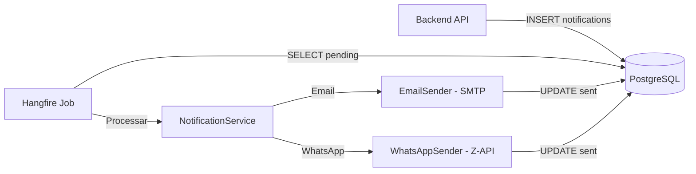

# Email API - Visão Geral

## Descrição

A **Email API** é responsável pelo envio assíncrono de notificações por email e WhatsApp. Utiliza **Hangfire** para processamento de jobs em background.

## Tecnologias

- **.NET 8**: Framework
- **Hangfire**: Jobs em background
- **PostgreSQL**: Banco de dados compartilhado
- **SMTP**: Envio de emails
- **Z-API**: Envio de WhatsApp
- **Razor**: Templates de email

## Arquitetura



## Base URL

```
Desenvolvimento: http://localhost:5014
Produção: https://email-api.amasso.com.br
```

## Dashboard Hangfire

```
http://localhost:5014/dashboard
```

- Visualizar jobs executados/pendentes
- Monitorar falhas
- Reprocessar jobs manualmente
- Ver estatísticas

## Como Funciona

1. **Backend API** cria registro em `notifications`
2. **Hangfire Job** (executado a cada 1 minuto):
   - Busca notificações pendentes
   - Renderiza template
   - Envia via SMTP ou Z-API
   - Marca como enviada
3. **Retry automático**: Até 3 tentativas se falhar

## Tipos de Notificação

| Tipo | Descrição | Canal |
|------|-----------|-------|
| `MfaCode` | Código de autenticação MFA | Email |
| `UserActivation` | Código de ativação de conta | Email |
| `ForgotPassword` | Código de recuperação de senha | Email |
| `PaymentConfirmed` | Confirmação de pagamento | Email/WhatsApp/All |
| `VideoReleaseSchedule` | Lançamento de vídeo agendado | Email/WhatsApp/All |
| `KycApproved` | KYC aprovado | Email/WhatsApp/All |
| `KycRejected` | KYC rejeitado | Email/WhatsApp/All |
| `NewSale` | Nova venda (para influencer/promoter) | Email/WhatsApp/All |

## Canais de Envio

| Canal | Descrição |
|-------|-----------|
| `Email` | Apenas email (SMTP) |
| `WhatsApp` | Apenas WhatsApp (Z-API) |
| `All` | Email + WhatsApp |

## Configuração SMTP

```json
{
  "Smtp": {
    "Host": "smtp.gmail.com",
    "Port": 587,
    "Username": "noreply@amasso.com.br",
    "Password": "app-password",
    "FromEmail": "noreply@amasso.com.br",
    "FromName": "Amasso"
  }
}
```

## Configuração Z-API

```json
{
  "ZApi": {
    "BaseUrl": "https://api.z-api.io",
    "InstanceId": "your-instance-id",
    "Token": "your-token"
  }
}
```

## Jobs Hangfire

### ProcessPendingNotifications

**Cron**: A cada 1 minuto  
**Descrição**: Processa notificações pendentes

```csharp
RecurringJob.AddOrUpdate(
    "process-pending-notifications",
    () => _notificationService.ProcessPendingNotificationsAsync(),
    Cron.Minutely
);
```

### CleanupOldNotifications

**Cron**: Diariamente às 03:00  
**Descrição**: Remove notificações antigas (>90 dias)

```csharp
RecurringJob.AddOrUpdate(
    "cleanup-old-notifications",
    () => _logCleanupService.CleanupOldNotificationsAsync(),
    Cron.Daily(3)
);
```

## Templates

Localizados em `wwwroot/Templates/`:

**Email (HTML)**:
- `MfaCode.html`
- `UserActivation.html`
- `PaymentConfirmed.html`
- etc.

**WhatsApp (TXT)**:
- `MfaCode.txt`
- `UserActivation.txt`
- `PaymentConfirmed.txt`
- etc.

### Variáveis nos Templates

```html
<!-- Email: PaymentConfirmed.html -->
<h1>Pagamento Confirmado!</h1>
<p>Olá {{UserName}},</p>
<p>Seu pagamento do vídeo "{{VideoTitle}}" foi confirmado.</p>
<p>Valor: R$ {{Amount}}</p>
```

As variáveis são substituídas a partir do `metadata_json` da notification.

## Monitoramento

### Logs

```
/email-api-prod2025082202.log
```

### Métricas

- Total de notificações enviadas
- Taxa de sucesso
- Tempo médio de envio
- Notificações com falha

## Próximos Passos

- Veja [Notificações](notificacoes.md) para detalhes
- Consulte [Templates](templates.md) para criar novos
- Entenda [Hangfire Jobs](hangfire-jobs.md) para configuração

