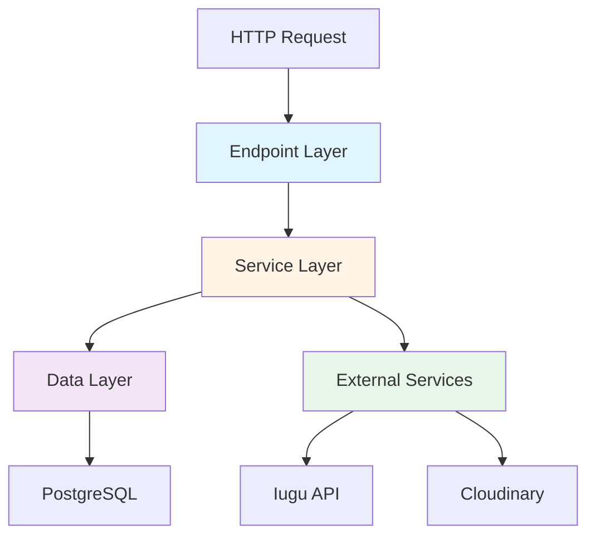

# Backend API

## Visão Geral

O Backend API é o coração da plataforma Amasso, construído com **ASP.NET Core 8.0** e seguindo os princípios de Clean Architecture.

**Localização**: `backend-api/`

## Tecnologias

| Tecnologia | Versão | Propósito |
|------------|--------|-----------|
| .NET | 8.0 | Framework principal |
| ASP.NET Core | 8.0 | Web API |
| Entity Framework Core | 8.0 | ORM |
| Npgsql | 8.0 | Driver PostgreSQL |
| JWT Bearer | - | Autenticação |
| Swagger/OpenAPI | - | Documentação API |

## Estrutura de Pastas

```
backend-api/
├── Data/
│   ├── Context/
│   │   └── Pay4TruContext.cs          # DbContext principal
│   ├── Entities/                      # 17 entidades
│   │   ├── User.cs
│   │   ├── Owner.cs
│   │   ├── Video.cs
│   │   ├── Order.cs
│   │   ├── Payment.cs
│   │   ├── Income.cs
│   │   ├── Notification.cs
│   │   └── ... (outras)
│   ├── Enums/                         # 13 enums
│   │   ├── UserTypeEnum.cs
│   │   ├── PaymentStatusEnum.cs
│   │   ├── OwnerSubAccountStatusEnum.cs
│   │   └── ...
│   ├── Dtos/                          # 53 DTOs
│   │   ├── Login.cs
│   │   ├── VideoDto.cs
│   │   ├── OrderDto.cs
│   │   └── ...
│   ├── Configuration/                 # EF Core configurations
│   │   ├── UserConfiguration.cs
│   │   ├── VideoConfiguration.cs
│   │   └── ...
│   └── Validations/                   # FluentValidation
│       ├── LoginValidator.cs
│       └── ...
├── Endpoints/                         # Minimal APIs
│   ├── LoginEndpoints.cs
│   ├── UserEndpoints.cs
│   ├── VideoEndpoints.cs
│   ├── OrderEndpoints.cs
│   ├── PaymentEndpoints.cs
│   ├── AdminEndpoints.cs
│   ├── OwnerEndpoints.cs
│   ├── PromoterEndpoint.cs
│   ├── MfaEndpoints.cs
│   └── WebHookEndpoint.cs
├── Services/                          # Lógica de negócio
│   ├── LoginService.cs
│   ├── UserService.cs
│   ├── VideoService.cs
│   ├── OrderService.cs
│   ├── PaymentService.cs
│   ├── OwnerService.cs
│   ├── TokenService.cs
│   ├── MfaService.cs
│   ├── Admin/
│   │   └── AdminService.cs
│   ├── Promoter/
│   │   └── PromoterService.cs
│   ├── External/
│   │   ├── IuguService.cs
│   │   ├── CloudinaryService.cs
│   │   └── ...
│   └── ...
├── Helpers/
│   ├── Extensions/                    # Extension methods
│   ├── Middlewares/                   # Middlewares customizados
│   ├── Constants/                     # Constantes
│   └── Wrappers/                      # Response wrappers
├── Migrations/                        # EF Core migrations (49 arquivos)
├── Program.cs                         # Entrada da aplicação
├── Usings.cs                          # Global usings
├── appsettings.json                   # Configurações
├── Pay4Tru.Api.csproj                # Definição do projeto
└── Dockerfile                         # Container Docker
```

## Arquitetura em Camadas



### 1. Endpoint Layer (Presentation)
**Localização**: `Endpoints/`

Usa Minimal APIs do ASP.NET Core:

```csharp
// Exemplo simplificado
public static class VideoEndpoints
{
    public static void MapVideoEndpoints(this IEndpointRouteBuilder app)
    {
        var group = app.MapGroup("/api/videos").RequireAuthorization();
        
        group.MapGet("/", GetAllVideos);
        group.MapGet("/{id}", GetVideoById);
        group.MapPost("/", CreateVideo).RequireRole("Admin");
        group.MapPut("/{id}", UpdateVideo).RequireRole("Admin");
        group.MapDelete("/{id}", DeleteVideo).RequireRole("Admin");
    }
}
```

**Responsabilidades**:
- Validação de entrada (DTOs)
- Autorização (Roles, Claims)
- Chamada aos Services
- Formatação de resposta

### 2. Service Layer (Business Logic)
**Localização**: `Services/`

Contém toda a lógica de negócio:

```csharp
public interface IVideoService
{
    Task<VideoDto> GetByIdAsync(long id, long? userId);
    Task<List<VideoDto>> GetAllAsync(long? userId);
    Task<VideoDto> CreateAsync(VideoDto dto);
    Task UpdateAsync(long id, VideoDto dto);
    Task DeleteAsync(long id);
    Task<List<VideoDto>> GetVideosForPromoterAsync(long promoterId);
}
```

**Responsabilidades**:
- Regras de negócio
- Validações complexas
- Orquestração de operações
- Chamadas a serviços externos
- Transações

### 3. Data Layer (Data Access)
**Localização**: `Data/`

Entity Framework Core com Repository Pattern:

```csharp
public class Pay4TruDb : DbContext
{
    public DbSet<User> Users { get; set; }
    public DbSet<Video> Videos { get; set; }
    public DbSet<Order> Orders { get; set; }
    // ... outros DbSets
    
    protected override void OnModelCreating(ModelBuilder b)
    {
        b.ApplyConfiguration(new UserConfiguration());
        b.ApplyConfiguration(new VideoConfiguration());
        // ... outras configurações
    }
}
```

**Responsabilidades**:
- Mapeamento objeto-relacional
- Queries ao banco
- Migrations
- Configurações de entidades

## Principais Funcionalidades

### Autenticação e Autorização

#### JWT Tokens
```csharp
// TokenService.cs
public string GenerateToken(User user)
{
    var claims = new[]
    {
        new Claim(ClaimTypes.NameIdentifier, user.Id.ToString()),
        new Claim(ClaimTypes.Email, user.Email),
        new Claim(ClaimTypes.Role, user.Type.ToString()),
        // Claims adicionais
    };
    
    var key = new SymmetricSecurityKey(Encoding.UTF8.GetBytes(_jwtSettings.Secret));
    var creds = new SigningCredentials(key, SecurityAlgorithms.HmacSha256);
    
    var token = new JwtSecurityToken(
        issuer: _jwtSettings.Issuer,
        audience: _jwtSettings.Audience,
        claims: claims,
        expires: DateTime.UtcNow.AddHours(24),
        signingCredentials: creds
    );
    
    return new JwtSecurityTokenHandler().WriteToken(token);
}
```

#### MFA (Multi-Factor Authentication)
1. Usuário faz login
2. Sistema gera código de 6 dígitos
3. Código salvo na tabela `mfa_codes` com expiração de 5 minutos
4. Notificação criada para envio (Email API processa)
5. Usuário informa código
6. Sistema valida e emite JWT

### Gestão de Vídeos

#### Upload e Armazenamento
```csharp
// VideoService.cs
public async Task<VideoDto> UploadVideoAsync(IFormFile file, VideoDto dto)
{
    // 1. Upload para Cloudinary
    var uploadResult = await _cloudinaryService.UploadVideoAsync(file);
    
    // 2. Criar entidade Video
    var video = new Video
    {
        Title = dto.Title,
        Description = dto.Description,
        CloudinaryPublicId = uploadResult.PublicId,
        Price = dto.Price,
        ReleaseDate = dto.ReleaseDate
    };
    
    _context.Videos.Add(video);
    
    // 3. Criar VideoRevenueConfig
    var config = new VideoRevenueConfig
    {
        VideoId = video.Id,
        PlatformPercentage = dto.PlatformPercentage,
        OwnerPercentage = dto.OwnerPercentage,
        PromoterPercentage = dto.PromoterPercentage
    };
    
    _context.VideoRevenueConfigs.Add(config);
    await _context.SaveChangesAsync();
    
    return MapToDto(video);
}
```

#### Vídeos para Promoters
**Regra de negócio importante**: Promoters só veem vídeos com `PromoterPercentage > 0%`

```csharp
public async Task<List<VideoDto>> GetVideosForPromoterAsync(long promoterId)
{
    return await _context.Videos
        .Include(v => v.VideoRevenueConfig)
        .Where(v => v.IsActive && 
                    v.VideoRevenueConfig.PromoterPercentage > 0)
        .Select(v => MapToDto(v))
        .ToListAsync();
}
```

### Sistema de Pedidos e Pagamentos

#### Criar Pedido com Split
```csharp
// OrderService.cs
public async Task<OrderDto> CreateOrderAsync(CreateOrderDto dto)
{
    var video = await _context.Videos
        .Include(v => v.VideoRevenueConfig)
        .FirstAsync(v => v.Id == dto.VideoId);
    
    var config = video.VideoRevenueConfig;
    
    // Calcular valores
    var totalAmount = (int)(video.Price * 100); // em centavos
    var platformAmount = totalAmount * config.PlatformPercentage / 100;
    var ownerAmount = totalAmount * config.OwnerPercentage / 100;
    var promoterAmount = dto.PromoterId.HasValue 
        ? totalAmount * config.PromoterPercentage / 100 
        : 0;
    
    // Criar Order
    var order = new Order
    {
        UserId = dto.UserId,
        VideoId = dto.VideoId,
        PromoterId = dto.PromoterId,
        Amount = totalAmount,
        PlatformAmount = platformAmount,
        OwnerAmount = ownerAmount,
        PromoterAmount = promoterAmount
    };
    
    _context.Orders.Add(order);
    await _context.SaveChangesAsync();
    
    // Criar Invoice no Iugu com split
    var invoice = await _iuguService.CreateInvoiceWithSplitAsync(order);
    
    // Criar Payment
    var payment = new Payment
    {
        OrderId = order.Id,
        IuguInvoiceId = invoice.Id,
        Status = PaymentStatusEnum.Pending
    };
    
    _context.Payments.Add(payment);
    
    // Criar Notification
    var notification = new Notification
    {
        Type = NotificationTypeEnum.OrderCreated,
        Channel = user.NotificationPreference,
        MetadataJson = JsonSerializer.Serialize(new { OrderId = order.Id })
    };
    
    _context.Notifications.Add(notification);
    await _context.SaveChangesAsync();
    
    return MapToDto(order, invoice.SecureUrl);
}
```

### Webhooks do Iugu

#### Processar Confirmação de Pagamento
```csharp
// PaymentEndpoints.cs - Webhook
[AllowAnonymous]
public static async Task<IResult> HandleIuguWebhook(
    [FromBody] IuguWebhookDto webhook,
    [FromServices] IPaymentService paymentService)
{
    // Validar assinatura do webhook (segurança)
    if (!ValidateIuguSignature(webhook))
        return Results.Unauthorized();
    
    if (webhook.Event == "invoice.status_changed" && 
        webhook.Data.Status == "paid")
    {
        await paymentService.ConfirmPaymentAsync(webhook.Data.Id);
    }
    
    return Results.Ok();
}

// PaymentService.cs
public async Task ConfirmPaymentAsync(string iuguInvoiceId)
{
    var payment = await _context.Payments
        .Include(p => p.Order)
        .ThenInclude(o => o.Video)
        .ThenInclude(v => v.OwnerVideos)
        .FirstAsync(p => p.IuguInvoiceId == iuguInvoiceId);
    
    // Atualizar status
    payment.Status = PaymentStatusEnum.Paid;
    payment.IuguPaidAt = DateTime.UtcNow;
    
    // Criar Income para cada parte
    var incomes = new List<Income>();
    
    // Plataforma
    incomes.Add(new Income
    {
        OrderId = payment.Order.Id,
        Amount = payment.Order.PlatformAmount,
        Type = IncomeTypeEnum.Platform
    });
    
    // Owner/Influencer
    var owner = payment.Order.Video.OwnerVideos.First().Owner;
    incomes.Add(new Income
    {
        OrderId = payment.Order.Id,
        OwnerId = owner.Id,
        Amount = payment.Order.OwnerAmount,
        Type = IncomeTypeEnum.Owner
    });
    
    // Promoter (se houver)
    if (payment.Order.PromoterId.HasValue)
    {
        incomes.Add(new Income
        {
            OrderId = payment.Order.Id,
            OwnerId = payment.Order.PromoterId.Value,
            Amount = payment.Order.PromoterAmount,
            Type = IncomeTypeEnum.Promoter
        });
    }
    
    _context.Incomes.AddRange(incomes);
    
    // Criar notificação de confirmação
    var notification = new Notification
    {
        Type = NotificationTypeEnum.PaymentConfirmed,
        Channel = NotificationChannelEnum.Email,
        MetadataJson = JsonSerializer.Serialize(new { OrderId = payment.Order.Id })
    };
    
    _context.Notifications.Add(notification);
    await _context.SaveChangesAsync();
}
```

### Gestão de KYC

#### Aprovar KYC (Admin)
```csharp
// AdminService.cs
public async Task ApproveKycAsync(long ownerId)
{
    var owner = await _context.Owners.FindAsync(ownerId);
    
    if (owner.SubAccountStatus != OwnerSubAccountStatusEnum.Pending)
        throw new InvalidOperationException("KYC não está pendente");
    
    // Ativar subconta no Iugu
    await _iuguService.ActivateSubAccountAsync(owner.IuguAccountId);
    
    // Atualizar status
    owner.SubAccountStatus = OwnerSubAccountStatusEnum.Approved;
    owner.UpdatedAt = DateTime.UtcNow;
    
    // Notificar usuário
    var notification = new Notification
    {
        Type = NotificationTypeEnum.KycApproved,
        Channel = owner.User.NotificationPreference,
        MetadataJson = JsonSerializer.Serialize(new { OwnerId = ownerId })
    };
    
    _context.Notifications.Add(notification);
    await _context.SaveChangesAsync();
}
```

## Configurações

### appsettings.json
```json
{
  "ConnectionStrings": {
    "Pay4TruDb": "Host=localhost;Database=pay4tru;Username=postgres;Password=***"
  },
  "Jwt": {
    "Secret": "super-secret-key-min-32-chars",
    "Issuer": "amasso-api",
    "Audience": "amasso-frontend",
    "ExpirationHours": 24
  },
  "Iugu": {
    "ApiToken": "***",
    "AccountId": "***"
  },
  "Cloudinary": {
    "CloudName": "***",
    "ApiKey": "***",
    "ApiSecret": "***"
  }
}
```

## Middlewares

### Request Logging
Loga todas as requisições na tabela `logs`:
- RequestId
- Path
- Method
- Status Code
- Duration
- IP
- User

### Exception Handling
Captura exceções não tratadas e retorna resposta padronizada.

### JWT Authentication
Valida token em cada request protegido.

## Próximos Passos

- Veja [APIs > Backend API](../apis/backend-api/visao-geral.md) para referência completa de endpoints
- Consulte [Banco de Dados](../banco-de-dados/visao-geral.md) para entender as entidades
- Leia [Guias > Backend](../guias/configuracao-ambiente/backend.md) para configurar localmente

