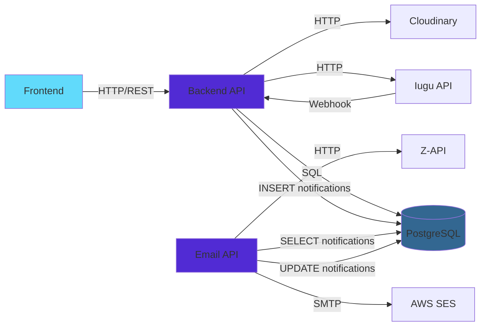
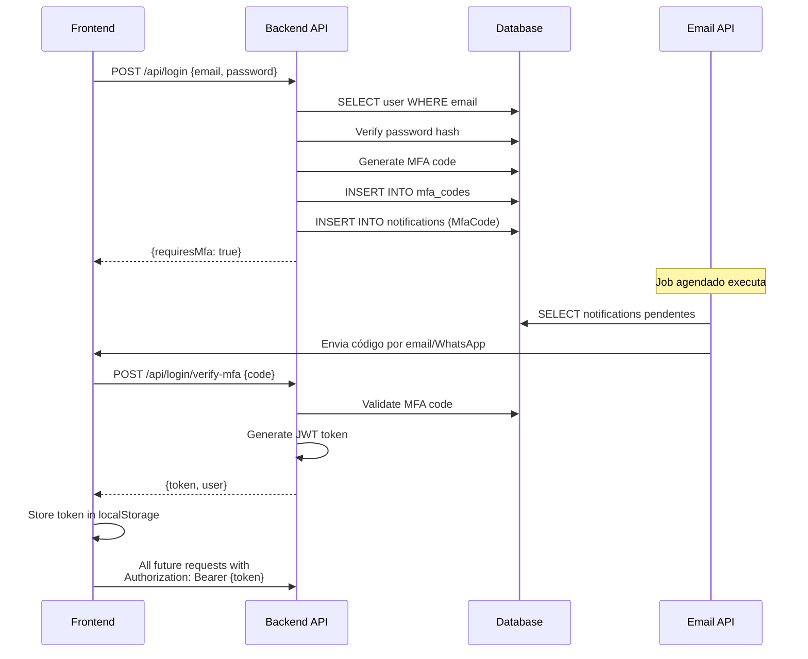
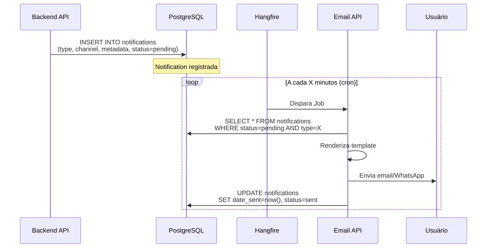
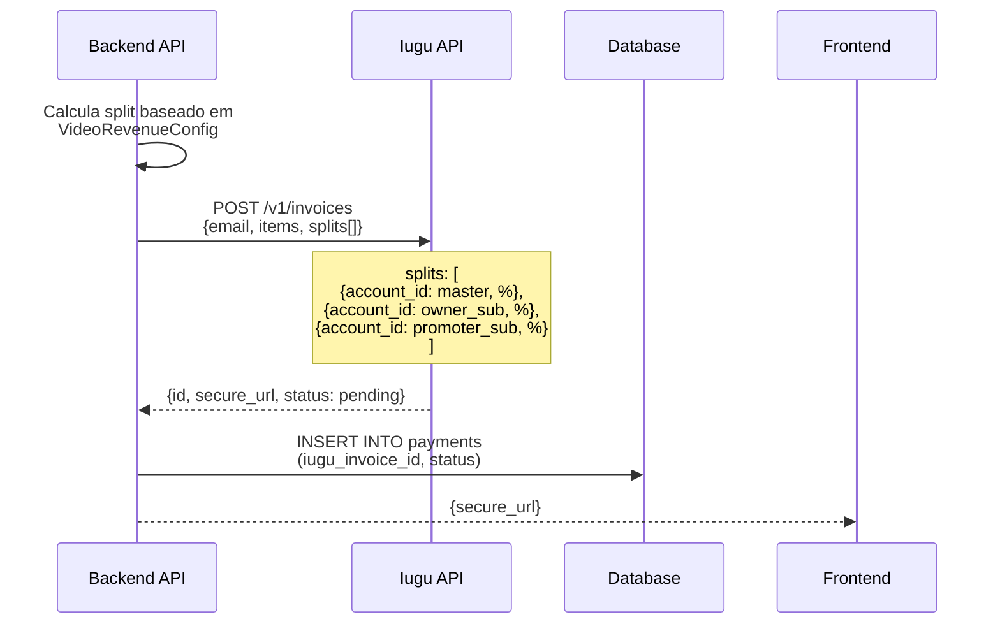
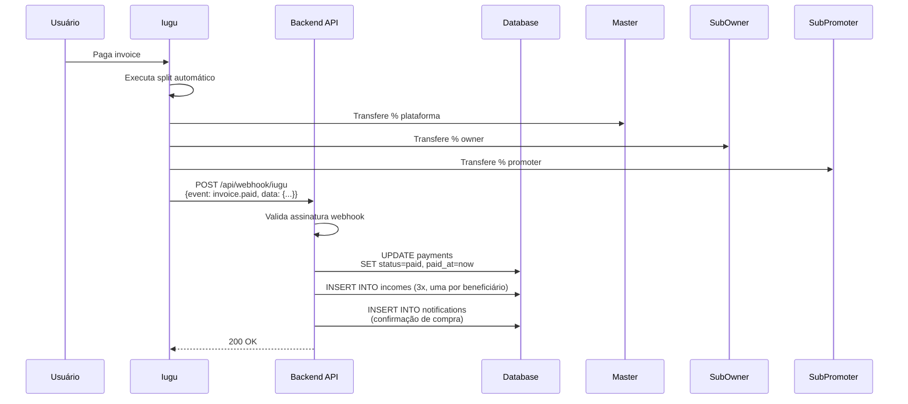
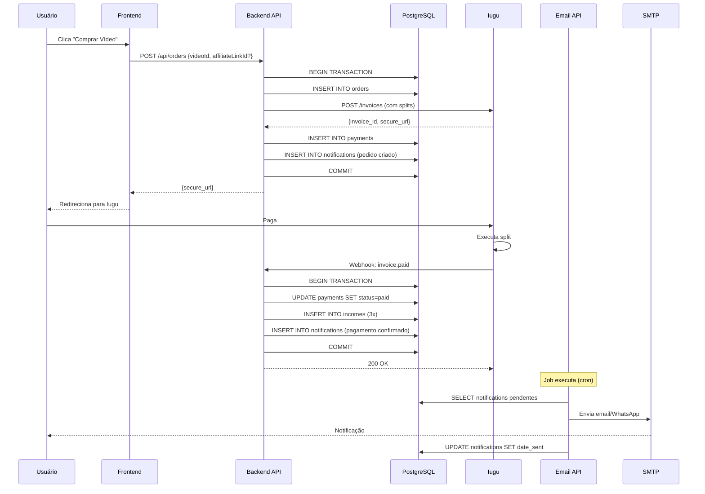

# Comunicação Entre Sistemas

Este documento detalha como os três principais componentes da plataforma Amasso se comunicam entre si e com serviços externos.

## Visão Geral da Comunicação



## 1. Frontend ↔ Backend API

### Protocolo
- **HTTP/REST** via Axios
- **JSON** para payloads
- **JWT** para autenticação

### Fluxo de Autenticação



### Exemplo de Request

```typescript
// Frontend
const response = await axios.post('/api/login', {
  email: 'user@email.com',
  password: 'senha123',
  signInWith: 'Default'
});

if (response.data.requiresMfa) {
  // Mostrar tela de MFA
  const mfaResponse = await axios.post('/api/login/verify-mfa', {
    email: 'user@email.com',
    code: '123456'
  });
  
  const { token } = mfaResponse.data;
  localStorage.setItem('token', token);
  
  // Configurar axios para usar token
  axios.defaults.headers.common['Authorization'] = `Bearer ${token}`;
}
```

## 2. Backend API ↔ PostgreSQL

### Protocolo
- **Npgsql** (Driver .NET para PostgreSQL)
- **Entity Framework Core** como ORM

### Padrão de Acesso

```csharp
// 1. Definir entidade
public class Video : Base
{
    public string Title { get; set; }
    public decimal Price { get; set; }
    // ... outros campos
}

// 2. Configurar mapeamento
public class VideoConfiguration : IEntityTypeConfiguration<Video>
{
    public void Configure(EntityTypeBuilder<Video> entity)
    {
        entity.ToTable("videos");
        entity.HasKey(v => v.Id);
        entity.Property(v => v.Title).HasColumnName("title").IsRequired();
        // ...
    }
}

// 3. Usar no serviço
public class VideoService
{
    private readonly Pay4TruDb _context;
    
    public async Task<Video> GetByIdAsync(long id)
    {
        return await _context.Videos
            .Include(v => v.VideoRevenueConfig)
            .FirstOrDefaultAsync(v => v.Id == id && v.IsActive);
    }
}
```

### Transações

```csharp
// Operações atômicas
using var transaction = await _context.Database.BeginTransactionAsync();
try
{
    // 1. Criar order
    _context.Orders.Add(order);
    await _context.SaveChangesAsync();
    
    // 2. Criar payment
    _context.Payments.Add(payment);
    await _context.SaveChangesAsync();
    
    // 3. Criar notification
    _context.Notifications.Add(notification);
    await _context.SaveChangesAsync();
    
    await transaction.CommitAsync();
}
catch
{
    await transaction.RollbackAsync();
    throw;
}
```

## 3. Backend API ↔ Email API

### Comunicação Assíncrona via Database

**Não há comunicação HTTP direta**. A comunicação acontece através do banco de dados compartilhado:



### Exemplo Completo

**Backend API cria notificação:**

```csharp
// Em qualquer Service do Backend API
var notification = new Notification
{
    Type = NotificationTypeEnum.VideoReleaseSchedule,
    Channel = user.NotificationPreference, // Email, WhatsApp ou All
    MetadataJson = JsonSerializer.Serialize(new
    {
        Email = user.Email,
        PhoneNumber = user.Telephone,
        Name = user.FirstName,
        VideoTitle = video.Title,
        VideoId = video.Id,
        Subject = "Novo vídeo disponível!"
    }),
    ScheduleDate = video.ReleaseDate, // Opcional: agendar para o futuro
    IsActive = true,
    CreatedAt = DateTime.UtcNow
};

await _context.Notifications.AddAsync(notification);
await _context.SaveChangesAsync();
// Pronto! Email API processará
```

**Email API processa (automaticamente via Hangfire):**

```csharp
// Job configurado no appsettings.json
// { "Type": "VideoReleaseSchedule", "Channel": "Email", "CronExpression": "*/5 * * * *" }

public async Task SendScheduledByTypeAndChannelAsync(
    NotificationTypeEnum.VideoReleaseSchedule,
    NotificationChannelEnum.Email)
{
    // 1. Busca notificações pendentes
    var notifications = await _context.Notifications
        .Where(n => n.Type == NotificationTypeEnum.VideoReleaseSchedule &&
                   n.Channel == NotificationChannelEnum.Email &&
                   n.DateSent == null &&
                   n.SendAttempts < 3)
        .ToListAsync();
    
    // 2. Processa cada uma
    foreach (var notification in notifications)
    {
        var metadata = JsonSerializer.Deserialize<Dictionary<string, string>>(
            notification.MetadataJson);
        
        // 3. Renderiza template
        var html = await _templateRenderer.RenderAsync(
            NotificationTypeEnum.VideoReleaseSchedule,
            metadata);
        
        // 4. Envia
        var success = await _emailSender.SendAsync(
            metadata["Email"],
            metadata["Subject"],
            html);
        
        // 5. Atualiza status
        notification.SendAttempts++;
        if (success)
        {
            notification.DateSent = DateTime.UtcNow;
        }
        else
        {
            notification.ErrorMessage = "Failed to send";
        }
    }
    
    await _context.SaveChangesAsync();
}
```

## 4. Backend API ↔ Iugu

### Criação de Invoice com Split



**Código do Backend:**

```csharp
public async Task<IuguInvoiceDto> CreateInvoiceWithSplitAsync(Order order)
{
    var owner = await GetOwnerForVideo(order.VideoId);
    var promoter = order.PromoterId.HasValue 
        ? await GetOwnerById(order.PromoterId.Value) 
        : null;
    
    // Montar splits
    var splits = new List<IuguSplitDto>
    {
        // Plataforma (conta master) - recebe o que sobrar
        new IuguSplitDto
        {
            recipient_account_id = _config.MasterAccountId,
            percent = order.PlatformAmount / (decimal)order.Amount * 100
        },
        // Owner/Influencer
        new IuguSplitDto
        {
            recipient_account_id = owner.IuguAccountId,
            percent = order.OwnerAmount / (decimal)order.Amount * 100
        }
    };
    
    // Promoter (se houver)
    if (promoter != null && order.PromoterAmount > 0)
    {
        splits.Add(new IuguSplitDto
        {
            recipient_account_id = promoter.IuguAccountId,
            percent = order.PromoterAmount / (decimal)order.Amount * 100
        });
    }
    
    var request = new CreateIuguInvoiceDto
    {
        email = order.User.Email,
        due_date = DateTime.Now.AddDays(3).ToString("yyyy-MM-dd"),
        items = new[]
        {
            new IuguItemDto
            {
                description = $"Vídeo: {order.Video.Title}",
                quantity = 1,
                price_cents = order.Amount
            }
        },
        splits = splits.ToArray()
    };
    
    var response = await _httpClient.PostAsJsonAsync(
        "https://api.iugu.com/v1/invoices",
        request);
    
    response.EnsureSuccessStatusCode();
    return await response.Content.ReadFromJsonAsync<IuguInvoiceDto>();
}
```

### Webhook de Confirmação



**Handler do Webhook:**

```csharp
[AllowAnonymous]
[HttpPost("/api/webhook/iugu")]
public async Task<IResult> HandleIuguWebhook(
    [FromBody] IuguWebhookDto webhook,
    [FromHeader(Name = "X-Iugu-Signature")] string signature)
{
    // 1. Validar assinatura (segurança)
    if (!ValidateSignature(webhook, signature))
        return Results.Unauthorized();
    
    // 2. Processar evento
    if (webhook.Event == "invoice.status_changed" && 
        webhook.Data.Status == "paid")
    {
        await _paymentService.ConfirmPaymentAsync(webhook.Data.Id);
    }
    
    return Results.Ok();
}
```

## 5. Backend API ↔ Cloudinary

### Upload de Vídeo

```csharp
public async Task<CloudinaryUploadResult> UploadVideoAsync(IFormFile file)
{
    var uploadParams = new VideoUploadParams()
    {
        File = new FileDescription(file.FileName, file.OpenReadStream()),
        PublicId = $"videos/{Guid.NewGuid()}",
        ResourceType = ResourceType.Video,
        Folder = "amasso-videos"
    };
    
    var result = await _cloudinary.UploadAsync(uploadParams);
    
    return new CloudinaryUploadResult
    {
        PublicId = result.PublicId,
        SecureUrl = result.SecureUrl,
        Format = result.Format,
        Duration = result.Duration
    };
}
```

## 6. Email API ↔ SMTP/Z-API

### SMTP (AWS SES)

```csharp
using var smtp = new SmtpClient("email-smtp.us-east-1.amazonaws.com", 587)
{
    Credentials = new NetworkCredential(username, password),
    EnableSsl = true
};

using var message = new MailMessage
{
    From = new MailAddress("noreply@amasso.com.br", "Amasso"),
    To = { new MailAddress(recipient) },
    Subject = subject,
    Body = htmlBody,
    IsBodyHtml = true
};

await smtp.SendMailAsync(message);
```

### Z-API (WhatsApp)

```csharp
var payload = new
{
    phone = phoneNumber, // ex: "5511999999999"
    message = textMessage
};

var endpoint = $"https://api.z-api.io/instances/{instanceId}/token/{token}/send-text";

_httpClient.DefaultRequestHeaders.Add("Client-Token", clientToken);

var response = await _httpClient.PostAsJsonAsync(endpoint, payload);
return response.IsSuccessStatusCode;
```

## Fluxo Completo: Compra de Vídeo



## Segurança na Comunicação

### 1. Frontend ↔ Backend
- HTTPS obrigatório em produção
- JWT com expiration
- Refresh tokens
- CORS configurado

### 2. Backend ↔ Database
- Connection string com credenciais seguras
- Parameterized queries (EF Core)
- Migrations versionadas

### 3. Backend ↔ Iugu
- API Token em variáveis de ambiente
- Validação de assinatura em webhooks
- HTTPS para todas as chamadas

### 4. Email API ↔ External
- Token de autenticação para endpoints manuais
- SMTP com TLS
- Z-API com client token

## Próximos Passos

- Veja [Fluxos de Negócio](../fluxos-de-negocio/compra-video.md) para cenários detalhados
- Consulte [Pagamentos Iugu](../pagamentos/visao-geral-iugu.md) para entender splits
- Explore [Casos de Uso](../casos-de-uso/usuario-compra-video.md) com código completo

