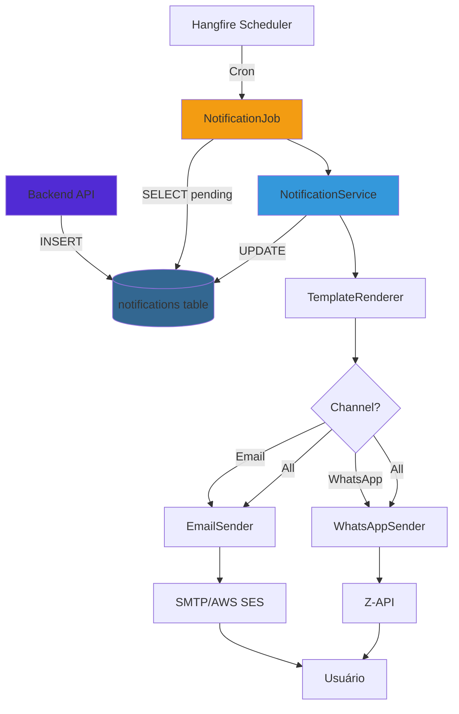

# Email API

## Visão Geral

A Email API é um serviço dedicado ao **envio assíncrono de notificações** via email e WhatsApp, construído com **ASP.NET Core 8.0** e **Hangfire**.

**Localização**: `email-api/`

## Por que um Serviço Separado?

- **Desacoplamento**: Backend API foca em lógica de negócio, Email API foca em comunicação
- **Escalabilidade**: Pode escalar independentemente do Backend
- **Resiliência**: Falhas no envio não afetam o fluxo principal
- **Retry inteligente**: Hangfire gerencia tentativas automáticas
- **Monitoramento**: Dashboard específico para jobs de notificação

## Tecnologias

| Tecnologia | Versão | Propósito |
|------------|--------|-----------|
| .NET | 8.0 | Framework principal |
| Hangfire | 1.8+ | Job scheduler e processing |
| Hangfire.PostgreSql | 1.20+ | Armazenamento de jobs |
| AWS SES | - | SMTP para emails |
| Z-API | - | Envio de WhatsApp |

## Estrutura de Pastas

```
email-api/
├── Data/
│   ├── Context/
│   │   └── Pay4TruDb.cs                # DbContext compartilhado
│   ├── Entities/                       # 3 entidades
│   │   ├── Notification.cs
│   │   ├── Log.cs
│   │   └── Base.cs
│   ├── Enums/
│   │   ├── NotificationTypeEnum.cs
│   │   └── NotificationChannelEnum.cs
│   ├── Dtos/
│   │   ├── Config.cs
│   │   ├── Smtp.cs
│   │   ├── ZApiSettings.cs
│   │   └── NotificationScheduleConfig.cs
│   ├── Configuration/                  # EF Core configs
│   │   ├── NotificationConfiguration.cs
│   │   └── LogConfiguration.cs
│   └── Repositories/
│       └── LogRepository.cs
├── Services/
│   ├── EmailSender.cs                  # SMTP sender
│   ├── WhatsAppSender.cs               # Z-API sender
│   ├── TemplateRenderer.cs             # Template engine
│   ├── NotificationService.cs          # Orchestrator
│   ├── LogCleanupService.cs            # Cleanup old logs
│   └── TemplateRenderer.cs
├── Jobs/
│   ├── NotificationJob.cs              # Job management
│   └── LogCleanupJob.cs                # Log cleanup job
├── Endpoints/
│   └── NotificationEndpoints.cs        # Manual triggers
├── Middlewares/
│   ├── ExceptionHandleMiddleware.cs
│   └── TokenAuthenticationMiddleware.cs
├── Extensions/
│   ├── BuilderExtensions.cs
│   ├── AppExtensions.cs
│   └── DateTimeExtensions.cs
├── wwwroot/
│   ├── Templates/                      # Email templates (HTML)
│   │   ├── MfaCode.html
│   │   ├── UserActivation.html
│   │   ├── ForgotPassword.html
│   │   └── VideoReleaseSchedule.html
│   └── Templates/Whatsapp/             # WhatsApp templates (TXT)
│       ├── MfaCode.txt
│       ├── UserActivation.txt
│       ├── ForgotPassword.txt
│       └── VideoReleaseSchedule.txt
├── Program.cs
├── Usings.cs
├── appsettings.json
├── Pay4Tru.JobEmails.csproj
└── Dockerfile
```

## Arquitetura



## Como Funciona

### 1. Backend API Cria Notificação

```csharp
// No Backend API
var notification = new Notification
{
    Type = NotificationTypeEnum.UserActivation,
    Channel = NotificationChannelEnum.Email,
    MetadataJson = JsonSerializer.Serialize(new 
    {
        Email = user.Email,
        Name = user.FirstName,
        ActivationCode = user.ActivationCode,
        Subject = "Ative sua conta Amasso"
    })
};

await _context.Notifications.AddAsync(notification);
await _context.SaveChangesAsync();
```

### 2. Hangfire Job Processa

Jobs configurados via cron expressions no `appsettings.json`:

```json
{
  "Config": {
    "NotificationSchedule": [
      { "Type": "MfaCode", "Channel": "Email", "CronExpression": "*/1 * * * *" },
      { "Type": "UserActivation", "Channel": "Email", "CronExpression": "*/2 * * * *" },
      { "Type": "ForgotPassword", "Channel": "All", "CronExpression": "*/3 * * * *" }
    ]
  }
}
```

**Registro automático no startup**:

```csharp
// NotificationJob.cs
public class NotificationJobManager : INotificationJobManager
{
    public void RegisterJobs()
    {
        foreach (var config in _scheduleConfigs)
        {
            var jobId = $"notification-{config.Type}-{config.Channel}";
            
            RecurringJob.AddOrUpdate<INotificationService>(
                jobId,
                service => service.SendScheduledByTypeAndChannelAsync(
                    Enum.Parse<NotificationTypeEnum>(config.Type),
                    Enum.Parse<NotificationChannelEnum>(config.Channel)
                ),
                config.CronExpression,
                TimeZoneInfo.Utc
            );
        }
    }
}
```

### 3. NotificationService Orquestra

```csharp
public async Task SendScheduledByTypeAndChannelAsync(
    NotificationTypeEnum type, 
    NotificationChannelEnum channel)
{
    // Busca notificações pendentes
    var notifications = await _context.Notifications
        .Where(n => n.Type == type &&
                   n.Channel == channel &&
                   n.IsActive &&
                   n.DateSent == null &&
                   n.SendAttempts < 3)
        .Take(50)
        .ToListAsync();
    
    foreach (var notification in notifications)
    {
        await ProcessNotificationAsync(notification);
    }
    
    await _context.SaveChangesAsync();
}

private async Task ProcessNotificationAsync(Notification notification)
{
    var metadata = DeserializeMetadata(notification.MetadataJson);
    var success = await SendNotificationAsync(notification, metadata);
    
    notification.SendAttempts++;
    
    if (success)
    {
        notification.DateSent = DateTime.UtcNow;
        notification.ErrorMessage = null;
    }
    else
    {
        notification.ErrorMessage = "Failed to send";
    }
    
    notification.UpdatedAt = DateTime.UtcNow;
}
```

### 4. TemplateRenderer Processa Templates

```csharp
public async Task<string> RenderAsync(
    NotificationTypeEnum type, 
    Dictionary<string, string> metadata)
{
    // Carrega template HTML
    var templatePath = Path.Combine(_templatesPath, $"{type}.html");
    var templateContent = await File.ReadAllTextAsync(templatePath);
    
    // Enriquece com URLs de config
    metadata["UrlLogoAmasso"] = _config.UrlLogoAmasso;
    metadata["UrlPortalPay4Tru"] = _config.UrlPortalPay4Tru;
    
    // Para UserActivation, gera URL de ativação
    if (type == NotificationTypeEnum.UserActivation)
    {
        metadata["UrlButton"] = 
            $"{_config.UrlPortalPay4Tru}/login?code={metadata["ActivationCode"]}";
    }
    
    // Substitui placeholders {Key}
    var rendered = templateContent;
    foreach (var kvp in metadata)
    {
        rendered = rendered.Replace($"{{{kvp.Key}}}", kvp.Value);
    }
    
    return rendered;
}
```

### 5. EmailSender ou WhatsAppSender Envia

#### EmailSender

```csharp
public async Task<bool> SendAsync(string recipient, string subject, string message)
{
    using var smtp = new SmtpClient(_settings.Host, _settings.Port)
    {
        Credentials = new NetworkCredential(_settings.User, _settings.Pass),
        EnableSsl = _settings.Ssl
    };
    
    using var msg = new MailMessage
    {
        From = new MailAddress(_settings.From, _settings.Display),
        To = { new MailAddress(recipient) },
        Subject = subject,
        Body = message,
        IsBodyHtml = true
    };
    
    try
    {
        await smtp.SendMailAsync(msg);
        return true;
    }
    catch (Exception ex)
    {
        _logger.LogError(ex, "Failed to send email to {Recipient}", recipient);
        return false;
    }
}
```

#### WhatsAppSender

```csharp
public async Task<bool> SendNotificationAsync(
    NotificationTypeEnum type,
    string phoneNumber, 
    Dictionary<string, string> metadata)
{
    // Renderiza template de WhatsApp (texto)
    var message = await _templateRenderer.RenderWhatsAppAsync(type, metadata);
    
    var payload = new
    {
        phone = phoneNumber,
        message = message
    };
    
    var endpoint = $"https://api.z-api.io/instances/{_settings.InstanceId}" +
                   $"/token/{_settings.Token}/send-text";
    
    var response = await _httpClient.PostAsJsonAsync(endpoint, payload);
    
    return response.IsSuccessStatusCode;
}
```

## Templates

### Email Template (HTML)

```html
<!-- wwwroot/Templates/UserActivation.html -->
<!DOCTYPE html>
<html lang="pt">
<head>
    <meta charset="UTF-8">
    <title>Ativação de Conta</title>
</head>
<body>
    
    <h1>Olá, {Name}!</h1>
    <p>Bem-vindo ao Amasso</p>
    <p>Você está a um passo de fazer parte disso!</p>
    <a href="{UrlButton}">Ativar Conta</a>
</body>
</html>
```

**Variáveis disponíveis**:
- `{Name}` - Nome do usuário
- `{UrlLogoAmasso}` - URL do logo
- `{UrlButton}` - URL de ação
- Específicas por tipo (ActivationCode, ResetToken, Code, etc.)

### WhatsApp Template (Texto)

```text
<!-- wwwroot/Templates/Whatsapp/UserActivation.txt -->
🎉 *Bem-vindo ao Amasso*

Olá, *{Name}*!

Você está a um passo de fazer parte disso!

Para ativar sua conta, clique no link abaixo:
{ActivationUrl}

Atenciosamente,
*Equipe Amasso*
```

## Hangfire Dashboard

Acessível em `/dashboard`:

**Autenticação**:
```csharp
// Filtro de autorização básica
public class HangfireAuthorizationCustomFilter : IDashboardAuthorizationFilter
{
    public bool Authorize(DashboardContext context)
    {
        #if DEBUG
            return true;
        #endif
        
        // Em produção: Basic Auth
        var authHeader = context.GetHttpContext().Request.Headers["Authorization"];
        // Validar credenciais...
    }
}
```

**Funcionalidades**:
- Visualizar jobs agendados
- Ver execuções passadas
- Retry manual
- Ver falhas
- Métricas de performance

## Retry e Resiliência

### Estratégia de Retry
- **Máximo de tentativas**: 3
- **Quando**: Falha no envio (SMTP/Z-API indisponível)
- **Como**: Job roda novamente e pega notificações com `SendAttempts < 3`

```csharp
// Query considera tentativas
.Where(n => n.SendAttempts < MaxRetryAttempts)
```

### Timeout
```csharp
services.AddHttpClient<WhatsAppSender>(client =>
{
    client.Timeout = TimeSpan.FromSeconds(60);
});
```

## Logging

Sistema detalhado de logs na tabela `logs`:

```csharp
await _logRepository.AddLogAsync(
    requestId: Guid.NewGuid().ToString(),
    level: "info",
    event: "emailsender.sendasync.started",
    payload: new
    {
        Recipient = recipient,
        Subject = subject,
        StartTime = DateTime.UtcNow
    },
    source: "EmailSender"
);
```

**Níveis**: debug, info, warning, error

**Cleanup automático**:
- Debug: 1 dia
- Info: 3 dias
- Warning: 5 dias
- Error: 7 dias

## Endpoints Manuais

Para triggers manuais (testes, reprocessamento):

```http
POST /api/notifications/send/{id}
POST /api/notifications/send-scheduled/{type}/{channel}
GET /api/notifications/{id}/status
```

**Autenticação**: Bearer token SHA256 baseado em data

```csharp
// Geração do token (Backend API deve usar)
var date = DateTime.UtcNow.Date.ToString("yyyy-MM-dd");
var input = $"{secretKey}{date}";
var hash = SHA256.Hash(input).ToLower();
// Usar como: Authorization: Bearer {hash}
```

## Configurações

### appsettings.json

```json
{
  "ConnectionStrings": {
    "Pay4TruDb": "Host=localhost;Database=pay4tru;Username=postgres;Password=***"
  },
  "Smtp": {
    "Host": "email-smtp.us-east-1.amazonaws.com",
    "Port": 587,
    "Ssl": true,
    "User": "***",
    "Pass": "***",
    "From": "noreply@amasso.com.br",
    "Display": "Amasso"
  },
  "ZApi": {
    "InstanceId": "***",
    "Token": "***",
    "ClientToken": "***"
  },
  "TokenAuth": {
    "SecretKey": "your-secret-key",
    "SkipInDevelopment": true
  },
  "Config": {
    "Attempts": 3,
    "UrlPortalPay4Tru": "https://amasso.com.br",
    "UrlLogoAmasso": "https://cdn.amasso.com.br/logo.png",
    "NotificationSchedule": [
      { "Type": "MfaCode", "Channel": "Email", "CronExpression": "*/1 * * * *" },
      { "Type": "UserActivation", "Channel": "Email", "CronExpression": "*/2 * * * *" },
      { "Type": "ForgotPassword", "Channel": "All", "CronExpression": "*/3 * * * *" },
      { "Type": "VideoReleaseSchedule", "Channel": "Email", "CronExpression": "*/5 * * * *" }
    ]
  }
}
```

## Tipos de Notificação

| Tipo | Descrição | Canais | Variáveis |
|------|-----------|--------|-----------|
| **MfaCode** | Código 2FA | Email, WhatsApp | Name, Code |
| **UserActivation** | Ativar conta | Email, WhatsApp | Name, ActivationCode, ActivationUrl |
| **ForgotPassword** | Reset senha | Email, WhatsApp | Name, ResetToken, ResetUrl |
| **VideoReleaseSchedule** | Lançamento | Email, WhatsApp | Name, VideoTitle, VideoUrl |

## Próximos Passos

- Consulte [APIs > Email API](../apis/email-api/visao-geral.md) para referência completa
- Veja [Guias > Email API](../guias/configuracao-ambiente/email-api.md) para configurar localmente
- Entenda [Fluxos > Notificações](../fluxos-de-negocio/autenticacao.md) em detalhes

