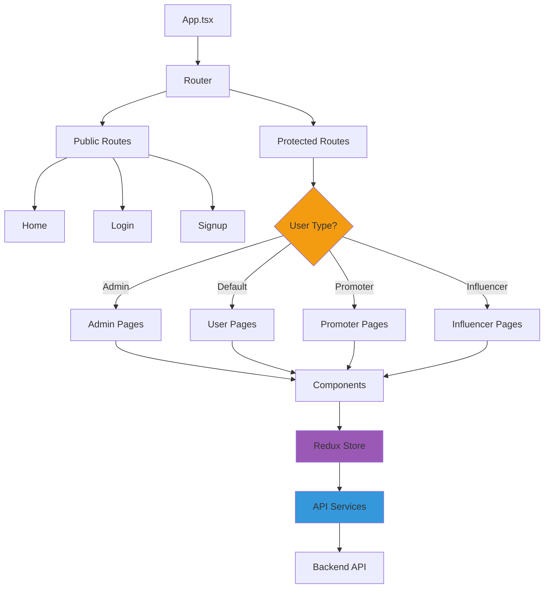

# Frontend

## Visão Geral

O Frontend é uma **Single Page Application (SPA)** construída com **React 18** e **TypeScript**, oferecendo uma experiência moderna e responsiva para todos os perfis de usuário.

**Localização**: `frontend-react/`

## Tecnologias

| Tecnologia | Versão | Propósito |
|------------|--------|-----------|
| React | 18 | Framework UI |
| TypeScript | 5 | Linguagem tipada |
| Redux Toolkit | 2.2+ | Gerenciamento de estado |
| React Router | 6 | Roteamento |
| Axios | 1.7+ | HTTP client |
| Material-UI | 5 | Componentes UI |
| Bootstrap | 5 | Estilos e grid |
| Vite | 5 | Build tool |
| Cloudinary React | - | Player de vídeos |

## Estrutura de Pastas

```
frontend-react/
├── src/
│   ├── main.tsx                        # Entry point
│   ├── routes/
│   │   ├── Router.tsx                  # Configuração de rotas
│   │   ├── ProtectedRoute.tsx          # HOC para rotas protegidas
│   │   ├── RedirectBasedOnUser.tsx     # Redirect por perfil
│   │   └── paths.ts                    # Constantes de rotas
│   ├── pages/                          # Páginas por rota
│   │   ├── home/
│   │   ├── login/
│   │   ├── sigin/                      # Cadastro
│   │   ├── my-account/
│   │   ├── videosHome/
│   │   ├── view-content/               # Player de vídeo comprado
│   │   ├── admin/                      # 32 arquivos (dashboard admin)
│   │   ├── partners/                   # Área de promoters/influencers
│   │   ├── payment-terms/
│   │   └── ...
│   ├── components/                     # Componentes reutilizáveis
│   │   ├── nav/
│   │   ├── footer/
│   │   ├── videoCard/
│   │   ├── forms/                      # 28 arquivos de formulários
│   │   ├── user/
│   │   ├── admin/
│   │   └── ...
│   ├── common/
│   │   ├── http/
│   │   │   ├── httpClient.ts           # Axios configurado
│   │   │   └── api/                    # 19 serviços de API
│   │   │       ├── authApi.ts
│   │   │       ├── videoApi.ts
│   │   │       ├── orderApi.ts
│   │   │       ├── userApi.ts
│   │   │       └── ...
│   │   ├── models/                     # 41 TypeScript interfaces
│   │   │   ├── User.ts
│   │   │   ├── Video.ts
│   │   │   ├── Order.ts
│   │   │   └── ...
│   │   ├── enums/
│   │   │   ├── user-type.enum.ts
│   │   │   ├── status.enum.ts
│   │   │   └── ...
│   │   └── utils/
│   │       ├── formatters.ts
│   │       └── phoneUtils.ts
│   ├── hooks/                          # Custom hooks
│   │   ├── useUserLogged.ts
│   │   ├── useUserType.ts
│   │   ├── useAffiliateLinks.ts
│   │   ├── useDocumentVerification.ts
│   │   └── ...
│   ├── store/                          # Redux
│   │   ├── index.ts
│   │   └── slices/
│   │       └── userSlice.ts
│   ├── services/
│   │   ├── ageVerificationService.ts
│   │   └── featureFlagService.ts
│   ├── assets/
│   │   ├── img/
│   │   ├── fonts/
│   │   └── i18n/
│   └── custom.scss                     # Estilos globais
├── index.html
├── package.json
├── tsconfig.json
├── vite.config.ts
└── Dockerfile
```

## Arquitetura de Componentes



## Roteamento

### Configuração Principal (Router.tsx)

```typescript
export const Router = () => {
  return (
    <BrowserRouter>
      <Routes>
        {/* Rotas públicas */}
        <Route path={paths.home} element={<Home />} />
        <Route path={paths.login} element={<Login />} />
        <Route path={paths.signup} element={<Signup />} />
        <Route path={paths.forgotPassword} element={<ForgotPassword />} />
        
        {/* Rotas protegidas */}
        <Route element={<ProtectedRoute />}>
          <Route path={paths.myAccount} element={<MyAccount />} />
          <Route path={paths.videos} element={<VideosHome />} />
          <Route path={paths.viewContent} element={<ViewContent />} />
          
          {/* Admin */}
          <Route element={<ProtectedRoute requiredRole="Admin" />}>
            <Route path={paths.admin} element={<AdminDashboard />} />
            <Route path={paths.adminUsers} element={<AdminUsers />} />
            <Route path={paths.adminVideos} element={<AdminVideos />} />
            <Route path={paths.adminKyc} element={<AdminKyc />} />
          </Route>
          
          {/* Promoter */}
          <Route element={<ProtectedRoute requiredRole="Promoter" />}>
            <Route path={paths.promoterDashboard} element={<PromoterDashboard />} />
            <Route path={paths.promoterLinks} element={<PromoterLinks />} />
          </Route>
          
          {/* Influencer */}
          <Route element={<ProtectedRoute requiredRole="Influencer" />}>
            <Route path={paths.influencerDashboard} element={<InfluencerDashboard />} />
          </Route>
        </Route>
      </Routes>
    </BrowserRouter>
  );
};
```

### Protected Route HOC

```typescript
export const ProtectedRoute = ({ requiredRole }: { requiredRole?: string }) => {
  const user = useSelector((state: RootState) => state.user.currentUser);
  const token = localStorage.getItem('token');
  
  if (!token || !user) {
    return <Navigate to={paths.login} replace />;
  }
  
  if (requiredRole && user.type !== requiredRole) {
    return <Navigate to={paths.accessDenied} replace />;
  }
  
  return <Outlet />;
};
```

## Gerenciamento de Estado

### Redux Store

```typescript
// store/index.ts
import { configureStore } from '@reduxjs/toolkit';
import userReducer from './slices/userSlice';

export const store = configureStore({
  reducer: {
    user: userReducer,
  },
});

export type RootState = ReturnType<typeof store.getState>;
export type AppDispatch = typeof store.dispatch;
```

### User Slice

```typescript
// store/slices/userSlice.ts
interface UserState {
  currentUser: User | null;
  isAuthenticated: boolean;
  loading: boolean;
}

const initialState: UserState = {
  currentUser: null,
  isAuthenticated: false,
  loading: false,
};

export const userSlice = createSlice({
  name: 'user',
  initialState,
  reducers: {
    setUser: (state, action: PayloadAction<User>) => {
      state.currentUser = action.payload;
      state.isAuthenticated = true;
    },
    logout: (state) => {
      state.currentUser = null;
      state.isAuthenticated = false;
      localStorage.removeItem('token');
    },
  },
});
```

## Comunicação com API

### HTTP Client Configurado

```typescript
// common/http/httpClient.ts
import axios from 'axios';

const baseURL = import.meta.env.VITE_API_URL || 'http://localhost:7080';

export const httpClient = axios.create({
  baseURL,
  headers: {
    'Content-Type': 'application/json',
  },
});

// Interceptor para adicionar token
httpClient.interceptors.request.use((config) => {
  const token = localStorage.getItem('token');
  if (token) {
    config.headers.Authorization = `Bearer ${token}`;
  }
  return config;
});

// Interceptor para tratar erros
httpClient.interceptors.response.use(
  (response) => response,
  (error) => {
    if (error.response?.status === 401) {
      localStorage.removeItem('token');
      window.location.href = '/login';
    }
    return Promise.reject(error);
  }
);
```

### API Services

```typescript
// common/http/api/videoApi.ts
export const videoApi = {
  getAll: async (): Promise<Video[]> => {
    const { data } = await httpClient.get('/api/videos');
    return data;
  },
  
  getById: async (id: number): Promise<Video> => {
    const { data } = await httpClient.get(`/api/videos/${id}`);
    return data;
  },
  
  // Promoters só veem vídeos com comissão > 0%
  getVideosForPromoter: async (): Promise<Video[]> => {
    const { data } = await httpClient.get('/api/promoter/videos');
    return data;
  },
  
  create: async (video: CreateVideoDto): Promise<Video> => {
    const { data } = await httpClient.post('/api/videos', video);
    return data;
  },
};

// common/http/api/orderApi.ts
export const orderApi = {
  create: async (order: CreateOrderDto): Promise<Order> => {
    const { data } = await httpClient.post('/api/orders', order);
    return data;
  },
  
  getMyOrders: async (): Promise<Order[]> => {
    const { data } = await httpClient.get('/api/orders/me');
    return data;
  },
};
```

## Componentes Principais

### VideoCard

```typescript
interface VideoCardProps {
  video: Video;
  showBuyButton?: boolean;
  onBuyClick?: (videoId: number) => void;
}

export const VideoCard: React.FC<VideoCardProps> = ({
  video,
  showBuyButton = true,
  onBuyClick
}) => {
  const formatPrice = (price: number) => {
    return new Intl.NumberFormat('pt-BR', {
      style: 'currency',
      currency: 'BRL'
    }).format(price);
  };
  
  return (
    <Card>
      <CardMedia
        component="img"
        image={video.thumbImgUrl}
        alt={video.title}
      />
      <CardContent>
        <Typography variant="h5">{video.title}</Typography>
        <Typography variant="body2">{video.description}</Typography>
        <Typography variant="h6">{formatPrice(video.price)}</Typography>
      </CardContent>
      {showBuyButton && (
        <CardActions>
          <Button onClick={() => onBuyClick?.(video.id)}>
            Comprar
          </Button>
        </CardActions>
      )}
    </Card>
  );
};
```

### Payment Flow Component

```typescript
export const PaymentFlow: React.FC = () => {
  const [selectedVideo, setSelectedVideo] = useState<Video | null>(null);
  const [loading, setLoading] = useState(false);
  const navigate = useNavigate();
  
  const handleBuyVideo = async (videoId: number) => {
    setLoading(true);
    try {
      // Criar pedido
      const order = await orderApi.create({
        videoId,
        affiliateLinkId: getAffiliateLinkFromUrl(), // Se veio de link
      });
      
      // Redirecionar para URL de pagamento do Iugu
      window.location.href = order.iuguFaturaSecureUrl;
    } catch (error) {
      toast.error('Erro ao processar compra');
    } finally {
      setLoading(false);
    }
  };
  
  return (
    <div>
      <VideoList onBuyClick={handleBuyVideo} />
      {loading && <LoadingSpinner />}
    </div>
  );
};
```

## Custom Hooks

### useUserLogged

```typescript
export const useUserLogged = () => {
  const dispatch = useDispatch();
  const user = useSelector((state: RootState) => state.user.currentUser);
  
  useEffect(() => {
    const fetchUser = async () => {
      const token = localStorage.getItem('token');
      if (token && !user) {
        try {
          const userData = await userApi.getMe();
          dispatch(setUser(userData));
        } catch (error) {
          localStorage.removeItem('token');
        }
      }
    };
    
    fetchUser();
  }, []);
  
  return { user, isAuthenticated: !!user };
};
```

### useAffiliateLinks (Promoter)

```typescript
export const useAffiliateLinks = () => {
  const [links, setLinks] = useState<AffiliateLink[]>([]);
  const [loading, setLoading] = useState(false);
  
  const generateLink = async (videoId: number) => {
    try {
      setLoading(true);
      const link = await affiliateApi.generateLink(videoId);
      setLinks([...links, link]);
      return link;
    } catch (error) {
      toast.error('Erro ao gerar link');
    } finally {
      setLoading(false);
    }
  };
  
  const fetchLinks = async () => {
    try {
      setLoading(true);
      const data = await affiliateApi.getMyLinks();
      setLinks(data);
    } catch (error) {
      toast.error('Erro ao carregar links');
    } finally {
      setLoading(false);
    }
  };
  
  return { links, generateLink, fetchLinks, loading };
};
```

## Páginas por Perfil

### Admin Dashboard
- Gestão de usuários
- Aprovação de KYC
- CRUD de vídeos com configuração de comissões
- Relatórios financeiros
- Logs do sistema

### Default User
- Catálogo de vídeos
- Compra de vídeos
- Biblioteca de vídeos comprados
- Player de vídeos
- Perfil e configurações

### Promoter
- **Dashboard**: Vendas, comissões, conversões
- **Gerar Links**: Lista de vídeos com comissão > 0%
- **Meus Links**: Links gerados e métricas
- **KYC**: Envio de documentos
- **Rendimentos**: Histórico de income

### Influencer
- **Dashboard**: Vídeos, vendas, comissões
- **Meus Vídeos**: Vídeos em que participa
- **KYC**: Envio de documentos
- **Rendimentos**: Histórico de income

## Responsividade

### Breakpoints
```scss
$mobile: 576px;
$tablet: 768px;
$desktop: 992px;
$large-desktop: 1200px;

@media (max-width: $mobile) {
  // Mobile styles
}

@media (min-width: $tablet) and (max-width: $desktop) {
  // Tablet styles
}
```

### Hook de Responsividade
```typescript
export const useScreenSize = () => {
  const [isMobile, setIsMobile] = useState(window.innerWidth < 768);
  
  useEffect(() => {
    const handleResize = () => {
      setIsMobile(window.innerWidth < 768);
    };
    
    window.addEventListener('resize', handleResize);
    return () => window.removeEventListener('resize', handleResize);
  }, []);
  
  return { isMobile };
};
```

## Build e Deploy

### Desenvolvimento
```bash
npm run dev
# Roda em http://localhost:5173
```

### Produção
```bash
npm run build
# Gera arquivos otimizados em /dist
```

### Variáveis de Ambiente
```env
VITE_API_URL=https://api.amasso.com.br
VITE_CLOUDINARY_CLOUD_NAME=***
VITE_GOOGLE_CLIENT_ID=***
```

## Próximos Passos

- Explore [Casos de Uso](../casos-de-uso/usuario-compra-video.md) para ver fluxos completos
- Veja [Guias > Frontend](../guias/configuracao-ambiente/frontend.md) para configurar
- Consulte [Perfis de Usuário](../perfis-de-usuario/admin.md) para entender cada área

