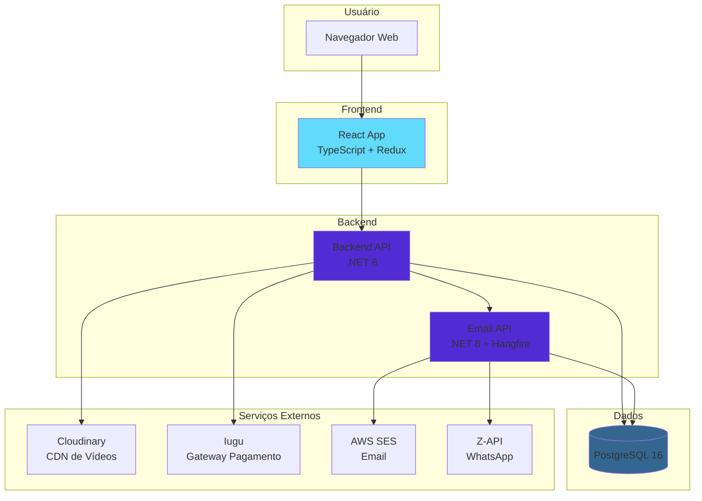
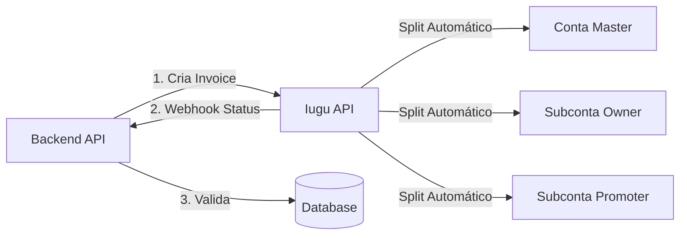
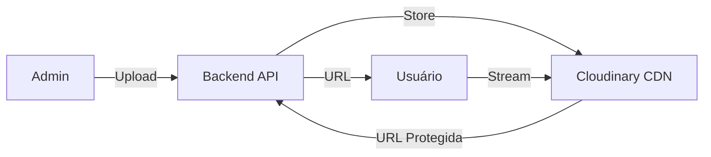
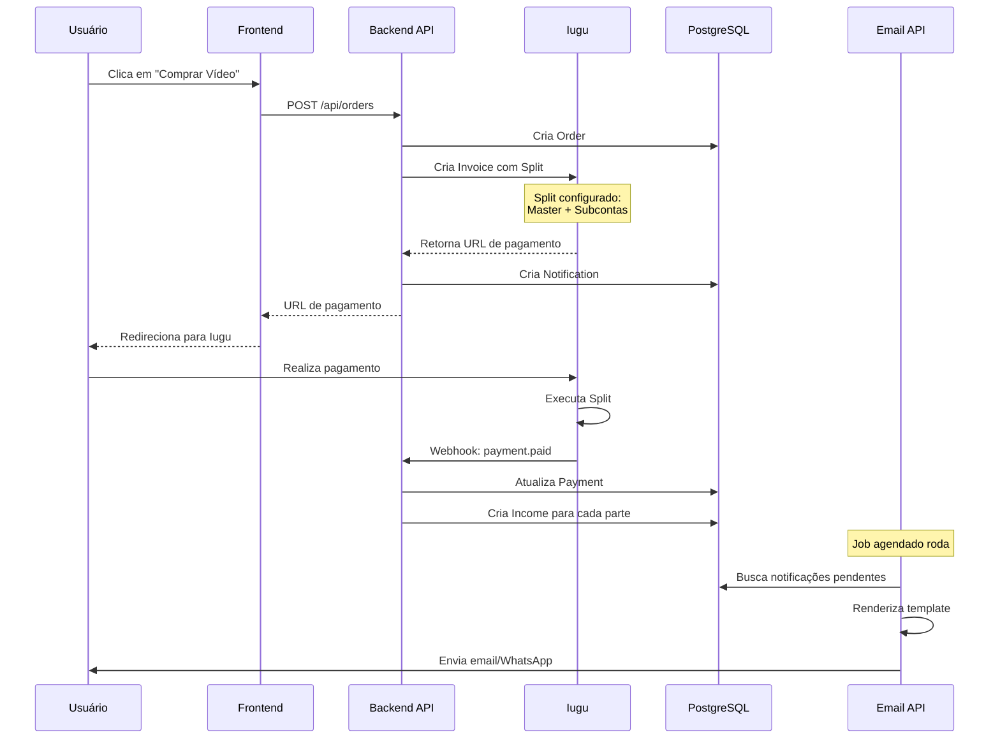
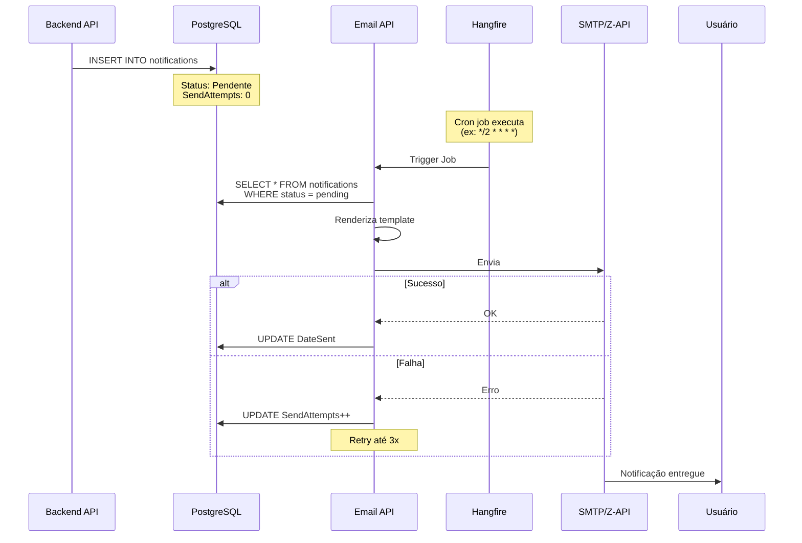

# Arquitetura - Visão Geral

## Visão Macro do Sistema

A plataforma Amasso é composta por **três projetos principais** que trabalham em conjunto:



## Componentes Principais

### 1. Frontend React
**Localização**: `frontend-react/`

- **Tecnologia**: React 18 + TypeScript
- **Estado**: Redux Toolkit
- **Build**: Vite
- **Responsabilidades**:
  - Interface do usuário
  - Comunicação com Backend API via Axios
  - Roteamento (React Router)
  - Validações client-side

### 2. Backend API
**Localização**: `backend-api/`

- **Tecnologia**: ASP.NET Core 8.0
- **ORM**: Entity Framework Core
- **Responsabilidades**:
  - Regras de negócio
  - Gerenciamento de usuários e autenticação
  - CRUD de vídeos e pedidos
  - Integração com Iugu (pagamentos, subcontas, KYC)
  - Integração com Cloudinary (upload de vídeos)
  - Criação de notificações no banco

### 3. Email API
**Localização**: `email-api/`

- **Tecnologia**: ASP.NET Core 8.0 + Hangfire
- **Responsabilidades**:
  - Envio assíncrono de notificações
  - Jobs agendados (Hangfire)
  - Templates de email (HTML)
  - Templates de WhatsApp (texto)
  - Integração com SMTP e Z-API

## Banco de Dados Compartilhado

Ambas as APIs (Backend e Email) compartilham o mesmo banco PostgreSQL:

- **Backend API**: Leitura e escrita completa
- **Email API**: Leitura de notificações + escrita de logs

**Tabelas Principais**:
- `users` - Usuários da plataforma
- `owners` - Dados de KYC e subcontas
- `videos` - Catálogo de vídeos
- `orders` - Pedidos de compra
- `payments` - Pagamentos via Iugu
- `income` - Distribuição de comissões
- `notifications` - Fila de notificações
- `logs` - Logs de sistema

## Integrações Externas

### Iugu (Gateway de Pagamento)


**Funcionalidades Usadas**:
- Criação de invoices (faturas)
- Sistema de split de pagamento
- Conta master + subcontas
- Webhooks de confirmação
- Gestão de subcontas (KYC)

### Cloudinary (CDN de Vídeos)


**Funcionalidades Usadas**:
- Upload de vídeos e imagens
- Armazenamento seguro
- URLs protegidas
- Streaming otimizado
- Transformações de vídeo

### AWS SES (Email)
Backend API cria notificação → Email API processa → AWS SES envia

### Z-API (WhatsApp)
Backend API cria notificação → Email API processa → Z-API envia

## Fluxo de Comunicação

### Fluxo de Compra (Com Split)


### Fluxo de Notificação


## Padrões Arquiteturais

### Backend API - Clean Architecture
```
Endpoints (Presentation Layer)
    ↓
Services (Business Logic Layer)
    ↓
Repositories/Data (Data Access Layer)
    ↓
Database
```

### Email API - Job-Based Architecture
```
HTTP Endpoints (Trigger manual)
    ↓
Hangfire Jobs (Scheduled/Background)
    ↓
Services (Email/WhatsApp Senders)
    ↓
External APIs (SMTP/Z-API)
```

### Frontend - Component-Based Architecture
```
Pages (Route level)
    ↓
Components (Reusable UI)
    ↓
Redux Store (Global State)
    ↓
API Services (HTTP Calls)
```

## Segurança

### Autenticação
- **JWT Tokens**: Gerados no Backend API, validados em cada request
- **MFA**: Código adicional enviado via Email API
- **Refresh Tokens**: Para renovação de sessão

### Autorização
- **Role-Based**: Admin, Default, Promoter, Influencer
- **Claims**: Informações do usuário no token
- **Middleware**: Validação em cada endpoint

### Comunicação Inter-APIs
- Backend API → Email API: Através do banco (notifications table)
- Email API lê, Backend API escreve
- Sem comunicação HTTP direta

## Escalabilidade

### Horizontal
- Frontend: CDN / Multiple instances
- Backend API: Load balancer + múltiplas instâncias
- Email API: Múltiplos workers Hangfire
- Database: Replicação read/write

### Vertical
- Otimização de queries
- Caching (Redis futuro)
- Compressão de responses
- Lazy loading no frontend

## Monitoramento

### Logs
- Backend API: Console + Database (logs table)
- Email API: Console + Database (logs table)
- Estruturados com contexto (RequestId, Level, Event, Payload)

### Métricas
- Hangfire Dashboard: Jobs executados, falhas, tempo
- Application Insights: Performance, erros (futuro)
- Database: Queries lentas, connections

## Ambientes

### Desenvolvimento
- Frontend: `localhost:5173` (Vite)
- Backend API: `localhost:7080`
- Email API: `localhost:5014`
- Database: `localhost:5432` (ou Docker)

### Produção
- Frontend: Azure Static Web Apps / Cloudflare
- Backend API: Azure App Service
- Email API: Azure App Service
- Database: Azure PostgreSQL / AWS RDS

## Próximos Passos

Explore cada componente em detalhes:
- [Backend API](backend-api.md) - Estrutura e endpoints
- [Email API](email-api.md) - Jobs e notificações
- [Frontend](frontend.md) - Componentes e rotas
- [Comunicação](comunicacao-entre-sistemas.md) - Fluxos detalhados

