# Modelo Entidade-Relacionamento

## Diagrama ER Completo

```mermaid
erDiagram
    %% Definição das entidades principais
    users {
        bigint id PK
        varchar email UK
        varchar password_hash
        varchar type "Admin, Default, Promoter, Influencer"
        varchar first_name
        varchar last_name
        varchar cpf
        date birth_date
        varchar telephone
        varchar notification_preference "Email, WhatsApp"
        boolean is_active
        timestamp created_at
        timestamp updated_at
        timestamp deleted_at
    }
    
    owners {
        bigint id PK
        bigint user_id FK
        varchar type "Influencer, Promoter, Partner, Agent"
        varchar iugu_account_id "ID da subconta Iugu"
        varchar sub_account_status "Pending, Approved, Rejected"
        varchar cpf_cnpj
        varchar rg
        date birth_date
        varchar bank_code
        varchar bank_agency
        varchar bank_account
        varchar bank_account_type
        text document_cpf_url
        text document_rg_url
        text document_address_proof_url
        text document_selfie_url
        boolean is_active
        timestamp created_at
        timestamp updated_at
    }
    
    videos {
        bigint id PK
        varchar title
        text description
        varchar cloudinary_public_id
        integer duration_seconds
        decimal price
        date release_date
        date expiration_sale_date
        date expiration_view_date
        text thumb_img_url
        boolean is_active
        timestamp created_at
        timestamp updated_at
        timestamp deleted_at
    }
    
    video_revenue_configs {
        bigint id PK
        bigint video_id FK
        decimal platform_percentage "Ex: 20.00"
        decimal owner_percentage "Ex: 50.00"
        decimal promoter_percentage "Ex: 30.00"
        timestamp created_at
        timestamp updated_at
    }
    
    video_trailers {
        bigint id PK
        bigint video_id FK
        varchar trailer_type "Teaser, BehindScenes"
        varchar cloudinary_public_id
        integer duration_seconds
        boolean is_active
        timestamp created_at
    }
    
    owner_videos {
        bigint id PK
        bigint owner_id FK
        bigint video_id FK
        timestamp created_at
    }
    
    video_affiliate_links {
        bigint id PK
        bigint owner_id FK "Promoter"
        bigint video_id FK
        varchar unique_code UK
        text full_url
        integer clicks
        boolean is_active
        timestamp created_at
    }
    
    orders {
        bigint id PK
        bigint user_id FK
        bigint video_id FK
        bigint promoter_id FK "Nullable"
        bigint video_affiliate_link_id FK "Nullable"
        integer amount "Total em centavos"
        integer platform_amount "Em centavos"
        integer owner_amount "Em centavos"
        integer promoter_amount "Em centavos"
        timestamp created_at
    }
    
    payments {
        bigint id PK
        bigint order_id FK
        varchar iugu_invoice_id
        text iugu_secure_url
        varchar status "Pending, Paid, Cancelled, Refunded"
        timestamp iugu_paid_at
        integer amount
        boolean is_active
        timestamp created_at
        timestamp updated_at
    }
    
    incomes {
        bigint id PK
        bigint order_id FK
        bigint owner_id FK "Nullable (NULL = platform)"
        integer amount "Em centavos"
        varchar type "Platform, Owner, Promoter"
        text description
        timestamp created_at
    }
    
    notifications {
        bigint id PK
        varchar type "MfaCode, UserActivation, etc"
        varchar channel "Email, WhatsApp, All"
        text metadata_json
        timestamp schedule_date
        timestamp date_sent
        integer send_attempts
        text error_message
        boolean is_active
        timestamp created_at
        timestamp updated_at
    }
    
    user_video_logs {
        bigint id PK
        bigint user_id FK
        bigint video_id FK
        timestamp watched_at
        integer watch_duration_seconds
        timestamp created_at
    }
    
    mfa_codes {
        bigint id PK
        bigint user_id FK
        varchar code
        timestamp expires_at
        boolean is_used
        timestamp created_at
    }
    
    logs {
        bigint id PK
        varchar request_id
        timestamp timestamp
        varchar level "debug, info, warning, error"
        varchar event
        text payload
        varchar source
        varchar ip
    }
    
    params {
        bigint id PK
        varchar key UK
        text value
        text description
        timestamp created_at
        timestamp updated_at
    }
    
    %% Relacionamentos
    users ||--o| owners : "pode ser (1:0..1)"
    users ||--o{ orders : "faz (1:N)"
    users ||--o{ user_video_logs : "assiste (1:N)"
    users ||--o{ mfa_codes : "tem (1:N)"
    
    owners ||--o{ owner_videos : "possui (1:N)"
    owners ||--o{ video_affiliate_links : "cria (1:N)"
    owners ||--o{ incomes : "recebe (1:N)"
    owners ||--o{ orders : "promove (1:N)"
    
    videos ||--o{ video_trailers : "tem (1:N)"
    videos ||--|| video_revenue_configs : "tem (1:1)"
    videos ||--o{ owner_videos : "pertence a (1:N)"
    videos ||--o{ orders : "é comprado (1:N)"
    videos ||--o{ video_affiliate_links : "promovido por (1:N)"
    videos ||--o{ user_video_logs : "registra (1:N)"
    
    orders ||--|| payments : "tem (1:1)"
    orders ||--o{ incomes : "gera (1:N)"
    orders }o--o| video_affiliate_links : "usa (0..1:0..N)"
```



## Resumo dos Relacionamentos

### User (Central)
- **1:0..1** com `Owner` - Pode se tornar Promoter/Influencer
- **1:N** com `Order` - Pode fazer múltiplas compras
- **1:N** com `UserVideoLog` - Múltiplos logs de visualização
- **1:N** com `MfaCode` - Múltiplos códigos MFA

### Owner (Promoter/Influencer)
- **1:1** com `User` - Todo owner é um user
- **1:N** com `OwnerVideo` - Influencer pode estar em vários vídeos
- **1:N** com `VideoAffiliateLink` - Promoter pode ter múltiplos links
- **1:N** com `Income` - Recebe múltiplas comissões
- **1:N** com `Order` - Promoter vinculado a múltiplos pedidos (como afiliado)

### Video
- **1:1** com `VideoRevenueConfig` - Cada vídeo tem uma config de comissão
- **1:N** com `VideoTrailer` - Pode ter múltiplos trailers
- **1:N** com `OwnerVideo` - Pode ter múltiplos influencers
- **1:N** com `Order` - Pode ser comprado múltiplas vezes
- **1:N** com `VideoAffiliateLink` - Pode ter múltiplos links de promoters
- **1:N** com `UserVideoLog` - Múltiplos logs de visualização

### Order (Transação)
- **N:1** com `User` - Pedido pertence a um usuário
- **N:1** com `Video` - Pedido é de um vídeo específico
- **N:0..1** com `Owner` (Promoter) - Pode ter ou não um promoter
- **N:0..1** com `VideoAffiliateLink` - Pode ter usado um link
- **1:1** com `Payment` - Cada pedido tem um pagamento
- **1:N** com `Income` - Gera múltiplas comissões (plataforma, owner, promoter)

## Cardinalidades Importantes

### Obrigatório vs Opcional

**Obrigatório (NOT NULL)**:
```
Order → User (obrigatório ter usuário)
Order → Video (obrigatório ter vídeo)
Payment → Order (obrigatório ter pedido)
Income → Order (obrigatório ter pedido)
```

**Opcional (NULL)**:
```
Order → Promoter (pode não ter promoter)
Order → VideoAffiliateLink (pode não usar link)
Income → Owner (NULL = plataforma)
Owner → IuguAccountId (criado apenas após KYC)
```

## Índices Importantes

### Chaves Primárias (Automáticas)
Todas as tabelas têm `id BIGSERIAL PRIMARY KEY`

### Chaves Únicas
```sql
users.email - UK
video_affiliate_links.unique_code - UK
params.key - UK
```

### Índices de Performance

```sql
-- Índices em Foreign Keys
CREATE INDEX idx_orders_user_id ON orders(user_id);
CREATE INDEX idx_orders_video_id ON orders(video_id);
CREATE INDEX idx_orders_promoter_id ON orders(promoter_id);
CREATE INDEX idx_payments_order_id ON payments(order_id);
CREATE INDEX idx_incomes_order_id ON incomes(order_id);
CREATE INDEX idx_incomes_owner_id ON incomes(owner_id);

-- Índices compostos
CREATE INDEX idx_orders_user_video ON orders(user_id, video_id);
CREATE INDEX idx_notifications_type_channel 
    ON notifications(type, channel, date_sent);

-- Índices parciais (soft delete)
CREATE INDEX idx_videos_active 
    ON videos(id) 
    WHERE is_active = TRUE AND deleted_at IS NULL;
    
CREATE INDEX idx_video_affiliate_links_active 
    ON video_affiliate_links(video_id, owner_id) 
    WHERE is_active = TRUE;
```

## Constraints de Integridade

### Check Constraints

```sql
-- Percentuais de comissão devem somar 100
ALTER TABLE video_revenue_configs 
ADD CONSTRAINT chk_percentages_sum_100 
CHECK (platform_percentage + owner_percentage + promoter_percentage = 100);

-- Valores positivos
ALTER TABLE videos 
ADD CONSTRAINT chk_price_positive 
CHECK (price >= 0);

ALTER TABLE orders 
ADD CONSTRAINT chk_amount_positive 
CHECK (amount > 0);

-- Status válidos
ALTER TABLE payments 
ADD CONSTRAINT chk_status_valid 
CHECK (status IN ('Pending', 'Paid', 'Cancelled', 'Refunded'));

-- Tipo de usuário válido
ALTER TABLE users 
ADD CONSTRAINT chk_user_type_valid 
CHECK (type IN ('Admin', 'Default', 'Promoter', 'Influencer'));
```

### Foreign Key Constraints

```sql
-- Todas com ON DELETE RESTRICT (default)
-- Não permite deletar se houver dependências

ALTER TABLE orders 
ADD CONSTRAINT fk_orders_user 
    FOREIGN KEY (user_id) REFERENCES users(id);

ALTER TABLE orders 
ADD CONSTRAINT fk_orders_video 
    FOREIGN KEY (video_id) REFERENCES videos(id);

-- Com ON DELETE CASCADE (quando aplicável)
ALTER TABLE video_trailers 
ADD CONSTRAINT fk_video_trailers_video 
    FOREIGN KEY (video_id) REFERENCES videos(id) 
    ON DELETE CASCADE;
```

## Triggers

### Updated At Automático

```sql
CREATE OR REPLACE FUNCTION update_updated_at_column()
RETURNS TRIGGER AS $$
BEGIN
    NEW.updated_at = CURRENT_TIMESTAMP;
    RETURN NEW;
END;
$$ LANGUAGE plpgsql;

-- Aplicar em tabelas relevantes
CREATE TRIGGER set_updated_at
BEFORE UPDATE ON users
FOR EACH ROW
EXECUTE FUNCTION update_updated_at_column();

CREATE TRIGGER set_updated_at
BEFORE UPDATE ON videos
FOR EACH ROW
EXECUTE FUNCTION update_updated_at_column();
-- ... outras tabelas
```

## Views Úteis

### Pedidos com Detalhes Completos

```sql
CREATE VIEW vw_orders_full AS
SELECT 
    o.id AS order_id,
    o.created_at AS order_date,
    u.email AS buyer_email,
    u.first_name || ' ' || u.last_name AS buyer_name,
    v.title AS video_title,
    v.price AS video_price,
    o.amount / 100.0 AS total_amount,
    p.status AS payment_status,
    p.iugu_paid_at AS paid_at,
    CASE 
        WHEN o.promoter_id IS NOT NULL THEN owner.user_id 
        ELSE NULL 
    END AS promoter_user_id,
    val.unique_code AS affiliate_code
FROM orders o
JOIN users u ON o.user_id = u.id
JOIN videos v ON o.video_id = v.id
LEFT JOIN payments p ON p.order_id = o.id
LEFT JOIN owners owner ON o.promoter_id = owner.id
LEFT JOIN video_affiliate_links val ON o.video_affiliate_link_id = val.id;
```

### Dashboard de Influencer

```sql
CREATE VIEW vw_influencer_dashboard AS
SELECT 
    ow.id AS owner_id,
    u.email,
    u.first_name || ' ' || u.last_name AS name,
    COUNT(DISTINCT ov.video_id) AS total_videos,
    COUNT(DISTINCT o.id) AS total_sales,
    SUM(i.amount) / 100.0 AS total_earnings,
    AVG(i.amount) / 100.0 AS avg_per_sale
FROM owners ow
JOIN users u ON ow.user_id = u.id
LEFT JOIN owner_videos ov ON ov.owner_id = ow.id
LEFT JOIN orders o ON o.video_id = ov.video_id
LEFT JOIN incomes i ON i.order_id = o.id AND i.owner_id = ow.id
WHERE ow.type = 'Influencer'
GROUP BY ow.id, u.email, u.first_name, u.last_name;
```

### Dashboard de Promoter

```sql
CREATE VIEW vw_promoter_dashboard AS
SELECT 
    ow.id AS owner_id,
    u.email,
    u.first_name || ' ' || u.last_name AS name,
    COUNT(DISTINCT val.id) AS total_links,
    SUM(val.clicks) AS total_clicks,
    COUNT(DISTINCT o.id) AS total_conversions,
    SUM(i.amount) / 100.0 AS total_earnings,
    CASE 
        WHEN SUM(val.clicks) > 0 
        THEN (COUNT(DISTINCT o.id)::decimal / SUM(val.clicks)::decimal * 100)
        ELSE 0 
    END AS conversion_rate
FROM owners ow
JOIN users u ON ow.user_id = u.id
LEFT JOIN video_affiliate_links val ON val.owner_id = ow.id
LEFT JOIN orders o ON o.video_affiliate_link_id = val.id
LEFT JOIN incomes i ON i.order_id = o.id AND i.owner_id = ow.id
WHERE ow.type = 'Promoter'
GROUP BY ow.id, u.email, u.first_name, u.last_name;
```

## Dados de Exemplo

### Seed Data para Desenvolvimento

```sql
-- Admin
INSERT INTO users (email, password_hash, type, first_name, last_name, is_active)
VALUES ('admin@amasso.com', '$2a$...hash...', 'Admin', 'Admin', 'Sistema', true);

-- Default User
INSERT INTO users (email, password_hash, type, first_name, last_name, is_active)
VALUES ('user@example.com', '$2a$...hash...', 'Default', 'João', 'Silva', true);

-- Influencer
INSERT INTO users (email, password_hash, type, first_name, last_name, is_active)
VALUES ('influencer@example.com', '$2a$...hash...', 'Influencer', 'Maria', 'Santos', true);

INSERT INTO owners (user_id, type, sub_account_status, iugu_account_id)
VALUES (3, 'Influencer', 'Approved', 'iugu_acc_123');

-- Promoter
INSERT INTO users (email, password_hash, type, first_name, last_name, is_active)
VALUES ('promoter@example.com', '$2a$...hash...', 'Promoter', 'Carlos', 'Oliveira', true);

INSERT INTO owners (user_id, type, sub_account_status, iugu_account_id)
VALUES (4, 'Promoter', 'Approved', 'iugu_acc_456');

-- Vídeo com config de comissão
INSERT INTO videos (title, description, cloudinary_public_id, price, is_active)
VALUES ('Vídeo Exemplo', 'Descrição do vídeo', 'cloudinary_123', 100.00, true);

INSERT INTO video_revenue_configs (video_id, platform_percentage, owner_percentage, promoter_percentage)
VALUES (1, 20.00, 50.00, 30.00);
```

## Próximos Passos

- Consulte documentação detalhada de cada tabela:
  - [Users](tabelas/users.md)
  - [Videos](tabelas/videos.md)
  - [Orders](tabelas/orders.md)
  - [Payments](tabelas/payments.md)
  - [Owners](tabelas/owners.md)
  - [Income](tabelas/income.md)
  - [Notifications](tabelas/notifications.md)
- Veja [Relacionamentos](tabelas/relacionamentos.md) com exemplos práticos
- Consulte [Casos de Uso](../casos-de-uso/usuario-compra-video.md) para entender os fluxos

