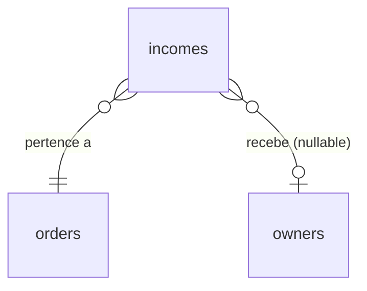

# Tabela: incomes

## Descrição

A tabela `incomes` registra a distribuição de comissões de cada venda. Para cada order pago, são criados 2-3 registros de income: um para a plataforma, um para o influencer (owner) e opcionalmente um para o promoter.

## Estrutura

```sql
CREATE TABLE incomes (
    id BIGSERIAL PRIMARY KEY,
    order_id BIGINT NOT NULL REFERENCES orders(id),
    owner_id BIGINT REFERENCES owners(id), -- NULL = plataforma
    
    amount INTEGER NOT NULL,
    type VARCHAR(20) NOT NULL, -- Platform, Owner, Promoter
    description TEXT,
    
    created_at TIMESTAMP DEFAULT CURRENT_TIMESTAMP
);

-- Índices
CREATE INDEX idx_incomes_order_id ON incomes(order_id);
CREATE INDEX idx_incomes_owner_id ON incomes(owner_id);
CREATE INDEX idx_incomes_type ON incomes(type);
CREATE INDEX idx_incomes_created_at ON incomes(created_at DESC);
```

## Campos

| Campo | Tipo | Descrição | Obrigatório |
|-------|------|-----------|-------------|
| `id` | `bigserial` | Chave primária | ✓ |
| `order_id` | `bigint` | FK para orders | ✓ |
| `owner_id` | `bigint` | FK para owners (NULL = plataforma) | ✗ |
| `amount` | `integer` | Valor em centavos | ✓ |
| `type` | `varchar(20)` | Tipo de comissão (enum) | ✓ |
| `description` | `text` | Descrição | ✗ |
| `created_at` | `timestamp` | Data de criação | ✓ |

## Enum: IncomeTypeEnum

```csharp
public enum IncomeTypeEnum
{
    Platform,  // Comissão da plataforma (owner_id = NULL)
    Owner,     // Comissão do influencer/criador
    Promoter   // Comissão do promoter/afiliado
}
```

## Relacionamentos



- **N:1** com `orders` - Cada income pertence a um order
- **N:0..1** com `owners` - NULL = plataforma, senão = owner específico

## Entidade C#

```csharp
public class Income
{
    public long Id { get; set; }
    public long OrderId { get; set; }
    public long? OwnerId { get; set; } // NULL = plataforma
    public int Amount { get; set; } // em centavos
    public IncomeTypeEnum Type { get; set; }
    public string? Description { get; set; }
    public DateTime CreatedAt { get; set; }
    
    // Navigation properties
    public Order Order { get; set; }
    public Owner? Owner { get; set; }
}
```

## Criação de Incomes

Após webhook confirmar pagamento:

```csharp
public async Task CreateIncomesForOrderAsync(long orderId)
{
    var order = await _context.Orders
        .Include(o => o.Video)
        .ThenInclude(v => v.OwnerVideos)
        .ThenInclude(ov => ov.Owner)
        .FirstAsync(o => o.Id == orderId);
    
    var incomes = new List<Income>();
    
    // 1. Plataforma (owner_id = NULL)
    incomes.Add(new Income
    {
        OrderId = order.Id,
        OwnerId = null,
        Amount = order.PlatformAmount,
        Type = IncomeTypeEnum.Platform,
        Description = "Comissão da plataforma",
        CreatedAt = DateTime.UtcNow
    });
    
    // 2. Owner/Influencer
    var owner = order.Video.OwnerVideos.First().Owner;
    incomes.Add(new Income
    {
        OrderId = order.Id,
        OwnerId = owner.Id,
        Amount = order.OwnerAmount,
        Type = IncomeTypeEnum.Owner,
        Description = $"Venda do vídeo: {order.Video.Title}",
        CreatedAt = DateTime.UtcNow
    });
    
    // 3. Promoter (se houver)
    if (order.PromoterId.HasValue && order.PromoterAmount > 0)
    {
        incomes.Add(new Income
        {
            OrderId = order.Id,
            OwnerId = order.PromoterId.Value,
            Amount = order.PromoterAmount,
            Type = IncomeTypeEnum.Promoter,
            Description = $"Comissão por divulgação: {order.Video.Title}",
            CreatedAt = DateTime.UtcNow
        });
    }
    
    await _context.Incomes.AddRangeAsync(incomes);
    await _context.SaveChangesAsync();
}
```

## Exemplo Prático

### Venda de R$ 100,00

**Configuração do vídeo**:
- Plataforma: 20%
- Influencer: 50%
- Promoter: 30%

**Registros criados em `incomes`**:

| id | order_id | owner_id | amount | type | description |
|----|----------|----------|--------|------|-------------|
| 1 | 123 | NULL | 2000 | Platform | Comissão da plataforma |
| 2 | 123 | 45 | 5000 | Owner | Venda do vídeo: Vídeo X |
| 3 | 123 | 67 | 3000 | Promoter | Comissão por divulgação: Vídeo X |

**Total**: 2000 + 5000 + 3000 = 10000 centavos = R$ 100,00 ✓

## Queries Comuns

### Total de comissões de um owner

```sql
SELECT 
    o.id as owner_id,
    u.first_name || ' ' || u.last_name as name,
    COUNT(i.id) as total_vendas,
    SUM(i.amount) / 100.0 as total_recebido
FROM owners o
INNER JOIN users u ON u.id = o.user_id
INNER JOIN incomes i ON i.owner_id = o.id
GROUP BY o.id, u.first_name, u.last_name;
```

```csharp
var ownerIncomes = await _context.Incomes
    .Where(i => i.OwnerId == ownerId)
    .GroupBy(i => i.Type)
    .Select(g => new
    {
        Type = g.Key,
        Total = g.Sum(i => i.Amount) / 100m,
        Count = g.Count()
    })
    .ToListAsync();
```

### Comissões da plataforma (período)

```sql
SELECT 
    DATE(i.created_at) as date,
    COUNT(i.id) as total_vendas,
    SUM(i.amount) / 100.0 as total_comissao
FROM incomes i
WHERE i.owner_id IS NULL
  AND i.created_at BETWEEN '2025-01-01' AND '2025-01-31'
GROUP BY DATE(i.created_at)
ORDER BY date;
```

```csharp
var platformIncomes = await _context.Incomes
    .Where(i => i.OwnerId == null &&
                i.CreatedAt >= startDate &&
                i.CreatedAt <= endDate)
    .GroupBy(i => i.CreatedAt.Date)
    .Select(g => new
    {
        Date = g.Key,
        Total = g.Sum(i => i.Amount) / 100m,
        Count = g.Count()
    })
    .ToListAsync();
```

### Top 10 promoters por comissão

```sql
SELECT 
    o.id,
    u.first_name || ' ' || u.last_name as name,
    COUNT(i.id) as total_vendas,
    SUM(i.amount) / 100.0 as total_comissao
FROM incomes i
INNER JOIN owners o ON o.id = i.owner_id
INNER JOIN users u ON u.id = o.user_id
WHERE i.type = 'Promoter'
GROUP BY o.id, u.first_name, u.last_name
ORDER BY total_comissao DESC
LIMIT 10;
```

### Incomes de um order específico

```sql
SELECT 
    i.*,
    CASE 
        WHEN i.owner_id IS NULL THEN 'Amasso (Plataforma)'
        ELSE u.first_name || ' ' || u.last_name
    END as beneficiario
FROM incomes i
LEFT JOIN owners o ON o.id = i.owner_id
LEFT JOIN users u ON u.id = o.user_id
WHERE i.order_id = 123;
```

## Dashboard de Influencer

```csharp
public async Task<InfluencerDashboardDto> GetDashboardAsync(long influencerId)
{
    var incomes = await _context.Incomes
        .Include(i => i.Order)
        .ThenInclude(o => o.Video)
        .Where(i => i.OwnerId == influencerId &&
                    i.Type == IncomeTypeEnum.Owner)
        .ToListAsync();
    
    return new InfluencerDashboardDto
    {
        TotalEarnings = incomes.Sum(i => i.Amount) / 100m,
        TotalSales = incomes.Count,
        AveragePerSale = incomes.Average(i => i.Amount) / 100m,
        LastSale = incomes.Max(i => i.CreatedAt),
        TopVideos = incomes
            .GroupBy(i => i.Order.Video)
            .OrderByDescending(g => g.Sum(i => i.Amount))
            .Take(5)
            .Select(g => new VideoEarningsDto
            {
                VideoTitle = g.Key.Title,
                Sales = g.Count(),
                TotalEarnings = g.Sum(i => i.Amount) / 100m
            })
            .ToList()
    };
}
```

## Dashboard de Promoter

```csharp
public async Task<PromoterDashboardDto> GetDashboardAsync(long promoterId)
{
    var incomes = await _context.Incomes
        .Include(i => i.Order)
        .ThenInclude(o => o.Video)
        .Include(i => i.Order)
        .ThenInclude(o => o.VideoAffiliateLink)
        .Where(i => i.OwnerId == promoterId &&
                    i.Type == IncomeTypeEnum.Promoter)
        .ToListAsync();
    
    var links = await _context.VideoAffiliateLinks
        .Where(l => l.OwnerId == promoterId)
        .ToListAsync();
    
    var totalClicks = links.Sum(l => l.Clicks);
    var totalConversions = incomes.Count;
    
    return new PromoterDashboardDto
    {
        TotalEarnings = incomes.Sum(i => i.Amount) / 100m,
        TotalConversions = totalConversions,
        TotalClicks = totalClicks,
        ConversionRate = totalClicks > 0 
            ? (decimal)totalConversions / totalClicks * 100 
            : 0,
        AverageCommission = totalConversions > 0
            ? incomes.Average(i => i.Amount) / 100m
            : 0
    };
}
```

## Regras de Negócio

1. **3 beneficiários máximo**: Plataforma + Owner + Promoter (opcional)
2. **owner_id NULL**: Representa a plataforma
3. **Imutável**: Incomes não são alterados após criação
4. **Rastreabilidade**: Sempre vinculado a um order
5. **Soma deve bater**: Soma dos incomes de um order = order.amount
6. **Criado após pagamento**: Apenas quando payment.status = Paid

## Validações

```csharp
// Verificar se incomes já foram criados para um order
var alreadyCreated = await _context.Incomes
    .AnyAsync(i => i.OrderId == orderId);

if (alreadyCreated)
{
    throw new InvalidOperationException("Incomes já criados para este order");
}

// Validar soma dos incomes
var totalIncomes = incomes.Sum(i => i.Amount);
if (totalIncomes != order.Amount)
{
    throw new InvalidOperationException(
        $"Soma dos incomes ({totalIncomes}) != order.Amount ({order.Amount})");
}
```

## Relatórios

### Receita total da plataforma

```sql
SELECT 
    SUM(amount) / 100.0 as total_receita,
    COUNT(*) as total_transacoes
FROM incomes
WHERE owner_id IS NULL;
```

### Distribuição de comissões por tipo

```sql
SELECT 
    type,
    COUNT(*) as quantidade,
    SUM(amount) / 100.0 as total,
    AVG(amount) / 100.0 as media
FROM incomes
GROUP BY type;
```

## Próximos Passos

- Veja [Orders](orders.md) para entender origem das comissões
- Consulte [Owners](owners.md) para beneficiários
- Entenda [Split de Pagamento](../../pagamentos/split-pagamento.md) completo

