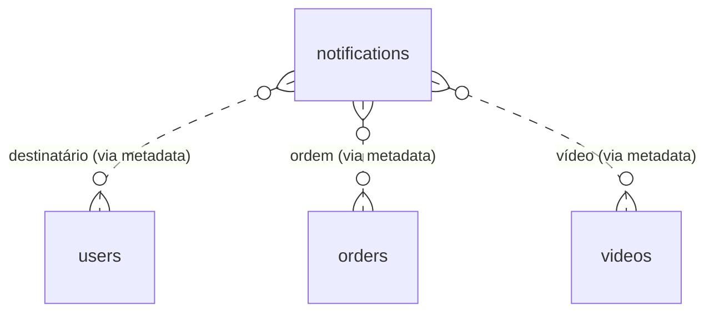

# Tabela: notifications

## Descrição

A tabela `notifications` armazena todas as notificações que precisam ser enviadas via email ou WhatsApp. Ela é processada pela **Email API** utilizando Hangfire para agendamento e retry automático.

## Estrutura

```sql
CREATE TABLE notifications (
    id BIGSERIAL PRIMARY KEY,
    
    -- Tipo e canal
    type VARCHAR(50) NOT NULL, -- MfaCode, UserActivation, ForgotPassword, etc.
    channel VARCHAR(20) NOT NULL, -- Email, WhatsApp, All
    
    -- Dados
    email VARCHAR(255),
    phone VARCHAR(20),
    metadata_json TEXT, -- JSON com dados para o template
    
    -- Controle de envio
    is_sent BOOLEAN DEFAULT FALSE,
    send_attempts INTEGER DEFAULT 0,
    scheduled_to_send TIMESTAMP,
    sent_at TIMESTAMP,
    error_message TEXT,
    
    -- Auditoria
    created_at TIMESTAMP DEFAULT CURRENT_TIMESTAMP,
    updated_at TIMESTAMP
);

-- Índices
CREATE INDEX idx_notifications_is_sent ON notifications(is_sent, scheduled_to_send);
CREATE INDEX idx_notifications_type ON notifications(type);
CREATE INDEX idx_notifications_channel ON notifications(channel);
CREATE INDEX idx_notifications_scheduled ON notifications(scheduled_to_send);
CREATE INDEX idx_notifications_created_at ON notifications(created_at DESC);
```

## Campos

| Campo | Tipo | Descrição | Obrigatório |
|-------|------|-----------|-------------|
| `id` | `bigserial` | Chave primária | ✓ |
| `type` | `varchar(50)` | Tipo de notificação (enum) | ✓ |
| `channel` | `varchar(20)` | Canal de envio (enum) | ✓ |
| `email` | `varchar(255)` | Email do destinatário | ✗ |
| `phone` | `varchar(20)` | Telefone do destinatário | ✗ |
| `metadata_json` | `text` | Dados JSON para template | ✗ |
| `is_sent` | `boolean` | Enviado com sucesso? | ✓ |
| `send_attempts` | `integer` | Tentativas de envio | ✓ |
| `scheduled_to_send` | `timestamp` | Quando deve ser enviado | ✗ |
| `sent_at` | `timestamp` | Quando foi enviado | ✗ |
| `error_message` | `text` | Mensagem de erro (se falhou) | ✗ |
| `created_at` | `timestamp` | Data de criação | ✓ |
| `updated_at` | `timestamp` | Data de atualização | ✗ |

## Enums

### NotificationTypeEnum

```csharp
public enum NotificationTypeEnum
{
    MfaCode,              // Código MFA para login
    UserActivation,       // Código de ativação de conta
    ForgotPassword,       // Código para recuperação de senha
    VideoReleaseSchedule, // Agendamento de lançamento de vídeo
    PaymentConfirmed,     // Confirmação de pagamento
    KycSubmitted,         // KYC enviado (notifica admin)
    KycApproved,          // KYC aprovado (notifica owner)
    KycRejected,          // KYC rejeitado (notifica owner)
    NewSale               // Nova venda (notifica influencer/promoter)
}
```

### NotificationChannelEnum

```csharp
public enum NotificationChannelEnum
{
    Email,    // Apenas email
    WhatsApp, // Apenas WhatsApp
    All       // Email + WhatsApp
}
```

## Relacionamentos

A tabela `notifications` não tem FKs diretas, mas contém `metadata_json` com IDs relacionados.



## Entidade C#

```csharp
public class Notification
{
    public long Id { get; set; }
    public NotificationTypeEnum Type { get; set; }
    public NotificationChannelEnum Channel { get; set; }
    public string? Email { get; set; }
    public string? Phone { get; set; }
    public string? MetadataJson { get; set; }
    public bool IsSent { get; set; }
    public int SendAttempts { get; set; }
    public DateTime? ScheduledToSend { get; set; }
    public DateTime? SentAt { get; set; }
    public string? ErrorMessage { get; set; }
    public DateTime CreatedAt { get; set; }
    public DateTime? UpdatedAt { get; set; }
}
```

## Criação de Notificação

### MFA Code

```csharp
public async Task SendMfaCodeAsync(string email, string code)
{
    var notification = new Notification
    {
        Type = NotificationTypeEnum.MfaCode,
        Channel = NotificationChannelEnum.Email,
        Email = email,
        MetadataJson = JsonSerializer.Serialize(new
        {
            Code = code,
            ExpiresIn = 5 // minutos
        }),
        CreatedAt = DateTime.UtcNow
    };
    
    await _context.Notifications.AddAsync(notification);
    await _context.SaveChangesAsync();
}
```

### Video Release Schedule

```csharp
public async Task ScheduleVideoReleaseNotificationAsync(
    long videoId, 
    string videoTitle, 
    DateTime releaseDate)
{
    // Buscar usuários interessados
    var users = await _context.Users
        .Where(u => u.IsActive && u.NotificationPreference != null)
        .ToListAsync();
    
    var notifications = users.Select(u => new Notification
    {
        Type = NotificationTypeEnum.VideoReleaseSchedule,
        Channel = u.NotificationPreference ?? NotificationChannelEnum.Email,
        Email = u.Email,
        Phone = u.Telephone,
        ScheduledToSend = releaseDate.AddHours(-24), // 24h antes
        MetadataJson = JsonSerializer.Serialize(new
        {
            VideoId = videoId,
            VideoTitle = videoTitle,
            ReleaseDate = releaseDate
        }),
        CreatedAt = DateTime.UtcNow
    }).ToList();
    
    await _context.Notifications.AddRangeAsync(notifications);
    await _context.SaveChangesAsync();
}
```

### Payment Confirmed

```csharp
public async Task NotifyPaymentConfirmedAsync(long orderId)
{
    var order = await _context.Orders
        .Include(o => o.User)
        .Include(o => o.Video)
        .FirstAsync(o => o.Id == orderId);
    
    var notification = new Notification
    {
        Type = NotificationTypeEnum.PaymentConfirmed,
        Channel = order.User.NotificationPreference ?? NotificationChannelEnum.Email,
        Email = order.User.Email,
        Phone = order.User.Telephone,
        MetadataJson = JsonSerializer.Serialize(new
        {
            OrderId = order.Id,
            VideoTitle = order.Video.Title,
            Amount = order.Amount / 100m
        }),
        CreatedAt = DateTime.UtcNow
    };
    
    await _context.Notifications.AddAsync(notification);
    await _context.SaveChangesAsync();
}
```

## Processamento pela Email API

```csharp
// Hangfire Job - executado a cada 1 minuto
[AutomaticRetry(Attempts = 3)]
public async Task ProcessPendingNotificationsAsync()
{
    var pendingNotifications = await _context.Notifications
        .Where(n => !n.IsSent &&
                    n.SendAttempts < 3 &&
                    (n.ScheduledToSend == null || n.ScheduledToSend <= DateTime.UtcNow))
        .OrderBy(n => n.CreatedAt)
        .Take(50)
        .ToListAsync();
    
    foreach (var notification in pendingNotifications)
    {
        try
        {
            notification.SendAttempts++;
            
            // Email
            if (notification.Channel == NotificationChannelEnum.Email ||
                notification.Channel == NotificationChannelEnum.All)
            {
                await _emailSender.SendAsync(notification);
            }
            
            // WhatsApp
            if (notification.Channel == NotificationChannelEnum.WhatsApp ||
                notification.Channel == NotificationChannelEnum.All)
            {
                await _whatsAppSender.SendAsync(notification);
            }
            
            notification.IsSent = true;
            notification.SentAt = DateTime.UtcNow;
            notification.UpdatedAt = DateTime.UtcNow;
            
            _logger.LogInformation("Notificação {Id} enviada com sucesso", notification.Id);
        }
        catch (Exception ex)
        {
            notification.ErrorMessage = ex.Message;
            notification.UpdatedAt = DateTime.UtcNow;
            
            _logger.LogError(ex, "Erro ao enviar notificação {Id}", notification.Id);
        }
    }
    
    await _context.SaveChangesAsync();
}
```

## Templates

Cada tipo de notificação tem templates específicos:

### Email

- `Templates/MfaCode.html`
- `Templates/UserActivation.html`
- `Templates/PaymentConfirmed.html`
- etc.

### WhatsApp

- `Templates/MfaCode.txt`
- `Templates/UserActivation.txt`
- `Templates/PaymentConfirmed.txt`
- etc.

### Renderização

```csharp
public async Task<string> RenderTemplateAsync(Notification notification)
{
    var templatePath = notification.Channel == NotificationChannelEnum.Email
        ? $"Templates/{notification.Type}.html"
        : $"Templates/{notification.Type}.txt";
    
    var template = await File.ReadAllTextAsync(templatePath);
    var metadata = JsonSerializer.Deserialize<Dictionary<string, object>>(
        notification.MetadataJson);
    
    // Substituir variáveis
    foreach (var key in metadata.Keys)
    {
        template = template.Replace($"{{{{{key}}}}}", metadata[key].ToString());
    }
    
    return template;
}
```

## Queries Comuns

### Notificações pendentes

```sql
SELECT * FROM notifications
WHERE is_sent = FALSE
  AND send_attempts < 3
  AND (scheduled_to_send IS NULL OR scheduled_to_send <= NOW())
ORDER BY created_at
LIMIT 50;
```

```csharp
var pending = await _context.Notifications
    .Where(n => !n.IsSent &&
                n.SendAttempts < 3 &&
                (n.ScheduledToSend == null || n.ScheduledToSend <= DateTime.UtcNow))
    .OrderBy(n => n.CreatedAt)
    .Take(50)
    .ToListAsync();
```

### Notificações com erro

```sql
SELECT * FROM notifications
WHERE is_sent = FALSE
  AND send_attempts >= 3
  AND error_message IS NOT NULL;
```

```csharp
var failed = await _context.Notifications
    .Where(n => !n.IsSent &&
                n.SendAttempts >= 3 &&
                n.ErrorMessage != null)
    .ToListAsync();
```

### Estatísticas por tipo

```sql
SELECT 
    type,
    COUNT(*) as total,
    SUM(CASE WHEN is_sent THEN 1 ELSE 0 END) as enviadas,
    AVG(send_attempts) as media_tentativas
FROM notifications
GROUP BY type;
```

```csharp
var stats = await _context.Notifications
    .GroupBy(n => n.Type)
    .Select(g => new
    {
        Type = g.Key,
        Total = g.Count(),
        Sent = g.Count(n => n.IsSent),
        AvgAttempts = g.Average(n => n.SendAttempts)
    })
    .ToListAsync();
```

### Notificações agendadas futuras

```sql
SELECT * FROM notifications
WHERE is_sent = FALSE
  AND scheduled_to_send > NOW()
ORDER BY scheduled_to_send;
```

## Regras de Negócio

1. **Email ou Phone**: Deve ter pelo menos um preenchido
2. **ScheduledToSend**: Null = enviar imediatamente
3. **Retry**: Máximo 3 tentativas antes de desistir
4. **MetadataJson**: Dados necessários para renderizar template
5. **IsSent**: Só marcado como true após envio bem-sucedido
6. **Cleanup**: Notificações antigas (>90 dias) são deletadas por job

## Monitoramento

### Dashboard Hangfire

```
/dashboard
```

- Total de notificações processadas
- Taxa de sucesso
- Fila de pendentes
- Erros recentes

### Alertas

```csharp
// Alertar se há muitas notificações falhando
var recentFailures = await _context.Notifications
    .Where(n => !n.IsSent &&
                n.SendAttempts >= 3 &&
                n.CreatedAt >= DateTime.UtcNow.AddHours(-1))
    .CountAsync();

if (recentFailures > 10)
{
    _logger.LogCritical("Muitas notificações falhando: {Count}", recentFailures);
    // Enviar alerta para admin
}
```

## Próximos Passos

- Veja [Email API](../../arquitetura/email-api.md) para arquitetura completa
- Consulte [Templates](../../apis/email-api/templates.md) para criar novos
- Entenda [Hangfire Jobs](../../apis/email-api/hangfire-jobs.md) para agendamento

