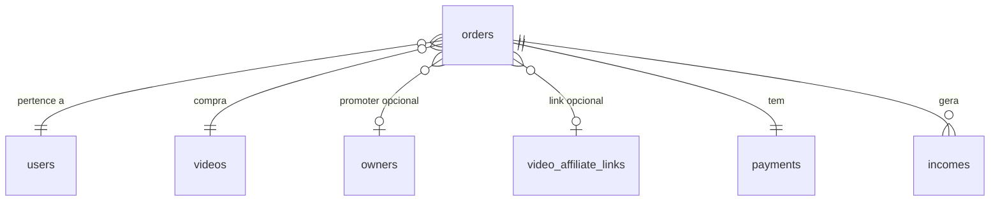

# Tabela: orders

## Descrição

A tabela `orders` registra todas as compras de vídeos realizadas na plataforma. Cada pedido armazena os valores já calculados para o split de pagamento.

## Estrutura

```sql
CREATE TABLE orders (
    id BIGSERIAL PRIMARY KEY,
    user_id BIGINT NOT NULL REFERENCES users(id),
    video_id BIGINT NOT NULL REFERENCES videos(id),
    promoter_id BIGINT REFERENCES owners(id),
    video_affiliate_link_id BIGINT REFERENCES video_affiliate_links(id),
    
    -- Valores (em centavos)
    amount INTEGER NOT NULL,
    platform_amount INTEGER NOT NULL,
    owner_amount INTEGER NOT NULL,
    promoter_amount INTEGER DEFAULT 0,
    
    created_at TIMESTAMP DEFAULT CURRENT_TIMESTAMP
);

-- Índices
CREATE INDEX idx_orders_user_id ON orders(user_id);
CREATE INDEX idx_orders_video_id ON orders(video_id);
CREATE INDEX idx_orders_promoter_id ON orders(promoter_id);
CREATE INDEX idx_orders_user_video ON orders(user_id, video_id);
CREATE INDEX idx_orders_created_at ON orders(created_at DESC);
```

## Campos

| Campo | Tipo | Descrição | Obrigatório |
|-------|------|-----------|-------------|
| `id` | `bigserial` | Chave primária | ✓ |
| `user_id` | `bigint` | FK para users (comprador) | ✓ |
| `video_id` | `bigint` | FK para videos | ✓ |
| `promoter_id` | `bigint` | FK para owners (promoter) | ✗ |
| `video_affiliate_link_id` | `bigint` | FK para video_affiliate_links | ✗ |
| `amount` | `integer` | Valor total em centavos | ✓ |
| `platform_amount` | `integer` | Comissão plataforma (centavos) | ✓ |
| `owner_amount` | `integer` | Comissão influencer (centavos) | ✓ |
| `promoter_amount` | `integer` | Comissão promoter (centavos) | ✓ |
| `created_at` | `timestamp` | Data de criação | ✓ |

## Relacionamentos



- **N:1** com `users` - Comprador do vídeo
- **N:1** com `videos` - Vídeo comprado
- **N:0..1** com `owners` - Promoter (se compra via link)
- **N:0..1** com `video_affiliate_links` - Link usado
- **1:1** com `payments` - Pagamento associado
- **1:N** com `incomes` - Comissões distribuídas (2-3 registros)

## Entidade C#

```csharp
public class Order
{
    public long Id { get; set; }
    public long UserId { get; set; }
    public long VideoId { get; set; }
    public long? PromoterId { get; set; }
    public long? VideoAffiliateLinkId { get; set; }
    
    // Valores em centavos
    public int Amount { get; set; }
    public int PlatformAmount { get; set; }
    public int OwnerAmount { get; set; }
    public int PromoterAmount { get; set; }
    
    public DateTime CreatedAt { get; set; }
    
    // Navigation properties
    public User User { get; set; }
    public Video Video { get; set; }
    public Owner? Promoter { get; set; }
    public VideoAffiliateLink? VideoAffiliateLink { get; set; }
    public Payment Payment { get; set; }
    public ICollection<Income> Incomes { get; set; }
}
```

## Cálculo de Valores

### Com Promoter

```csharp
var video = await _context.Videos
    .Include(v => v.VideoRevenueConfig)
    .FirstAsync(v => v.Id == videoId);

var config = video.VideoRevenueConfig;
var totalCents = (int)(video.Price * 100);

// Calcular split
var platformCents = (int)(totalCents * config.PlatformPercentage / 100);
var ownerCents = (int)(totalCents * config.OwnerPercentage / 100);
var promoterCents = (int)(totalCents * config.PromoterPercentage / 100);

// Ajustar arredondamento
var totalCalculated = platformCents + ownerCents + promoterCents;
if (totalCalculated != totalCents)
{
    ownerCents += (totalCents - totalCalculated);
}

var order = new Order
{
    UserId = userId,
    VideoId = videoId,
    PromoterId = promoterId,
    Amount = totalCents,
    PlatformAmount = platformCents,
    OwnerAmount = ownerCents,
    PromoterAmount = promoterCents
};
```

### Sem Promoter

```csharp
// Se não tem promoter, promoter_amount = 0
// Owner recebe a parte que seria do promoter
var platformCents = (int)(totalCents * config.PlatformPercentage / 100);
var ownerCents = totalCents - platformCents;

var order = new Order
{
    UserId = userId,
    VideoId = videoId,
    PromoterId = null,
    Amount = totalCents,
    PlatformAmount = platformCents,
    OwnerAmount = ownerCents,
    PromoterAmount = 0
};
```

## Queries Comuns

### Pedidos de um usuário

```sql
SELECT o.*, v.title, p.status
FROM orders o
INNER JOIN videos v ON v.id = o.video_id
INNER JOIN payments p ON p.order_id = o.id
WHERE o.user_id = 123
ORDER BY o.created_at DESC;
```

```csharp
var orders = await _context.Orders
    .Include(o => o.Video)
    .Include(o => o.Payment)
    .Where(o => o.UserId == userId)
    .OrderByDescending(o => o.CreatedAt)
    .ToListAsync();
```

### Pedidos pagos de um vídeo

```sql
SELECT o.*, u.email, p.iugu_paid_at
FROM orders o
INNER JOIN users u ON u.id = o.user_id
INNER JOIN payments p ON p.order_id = o.id
WHERE o.video_id = 456
  AND p.status = 'Paid';
```

```csharp
var orders = await _context.Orders
    .Include(o => o.User)
    .Include(o => o.Payment)
    .Where(o => o.VideoId == videoId &&
                o.Payment.Status == PaymentStatusEnum.Paid)
    .ToListAsync();
```

### Pedidos via promoter

```sql
SELECT o.*, v.title, val.unique_code
FROM orders o
INNER JOIN videos v ON v.id = o.video_id
LEFT JOIN video_affiliate_links val ON val.id = o.video_affiliate_link_id
WHERE o.promoter_id = 789;
```

```csharp
var orders = await _context.Orders
    .Include(o => o.Video)
    .Include(o => o.VideoAffiliateLink)
    .Where(o => o.PromoterId == promoterId)
    .ToListAsync();
```

### Total vendido por vídeo

```sql
SELECT 
    v.title,
    COUNT(o.id) as total_vendas,
    SUM(o.amount) / 100.0 as total_valor
FROM videos v
INNER JOIN orders o ON o.video_id = v.id
INNER JOIN payments p ON p.order_id = o.id
WHERE p.status = 'Paid'
GROUP BY v.id, v.title
ORDER BY total_valor DESC;
```

## Regras de Negócio

1. **Valores em centavos**: Sempre armazenados em centavos para precisão
2. **Soma dos amounts**: `platform_amount + owner_amount + promoter_amount = amount`
3. **Promoter opcional**: Se NULL, `promoter_amount` deve ser 0
4. **Unique constraint implícito**: Um usuário não deve comprar o mesmo vídeo duas vezes (validado em código)
5. **Imutável**: Após criado, order não deve ser alterado
6. **Payment obrigatório**: Todo order deve ter um payment associado

## Validações

```csharp
// Verificar se usuário já comprou
var alreadyPurchased = await _context.Orders
    .Include(o => o.Payment)
    .AnyAsync(o => o.UserId == userId && 
                  o.VideoId == videoId &&
                  o.Payment.Status == PaymentStatusEnum.Paid);

if (alreadyPurchased)
{
    throw new InvalidOperationException("Você já possui este vídeo");
}

// Validar soma dos valores
if (order.PlatformAmount + order.OwnerAmount + order.PromoterAmount != order.Amount)
{
    throw new InvalidOperationException("Split inválido");
}
```

## Próximos Passos

- Veja [Payments](payments.md) para status de pagamento
- Consulte [Income](income.md) para distribuição de comissões
- Entenda [Caso de Uso: Compra](../../casos-de-uso/usuario-compra-video.md) completo

