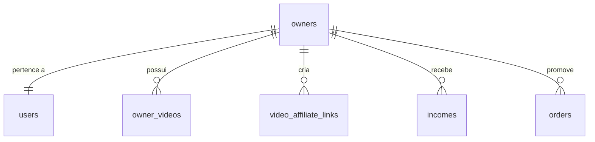
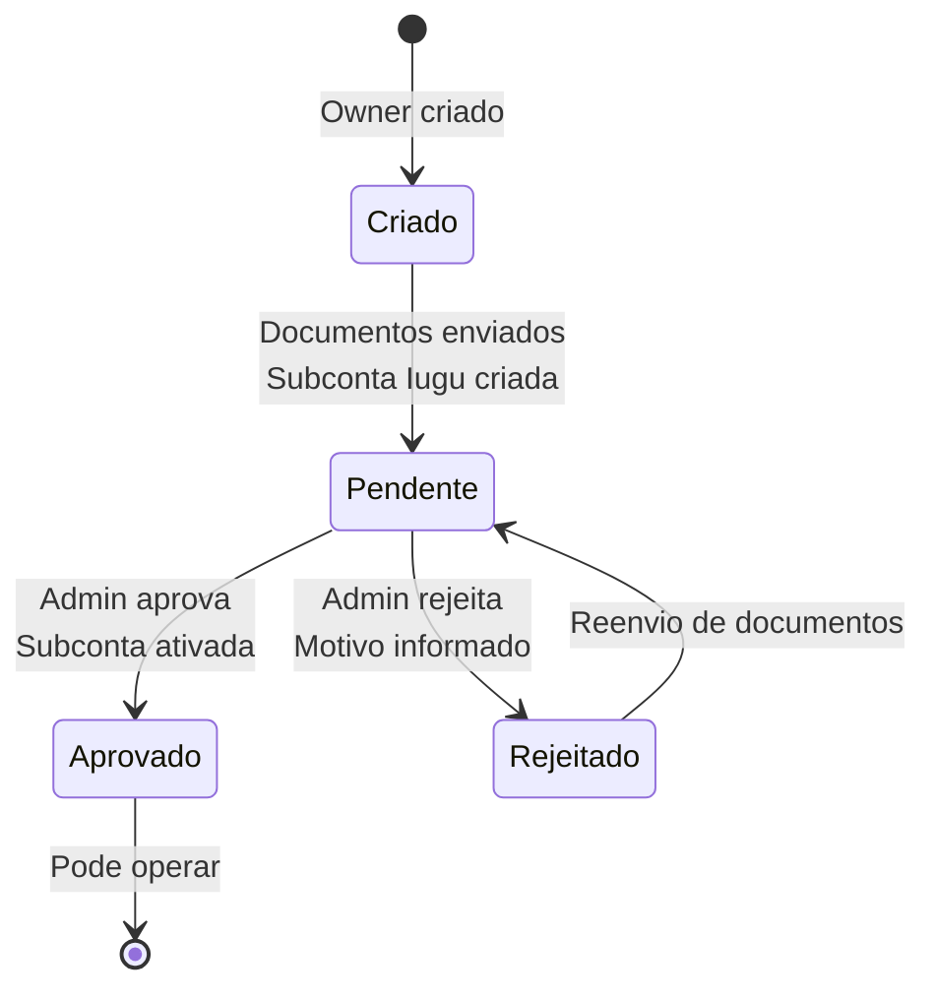

# Tabela: owners

## Descrição

A tabela `owners` armazena dados adicionais de usuários Promoters e Influencers, incluindo informações de KYC (Know Your Customer) e subcontas Iugu para recebimento de comissões.

## Estrutura

```sql
CREATE TABLE owners (
    id BIGSERIAL PRIMARY KEY,
    user_id BIGINT NOT NULL UNIQUE REFERENCES users(id),
    type VARCHAR(50) NOT NULL, -- Influencer, Promoter, Partner, Agent, Other
    
    -- Subconta Iugu
    iugu_account_id VARCHAR(100),
    sub_account_status VARCHAR(20), -- Pending, Approved, Rejected
    
    -- Dados KYC
    cpf_cnpj VARCHAR(20),
    rg VARCHAR(20),
    birth_date DATE,
    
    -- Endereço
    address_street VARCHAR(200),
    address_number VARCHAR(20),
    address_complement VARCHAR(100),
    address_neighborhood VARCHAR(100),
    address_city VARCHAR(100),
    address_state VARCHAR(2),
    address_zipcode VARCHAR(10),
    
    -- Dados bancários
    bank_code VARCHAR(10),
    bank_agency VARCHAR(10),
    bank_account VARCHAR(20),
    bank_account_type VARCHAR(20), -- corrente, poupanca
    
    -- Documentos (URLs Cloudinary)
    document_cpf_url TEXT,
    document_rg_url TEXT,
    document_address_proof_url TEXT,
    document_selfie_url TEXT,
    
    -- Controle
    is_active BOOLEAN DEFAULT TRUE,
    created_at TIMESTAMP DEFAULT CURRENT_TIMESTAMP,
    updated_at TIMESTAMP
);

-- Índices
CREATE UNIQUE INDEX idx_owners_user_id ON owners(user_id);
CREATE INDEX idx_owners_type ON owners(type);
CREATE INDEX idx_owners_sub_account_status ON owners(sub_account_status);
CREATE INDEX idx_owners_iugu_account_id ON owners(iugu_account_id);
```

## Campos

| Campo | Tipo | Descrição | Obrigatório |
|-------|------|-----------|-------------|
| `id` | `bigserial` | Chave primária | ✓ |
| `user_id` | `bigint` | FK para users (unique) | ✓ |
| `type` | `varchar(50)` | Tipo de owner (enum) | ✓ |
| `iugu_account_id` | `varchar(100)` | ID da subconta no Iugu | ✗ |
| `sub_account_status` | `varchar(20)` | Status do KYC (enum) | ✗ |
| `cpf_cnpj` | `varchar(20)` | CPF ou CNPJ | ✗ |
| `rg` | `varchar(20)` | RG | ✗ |
| `birth_date` | `date` | Data de nascimento | ✗ |
| `address_*` | `varchar` | Endereço completo | ✗ |
| `bank_*` | `varchar` | Dados bancários | ✗ |
| `document_*_url` | `text` | URLs dos documentos no Cloudinary | ✗ |
| `is_active` | `boolean` | Registro ativo? | ✓ |
| `created_at` | `timestamp` | Data de criação | ✓ |
| `updated_at` | `timestamp` | Data de atualização | ✗ |

## Enums

### OwnerTypeEnum

```csharp
public enum OwnerTypeEnum
{
    Influencer, // Criador de conteúdo
    Promoter,   // Afiliado (gera links)
    Partner,    // Parceiro de negócio
    Agent,      // Agente/representante
    Other       // Outros tipos
}
```

### OwnerSubAccountStatusEnum

```csharp
public enum OwnerSubAccountStatusEnum
{
    Pending,   // Aguardando aprovação de KYC
    Approved,  // KYC aprovado, pode operar
    Rejected   // KYC rejeitado, precisa reenviar
}
```

## Relacionamentos



- **1:1** com `users` - Todo owner é um user
- **1:N** com `owner_videos` - Influencer pode estar em vários vídeos
- **1:N** com `video_affiliate_links` - Promoter pode ter múltiplos links
- **1:N** com `incomes` - Recebe múltiplas comissões
- **1:N** com `orders` - Promoter vinculado a pedidos (como afiliado)

## Entidade C#

```csharp
public class Owner : Base
{
    public long UserId { get; set; }
    public OwnerTypeEnum Type { get; set; }
    
    // Iugu
    public string? IuguAccountId { get; set; }
    public OwnerSubAccountStatusEnum? SubAccountStatus { get; set; }
    
    // KYC
    public string? CpfCnpj { get; set; }
    public string? Rg { get; set; }
    public DateTime? BirthDate { get; set; }
    
    // Endereço
    public string? AddressStreet { get; set; }
    public string? AddressNumber { get; set; }
    public string? AddressComplement { get; set; }
    public string? AddressNeighborhood { get; set; }
    public string? AddressCity { get; set; }
    public string? AddressState { get; set; }
    public string? AddressZipcode { get; set; }
    
    // Dados bancários
    public string? BankCode { get; set; }
    public string? BankAgency { get; set; }
    public string? BankAccount { get; set; }
    public string? BankAccountType { get; set; }
    
    // Documentos
    public string? DocumentCpfUrl { get; set; }
    public string? DocumentRgUrl { get; set; }
    public string? DocumentAddressProofUrl { get; set; }
    public string? DocumentSelfieUrl { get; set; }
    
    // Navigation properties
    public User User { get; set; }
    public ICollection<OwnerVideo> OwnerVideos { get; set; }
    public ICollection<VideoAffiliateLink> VideoAffiliateLinks { get; set; }
    public ICollection<Income> Incomes { get; set; }
}
```

## Fluxo de KYC



## Criação de Owner

```csharp
// Quando usuário se cadastra como Promoter/Influencer
public async Task<Owner> CreateOwnerAsync(long userId, OwnerTypeEnum type)
{
    var owner = new Owner
    {
        UserId = userId,
        Type = type,
        SubAccountStatus = OwnerSubAccountStatusEnum.Pending,
        CreatedAt = DateTime.UtcNow
    };
    
    await _context.Owners.AddAsync(owner);
    await _context.SaveChangesAsync();
    
    return owner;
}
```

## Envio de Documentos KYC

```csharp
public async Task SubmitKycAsync(long ownerId, KycDocumentsDto dto)
{
    var owner = await _context.Owners
        .Include(o => o.User)
        .FirstAsync(o => o.Id == ownerId);
    
    // Upload documentos para Cloudinary
    owner.DocumentCpfUrl = await _cloudinary.UploadAsync(dto.CpfFile);
    owner.DocumentRgUrl = await _cloudinary.UploadAsync(dto.RgFile);
    owner.DocumentAddressProofUrl = await _cloudinary.UploadAsync(dto.AddressProofFile);
    owner.DocumentSelfieUrl = await _cloudinary.UploadAsync(dto.SelfieFile);
    
    // Dados pessoais e bancários
    owner.CpfCnpj = dto.Cpf;
    owner.Rg = dto.Rg;
    owner.BirthDate = dto.BirthDate;
    owner.AddressStreet = dto.AddressStreet;
    // ... outros campos
    
    owner.BankCode = dto.BankCode;
    owner.BankAgency = dto.BankAgency;
    owner.BankAccount = dto.BankAccount;
    owner.BankAccountType = dto.BankAccountType;
    
    // Criar ou atualizar subconta Iugu
    if (string.IsNullOrEmpty(owner.IuguAccountId))
    {
        var subAccount = await _iuguService.CreateSubAccountAsync(owner);
        owner.IuguAccountId = subAccount.AccountId;
    }
    else
    {
        await _iuguService.UpdateSubAccountAsync(owner);
    }
    
    owner.SubAccountStatus = OwnerSubAccountStatusEnum.Pending;
    owner.UpdatedAt = DateTime.UtcNow;
    
    await _context.SaveChangesAsync();
    
    // Notificar admin
    await _notificationService.NotifyAdminKycPendingAsync(ownerId);
}
```

## Aprovação de KYC

```csharp
public async Task ApproveKycAsync(long ownerId, long adminUserId)
{
    var owner = await _context.Owners.FindAsync(ownerId);
    
    if (owner.SubAccountStatus != OwnerSubAccountStatusEnum.Pending)
        throw new InvalidOperationException("KYC não está pendente");
    
    // Ativar subconta no Iugu
    await _iuguService.VerifySubAccountAsync(owner.IuguAccountId);
    
    owner.SubAccountStatus = OwnerSubAccountStatusEnum.Approved;
    owner.UpdatedAt = DateTime.UtcNow;
    
    await _context.SaveChangesAsync();
    
    // Notificar usuário
    await _notificationService.NotifyKycApprovedAsync(ownerId);
}
```

## Queries Comuns

### Owners com KYC pendente

```sql
SELECT o.*, u.email, u.first_name, u.last_name
FROM owners o
INNER JOIN users u ON u.id = o.user_id
WHERE o.sub_account_status = 'Pending'
ORDER BY o.updated_at;
```

```csharp
var pendingKyc = await _context.Owners
    .Include(o => o.User)
    .Where(o => o.SubAccountStatus == OwnerSubAccountStatusEnum.Pending)
    .OrderBy(o => o.UpdatedAt)
    .ToListAsync();
```

### Promoters aprovados

```sql
SELECT o.*, u.email
FROM owners o
INNER JOIN users u ON u.id = o.user_id
WHERE o.type = 'Promoter'
  AND o.sub_account_status = 'Approved'
  AND o.is_active = TRUE;
```

```csharp
var approvedPromoters = await _context.Owners
    .Include(o => o.User)
    .Where(o => o.Type == OwnerTypeEnum.Promoter &&
                o.SubAccountStatus == OwnerSubAccountStatusEnum.Approved)
    .ToListAsync();
```

### Total de comissões recebidas

```sql
SELECT 
    o.id,
    u.first_name || ' ' || u.last_name as name,
    o.type,
    COUNT(i.id) as total_comissoes,
    SUM(i.amount) / 100.0 as total_recebido
FROM owners o
INNER JOIN users u ON u.id = o.user_id
LEFT JOIN incomes i ON i.owner_id = o.id
GROUP BY o.id, u.first_name, u.last_name, o.type
ORDER BY total_recebido DESC;
```

## Regras de Negócio

1. **1:1 com User**: Cada owner pertence a exatamente um user
2. **KYC obrigatório**: Deve ter KYC aprovado para receber comissões
3. **Documentos**: Todos os 4 documentos são obrigatórios para envio de KYC
4. **Subconta Iugu**: Criada ao enviar documentos, ativada após aprovação
5. **Rejeição**: Owner pode reenviar documentos após rejeição
6. **Promoter**: Só pode gerar links se SubAccountStatus = Approved
7. **Influencer**: Pode estar vinculado a vídeos, mas só recebe se Approved

## Validações

```csharp
// Verificar se owner pode operar
public bool CanOperate(Owner owner)
{
    return owner.SubAccountStatus == OwnerSubAccountStatusEnum.Approved &&
           !string.IsNullOrEmpty(owner.IuguAccountId);
}

// Validar dados bancários
public bool HasValidBankData(Owner owner)
{
    return !string.IsNullOrEmpty(owner.BankCode) &&
           !string.IsNullOrEmpty(owner.BankAgency) &&
           !string.IsNullOrEmpty(owner.BankAccount) &&
           !string.IsNullOrEmpty(owner.BankAccountType);
}
```

## Próximos Passos

- Veja [Processo KYC](../../pagamentos/processo-kyc.md) para fluxo completo
- Consulte [Income](income.md) para entender comissões
- Entenda [Conta Master e Subcontas](../../pagamentos/conta-master-subcontas.md)

