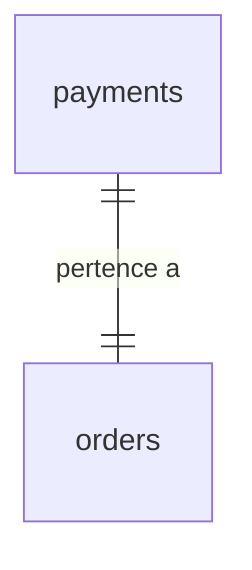
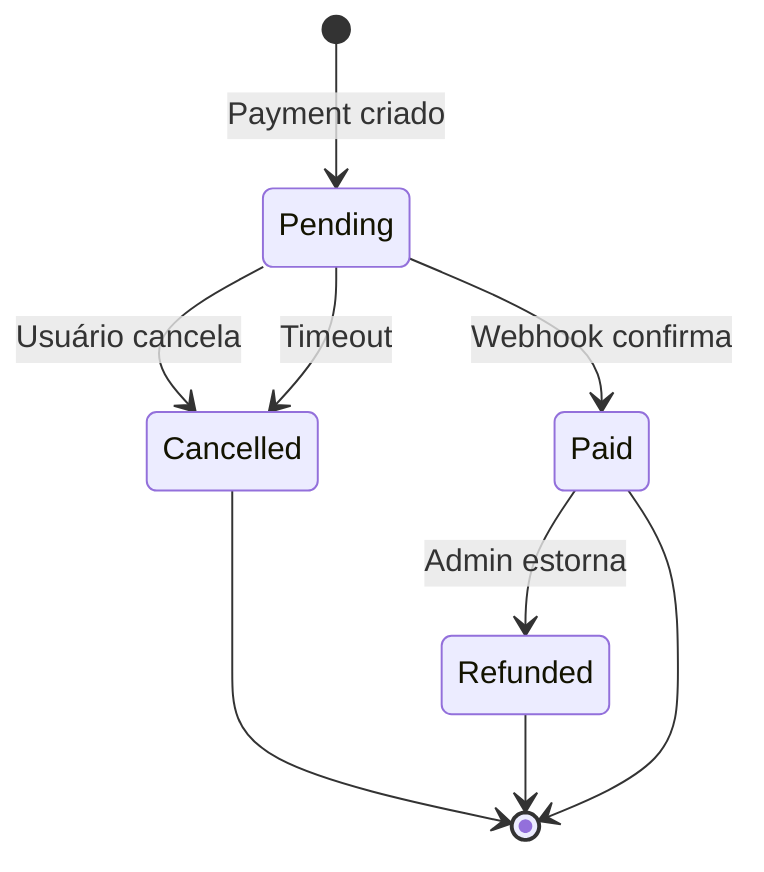

# Tabela: payments

## Descrição

A tabela `payments` registra o status de pagamento de cada order através do gateway Iugu. Cada order tem exatamente um payment associado.

## Estrutura

```sql
CREATE TABLE payments (
    id BIGSERIAL PRIMARY KEY,
    order_id BIGINT NOT NULL UNIQUE REFERENCES orders(id),
    
    -- Iugu
    iugu_invoice_id VARCHAR(100) UNIQUE NOT NULL,
    iugu_secure_url TEXT,
    iugu_paid_at TIMESTAMP,
    
    -- Status
    status VARCHAR(20) NOT NULL, -- Pending, Paid, Cancelled, Refunded
    amount INTEGER NOT NULL,
    
    -- Controle
    is_active BOOLEAN DEFAULT TRUE,
    created_at TIMESTAMP DEFAULT CURRENT_TIMESTAMP,
    updated_at TIMESTAMP
);

-- Índices
CREATE UNIQUE INDEX idx_payments_order_id ON payments(order_id);
CREATE UNIQUE INDEX idx_payments_iugu_invoice_id ON payments(iugu_invoice_id);
CREATE INDEX idx_payments_status ON payments(status);
CREATE INDEX idx_payments_paid_at ON payments(iugu_paid_at);
```

## Campos

| Campo | Tipo | Descrição | Obrigatório |
|-------|------|-----------|-------------|
| `id` | `bigserial` | Chave primária | ✓ |
| `order_id` | `bigint` | FK para orders (unique) | ✓ |
| `iugu_invoice_id` | `varchar(100)` | ID da invoice no Iugu (unique) | ✓ |
| `iugu_secure_url` | `text` | URL de pagamento do Iugu | ✗ |
| `iugu_paid_at` | `timestamp` | Data/hora do pagamento confirmado | ✗ |
| `status` | `varchar(20)` | Status do pagamento (enum) | ✓ |
| `amount` | `integer` | Valor em centavos | ✓ |
| `is_active` | `boolean` | Registro ativo? | ✓ |
| `created_at` | `timestamp` | Data de criação | ✓ |
| `updated_at` | `timestamp` | Data de atualização | ✗ |

## Enum: PaymentStatusEnum

```csharp
public enum PaymentStatusEnum
{
    Pending,    // Aguardando pagamento
    Paid,       // Pago e confirmado
    Cancelled,  // Cancelado
    Refunded    // Estornado
}
```

## Relacionamentos



- **1:1** com `orders` - Cada payment pertence a um order específico

## Entidade C#

```csharp
public class Payment : Base
{
    public long OrderId { get; set; }
    public string IuguInvoiceId { get; set; }
    public string? IuguSecureUrl { get; set; }
    public DateTime? IuguPaidAt { get; set; }
    public PaymentStatusEnum Status { get; set; }
    public int Amount { get; set; }
    
    // Navigation properties
    public Order Order { get; set; }
}
```

## Ciclo de Vida



## Criação de Payment

```csharp
// Após criar order e invoice no Iugu
var payment = new Payment
{
    OrderId = order.Id,
    IuguInvoiceId = invoice.Id,
    IuguSecureUrl = invoice.SecureUrl,
    Status = PaymentStatusEnum.Pending,
    Amount = order.Amount,
    CreatedAt = DateTime.UtcNow
};

await _context.Payments.AddAsync(payment);
await _context.SaveChangesAsync();

// Usuário é redirecionado para iugu_secure_url
return payment.IuguSecureUrl;
```

## Confirmação via Webhook

```csharp
// Webhook do Iugu envia invoice_id quando status muda para "paid"
public async Task ConfirmPaymentAsync(string iuguInvoiceId)
{
    var payment = await _context.Payments
        .Include(p => p.Order)
        .ThenInclude(o => o.Video)
        .FirstAsync(p => p.IuguInvoiceId == iuguInvoiceId);
    
    // Idempotência - não processar se já foi pago
    if (payment.Status == PaymentStatusEnum.Paid)
    {
        _logger.LogInformation("Payment já confirmado: {PaymentId}", payment.Id);
        return;
    }
    
    using var transaction = await _context.Database.BeginTransactionAsync();
    try
    {
        // Atualizar payment
        payment.Status = PaymentStatusEnum.Paid;
        payment.IuguPaidAt = DateTime.UtcNow;
        payment.UpdatedAt = DateTime.UtcNow;
        
        // Criar incomes
        var incomes = CreateIncomesForOrder(payment.Order);
        await _context.Incomes.AddRangeAsync(incomes);
        
        // Criar notificação
        var notification = new Notification
        {
            Type = NotificationTypeEnum.PaymentConfirmed,
            Channel = payment.Order.User.NotificationPreference,
            MetadataJson = JsonSerializer.Serialize(new
            {
                OrderId = payment.Order.Id,
                VideoTitle = payment.Order.Video.Title
            })
        };
        
        await _context.Notifications.AddAsync(notification);
        await _context.SaveChangesAsync();
        await transaction.CommitAsync();
        
        _logger.LogInformation("Payment confirmado: {PaymentId}", payment.Id);
    }
    catch
    {
        await transaction.RollbackAsync();
        throw;
    }
}
```

## Queries Comuns

### Payments pendentes (timeout)

```sql
SELECT * FROM payments 
WHERE status = 'Pending' 
  AND created_at < NOW() - INTERVAL '24 hours';
```

```csharp
var expiredPayments = await _context.Payments
    .Where(p => p.Status == PaymentStatusEnum.Pending &&
                p.CreatedAt < DateTime.UtcNow.AddHours(-24))
    .ToListAsync();
```

### Payments por status

```sql
SELECT status, COUNT(*) as total, SUM(amount) / 100.0 as total_valor
FROM payments
GROUP BY status;
```

```csharp
var stats = await _context.Payments
    .GroupBy(p => p.Status)
    .Select(g => new
    {
        Status = g.Key,
        Total = g.Count(),
        TotalValor = g.Sum(p => p.Amount) / 100m
    })
    .ToListAsync();
```

### Payments pagos de um período

```sql
SELECT p.*, o.user_id, o.video_id
FROM payments p
INNER JOIN orders o ON o.id = p.order_id
WHERE p.status = 'Paid'
  AND p.iugu_paid_at BETWEEN '2025-01-01' AND '2025-01-31';
```

```csharp
var payments = await _context.Payments
    .Include(p => p.Order)
    .Where(p => p.Status == PaymentStatusEnum.Paid &&
                p.IuguPaidAt >= startDate &&
                p.IuguPaidAt <= endDate)
    .ToListAsync();
```

## Regras de Negócio

1. **1:1 com Order**: Cada payment pertence a exatamente um order
2. **IuguInvoiceId único**: Não pode haver dois payments com mesmo invoice
3. **Status imutável para Paid**: Uma vez pago, não pode voltar para pending
4. **IuguPaidAt**: Só preenchido quando status = Paid
5. **Idempotência**: Webhook pode chegar múltiplas vezes, não processar duplicado
6. **Amount deve bater com Order**: `payment.Amount == order.Amount`

## Webhook Iugu

### Eventos Processados

| Evento | Ação |
|--------|------|
| `invoice.status_changed` (paid) | Confirmar payment, criar incomes |
| `invoice.status_changed` (canceled) | Cancelar payment |
| `invoice.refunded` | Estornar payment |
| `invoice.payment_failed` | Logar falha (opcional: notificar usuário) |

### Validação de Assinatura

```csharp
private bool ValidateIuguSignature(string body, string signature, string secret)
{
    var expectedHash = signature.Replace("sha256=", "");
    
    using var hmac = new HMACSHA256(Encoding.UTF8.GetBytes(secret));
    var hash = hmac.ComputeHash(Encoding.UTF8.GetBytes(body));
    var computedHash = BitConverter.ToString(hash).Replace("-", "").ToLower();
    
    return computedHash.Equals(expectedHash, StringComparison.OrdinalIgnoreCase);
}
```

## Monitoramento

### Payments pendentes há muito tempo

```sql
SELECT 
    p.id,
    p.created_at,
    EXTRACT(EPOCH FROM (NOW() - p.created_at))/3600 as hours_pending,
    o.user_id,
    o.video_id
FROM payments p
INNER JOIN orders o ON o.id = p.order_id
WHERE p.status = 'Pending'
  AND p.created_at < NOW() - INTERVAL '6 hours'
ORDER BY p.created_at;
```

## Próximos Passos

- Veja [Orders](orders.md) para entender o pedido
- Consulte [Webhooks](../../pagamentos/webhooks.md) para integração Iugu
- Entenda [Income](income.md) para distribuição de comissões

