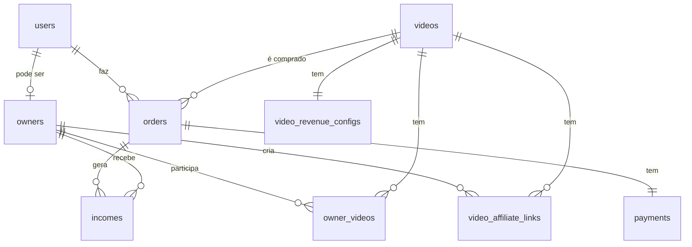

# Relacionamentos entre Tabelas

## Descrição

Este documento mostra exemplos práticos de queries com JOINs entre as principais tabelas do banco de dados, demonstrando os relacionamentos na prática.

## Diagrama Simplificado



## 1. User → Order → Payment → Income

### Buscar todo histórico de compras de um usuário

```sql
SELECT 
    u.first_name || ' ' || u.last_name as usuario,
    o.id as order_id,
    v.title as video_titulo,
    o.amount / 100.0 as valor_pago,
    p.status as status_pagamento,
    p.iugu_paid_at as data_pagamento,
    COUNT(i.id) as qtd_comissoes
FROM users u
INNER JOIN orders o ON o.user_id = u.id
INNER JOIN videos v ON v.id = o.video_id
INNER JOIN payments p ON p.order_id = o.id
LEFT JOIN incomes i ON i.order_id = o.id
WHERE u.id = 123
GROUP BY u.first_name, u.last_name, o.id, v.title, o.amount, p.status, p.iugu_paid_at
ORDER BY p.iugu_paid_at DESC;
```

```csharp
var userPurchases = await _context.Orders
    .Include(o => o.Video)
    .Include(o => o.Payment)
    .Include(o => o.Incomes)
    .Where(o => o.UserId == userId)
    .OrderByDescending(o => o.Payment.IuguPaidAt)
    .Select(o => new
    {
        OrderId = o.Id,
        VideoTitle = o.Video.Title,
        Amount = o.Amount / 100m,
        PaymentStatus = o.Payment.Status,
        PaidAt = o.Payment.IuguPaidAt,
        CommissionsCount = o.Incomes.Count
    })
    .ToListAsync();
```

## 2. Video → Order → Income

### Buscar performance de um vídeo (vendas e comissões)

```sql
SELECT 
    v.id as video_id,
    v.title,
    COUNT(DISTINCT o.id) as total_vendas,
    SUM(o.amount) / 100.0 as receita_total,
    SUM(CASE WHEN i.owner_id IS NULL THEN i.amount ELSE 0 END) / 100.0 as receita_plataforma,
    SUM(CASE WHEN i.type = 'Owner' THEN i.amount ELSE 0 END) / 100.0 as comissao_influencer,
    SUM(CASE WHEN i.type = 'Promoter' THEN i.amount ELSE 0 END) / 100.0 as comissao_promoters
FROM videos v
INNER JOIN orders o ON o.video_id = v.id
INNER JOIN payments p ON p.order_id = o.id AND p.status = 'Paid'
INNER JOIN incomes i ON i.order_id = o.id
WHERE v.id = 456
GROUP BY v.id, v.title;
```

```csharp
var videoPerformance = await _context.Videos
    .Where(v => v.Id == videoId)
    .Select(v => new
    {
        VideoId = v.Id,
        Title = v.Title,
        TotalSales = v.Orders.Count(o => o.Payment.Status == PaymentStatusEnum.Paid),
        TotalRevenue = v.Orders
            .Where(o => o.Payment.Status == PaymentStatusEnum.Paid)
            .Sum(o => o.Amount) / 100m,
        PlatformRevenue = v.Orders
            .SelectMany(o => o.Incomes)
            .Where(i => i.OwnerId == null)
            .Sum(i => i.Amount) / 100m,
        InfluencerCommission = v.Orders
            .SelectMany(o => o.Incomes)
            .Where(i => i.Type == IncomeTypeEnum.Owner)
            .Sum(i => i.Amount) / 100m,
        PromoterCommission = v.Orders
            .SelectMany(o => o.Incomes)
            .Where(i => i.Type == IncomeTypeEnum.Promoter)
            .Sum(i => i.Amount) / 100m
    })
    .FirstAsync();
```

## 3. Owner → Income (Promoter e Influencer)

### Dashboard de comissões de um Promoter

```sql
SELECT 
    own.id as promoter_id,
    u.first_name || ' ' || u.last_name as nome,
    COUNT(DISTINCT o.id) as total_vendas,
    COUNT(DISTINCT val.id) as total_links,
    SUM(val.clicks) as total_clicks,
    SUM(i.amount) / 100.0 as total_comissoes,
    AVG(i.amount) / 100.0 as comissao_media
FROM owners own
INNER JOIN users u ON u.id = own.user_id
LEFT JOIN video_affiliate_links val ON val.owner_id = own.id
LEFT JOIN orders o ON o.promoter_id = own.id
LEFT JOIN incomes i ON i.order_id = o.id AND i.type = 'Promoter'
WHERE own.id = 789
  AND own.type = 'Promoter'
GROUP BY own.id, u.first_name, u.last_name;
```

```csharp
var promoterDashboard = await _context.Owners
    .Where(o => o.Id == promoterId && o.Type == OwnerTypeEnum.Promoter)
    .Select(o => new
    {
        PromoterId = o.Id,
        Name = o.User.FirstName + " " + o.User.LastName,
        TotalSales = o.Incomes.Count(i => i.Type == IncomeTypeEnum.Promoter),
        TotalLinks = o.VideoAffiliateLinks.Count,
        TotalClicks = o.VideoAffiliateLinks.Sum(l => l.Clicks),
        TotalCommissions = o.Incomes
            .Where(i => i.Type == IncomeTypeEnum.Promoter)
            .Sum(i => i.Amount) / 100m,
        AverageCommission = o.Incomes
            .Where(i => i.Type == IncomeTypeEnum.Promoter)
            .Average(i => (decimal?)i.Amount) / 100m ?? 0
    })
    .FirstAsync();
```

### Dashboard de comissões de um Influencer

```sql
SELECT 
    own.id as influencer_id,
    u.first_name || ' ' || u.last_name as nome,
    COUNT(DISTINCT ov.video_id) as total_videos,
    COUNT(DISTINCT o.id) as total_vendas,
    SUM(i.amount) / 100.0 as total_comissoes
FROM owners own
INNER JOIN users u ON u.id = own.user_id
LEFT JOIN owner_videos ov ON ov.owner_id = own.id
LEFT JOIN orders o ON o.video_id = ov.video_id
LEFT JOIN incomes i ON i.order_id = o.id AND i.type = 'Owner'
WHERE own.id = 321
  AND own.type = 'Influencer'
GROUP BY own.id, u.first_name, u.last_name;
```

```csharp
var influencerDashboard = await _context.Owners
    .Where(o => o.Id == influencerId && o.Type == OwnerTypeEnum.Influencer)
    .Select(o => new
    {
        InfluencerId = o.Id,
        Name = o.User.FirstName + " " + o.User.LastName,
        TotalVideos = o.OwnerVideos.Select(ov => ov.VideoId).Distinct().Count(),
        TotalSales = o.Incomes.Count(i => i.Type == IncomeTypeEnum.Owner),
        TotalCommissions = o.Incomes
            .Where(i => i.Type == IncomeTypeEnum.Owner)
            .Sum(i => i.Amount) / 100m
    })
    .FirstAsync();
```

## 4. Video → VideoRevenueConfig

### Vídeos com suas configurações de comissão

```sql
SELECT 
    v.id,
    v.title,
    v.price,
    vrc.platform_percentage,
    vrc.owner_percentage,
    vrc.promoter_percentage,
    (v.price * vrc.platform_percentage / 100) as valor_plataforma,
    (v.price * vrc.owner_percentage / 100) as valor_influencer,
    (v.price * vrc.promoter_percentage / 100) as valor_promoter
FROM videos v
INNER JOIN video_revenue_configs vrc ON vrc.video_id = v.id
WHERE v.is_active = TRUE
  AND v.deleted_at IS NULL;
```

```csharp
var videosWithConfig = await _context.Videos
    .Include(v => v.VideoRevenueConfig)
    .Where(v => v.IsActive)
    .Select(v => new
    {
        VideoId = v.Id,
        Title = v.Title,
        Price = v.Price,
        PlatformPercentage = v.VideoRevenueConfig.PlatformPercentage,
        OwnerPercentage = v.VideoRevenueConfig.OwnerPercentage,
        PromoterPercentage = v.VideoRevenueConfig.PromoterPercentage,
        PlatformAmount = v.Price * v.VideoRevenueConfig.PlatformPercentage / 100,
        OwnerAmount = v.Price * v.VideoRevenueConfig.OwnerPercentage / 100,
        PromoterAmount = v.Price * v.VideoRevenueConfig.PromoterPercentage / 100
    })
    .ToListAsync();
```

## 5. Owner → VideoAffiliateLink → Order

### Rastreamento de conversões por link de afiliado

```sql
SELECT 
    val.id as link_id,
    val.unique_code,
    v.title as video_titulo,
    u.first_name || ' ' || u.last_name as promoter_nome,
    val.clicks,
    COUNT(o.id) as conversoes,
    SUM(o.promoter_amount) / 100.0 as comissao_total,
    CASE 
        WHEN val.clicks > 0 
        THEN (COUNT(o.id)::float / val.clicks * 100) 
        ELSE 0 
    END as taxa_conversao
FROM video_affiliate_links val
INNER JOIN videos v ON v.id = val.video_id
INNER JOIN owners own ON own.id = val.owner_id
INNER JOIN users u ON u.id = own.user_id
LEFT JOIN orders o ON o.video_affiliate_link_id = val.id
WHERE val.owner_id = 789
GROUP BY val.id, val.unique_code, v.title, u.first_name, u.last_name, val.clicks
ORDER BY conversoes DESC;
```

```csharp
var linkPerformance = await _context.VideoAffiliateLinks
    .Include(l => l.Video)
    .Include(l => l.Owner)
    .ThenInclude(o => o.User)
    .Where(l => l.OwnerId == promoterId)
    .Select(l => new
    {
        LinkId = l.Id,
        UniqueCode = l.UniqueCode,
        VideoTitle = l.Video.Title,
        PromoterName = l.Owner.User.FirstName + " " + l.Owner.User.LastName,
        Clicks = l.Clicks,
        Conversions = l.Orders.Count,
        TotalCommission = l.Orders.Sum(o => o.PromoterAmount) / 100m,
        ConversionRate = l.Clicks > 0 
            ? (decimal)l.Orders.Count / l.Clicks * 100 
            : 0
    })
    .OrderByDescending(x => x.Conversions)
    .ToListAsync();
```

## 6. Video → OwnerVideo → Owner

### Influencers participantes de um vídeo

```sql
SELECT 
    v.id as video_id,
    v.title,
    u.id as influencer_user_id,
    u.first_name || ' ' || u.last_name as influencer_nome,
    own.sub_account_status,
    ov.created_at as vinculado_em
FROM videos v
INNER JOIN owner_videos ov ON ov.video_id = v.id
INNER JOIN owners own ON own.id = ov.owner_id
INNER JOIN users u ON u.id = own.user_id
WHERE v.id = 456
  AND own.type = 'Influencer';
```

```csharp
var videoInfluencers = await _context.Videos
    .Where(v => v.Id == videoId)
    .SelectMany(v => v.OwnerVideos)
    .Where(ov => ov.Owner.Type == OwnerTypeEnum.Influencer)
    .Select(ov => new
    {
        VideoId = ov.VideoId,
        VideoTitle = ov.Video.Title,
        InfluencerUserId = ov.Owner.UserId,
        InfluencerName = ov.Owner.User.FirstName + " " + ov.Owner.User.LastName,
        SubAccountStatus = ov.Owner.SubAccountStatus,
        LinkedAt = ov.CreatedAt
    })
    .ToListAsync();
```

## 7. User → Payment → Order → Video (Vídeos comprados)

### Vídeos que um usuário já possui

```sql
SELECT DISTINCT
    v.id as video_id,
    v.title,
    v.cloudinary_public_id,
    o.amount / 100.0 as valor_pago,
    p.iugu_paid_at as comprado_em,
    v.expiration_view_date,
    CASE 
        WHEN v.expiration_view_date IS NULL OR v.expiration_view_date >= CURRENT_DATE 
        THEN TRUE 
        ELSE FALSE 
    END as pode_assistir
FROM users u
INNER JOIN orders o ON o.user_id = u.id
INNER JOIN payments p ON p.order_id = o.id AND p.status = 'Paid'
INNER JOIN videos v ON v.id = o.video_id
WHERE u.id = 123
ORDER BY p.iugu_paid_at DESC;
```

```csharp
var userVideos = await _context.Orders
    .Include(o => o.Payment)
    .Include(o => o.Video)
    .Where(o => o.UserId == userId &&
                o.Payment.Status == PaymentStatusEnum.Paid)
    .Select(o => new
    {
        VideoId = o.Video.Id,
        Title = o.Video.Title,
        CloudinaryPublicId = o.Video.CloudinaryPublicId,
        AmountPaid = o.Amount / 100m,
        PurchasedAt = o.Payment.IuguPaidAt,
        ExpirationViewDate = o.Video.ExpirationViewDate,
        CanWatch = o.Video.ExpirationViewDate == null ||
                   o.Video.ExpirationViewDate >= DateTime.Today
    })
    .OrderByDescending(x => x.PurchasedAt)
    .ToListAsync();
```

## 8. Relatórios Gerais

### Resumo financeiro da plataforma

```sql
SELECT 
    COUNT(DISTINCT o.id) as total_vendas,
    COUNT(DISTINCT u.id) as total_compradores,
    COUNT(DISTINCT v.id) as videos_vendidos,
    SUM(o.amount) / 100.0 as receita_bruta,
    SUM(i_platform.amount) / 100.0 as receita_plataforma,
    SUM(i_owner.amount) / 100.0 as comissoes_influencers,
    SUM(i_promoter.amount) / 100.0 as comissoes_promoters
FROM orders o
INNER JOIN payments p ON p.order_id = o.id AND p.status = 'Paid'
INNER JOIN users u ON u.id = o.user_id
INNER JOIN videos v ON v.id = o.video_id
LEFT JOIN incomes i_platform ON i_platform.order_id = o.id 
    AND i_platform.owner_id IS NULL
LEFT JOIN incomes i_owner ON i_owner.order_id = o.id 
    AND i_owner.type = 'Owner'
LEFT JOIN incomes i_promoter ON i_promoter.order_id = o.id 
    AND i_promoter.type = 'Promoter';
```

### Top 10 vídeos mais vendidos

```sql
SELECT 
    v.id,
    v.title,
    COUNT(o.id) as total_vendas,
    SUM(o.amount) / 100.0 as receita_total,
    AVG(o.amount) / 100.0 as ticket_medio
FROM videos v
INNER JOIN orders o ON o.video_id = v.id
INNER JOIN payments p ON p.order_id = o.id AND p.status = 'Paid'
GROUP BY v.id, v.title
ORDER BY total_vendas DESC
LIMIT 10;
```

### Top 10 promoters (por comissão)

```sql
SELECT 
    own.id,
    u.first_name || ' ' || u.last_name as nome,
    COUNT(DISTINCT o.id) as total_vendas,
    SUM(i.amount) / 100.0 as total_comissoes,
    AVG(i.amount) / 100.0 as comissao_media
FROM owners own
INNER JOIN users u ON u.id = own.user_id
INNER JOIN incomes i ON i.owner_id = own.id AND i.type = 'Promoter'
INNER JOIN orders o ON o.id = i.order_id
WHERE own.type = 'Promoter'
GROUP BY own.id, u.first_name, u.last_name
ORDER BY total_comissoes DESC
LIMIT 10;
```

## Próximos Passos

- Veja [Tabelas](users.md) individuais para detalhes de cada uma
- Consulte [Modelo ER](../modelo-entidade-relacionamento.md) para diagrama completo
- Entenda [Casos de Uso](../../casos-de-uso/usuario-compra-video.md) para queries em contexto

