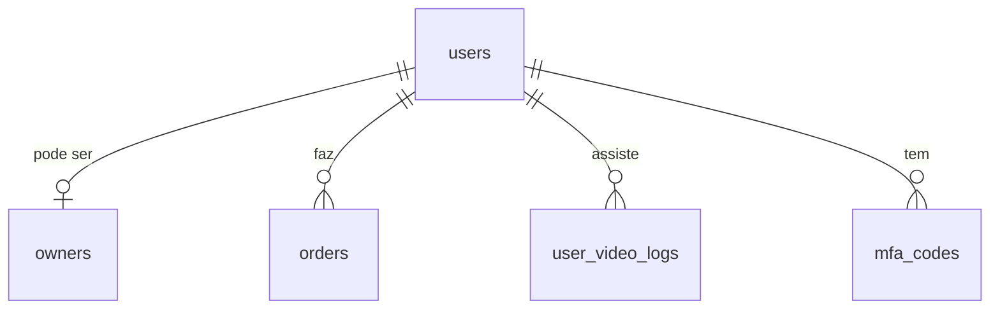

# Tabela: users

## Descrição

A tabela `users` armazena todos os usuários da plataforma Amasso, incluindo os 4 tipos de perfil: Admin, Default, Promoter e Influencer.

## Estrutura

```sql
CREATE TABLE users (
    id BIGSERIAL PRIMARY KEY,
    email VARCHAR(255) UNIQUE NOT NULL,
    password_hash VARCHAR(255) NOT NULL,
    type VARCHAR(50) NOT NULL, -- Admin, Default, Promoter, Influencer
    
    -- Dados pessoais
    first_name VARCHAR(100) NOT NULL,
    last_name VARCHAR(100) NOT NULL,
    cpf VARCHAR(14),
    birth_date DATE,
    telephone VARCHAR(20),
    
    -- Preferências
    notification_preference VARCHAR(20), -- Email, WhatsApp, All
    
    -- Controle
    is_active BOOLEAN DEFAULT TRUE,
    created_at TIMESTAMP DEFAULT CURRENT_TIMESTAMP,
    updated_at TIMESTAMP,
    deleted_at TIMESTAMP
);

-- Índices
CREATE UNIQUE INDEX idx_users_email ON users(email);
CREATE INDEX idx_users_type ON users(type);
CREATE INDEX idx_users_active ON users(id) WHERE is_active = TRUE AND deleted_at IS NULL;
```

## Campos

| Campo | Tipo | Descrição | Obrigatório |
|-------|------|-----------|-------------|
| `id` | `bigserial` | Chave primária auto-incremento | ✓ |
| `email` | `varchar(255)` | Email único do usuário | ✓ |
| `password_hash` | `varchar(255)` | Hash bcrypt da senha | ✓ |
| `type` | `varchar(50)` | Tipo de usuário (enum) | ✓ |
| `first_name` | `varchar(100)` | Primeiro nome | ✓ |
| `last_name` | `varchar(100)` | Sobrenome | ✓ |
| `cpf` | `varchar(14)` | CPF (opcional) | ✗ |
| `birth_date` | `date` | Data de nascimento | ✗ |
| `telephone` | `varchar(20)` | Telefone com DDD | ✗ |
| `notification_preference` | `varchar(20)` | Canal preferido de notificação | ✗ |
| `is_active` | `boolean` | Usuário ativo? | ✓ |
| `created_at` | `timestamp` | Data de criação | ✓ |
| `updated_at` | `timestamp` | Data de atualização | ✗ |
| `deleted_at` | `timestamp` | Data de exclusão lógica | ✗ |

## Enum: UserTypeEnum

```csharp
public enum UserTypeEnum
{
    Admin,      // Administrador da plataforma
    Default,    // Usuário padrão (comprador)
    Promoter,   // Afiliado (gera links)
    Influencer  // Criador de conteúdo
}
```

## Relacionamentos



- **1:0..1** com `owners` - Promoters e Influencers têm registro em owners
- **1:N** com `orders` - Um usuário pode fazer múltiplas compras
- **1:N** com `user_video_logs` - Logs de visualização
- **1:N** com `mfa_codes` - Códigos de autenticação MFA

## Entidade C#

```csharp
public class User : Base
{
    public string Email { get; set; }
    public string PasswordHash { get; set; }
    public UserTypeEnum Type { get; set; }
    public string FirstName { get; set; }
    public string LastName { get; set; }
    public string? Cpf { get; set; }
    public DateTime? BirthDate { get; set; }
    public string? Telephone { get; set; }
    public NotificationChannelEnum? NotificationPreference { get; set; }
    
    // Navigation properties
    public Owner? Owner { get; set; }
    public ICollection<Order> Orders { get; set; }
    public ICollection<UserVideoLog> UserVideoLogs { get; set; }
    public ICollection<MfaCode> MfaCodes { get; set; }
}
```

## Queries Comuns

### Buscar usuário por email

```sql
SELECT * FROM users 
WHERE email = 'user@example.com' 
  AND is_active = TRUE 
  AND deleted_at IS NULL;
```

```csharp
var user = await _context.Users
    .FirstOrDefaultAsync(u => u.Email == email);
```

### Listar todos os promoters

```sql
SELECT * FROM users 
WHERE type = 'Promoter' 
  AND is_active = TRUE 
  AND deleted_at IS NULL;
```

```csharp
var promoters = await _context.Users
    .Where(u => u.Type == UserTypeEnum.Promoter)
    .ToListAsync();
```

### Contar usuários por tipo

```sql
SELECT type, COUNT(*) as total 
FROM users 
WHERE is_active = TRUE 
  AND deleted_at IS NULL 
GROUP BY type;
```

## Regras de Negócio

1. **Email único**: Não pode haver dois usuários com o mesmo email
2. **Senha**: Deve ser armazenada como hash bcrypt
3. **Type**: Define as permissões e funcionalidades disponíveis
4. **Soft delete**: Usuários são desativados, não deletados fisicamente
5. **CPF**: Obrigatório apenas para Promoters e Influencers (validado no KYC)

## Segurança

- Senha nunca é armazenada em texto plano
- Hash bcrypt com salt aleatório
- Email é case-insensitive na busca
- JWT gerado baseado no user.Id e user.Type

## Próximos Passos

- Veja [Owners](owners.md) para dados adicionais de Promoters/Influencers
- Consulte [Orders](orders.md) para entender compras
- Entenda [Perfis de Usuário](../../perfis-de-usuario/admin.md) para cada tipo

