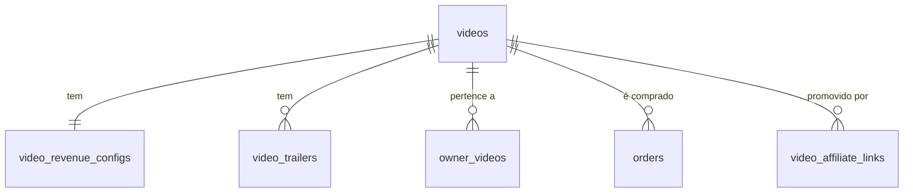

# Tabela: videos

## Descrição

A tabela `videos` armazena o catálogo de vídeos disponíveis para venda na plataforma. Os vídeos são hospedados no Cloudinary CDN.

## Estrutura

```sql
CREATE TABLE videos (
    id BIGSERIAL PRIMARY KEY,
    title VARCHAR(200) NOT NULL,
    description TEXT,
    
    -- Cloudinary
    cloudinary_public_id VARCHAR(255) NOT NULL,
    duration_seconds INTEGER,
    thumb_img_url TEXT,
    
    -- Preço e disponibilidade
    price DECIMAL(10,2) NOT NULL,
    release_date DATE,
    expiration_sale_date DATE,
    expiration_view_date DATE,
    
    -- Controle
    is_active BOOLEAN DEFAULT TRUE,
    created_at TIMESTAMP DEFAULT CURRENT_TIMESTAMP,
    updated_at TIMESTAMP,
    deleted_at TIMESTAMP
);

-- Índices
CREATE INDEX idx_videos_active ON videos(id) 
    WHERE is_active = TRUE AND deleted_at IS NULL;
CREATE INDEX idx_videos_release_date ON videos(release_date);
CREATE INDEX idx_videos_price ON videos(price);
```

## Campos

| Campo | Tipo | Descrição | Obrigatório |
|-------|------|-----------|-------------|
| `id` | `bigserial` | Chave primária | ✓ |
| `title` | `varchar(200)` | Título do vídeo | ✓ |
| `description` | `text` | Descrição completa | ✗ |
| `cloudinary_public_id` | `varchar(255)` | ID do vídeo no Cloudinary | ✓ |
| `duration_seconds` | `integer` | Duração em segundos | ✗ |
| `thumb_img_url` | `text` | URL da thumbnail | ✗ |
| `price` | `decimal(10,2)` | Preço em reais | ✓ |
| `release_date` | `date` | Data de lançamento | ✗ |
| `expiration_sale_date` | `date` | Data limite para venda | ✗ |
| `expiration_view_date` | `date` | Data limite para visualização | ✗ |
| `is_active` | `boolean` | Vídeo ativo? | ✓ |
| `created_at` | `timestamp` | Data de criação | ✓ |
| `updated_at` | `timestamp` | Data de atualização | ✗ |
| `deleted_at` | `timestamp` | Data de exclusão lógica | ✗ |

## Relacionamentos



- **1:1** com `video_revenue_configs` - Configuração de comissões
- **1:N** com `video_trailers` - Trailers/teasers
- **1:N** com `owner_videos` - Influencers participantes
- **1:N** com `orders` - Compras realizadas
- **1:N** com `video_affiliate_links` - Links de afiliado

## Entidade C#

```csharp
public class Video : Base
{
    public string Title { get; set; }
    public string? Description { get; set; }
    public string CloudinaryPublicId { get; set; }
    public int? DurationSeconds { get; set; }
    public string? ThumbImgUrl { get; set; }
    public decimal Price { get; set; }
    public DateTime? ReleaseDate { get; set; }
    public DateTime? ExpirationSaleDate { get; set; }
    public DateTime? ExpirationViewDate { get; set; }
    
    // Navigation properties
    public VideoRevenueConfig VideoRevenueConfig { get; set; }
    public ICollection<VideoTrailer> VideoTrailers { get; set; }
    public ICollection<OwnerVideo> OwnerVideos { get; set; }
    public ICollection<Order> Orders { get; set; }
    public ICollection<VideoAffiliateLink> VideoAffiliateLinks { get; set; }
}
```

## Integração Cloudinary

### Upload de Vídeo

```csharp
public async Task<string> UploadVideoAsync(IFormFile file)
{
    var uploadParams = new VideoUploadParams
    {
        File = new FileDescription(file.FileName, file.OpenReadStream()),
        PublicId = $"videos/{Guid.NewGuid()}",
        ResourceType = ResourceType.Video,
        Folder = "amasso-videos"
    };
    
    var result = await _cloudinary.UploadAsync(uploadParams);
    return result.PublicId; // Salvar no banco
}
```

### Streaming URL

```csharp
public string GetVideoUrl(string publicId)
{
    return _cloudinary.Api.UrlVideoUp
        .Transform(new Transformation().Quality("auto"))
        .BuildUrl(publicId);
}
```

## Queries Comuns

### Vídeos disponíveis para venda

```sql
SELECT * FROM videos 
WHERE is_active = TRUE 
  AND deleted_at IS NULL
  AND (release_date IS NULL OR release_date <= CURRENT_DATE)
  AND (expiration_sale_date IS NULL OR expiration_sale_date >= CURRENT_DATE);
```

```csharp
var videos = await _context.Videos
    .Include(v => v.VideoRevenueConfig)
    .Where(v => v.IsActive &&
                (v.ReleaseDate == null || v.ReleaseDate <= DateTime.Today) &&
                (v.ExpirationSaleDate == null || v.ExpirationSaleDate >= DateTime.Today))
    .ToListAsync();
```

### Vídeos com influencer específico

```sql
SELECT v.* 
FROM videos v
INNER JOIN owner_videos ov ON ov.video_id = v.id
WHERE ov.owner_id = 123
  AND v.is_active = TRUE;
```

```csharp
var videos = await _context.Videos
    .Where(v => v.OwnerVideos.Any(ov => ov.OwnerId == influencerId))
    .ToListAsync();
```

### Vídeos disponíveis para promoters (com comissão > 0%)

```sql
SELECT v.* 
FROM videos v
INNER JOIN video_revenue_configs vrc ON vrc.video_id = v.id
WHERE v.is_active = TRUE 
  AND v.deleted_at IS NULL
  AND vrc.promoter_percentage > 0;
```

```csharp
var videos = await _context.Videos
    .Include(v => v.VideoRevenueConfig)
    .Where(v => v.VideoRevenueConfig.PromoterPercentage > 0)
    .ToListAsync();
```

## Regras de Negócio

1. **CloudinaryPublicId**: Obrigatório para streaming
2. **Price**: Sempre positivo, não pode ser zero
3. **ReleaseDate**: Vídeo só aparece após esta data
4. **ExpirationSaleDate**: Após esta data, não pode mais ser comprado
5. **ExpirationViewDate**: Após esta data, usuários que compraram não podem mais assistir
6. **VideoRevenueConfig**: Todo vídeo deve ter uma configuração de comissões
7. **Soft delete**: Vídeos são desativados, não deletados

## Validações

```csharp
public class VideoValidator : AbstractValidator<Video>
{
    public VideoValidator()
    {
        RuleFor(v => v.Title).NotEmpty().MaximumLength(200);
        RuleFor(v => v.CloudinaryPublicId).NotEmpty();
        RuleFor(v => v.Price).GreaterThan(0);
        RuleFor(v => v.ExpirationSaleDate)
            .GreaterThan(v => v.ReleaseDate)
            .When(v => v.ReleaseDate.HasValue && v.ExpirationSaleDate.HasValue);
    }
}
```

## Próximos Passos

- Veja [Video Revenue Configs](../modelo-entidade-relacionamento.md#video_revenue_configs) para comissões
- Consulte [Orders](orders.md) para entender compras
- Entenda [Owner Videos](../modelo-entidade-relacionamento.md#owner_videos) para influencers

