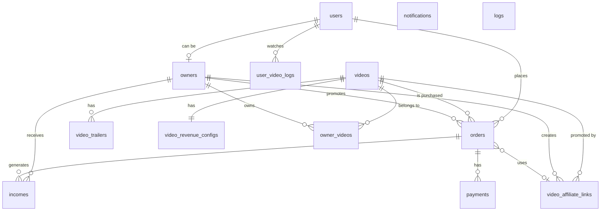

# Banco de Dados - Visão Geral

## Tecnologia

**PostgreSQL 16** - Sistema de gerenciamento de banco de dados relacional open-source.

### Por que PostgreSQL?

- ✅ **Confiável**: ACID compliant, transações robustas
- ✅ **Performático**: Índices avançados, queries otimizadas
- ✅ **Tipos de dados ricos**: JSON, Arrays, Timestamps com timezone
- ✅ **Extensível**: Suporte a extensões
- ✅ **Open Source**: Sem custos de licença
- ✅ **Compatível com .NET**: Npgsql driver maduro

## Estrutura Geral

A plataforma Amasso possui **17 tabelas principais** organizadas em grupos lógicos:



## Tabelas por Categoria

### 👤 Usuários e Autenticação (4 tabelas)
- **users** - Todos os usuários (Admin, Default, Promoter, Influencer)
- **owners** - Dados adicionais de Promoters/Influencers (KYC, subconta Iugu)
- **mfa_codes** - Códigos de autenticação em duas etapas
- **refresh_tokens** - Tokens para renovação de sessão

### 🎬 Vídeos (5 tabelas)
- **videos** - Catálogo de vídeos
- **video_trailers** - Trailers/prévias dos vídeos
- **video_revenue_configs** - Configuração de comissões por vídeo
- **owner_videos** - Relacionamento Influencer ↔ Vídeo
- **user_video_logs** - Log de visualização (acesso ao conteúdo)

### 💰 Transações (3 tabelas)
- **orders** - Pedidos de compra
- **payments** - Pagamentos via Iugu
- **incomes** - Distribuição de comissões

### 🔗 Afiliados (1 tabela)
- **video_affiliate_links** - Links de afiliado dos promoters

### 📧 Notificações (1 tabela)
- **notifications** - Fila de notificações (email/WhatsApp)

### 📊 Sistema (2 tabelas)
- **logs** - Logs de aplicação
- **params** - Parâmetros de configuração

### 📜 Auditoria
- **user_logs** - Logs de ações de usuários (futuro)

## Convenções de Nomenclatura

### Tabelas
- **Snake case**: `video_affiliate_links`
- **Plural**: `users`, `videos`, `orders`
- **Descritivo**: Nome claro do que armazena

### Colunas
- **Snake case**: `created_at`, `first_name`, `iugu_account_id`
- **Sufixos comuns**:
  - `_id` para chaves primárias e estrangeiras
  - `_at` para timestamps
  - `_url` para URLs
  - `_cents` ou `_amount` para valores monetários

### Tipos de Dados Comuns

| Coluna | Tipo PostgreSQL | Tipo .NET | Descrição |
|--------|-----------------|-----------|-----------|
| `id` | `bigserial` | `long` | Chave primária auto-incremento |
| `created_at` | `timestamp` | `DateTime` | Data de criação |
| `updated_at` | `timestamp` | `DateTime?` | Data de atualização |
| `deleted_at` | `timestamp` | `DateTime?` | Data de exclusão (soft delete) |
| `is_active` | `boolean` | `bool` | Status ativo/inativo |
| `email` | `varchar(255)` | `string` | Email |
| `price` | `decimal(10,2)` | `decimal` | Preço em reais |
| `amount` | `integer` | `int` | Valor em centavos |
| `metadata_json` | `text` | `string` | JSON serializado |

## Padrões Utilizados

### Soft Delete

Registros não são excluídos fisicamente, apenas marcados:

```sql
-- Estrutura padrão
CREATE TABLE example (
    id BIGSERIAL PRIMARY KEY,
    is_active BOOLEAN DEFAULT TRUE,
    deleted_at TIMESTAMP NULL,
    -- ... outros campos
);

-- Query ignora deletados
SELECT * FROM example 
WHERE is_active = TRUE 
  AND deleted_at IS NULL;
```

```csharp
// No EF Core
modelBuilder.Entity<Example>()
    .HasQueryFilter(e => e.IsActive && e.DeletedAt == null);
```

### Timestamps Automáticos

```sql
CREATE TABLE example (
    id BIGSERIAL PRIMARY KEY,
    created_at TIMESTAMP DEFAULT CURRENT_TIMESTAMP,
    updated_at TIMESTAMP,
    -- ... outros campos
);

-- Trigger para updated_at (opcional)
CREATE TRIGGER set_updated_at
BEFORE UPDATE ON example
FOR EACH ROW
EXECUTE FUNCTION update_updated_at_column();
```

```csharp
// No EF Core - SaveChanges
public override Task<int> SaveChangesAsync(CancellationToken ct = default)
{
    var entries = ChangeTracker.Entries()
        .Where(e => e.Entity is Base && 
                   (e.State == EntityState.Added || e.State == EntityState.Modified));
    
    foreach (var entry in entries)
    {
        var entity = (Base)entry.Entity;
        
        if (entry.State == EntityState.Added)
        {
            entity.CreatedAt = DateTime.UtcNow;
        }
        
        entity.UpdatedAt = DateTime.UtcNow;
    }
    
    return base.SaveChangesAsync(ct);
}
```

### Chaves Estrangeiras

Sempre com constraints para integridade referencial:

```sql
CREATE TABLE orders (
    id BIGSERIAL PRIMARY KEY,
    user_id BIGINT NOT NULL,
    video_id BIGINT NOT NULL,
    promoter_id BIGINT NULL,
    
    CONSTRAINT fk_orders_user 
        FOREIGN KEY (user_id) REFERENCES users(id),
    CONSTRAINT fk_orders_video 
        FOREIGN KEY (video_id) REFERENCES videos(id),
    CONSTRAINT fk_orders_promoter 
        FOREIGN KEY (promoter_id) REFERENCES owners(id)
);
```

### Índices

```sql
-- Índice simples
CREATE INDEX idx_orders_user_id ON orders(user_id);

-- Índice composto
CREATE INDEX idx_orders_user_video ON orders(user_id, video_id);

-- Índice único
CREATE UNIQUE INDEX idx_users_email ON users(email);

-- Índice parcial (soft delete)
CREATE INDEX idx_videos_active 
ON videos(id) 
WHERE is_active = TRUE AND deleted_at IS NULL;
```

## Entidades Base

```csharp
// Base.cs - Classe base para todas as entidades
public abstract class Base
{
    public long Id { get; set; }
    public bool IsActive { get; set; } = true;
    public DateTime CreatedAt { get; set; }
    public DateTime? UpdatedAt { get; set; }
    public DateTime? DeletedAt { get; set; }
}
```

## DbContext

```csharp
public class Pay4TruDb : DbContext
{
    // Usuários e Autenticação
    public DbSet<User> Users { get; set; }
    public DbSet<Owner> Owners { get; set; }
    public DbSet<MfaCode> MfaCodes { get; set; }
    public DbSet<RefreshToken> RefreshTokens { get; set; }
    
    // Vídeos
    public DbSet<Video> Videos { get; set; }
    public DbSet<VideoTrailer> VideoTrailers { get; set; }
    public DbSet<VideoRevenueConfig> VideoRevenueConfigs { get; set; }
    public DbSet<OwnerVideo> OwnerVideos { get; set; }
    public DbSet<UserVideoLog> UserVideoLogs { get; set; }
    
    // Transações
    public DbSet<Order> Orders { get; set; }
    public DbSet<Payment> Payments { get; set; }
    public DbSet<Income> Incomes { get; set; }
    
    // Afiliados
    public DbSet<VideoAffiliateLink> VideoAffiliateLinks { get; set; }
    
    // Notificações
    public DbSet<Notification> Notifications { get; set; }
    
    // Sistema
    public DbSet<Log> Logs { get; set; }
    public DbSet<Param> Params { get; set; }
    
    protected override void OnModelCreating(ModelBuilder modelBuilder)
    {
        // Aplicar configurações
        modelBuilder.ApplyConfiguration(new UserConfiguration());
        modelBuilder.ApplyConfiguration(new OwnerConfiguration());
        modelBuilder.ApplyConfiguration(new VideoConfiguration());
        // ... outras configurações
        
        // Global query filters (soft delete)
        modelBuilder.Entity<Video>()
            .HasQueryFilter(v => v.IsActive && v.DeletedAt == null);
        
        // Convenções de nomenclatura (snake_case)
        foreach (var entity in modelBuilder.Model.GetEntityTypes())
        {
            entity.SetTableName(ToSnakeCase(entity.GetTableName()));
            
            foreach (var property in entity.GetProperties())
            {
                property.SetColumnName(ToSnakeCase(property.GetColumnName()));
            }
        }
    }
    
    private static string ToSnakeCase(string text)
    {
        if (string.IsNullOrEmpty(text)) return text;
        return Regex.Replace(text, "([a-z])([A-Z])", "$1_$2").ToLower();
    }
}
```

## Migrations

### Criar Nova Migration

```bash
cd backend-api
dotnet ef migrations add NomeDaMigration
```

### Aplicar Migrations

```bash
# Desenvolvimento
dotnet ef database update

# Produção (via CI/CD)
dotnet ef database update --connection "ConnectionString"
```

### Rollback

```bash
# Voltar para migration específica
dotnet ef database update NomeDaMigrationAnterior

# Remover última migration (se não aplicada)
dotnet ef migrations remove
```

## Configuração de Conexão

### appsettings.json

```json
{
  "ConnectionStrings": {
    "Pay4TruDb": "Host=localhost;Port=5432;Database=pay4tru;Username=postgres;Password=senha123"
  }
}
```

### Program.cs

```csharp
// Leitura da connection string
var connectionString = Environment.GetEnvironmentVariable("DATABASE_LOCAL") == "true"
    ? builder.Configuration.GetConnectionString("Pay4TruDb")
    : Environment.GetEnvironmentVariable("DATABASE_URL");

// Registro do DbContext
builder.Services.AddDbContext<Pay4TruDb>(options =>
    options.UseNpgsql(connectionString));
```

### Docker Compose (Desenvolvimento)

```yaml
version: '3.8'
services:
  postgres:
    image: postgres:16
    environment:
      POSTGRES_DB: pay4tru
      POSTGRES_USER: postgres
      POSTGRES_PASSWORD: senha123
    ports:
      - "5432:5432"
    volumes:
      - postgres_data:/var/lib/postgresql/data

volumes:
  postgres_data:
```

## Backup e Restore

### Backup

```bash
# Backup completo
pg_dump -h localhost -U postgres pay4tru > backup.sql

# Backup apenas schema
pg_dump -h localhost -U postgres -s pay4tru > schema.sql

# Backup apenas dados
pg_dump -h localhost -U postgres -a pay4tru > data.sql
```

### Restore

```bash
# Restore completo
psql -h localhost -U postgres pay4tru < backup.sql

# Drop e recriar antes do restore
dropdb -h localhost -U postgres pay4tru
createdb -h localhost -U postgres pay4tru
psql -h localhost -U postgres pay4tru < backup.sql
```

## Estatísticas

### Tamanho do Banco

```sql
SELECT 
    pg_size_pretty(pg_database_size('pay4tru')) as database_size;
```

### Tamanho por Tabela

```sql
SELECT 
    schemaname,
    tablename,
    pg_size_pretty(pg_total_relation_size(schemaname||'.'||tablename)) AS size
FROM pg_tables 
WHERE schemaname = 'public'
ORDER BY pg_total_relation_size(schemaname||'.'||tablename) DESC;
```

### Queries Lentas

```sql
SELECT 
    query,
    mean_exec_time,
    calls
FROM pg_stat_statements
ORDER BY mean_exec_time DESC
LIMIT 10;
```

## Próximos Passos

- Veja o [Modelo ER Completo](modelo-entidade-relacionamento.md) com diagrama detalhado
- Consulte documentação de tabelas específicas:
  - [Users](tabelas/users.md)
  - [Videos](tabelas/videos.md)
  - [Orders](tabelas/orders.md)
  - [Owners](tabelas/owners.md)
  - [Income](tabelas/income.md)
- Entenda os [Relacionamentos](tabelas/relacionamentos.md) entre entidades

