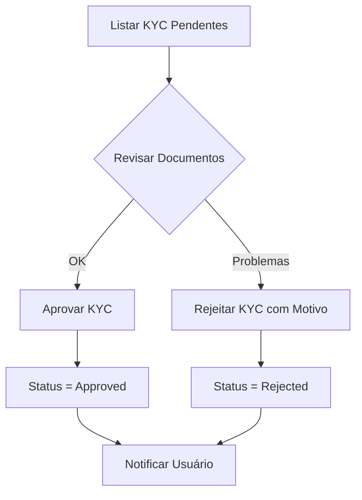
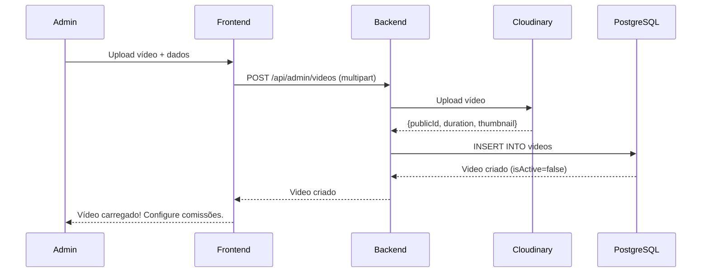

# Caso de Uso: Admin Gerencia Plataforma

## História

> "Como **admin**, **gerencio toda a plataforma**, incluindo aprovação de KYC, criação de vídeos, configuração de comissões e vinculação de influencers."

## Atores

- **Admin** (administrador da plataforma)
- **Sistema** (Backend API + Cloudinary + Iugu)

## Pré-condições

1. Admin deve estar logado
2. Admin deve ter tipo de usuário `Admin`

## Funcionalidades

### 1. Aprovar/Rejeitar KYC

Ver [Caso de Uso: Promoter - Aprovação KYC](promoter-aprovacao-kyc.md) para detalhes completos.

**Resumo:**



**Frontend:**
```typescript
// pages/Admin/KycApprovals.tsx
const { data: pendingKyc } = useQuery({
  queryKey: ['pending-kyc'],
  queryFn: async () => {
    const response = await httpClient.get('/api/admin/kyc/pending')
    return response.data
  }
})

const handleApprove = async (ownerId: number) => {
  await httpClient.post(`/api/admin/kyc/${ownerId}/approve`)
  toast.success('KYC aprovado!')
}

const handleReject = async (ownerId: number, reason: string) => {
  await httpClient.post(`/api/admin/kyc/${ownerId}/reject`, { reason })
  toast.success('KYC rejeitado')
}
```

### 2. Criar Vídeo

**Fluxo:**



**Frontend:**
```typescript
// pages/Admin/VideoManagement.tsx
const VideoUpload = () => {
  const { register, handleSubmit } = useForm<VideoForm>()
  const [isUploading, setIsUploading] = useState(false)
  
  const onSubmit = async (data: VideoForm) => {
    setIsUploading(true)
    
    try {
      const formData = new FormData()
      formData.append('title', data.title)
      formData.append('description', data.description)
      formData.append('price', data.price)
      formData.append('videoFile', data.videoFile[0])
      formData.append('releaseDate', data.releaseDate)
      formData.append('expirationSaleDate', data.expirationSaleDate)
      
      const response = await httpClient.post('/api/admin/videos', formData, {
        headers: { 'Content-Type': 'multipart/form-data' },
        onUploadProgress: (progressEvent) => {
          const percent = (progressEvent.loaded / progressEvent.total) * 100
          setUploadProgress(percent)
        }
      })
      
      toast.success('Vídeo criado! Configure as comissões.')
      navigate(`/admin/videos/${response.data.id}/configure`)
    } catch (error) {
      toast.error('Erro ao criar vídeo')
    } finally {
      setIsUploading(false)
    }
  }
  
  return (
    <form onSubmit={handleSubmit(onSubmit)}>
      <h1>Criar Novo Vídeo</h1>
      
      <input {...register('title')} placeholder="Título" required />
      <textarea {...register('description')} placeholder="Descrição" />
      <input {...register('price')} type="number" step="0.01" placeholder="Preço" required />
      
      <label>
        Arquivo do Vídeo (MP4):
        <input 
          type="file" 
          {...register('videoFile')} 
          accept="video/mp4,video/mov" 
          required 
        />
      </label>
      
      <input {...register('releaseDate')} type="date" />
      <input {...register('expirationSaleDate')} type="date" />
      
      {isUploading && (
        <ProgressBar progress={uploadProgress} />
      )}
      
      <button type="submit" disabled={isUploading}>
        {isUploading ? 'Enviando...' : 'Criar Vídeo'}
      </button>
    </form>
  )
}
```

**Backend:**
```csharp
// AdminEndpoints.cs
app.MapPost("/api/admin/videos", async (
    HttpRequest request,
    ICloudinaryService cloudinary,
    ApplicationDbContext context) =>
{
    var form = await request.ReadFormAsync();
    var videoFile = form.Files["videoFile"];
    
    // Upload para Cloudinary
    var uploadResult = await cloudinary.UploadVideoAsync(videoFile);
    
    // Criar vídeo (inativo até configurar comissões)
    var video = new Video
    {
        Title = form["title"],
        Description = form["description"],
        CloudinaryPublicId = uploadResult.PublicId,
        DurationSeconds = uploadResult.Duration,
        ThumbImgUrl = uploadResult.ThumbnailUrl,
        Price = decimal.Parse(form["price"]),
        ReleaseDate = DateTime.Parse(form["releaseDate"]),
        ExpirationSaleDate = DateTime.Parse(form["expirationSaleDate"]),
        IsActive = false, // Ativar após configurar comissões
        CreatedAt = DateTime.UtcNow
    };
    
    await context.Videos.AddAsync(video);
    await context.SaveChangesAsync();
    
    return Results.Created($"/api/videos/{video.Id}", video);
})
.RequireAuthorization("Admin")
.DisableAntiforgery()
.WithName("CreateVideo");
```

### 3. Configurar Comissões (VideoRevenueConfig)

**Frontend:**
```typescript
// pages/Admin/VideoRevenueConfig.tsx
const VideoRevenueConfig = () => {
  const { videoId } = useParams()
  const { register, handleSubmit, watch } = useForm<RevenueConfigForm>({
    defaultValues: {
      platformPercentage: 20,
      ownerPercentage: 50,
      promoterPercentage: 30
    }
  })
  
  const values = watch()
  const total = values.platformPercentage + values.ownerPercentage + values.promoterPercentage
  
  const onSubmit = async (data: RevenueConfigForm) => {
    if (total !== 100) {
      toast.error('A soma das porcentagens deve ser 100%')
      return
    }
    
    try {
      await httpClient.post(`/api/admin/videos/${videoId}/revenue-config`, data)
      toast.success('Comissões configuradas! Vídeo ativado.')
      navigate('/admin/videos')
    } catch (error) {
      toast.error('Erro ao configurar comissões')
    }
  }
  
  return (
    <form onSubmit={handleSubmit(onSubmit)}>
      <h1>Configurar Comissões</h1>
      
      <div className="field">
        <label>Plataforma (%)</label>
        <input 
          {...register('platformPercentage', { valueAsNumber: true })} 
          type="number" 
          min="0" 
          max="100" 
        />
      </div>
      
      <div className="field">
        <label>Owner/Influencer (%)</label>
        <input 
          {...register('ownerPercentage', { valueAsNumber: true })} 
          type="number" 
          min="0" 
          max="100" 
        />
      </div>
      
      <div className="field">
        <label>Promoter (%)</label>
        <input 
          {...register('promoterPercentage', { valueAsNumber: true })} 
          type="number" 
          min="0" 
          max="100" 
        />
        <small>
          ⚠️ Se 0%, vídeo NÃO aparecerá para promoters gerarem links
        </small>
      </div>
      
      <div className={`total ${total === 100 ? 'valid' : 'invalid'}`}>
        Total: {total}% {total === 100 ? '✓' : '✗'}
      </div>
      
      <button type="submit" disabled={total !== 100}>
        Salvar Configuração
      </button>
    </form>
  )
}
```

**Backend:**
```csharp
app.MapPost("/api/admin/videos/{id:long}/revenue-config", async (
    long id,
    VideoRevenueConfigDto dto,
    ApplicationDbContext context) =>
{
    // Validar soma = 100%
    var total = dto.PlatformPercentage + dto.OwnerPercentage + dto.PromoterPercentage;
    if (total != 100)
    {
        return Results.BadRequest(new 
        { 
            error = $"Soma deve ser 100% (atual: {total}%)" 
        });
    }
    
    var config = new VideoRevenueConfig
    {
        VideoId = id,
        PlatformPercentage = dto.PlatformPercentage,
        OwnerPercentage = dto.OwnerPercentage,
        PromoterPercentage = dto.PromoterPercentage,
        CreatedAt = DateTime.UtcNow
    };
    
    await context.VideoRevenueConfigs.AddAsync(config);
    
    // Ativar vídeo agora que tem comissões
    var video = await context.Videos.FindAsync(id);
    video.IsActive = true;
    video.UpdatedAt = DateTime.UtcNow;
    
    await context.SaveChangesAsync();
    
    return Results.Ok(config);
})
.RequireAuthorization("Admin");
```

### 4. Vincular Influencer ao Vídeo

**Frontend:**
```typescript
// pages/Admin/VideoInfluencers.tsx
const VideoInfluencers = () => {
  const { videoId } = useParams()
  
  const { data: approvedInfluencers } = useQuery({
    queryKey: ['approved-influencers'],
    queryFn: async () => {
      const response = await httpClient.get('/api/admin/owners', {
        params: { type: 'Influencer', status: 'Approved' }
      })
      return response.data
    }
  })
  
  const handleAddInfluencer = async (influencerId: number) => {
    try {
      await httpClient.post(`/api/admin/videos/${videoId}/add-influencer`, {
        influencerId
      })
      toast.success('Influencer vinculado!')
    } catch (error: any) {
      toast.error(error.response?.data?.error || 'Erro ao vincular')
    }
  }
  
  return (
    <div>
      <h1>Vincular Influencers ao Vídeo</h1>
      
      <table>
        <thead>
          <tr>
            <th>Nome</th>
            <th>Email</th>
            <th>Status KYC</th>
            <th>Ação</th>
          </tr>
        </thead>
        <tbody>
          {approvedInfluencers?.map(influencer => (
            <tr key={influencer.id}>
              <td>{influencer.name}</td>
              <td>{influencer.email}</td>
              <td>
                <span className="badge success">Aprovado</span>
              </td>
              <td>
                <button onClick={() => handleAddInfluencer(influencer.id)}>
                  Vincular
                </button>
              </td>
            </tr>
          ))}
        </tbody>
      </table>
    </div>
  )
}
```

**Backend:**
```csharp
app.MapPost("/api/admin/videos/{videoId:long}/add-influencer", async (
    long videoId,
    AddInfluencerDto dto,
    ApplicationDbContext context) =>
{
    // Verificar se é influencer com KYC aprovado
    var owner = await context.Owners
        .FirstOrDefaultAsync(o => o.Id == dto.InfluencerId &&
                                  o.Type == OwnerTypeEnum.Influencer &&
                                  o.SubAccountStatus == OwnerSubAccountStatusEnum.Approved);
    
    if (owner == null)
    {
        return Results.BadRequest(new 
        { 
            error = "Influencer não encontrado ou KYC não aprovado" 
        });
    }
    
    // Verificar se já está vinculado
    var exists = await context.OwnerVideos
        .AnyAsync(ov => ov.VideoId == videoId && ov.OwnerId == dto.InfluencerId);
    
    if (exists)
    {
        return Results.BadRequest(new 
        { 
            error = "Influencer já vinculado a este vídeo" 
        });
    }
    
    var ownerVideo = new OwnerVideo
    {
        VideoId = videoId,
        OwnerId = dto.InfluencerId,
        CreatedAt = DateTime.UtcNow
    };
    
    await context.OwnerVideos.AddAsync(ownerVideo);
    await context.SaveChangesAsync();
    
    return Results.Ok(ownerVideo);
})
.RequireAuthorization("Admin");
```

### 5. Ver Relatórios de Vendas

**Frontend:**
```typescript
// pages/Admin/SalesReport.tsx
const SalesReport = () => {
  const { data: report } = useQuery({
    queryKey: ['sales-report'],
    queryFn: async () => {
      const response = await httpClient.get('/api/admin/reports/sales')
      return response.data
    }
  })
  
  return (
    <div>
      <h1>Relatório de Vendas</h1>
      
      <div className="metrics">
        <Card>
          <h3>Total de Vendas</h3>
          <p>{report.totalOrders}</p>
        </Card>
        
        <Card>
          <h3>Faturamento Total</h3>
          <p>R$ {report.totalRevenue.toFixed(2)}</p>
        </Card>
        
        <Card>
          <h3>Comissão Plataforma</h3>
          <p>R$ {report.platformCommission.toFixed(2)}</p>
        </Card>
      </div>
      
      <h2>Top Vídeos</h2>
      <table>
        <thead>
          <tr>
            <th>Vídeo</th>
            <th>Vendas</th>
            <th>Faturamento</th>
          </tr>
        </thead>
        <tbody>
          {report.topVideos?.map(video => (
            <tr key={video.id}>
              <td>{video.title}</td>
              <td>{video.sales}</td>
              <td>R$ {video.revenue.toFixed(2)}</td>
            </tr>
          ))}
        </tbody>
      </table>
    </div>
  )
}
```

## Regra Especial: Promoter Percentage = 0%

**Se `promoter_percentage = 0%`:**

- ❌ Vídeo **NÃO aparece** para promoters gerarem links
- ✅ Vídeo aparece normalmente para usuários comprarem
- ✅ Se comprado sem promoter, owner recebe 100% - platform%

**Exemplo:**

```json
{
  "platformPercentage": 20,
  "ownerPercentage": 80,
  "promoterPercentage": 0
}
```

**Query para filtrar vídeos com comissão:**
```csharp
var videos = await _context.Videos
    .Include(v => v.VideoRevenueConfig)
    .Where(v => v.IsActive && v.VideoRevenueConfig.PromoterPercentage > 0)
    .ToListAsync();
```

## Próximos Passos

- [Perfil Admin](../perfis-de-usuario/admin.md)
- [Endpoint: Admin](../apis/backend-api/endpoints/admin.md)
- [Gestão de Vídeos](../fluxos-de-negocio/gestao-videos.md)
- [Processo KYC](../pagamentos/processo-kyc.md)

