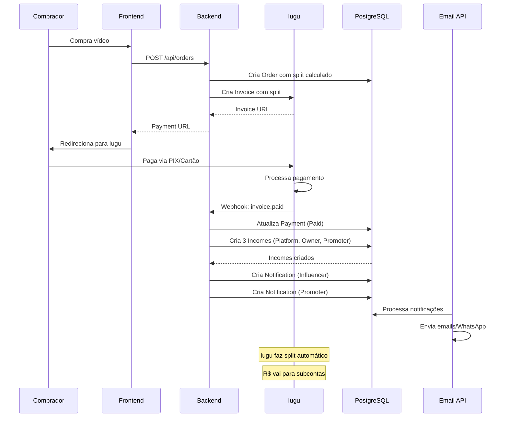

# Caso de Uso: Influencer Recebe Comissão

## História

> "Como **influencer**, **recebo comissão automática** a cada venda do meu vídeo, com o valor creditado diretamente na minha subconta Iugu."

## Atores

- **Influencer** (dono do vídeo)
- **Promoter** (opcional, se venda via link de afiliado)
- **Comprador** (usuário que compra o vídeo)
- **Sistema** (Backend API + Iugu + Email API)

## Pré-condições

1. Influencer deve ter **KYC aprovado** (`SubAccountStatus = Approved`)
2. Vídeo deve estar **ativo** e **disponível para venda**
3. Vídeo deve ter **comissões configuradas** (`VideoRevenueConfig`)
4. Influencer deve estar **vinculado ao vídeo** (`owner_videos`)

## Fluxo Principal



## Fluxo Passo a Passo

### 1. Vídeo é Vendido

Ver [Caso de Uso: Compra de Vídeo](usuario-compra-video.md) para detalhes completos.

Resumo:
- Comprador cria order
- Sistema cria invoice no Iugu com split
- Comprador paga
- Webhook confirma pagamento

### 2. Webhook Confirma Pagamento

**Backend:**
```csharp
// WebHookEndpoint.cs
app.MapPost("/api/webhooks/iugu", async (
    HttpRequest request,
    PaymentService service) =>
{
    var body = await new StreamReader(request.Body).ReadToEndAsync();
    var webhook = JsonSerializer.Deserialize<IuguWebhook>(body);
    
    if (webhook.Event == "invoice.status_changed" && 
        webhook.Data.Status == "paid")
    {
        await service.HandleInvoiceStatusChangedAsync(webhook.Data);
    }
    
    return Results.Ok();
});
```

### 3. Sistema Cria Incomes

**PaymentService:**
```csharp
// PaymentService.cs
public async Task HandleInvoiceStatusChangedAsync(IuguInvoiceData data)
{
    var payment = await _context.Payments
        .Include(p => p.Order)
        .ThenInclude(o => o.Video)
        .ThenInclude(v => v.OwnerVideos)
        .ThenInclude(ov => ov.Owner)
        .ThenInclude(o => o.User)
        .FirstOrDefaultAsync(p => p.IuguInvoiceId == data.Id);
    
    if (payment == null || payment.Status == PaymentStatusEnum.Paid)
        return; // Idempotência
    
    using var transaction = await _context.Database.BeginTransactionAsync();
    
    try
    {
        // Atualizar payment
        payment.Status = PaymentStatusEnum.Paid;
        payment.IuguPaidAt = DateTime.UtcNow;
        payment.UpdatedAt = DateTime.UtcNow;
        
        // Criar incomes
        var incomes = new List<Income>();
        
        // 1. Platform
        incomes.Add(new Income
        {
            OrderId = payment.Order.Id,
            OwnerId = null, // Platform não tem owner
            Amount = payment.Order.PlatformAmount,
            Type = IncomeTypeEnum.Platform,
            Description = "Comissão da plataforma",
            CreatedAt = DateTime.UtcNow
        });
        
        // 2. Owner (Influencer)
        var owner = payment.Order.Video.OwnerVideos.First().Owner;
        incomes.Add(new Income
        {
            OrderId = payment.Order.Id,
            OwnerId = owner.Id,
            Amount = payment.Order.OwnerAmount,
            Type = IncomeTypeEnum.Owner,
            Description = $"Venda do vídeo: {payment.Order.Video.Title}",
            CreatedAt = DateTime.UtcNow
        });
        
        // 3. Promoter (se houver)
        if (payment.Order.PromoterId.HasValue && payment.Order.PromoterAmount > 0)
        {
            incomes.Add(new Income
            {
                OrderId = payment.Order.Id,
                OwnerId = payment.Order.PromoterId.Value,
                Amount = payment.Order.PromoterAmount,
                Type = IncomeTypeEnum.Promoter,
                Description = $"Comissão por divulgação: {payment.Order.Video.Title}",
                CreatedAt = DateTime.UtcNow
            });
        }
        
        await _context.Incomes.AddRangeAsync(incomes);
        
        // Criar notificações
        await CreateNotificationsAsync(payment, owner);
        
        await _context.SaveChangesAsync();
        await transaction.CommitAsync();
        
        _logger.LogInformation("Payment {PaymentId} processed successfully. {IncomeCount} incomes created.", 
            payment.Id, incomes.Count);
    }
    catch (Exception ex)
    {
        _logger.LogError(ex, "Error processing payment {PaymentId}", payment.Id);
        await transaction.RollbackAsync();
        throw;
    }
}

private async Task CreateNotificationsAsync(Payment payment, Owner owner)
{
    var buyer = await _context.Users.FindAsync(payment.Order.UserId);
    
    // Notificação para comprador
    await _context.Notifications.AddAsync(new Notification
    {
        Type = NotificationTypeEnum.PaymentConfirmed,
        Channel = buyer.NotificationPreference ?? NotificationChannelEnum.Email,
        Email = buyer.Email,
        Phone = buyer.Telephone,
        MetadataJson = JsonSerializer.Serialize(new
        {
            OrderId = payment.Order.Id,
            VideoTitle = payment.Order.Video.Title,
            Amount = payment.Order.Amount / 100m
        }),
        CreatedAt = DateTime.UtcNow
    });
    
    // Notificação para influencer
    await _context.Notifications.AddAsync(new Notification
    {
        Type = NotificationTypeEnum.NewSale,
        Channel = owner.User.NotificationPreference ?? NotificationChannelEnum.Email,
        Email = owner.User.Email,
        Phone = owner.User.Telephone,
        MetadataJson = JsonSerializer.Serialize(new
        {
            OrderId = payment.Order.Id,
            VideoTitle = payment.Order.Video.Title,
            BuyerName = $"{buyer.FirstName} {buyer.LastName}",
            Commission = payment.Order.OwnerAmount / 100m
        }),
        CreatedAt = DateTime.UtcNow
    });
    
    // Notificação para promoter (se houver)
    if (payment.Order.PromoterId.HasValue)
    {
        var promoter = await _context.Owners
            .Include(o => o.User)
            .FirstAsync(o => o.Id == payment.Order.PromoterId.Value);
        
        await _context.Notifications.AddAsync(new Notification
        {
            Type = NotificationTypeEnum.NewSale,
            Channel = promoter.User.NotificationPreference ?? NotificationChannelEnum.Email,
            Email = promoter.User.Email,
            Phone = promoter.User.Telephone,
            MetadataJson = JsonSerializer.Serialize(new
            {
                OrderId = payment.Order.Id,
                VideoTitle = payment.Order.Video.Title,
                BuyerName = $"{buyer.FirstName} {buyer.LastName}",
                Commission = payment.Order.PromoterAmount / 100m
            }),
            CreatedAt = DateTime.UtcNow
        });
    }
}
```

### 4. Influencer Vê Comissão no Dashboard

**Frontend:**
```typescript
// pages/Influencer/InfluencerDashboard.tsx
const InfluencerDashboard = () => {
  const { data: dashboard } = useQuery({
    queryKey: ['influencer-dashboard'],
    queryFn: async () => {
      const response = await httpClient.get('/api/influencer/dashboard')
      return response.data
    }
  })
  
  const { data: sales } = useQuery({
    queryKey: ['influencer-sales'],
    queryFn: async () => {
      const response = await httpClient.get('/api/influencer/sales')
      return response.data
    }
  })
  
  return (
    <div>
      <h1>Dashboard do Influencer</h1>
      
      <div className="metrics">
        <Card>
          <h3>Total de Vendas</h3>
          <p className="value">{dashboard.totalSales}</p>
        </Card>
        
        <Card>
          <h3>Total de Comissões</h3>
          <p className="value">R$ {dashboard.totalEarnings.toFixed(2)}</p>
        </Card>
        
        <Card>
          <h3>Comissão Média</h3>
          <p className="value">R$ {dashboard.averageCommission.toFixed(2)}</p>
        </Card>
      </div>
      
      <h2>Vendas Recentes</h2>
      <table>
        <thead>
          <tr>
            <th>Vídeo</th>
            <th>Comprador</th>
            <th>Valor Total</th>
            <th>Sua Comissão</th>
            <th>Data</th>
          </tr>
        </thead>
        <tbody>
          {sales?.map(sale => (
            <tr key={sale.orderId}>
              <td>{sale.videoTitle}</td>
              <td>{sale.buyerName}</td>
              <td>R$ {sale.orderAmount.toFixed(2)}</td>
              <td className="highlight">R$ {sale.commission.toFixed(2)}</td>
              <td>{new Date(sale.paidAt).toLocaleDateString()}</td>
            </tr>
          ))}
        </tbody>
      </table>
    </div>
  )
}
```

**Backend:**
```csharp
// InfluencerEndpoints.cs
app.MapGet("/api/influencer/dashboard", async (
    HttpRequest request,
    ApplicationDbContext context) =>
{
    var userId = GetUserIdFromToken(request);
    var owner = await context.Owners.FirstAsync(o => o.UserId == userId);
    
    var incomes = await context.Incomes
        .Where(i => i.OwnerId == owner.Id && i.Type == IncomeTypeEnum.Owner)
        .ToListAsync();
    
    return Results.Ok(new
    {
        TotalSales = incomes.Count,
        TotalEarnings = incomes.Sum(i => i.Amount) / 100m,
        AverageCommission = incomes.Any() 
            ? incomes.Average(i => i.Amount) / 100m 
            : 0
    });
});

app.MapGet("/api/influencer/sales", async (
    HttpRequest request,
    ApplicationDbContext context) =>
{
    var userId = GetUserIdFromToken(request);
    var owner = await context.Owners.FirstAsync(o => o.UserId == userId);
    
    var sales = await context.Incomes
        .Include(i => i.Order)
        .ThenInclude(o => o.Video)
        .Include(i => i.Order)
        .ThenInclude(o => o.User)
        .Include(i => i.Order)
        .ThenInclude(o => o.Payment)
        .Where(i => i.OwnerId == owner.Id && i.Type == IncomeTypeEnum.Owner)
        .OrderByDescending(i => i.CreatedAt)
        .Select(i => new
        {
            OrderId = i.OrderId,
            VideoTitle = i.Order.Video.Title,
            BuyerName = $"{i.Order.User.FirstName} {i.Order.User.LastName}",
            OrderAmount = i.Order.Amount / 100m,
            Commission = i.Amount / 100m,
            PaidAt = i.Order.Payment.IuguPaidAt
        })
        .ToListAsync();
    
    return Results.Ok(sales);
});
```

## Tabelas Envolvidas

### orders
```sql
-- Order criado ao comprar
INSERT INTO orders (
    id, user_id, video_id, promoter_id,
    amount, platform_amount, owner_amount, promoter_amount,
    created_at
) VALUES (
    789, 10, 123, 5,
    10000,  -- R$ 100,00
    2000,   -- R$ 20,00 (20%)
    5000,   -- R$ 50,00 (50%)
    3000,   -- R$ 30,00 (30%)
    '2025-01-15 10:30:00'
);
```

### payments
```sql
-- Payment atualizado pelo webhook
UPDATE payments
SET status = 'Paid',
    iugu_paid_at = '2025-01-15 11:00:00',
    updated_at = '2025-01-15 11:00:00'
WHERE id = 456;
```

### incomes
```sql
-- 3 incomes criados

-- 1. Platform
INSERT INTO incomes (order_id, owner_id, amount, type, description, created_at)
VALUES (789, NULL, 2000, 'Platform', 'Comissão da plataforma', '2025-01-15 11:00:00');

-- 2. Owner (Influencer)
INSERT INTO incomes (order_id, owner_id, amount, type, description, created_at)
VALUES (789, 15, 5000, 'Owner', 'Venda do vídeo: Vídeo Exclusivo', '2025-01-15 11:00:00');

-- 3. Promoter
INSERT INTO incomes (order_id, owner_id, amount, type, description, created_at)
VALUES (789, 5, 3000, 'Promoter', 'Comissão por divulgação: Vídeo Exclusivo', '2025-01-15 11:00:00');
```

## Split no Iugu

O Iugu faz o split **automaticamente** ao confirmar o pagamento:

- **20% (R$ 20,00)** → Conta master (plataforma)
- **50% (R$ 50,00)** → Subconta do influencer
- **30% (R$ 30,00)** → Subconta do promoter

**Importante**: O dinheiro vai diretamente para as subcontas, não passa pela plataforma.

## Exemplo de Notificação

### Email para Influencer

```html
💰 Nova Venda!

Parabéns! Você recebeu uma nova comissão:

📹 Vídeo: Vídeo Exclusivo
👤 Comprador: João Silva
💵 Sua comissão: R$ 50,00

Acesse seu dashboard: https://amasso.com.br/dashboard

_Amasso - Plataforma de Vídeos Exclusivos_
```

## Regras de Negócio

1. **Split automático**: Iugu distribui valores nas subcontas
2. **3 incomes sempre**: Platform, Owner, Promoter (se houver)
3. **Notificação imediata**: Email/WhatsApp ao confirmar pagamento
4. **Sem promoter**: Owner recebe owner% + promoter%
5. **Idempotência**: Webhook pode chegar múltiplas vezes
6. **KYC obrigatório**: Sem KYC aprovado, não pode receber

## Queries Úteis

### Total de comissões do influencer

```sql
SELECT 
    SUM(amount) / 100.0 as total_commission
FROM incomes
WHERE owner_id = 15
  AND type = 'Owner';
```

### Vendas por vídeo

```sql
SELECT 
    v.title,
    COUNT(*) as sales,
    SUM(i.amount) / 100.0 as total_commission
FROM incomes i
JOIN orders o ON i.order_id = o.id
JOIN videos v ON o.video_id = v.id
WHERE i.owner_id = 15
  AND i.type = 'Owner'
GROUP BY v.id, v.title
ORDER BY sales DESC;
```

## Próximos Passos

- [Perfil Influencer](../perfis-de-usuario/influencer.md)
- [Split de Pagamento](../pagamentos/split-pagamento.md)
- [Webhooks Iugu](../pagamentos/webhooks.md)
- [Tabela: incomes](../banco-de-dados/tabelas/income.md)

