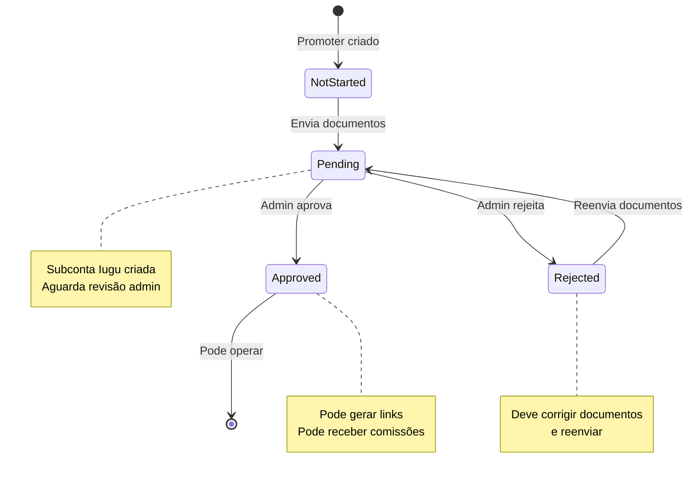

# Caso de Uso: Promoter - Aprovação KYC

## História

> "Como **promoter**, preciso ter meu **KYC aprovado** para poder operar na plataforma e receber comissões através de minha subconta Iugu."

## Atores

- **Promoter** (usuário que deseja ser afiliado)
- **Admin** (aprova/rejeita documentos)
- **Sistema** (Backend API + Iugu)

## Pré-condições

1. Promoter deve estar logado
2. Promoter deve ter tipo de usuário `Promoter`

## Fluxo Principal



## Enum: OwnerSubAccountStatusEnum

```csharp
public enum OwnerSubAccountStatusEnum
{
    NotStarted,  // Ainda não enviou documentos
    Pending,     // Aguardando aprovação
    Approved,    // Aprovado, pode operar
    Rejected     // Rejeitado, deve reenviar
}
```

## Fluxo Passo a Passo

### 1. Promoter Envia Documentos

**Frontend:**
```typescript
// pages/Owner/KycSubmission.tsx
const KycSubmission = () => {
  const { register, handleSubmit, formState: { errors } } = useForm<KycForm>()
  const [isSubmitting, setIsSubmitting] = useState(false)
  
  const onSubmit = async (data: KycForm) => {
    setIsSubmitting(true)
    
    try {
      const formData = new FormData()
      
      // Dados pessoais
      formData.append('cpf', data.cpf)
      formData.append('rg', data.rg)
      formData.append('birthDate', data.birthDate)
      
      // Endereço
      formData.append('addressStreet', data.addressStreet)
      formData.append('addressNumber', data.addressNumber)
      formData.append('addressCity', data.addressCity)
      formData.append('addressState', data.addressState)
      formData.append('addressZipcode', data.addressZipcode)
      
      // Dados bancários
      formData.append('bankCode', data.bankCode)
      formData.append('bankAgency', data.bankAgency)
      formData.append('bankAccount', data.bankAccount)
      formData.append('bankAccountType', data.bankAccountType)
      
      // Documentos (arquivos)
      formData.append('cpfFile', data.cpfFile[0])
      formData.append('rgFile', data.rgFile[0])
      formData.append('addressProofFile', data.addressProofFile[0])
      formData.append('selfieFile', data.selfieFile[0])
      
      await httpClient.post('/api/owners/kyc', formData, {
        headers: { 'Content-Type': 'multipart/form-data' }
      })
      
      toast.success('Documentos enviados! Aguarde aprovação.')
      navigate('/dashboard')
    } catch (error: any) {
      toast.error(error.response?.data?.error || 'Erro ao enviar documentos')
    } finally {
      setIsSubmitting(false)
    }
  }
  
  return (
    <form onSubmit={handleSubmit(onSubmit)}>
      <h1>Enviar Documentos KYC</h1>
      
      {/* Formulário completo */}
      
      <button type="submit" disabled={isSubmitting}>
        {isSubmitting ? 'Enviando...' : 'Enviar Documentos'}
      </button>
    </form>
  )
}
```

**Backend:**
```csharp
// OwnerEndpoints.cs
app.MapPost("/api/owners/kyc", async (
    HttpRequest request,
    OwnerService service,
    ICloudinaryService cloudinary,
    IIuguService iugu) =>
{
    var userId = GetUserIdFromToken(request);
    var form = await request.ReadFormAsync();
    
    // 1. Upload documentos para Cloudinary
    var cpfUrl = await cloudinary.UploadAsync(form.Files["cpfFile"]);
    var rgUrl = await cloudinary.UploadAsync(form.Files["rgFile"]);
    var addressProofUrl = await cloudinary.UploadAsync(form.Files["addressProofFile"]);
    var selfieUrl = await cloudinary.UploadAsync(form.Files["selfieFile"]);
    
    var dto = new SubmitKycDto
    {
        Cpf = form["cpf"],
        Rg = form["rg"],
        BirthDate = DateTime.Parse(form["birthDate"]),
        AddressStreet = form["addressStreet"],
        AddressNumber = form["addressNumber"],
        AddressCity = form["addressCity"],
        AddressState = form["addressState"],
        AddressZipcode = form["addressZipcode"],
        BankCode = form["bankCode"],
        BankAgency = form["bankAgency"],
        BankAccount = form["bankAccount"],
        BankAccountType = form["bankAccountType"],
        DocumentCpfUrl = cpfUrl,
        DocumentRgUrl = rgUrl,
        DocumentAddressProofUrl = addressProofUrl,
        DocumentSelfieUrl = selfieUrl
    };
    
    var owner = await service.SubmitKycAsync(userId, dto, iugu);
    
    return Results.Ok(new
    {
        OwnerId = owner.Id,
        IuguAccountId = owner.IuguAccountId,
        SubAccountStatus = owner.SubAccountStatus,
        Message = "Documentos enviados com sucesso! Aguarde aprovação."
    });
})
.RequireAuthorization()
.DisableAntiforgery()
.WithName("SubmitKyc");
```

**Service:**
```csharp
// OwnerService.cs
public async Task<Owner> SubmitKycAsync(
    long userId, 
    SubmitKycDto dto, 
    IIuguService iugu)
{
    var user = await _context.Users.FindAsync(userId);
    
    // Verificar tipo
    if (user.Type != UserTypeEnum.Promoter && 
        user.Type != UserTypeEnum.Influencer)
    {
        throw new InvalidOperationException(
            "Apenas Promoters e Influencers podem enviar KYC");
    }
    
    var owner = await _context.Owners
        .FirstOrDefaultAsync(o => o.UserId == userId);
    
    if (owner == null)
    {
        owner = new Owner
        {
            UserId = userId,
            Type = user.Type == UserTypeEnum.Promoter 
                ? OwnerTypeEnum.Promoter 
                : OwnerTypeEnum.Influencer,
            CreatedAt = DateTime.UtcNow
        };
        
        await _context.Owners.AddAsync(owner);
        await _context.SaveChangesAsync();
    }
    
    // Atualizar dados
    owner.CpfCnpj = dto.Cpf;
    owner.Rg = dto.Rg;
    owner.BirthDate = dto.BirthDate;
    owner.AddressStreet = dto.AddressStreet;
    owner.AddressNumber = dto.AddressNumber;
    owner.AddressCity = dto.AddressCity;
    owner.AddressState = dto.AddressState;
    owner.AddressZipcode = dto.AddressZipcode;
    owner.BankCode = dto.BankCode;
    owner.BankAgency = dto.BankAgency;
    owner.BankAccount = dto.BankAccount;
    owner.BankAccountType = dto.BankAccountType;
    owner.DocumentCpfUrl = dto.DocumentCpfUrl;
    owner.DocumentRgUrl = dto.DocumentRgUrl;
    owner.DocumentAddressProofUrl = dto.DocumentAddressProofUrl;
    owner.DocumentSelfieUrl = dto.DocumentSelfieUrl;
    
    // Criar subconta Iugu (se não existe)
    if (string.IsNullOrEmpty(owner.IuguAccountId))
    {
        var subAccount = await iugu.CreateSubAccountAsync(new
        {
            Name = $"{user.FirstName} {user.LastName}",
            Email = user.Email,
            Cpf = dto.Cpf
        });
        
        owner.IuguAccountId = subAccount.AccountId;
        owner.IuguLiveApiToken = subAccount.LiveApiToken;
        owner.IuguTestApiToken = subAccount.TestApiToken;
    }
    else
    {
        // Atualizar subconta existente
        await iugu.UpdateSubAccountAsync(owner.IuguAccountId, new
        {
            Name = $"{user.FirstName} {user.LastName}",
            Cpf = dto.Cpf
        });
    }
    
    owner.SubAccountStatus = OwnerSubAccountStatusEnum.Pending;
    owner.UpdatedAt = DateTime.UtcNow;
    
    await _context.SaveChangesAsync();
    
    _logger.LogInformation("KYC submitted for owner {OwnerId}", owner.Id);
    
    return owner;
}
```

### 2. Admin Revisa Documentos

**Frontend:**
```typescript
// pages/Admin/KycApprovals.tsx
const KycApprovals = () => {
  const { data: pendingKyc, refetch } = useQuery({
    queryKey: ['pending-kyc'],
    queryFn: async () => {
      const response = await httpClient.get('/api/admin/kyc/pending')
      return response.data
    }
  })
  
  const handleApprove = async (ownerId: number) => {
    if (!confirm('Aprovar este KYC?')) return
    
    try {
      await httpClient.post(`/api/admin/kyc/${ownerId}/approve`)
      toast.success('KYC aprovado!')
      refetch()
    } catch (error) {
      toast.error('Erro ao aprovar KYC')
    }
  }
  
  const handleReject = async (ownerId: number) => {
    const reason = prompt('Motivo da rejeição:')
    if (!reason) return
    
    try {
      await httpClient.post(`/api/admin/kyc/${ownerId}/reject`, { reason })
      toast.success('KYC rejeitado')
      refetch()
    } catch (error) {
      toast.error('Erro ao rejeitar KYC')
    }
  }
  
  return (
    <div>
      <h1>KYC Pendentes de Aprovação</h1>
      
      <table>
        <thead>
          <tr>
            <th>Nome</th>
            <th>Tipo</th>
            <th>CPF</th>
            <th>Documentos</th>
            <th>Ações</th>
          </tr>
        </thead>
        <tbody>
          {pendingKyc?.map(kyc => (
            <tr key={kyc.ownerId}>
              <td>{kyc.userName}</td>
              <td>{kyc.type}</td>
              <td>{kyc.cpf}</td>
              <td>
                <button onClick={() => window.open(kyc.documents.cpfUrl)}>
                  Ver CPF
                </button>
                <button onClick={() => window.open(kyc.documents.rgUrl)}>
                  Ver RG
                </button>
                <button onClick={() => window.open(kyc.documents.addressProofUrl)}>
                  Ver Comprovante
                </button>
                <button onClick={() => window.open(kyc.documents.selfieUrl)}>
                  Ver Selfie
                </button>
              </td>
              <td>
                <button 
                  onClick={() => handleApprove(kyc.ownerId)}
                  className="btn-success"
                >
                  Aprovar
                </button>
                <button 
                  onClick={() => handleReject(kyc.ownerId)}
                  className="btn-danger"
                >
                  Rejeitar
                </button>
              </td>
            </tr>
          ))}
        </tbody>
      </table>
    </div>
  )
}
```

### 3. Admin Aprova KYC

**Backend:**
```csharp
// AdminEndpoints.cs
app.MapPost("/api/admin/kyc/{id:long}/approve", async (
    long id,
    AdminService service,
    HttpRequest request) =>
{
    var adminUserId = GetUserIdFromToken(request);
    
    await service.ApproveKycAsync(id, adminUserId);
    
    return Results.Ok(new
    {
        OwnerId = id,
        Status = "Approved",
        ApprovedAt = DateTime.UtcNow
    });
})
.RequireAuthorization("Admin")
.WithName("ApproveKyc");
```

**Service:**
```csharp
// AdminService.cs
public async Task ApproveKycAsync(long ownerId, long adminUserId)
{
    var owner = await _context.Owners
        .Include(o => o.User)
        .FirstAsync(o => o.Id == ownerId);
    
    owner.SubAccountStatus = OwnerSubAccountStatusEnum.Approved;
    owner.UpdatedAt = DateTime.UtcNow;
    
    await _context.SaveChangesAsync();
    
    // Criar notificação
    var notification = new Notification
    {
        Type = NotificationTypeEnum.KycApproved,
        Channel = owner.User.NotificationPreference ?? NotificationChannelEnum.Email,
        Email = owner.User.Email,
        Phone = owner.User.Telephone,
        MetadataJson = JsonSerializer.Serialize(new
        {
            OwnerType = owner.Type.ToString()
        }),
        CreatedAt = DateTime.UtcNow
    };
    
    await _context.Notifications.AddAsync(notification);
    await _context.SaveChangesAsync();
    
    _logger.LogInformation("KYC approved for owner {OwnerId} by admin {AdminUserId}", 
        ownerId, adminUserId);
}
```

### 4. Admin Rejeita KYC (Alternativo)

**Backend:**
```csharp
app.MapPost("/api/admin/kyc/{id:long}/reject", async (
    long id,
    RejectKycDto dto,
    AdminService service,
    HttpRequest request) =>
{
    var adminUserId = GetUserIdFromToken(request);
    
    await service.RejectKycAsync(id, dto.Reason, adminUserId);
    
    return Results.Ok(new
    {
        OwnerId = id,
        Status = "Rejected",
        Reason = dto.Reason,
        RejectedAt = DateTime.UtcNow
    });
})
.RequireAuthorization("Admin")
.WithName("RejectKyc");
```

**Service:**
```csharp
public async Task RejectKycAsync(long ownerId, string reason, long adminUserId)
{
    var owner = await _context.Owners
        .Include(o => o.User)
        .FirstAsync(o => o.Id == ownerId);
    
    owner.SubAccountStatus = OwnerSubAccountStatusEnum.Rejected;
    owner.UpdatedAt = DateTime.UtcNow;
    
    await _context.SaveChangesAsync();
    
    // Criar notificação com motivo
    var notification = new Notification
    {
        Type = NotificationTypeEnum.KycRejected,
        Channel = owner.User.NotificationPreference ?? NotificationChannelEnum.Email,
        Email = owner.User.Email,
        Phone = owner.User.Telephone,
        MetadataJson = JsonSerializer.Serialize(new
        {
            OwnerType = owner.Type.ToString(),
            Reason = reason
        }),
        CreatedAt = DateTime.UtcNow
    };
    
    await _context.Notifications.AddAsync(notification);
    await _context.SaveChangesAsync();
    
    _logger.LogInformation("KYC rejected for owner {OwnerId} by admin {AdminUserId}. Reason: {Reason}", 
        ownerId, adminUserId, reason);
}
```

## Documentos Necessários

1. **CPF**: Frente e verso (imagem ou PDF)
2. **RG**: Frente e verso (imagem ou PDF)
3. **Comprovante de Endereço**: Máximo 3 meses (conta de luz, água, telefone)
4. **Selfie com Documento**: Foto segurando RG ou CNH

## Restrições por Status

### NotStarted
- ❌ Não pode gerar links de afiliado
- ❌ Não pode receber comissões

### Pending
- ❌ Não pode gerar links de afiliado
- ❌ Não pode receber comissões
- ✅ Pode visualizar status

### Approved
- ✅ Pode gerar links de afiliado
- ✅ Pode receber comissões
- ✅ Subconta Iugu ativa

### Rejected
- ❌ Não pode gerar links de afiliado
- ❌ Não pode receber comissões
- ✅ Pode reenviar documentos

## Regras de Negócio

1. **Apenas Promoter/Influencer**: Outros tipos não podem enviar KYC
2. **Subconta automática**: Criada ao enviar documentos
3. **Reenvio**: Pode reenviar quantas vezes necessário
4. **Notificação**: Email/WhatsApp ao aprovar/rejeitar
5. **Motivo obrigatório**: Ao rejeitar, deve informar motivo

## Próximos Passos

- [Processo KYC](../pagamentos/processo-kyc.md)
- [Perfil Promoter](../perfis-de-usuario/promoter.md)
- [Endpoint: Owner](../apis/backend-api/endpoints/owner.md)
- [Endpoint: Admin](../apis/backend-api/endpoints/admin.md)

