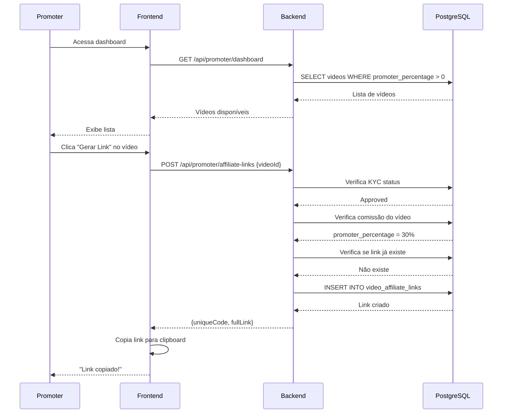
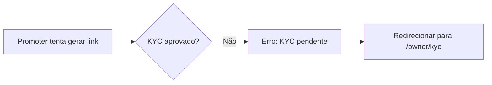

# Caso de Uso: Promoter Gera Link de Afiliado

## História

> "Como **promoter**, quero **gerar links de afiliado** para divulgar vídeos e **receber comissões** pelas vendas realizadas através dos meus links."

## Atores

- **Promoter** (usuário com KYC aprovado)
- **Sistema** (Backend API)

## Pré-condições

1. Promoter deve estar logado
2. Promoter deve ter **KYC aprovado** (`SubAccountStatus = Approved`)
3. Vídeo deve ter **comissão configurada** (`promoter_percentage > 0%`)

## Fluxo Principal



## Fluxo Passo a Passo

### 1. Promoter Acessa Dashboard

**Frontend:**
```typescript
// pages/Promoter/PromoterDashboard.tsx
const PromoterDashboard = () => {
  const { data: availableVideos } = useQuery({
    queryKey: ['promoter-available-videos'],
    queryFn: async () => {
      const response = await httpClient.get('/api/videos', {
        params: { promoterOnly: true }
      })
      return response.data
    }
  })
  
  return (
    <div>
      <h1>Vídeos Disponíveis para Divulgação</h1>
      <VideoGrid videos={availableVideos} />
    </div>
  )
}
```

**Backend:**
```csharp
// VideoEndpoints.cs
app.MapGet("/api/videos", async (
    ApplicationDbContext context,
    bool promoterOnly = false) =>
{
    var query = context.Videos
        .Include(v => v.VideoRevenueConfig)
        .Where(v => v.IsActive);
    
    // Filtrar apenas vídeos com comissão
    if (promoterOnly)
    {
        query = query.Where(v => v.VideoRevenueConfig.PromoterPercentage > 0);
    }
    
    var videos = await query.ToListAsync();
    
    return Results.Ok(videos);
});
```

### 2. Promoter Clica em "Gerar Link"

**Frontend:**
```typescript
// pages/Promoter/PromoterDashboard.tsx
const handleCreateLink = async (videoId: number) => {
  try {
    const response = await httpClient.post('/api/promoter/affiliate-links', {
      videoId
    })
    
    const { fullLink } = response.data
    
    // Copiar para clipboard
    await navigator.clipboard.writeText(fullLink)
    
    toast.success('Link copiado para área de transferência!')
    
    // Atualizar lista
    queryClient.invalidateQueries(['affiliate-links'])
  } catch (error: any) {
    const message = error.response?.data?.error || 'Erro ao gerar link'
    toast.error(message)
  }
}

return (
  <div className="video-card">
    
    <h3>{video.title}</h3>
    <p>Comissão: {video.videoRevenueConfig.promoterPercentage}%</p>
    <button onClick={() => handleCreateLink(video.id)}>
      Gerar Link de Afiliado
    </button>
  </div>
)
```

### 3. Sistema Verifica Permissões

**Backend:**
```csharp
// PromoterEndpoint.cs
app.MapPost("/api/promoter/affiliate-links", async (
    CreateAffiliateLinkDto dto,
    HttpRequest request,
    ApplicationDbContext context,
    IConfiguration config) =>
{
    var userId = GetUserIdFromToken(request);
    
    // 1. Buscar owner do promoter
    var owner = await context.Owners
        .FirstOrDefaultAsync(o => o.UserId == userId);
    
    if (owner == null)
        return Results.BadRequest(new { error = "Owner não encontrado" });
    
    // 2. Verificar KYC aprovado
    if (owner.SubAccountStatus != OwnerSubAccountStatusEnum.Approved)
    {
        return Results.BadRequest(new 
        { 
            error = "Seu KYC ainda não foi aprovado. Aguarde a análise." 
        });
    }
    
    // 3. Verificar comissão do vídeo
    var video = await context.Videos
        .Include(v => v.VideoRevenueConfig)
        .FirstOrDefaultAsync(v => v.Id == dto.VideoId);
    
    if (video == null)
        return Results.NotFound(new { error = "Vídeo não encontrado" });
    
    if (video.VideoRevenueConfig.PromoterPercentage <= 0)
    {
        return Results.BadRequest(new 
        { 
            error = "Este vídeo não oferece comissão para promoters" 
        });
    }
    
    // 4. Verificar se link já existe
    var existingLink = await context.VideoAffiliateLinks
        .FirstOrDefaultAsync(l => l.OwnerId == owner.Id && 
                                  l.VideoId == dto.VideoId);
    
    if (existingLink != null)
    {
        var baseUrl = config["App:BaseUrl"];
        return Results.Ok(new
        {
            Id = existingLink.Id,
            VideoId = existingLink.VideoId,
            UniqueCode = existingLink.UniqueCode,
            FullLink = $"{baseUrl}/videos/{existingLink.VideoId}?ref={existingLink.UniqueCode}",
            Message = "Link já existe"
        });
    }
    
    // 5. Criar novo link
    var link = new VideoAffiliateLink
    {
        OwnerId = owner.Id,
        VideoId = dto.VideoId,
        UniqueCode = GenerateUniqueCode(),
        Clicks = 0,
        CreatedAt = DateTime.UtcNow
    };
    
    await context.VideoAffiliateLinks.AddAsync(link);
    await context.SaveChangesAsync();
    
    var fullLink = $"{config["App:BaseUrl"]}/videos/{link.VideoId}?ref={link.UniqueCode}";
    
    return Results.Created($"/api/promoter/affiliate-links/{link.Id}", new
    {
        Id = link.Id,
        VideoId = link.VideoId,
        UniqueCode = link.UniqueCode,
        FullLink = fullLink
    });
})
.RequireAuthorization()
.WithName("CreateAffiliateLink");

private static string GenerateUniqueCode()
{
    return Convert.ToBase64String(Guid.NewGuid().ToByteArray())
        .Replace("+", "").Replace("/", "").Replace("=", "")
        .Substring(0, 8)
        .ToUpper();
}
```

### 4. Promoter Divulga o Link

O promoter pode compartilhar o link em redes sociais, WhatsApp, email, etc:

```
https://amasso.com.br/videos/123?ref=ABC12345
```

### 5. Usuário Clica no Link

Quando um usuário clica no link, o frontend salva o `ref` no localStorage:

```typescript
// pages/Videos/VideoDetail.tsx
useEffect(() => {
  const params = new URLSearchParams(window.location.search)
  const affiliateCode = params.get('ref')
  
  if (affiliateCode) {
    // Salvar por 30 dias
    localStorage.setItem('affiliateRef', affiliateCode)
    localStorage.setItem('affiliateRefExpiry', 
      String(Date.now() + 30 * 24 * 60 * 60 * 1000))
    
    // Incrementar contador de cliques
    httpClient.post(`/api/affiliate-links/${affiliateCode}/click`)
  }
}, [])
```

**Backend (Incrementar Clicks):**
```csharp
app.MapPost("/api/affiliate-links/{code}/click", async (
    string code,
    ApplicationDbContext context) =>
{
    var link = await context.VideoAffiliateLinks
        .FirstOrDefaultAsync(l => l.UniqueCode == code);
    
    if (link != null)
    {
        link.Clicks++;
        await context.SaveChangesAsync();
    }
    
    return Results.Ok();
})
.AllowAnonymous();
```

### 6. Usuário Compra o Vídeo

Ao comprar, o código é enviado:

```typescript
const affiliateCode = localStorage.getItem('affiliateRef')
const expiry = localStorage.getItem('affiliateRefExpiry')

// Verificar se ainda é válido
if (expiry && Date.now() < parseInt(expiry)) {
  await orderApi.create({
    videoId,
    affiliateCode
  })
  
  // Limpar após uso
  localStorage.removeItem('affiliateRef')
  localStorage.removeItem('affiliateRefExpiry')
}
```

### 7. Sistema Registra Comissão

O `OrderService` registra a comissão automaticamente (ver [Compra de Vídeo](usuario-compra-video.md)).

## Fluxos Alternativos

### 7.1. KYC Não Aprovado



**Response:**
```json
{
  "error": "Seu KYC ainda não foi aprovado. Aguarde a análise."
}
```

### 7.2. Vídeo Sem Comissão

```json
{
  "error": "Este vídeo não oferece comissão para promoters"
}
```

### 7.3. Link Já Existe

Sistema retorna o link existente ao invés de criar novo:

```json
{
  "id": 456,
  "videoId": 123,
  "uniqueCode": "ABC12345",
  "fullLink": "https://amasso.com.br/videos/123?ref=ABC12345",
  "message": "Link já existe"
}
```

## Regras de Negócio

1. **1 link por vídeo por promoter**: Não duplica links
2. **Código único**: 8 caracteres alfanuméricos
3. **Validade**: Link não expira
4. **Tracking de cliques**: Incrementado automaticamente
5. **Expiração do ref**: 30 dias no localStorage
6. **Comissão > 0%**: Apenas vídeos configurados

## Dados Criados

### Tabela: video_affiliate_links

```sql
INSERT INTO video_affiliate_links (
    id,
    owner_id,
    video_id,
    unique_code,
    clicks,
    created_at
) VALUES (
    456,
    5,      -- Promoter owner
    123,    -- Video ID
    'ABC12345',
    0,
    '2025-01-15 10:00:00'
);
```

## Métricas

O promoter pode ver suas métricas no dashboard:

```typescript
const { data: metrics } = useQuery({
  queryKey: ['promoter-metrics'],
  queryFn: async () => {
    const response = await httpClient.get('/api/promoter/dashboard')
    return response.data
  }
})

// Exibir:
// - Total de links gerados
// - Total de cliques
// - Total de conversões (vendas)
// - Taxa de conversão
// - Total de comissões
```

## Próximos Passos

- [Fluxo de Link de Afiliado](../fluxos-de-negocio/link-afiliado.md)
- [Perfil Promoter](../perfis-de-usuario/promoter.md)
- [Endpoint: Promoter](../apis/backend-api/endpoints/promoter.md)

