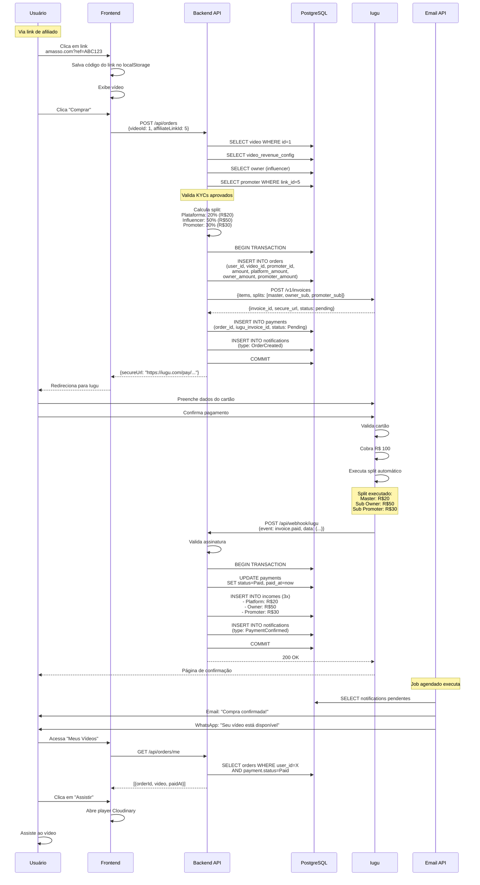

# Caso de Uso: Compra de Vídeo

## História do Usuário

> **Como** usuário da plataforma,  
> **Quero** comprar um vídeo para poder assisti-lo,  
> **Para** ter acesso ao conteúdo exclusivo do criador.

## Atores

- **Usuário** (Default): Comprador do vídeo
- **Promoter** (opcional): Divulgador que criou link de afiliado
- **Influencer/Owner**: Criador do vídeo
- **Plataforma**: Amasso (conta master)
- **Iugu**: Gateway de pagamento

## Pré-condições

1. ✅ Usuário cadastrado e logado
2. ✅ Vídeo disponível para venda (`is_active = true`, `release_date <= today`)
3. ✅ Vídeo tem configuração de comissões (`video_revenue_configs`)
4. ✅ Influencer tem KYC aprovado (se houver comissão para owner)
5. ✅ Promoter tem KYC aprovado (se compra via link de afiliado)

## Fluxo Principal (Com Link de Afiliado)

### Diagrama de Sequência



## Passo a Passo Detalhado

### 1. Usuário Acessa via Link de Afiliado

**URL**: `https://amasso.com.br/videos/1?ref=ABC123`

```typescript
// Frontend - Router intercepta query param
const VideoPage: React.FC = () => {
  const { videoId } = useParams();
  const [searchParams] = useSearchParams();
  const affiliateCode = searchParams.get('ref');
  
  useEffect(() => {
    if (affiliateCode) {
      // Salvar código para usar na compra
      localStorage.setItem('affiliateCode', affiliateCode);
      
      // Registrar clique no link
      affiliateApi.registerClick(affiliateCode);
    }
  }, [affiliateCode]);
  
  // ... resto do componente
};
```

```csharp
// Backend - Registrar clique
// PromoterEndpoints.cs
group.MapPost("/affiliate-links/{code}/click", async (string code, Pay4TruDb db) =>
{
    var link = await db.VideoAffiliateLinks
        .FirstOrDefaultAsync(l => l.UniqueCode == code);
    
    if (link != null)
    {
        link.Clicks++;
        await db.SaveChangesAsync();
    }
    
    return Results.Ok();
});
```

### 2. Criar Pedido

```typescript
// Frontend
const handleBuyVideo = async (videoId: number) => {
  const affiliateCode = localStorage.getItem('affiliateCode');
  
  try {
    const order = await orderApi.create({
      videoId,
      affiliateCode // Se houver
    });
    
    // Redirecionar para URL de pagamento do Iugu
    window.location.href = order.iuguSecureUrl;
  } catch (error) {
    if (error.response?.data?.message.includes('KYC')) {
      toast.error('Não foi possível processar. Entre em contato.');
    } else {
      toast.error('Erro ao criar pedido');
    }
  }
};
```

```csharp
// Backend - OrderService.cs
public async Task<CreateOrderResponseDto> CreateOrderAsync(CreateOrderDto dto, long userId)
{
    // 1. Buscar dados do vídeo
    var video = await _context.Videos
        .Include(v => v.VideoRevenueConfig)
        .Include(v => v.OwnerVideos)
        .ThenInclude(ov => ov.Owner)
        .FirstOrDefaultAsync(v => v.Id == dto.VideoId && v.IsActive);
    
    if (video == null)
        throw new NotFoundException("Vídeo não encontrado");
    
    // Verificar se vídeo está disponível para venda
    if (video.ReleaseDate > DateTime.Today)
        throw new InvalidOperationException("Vídeo ainda não foi lançado");
    
    if (video.ExpirationSaleDate.HasValue && video.ExpirationSaleDate < DateTime.Today)
        throw new InvalidOperationException("Venda deste vídeo expirou");
    
    // 2. Verificar se usuário já comprou
    var alreadyPurchased = await _context.Orders
        .Include(o => o.Payment)
        .AnyAsync(o => o.UserId == userId && 
                      o.VideoId == dto.VideoId &&
                      o.Payment.Status == PaymentStatusEnum.Paid);
    
    if (alreadyPurchased)
        throw new InvalidOperationException("Você já possui este vídeo");
    
    // 3. Buscar link de afiliado (se fornecido)
    VideoAffiliateLink? affiliateLink = null;
    Owner? promoter = null;
    
    if (!string.IsNullOrEmpty(dto.AffiliateCode))
    {
        affiliateLink = await _context.VideoAffiliateLinks
            .Include(l => l.Owner)
            .FirstOrDefaultAsync(l => l.UniqueCode == dto.AffiliateCode && 
                                     l.IsActive);
        
        if (affiliateLink != null)
        {
            promoter = affiliateLink.Owner;
            
            // Validar KYC do promoter
            if (promoter.SubAccountStatus != OwnerSubAccountStatusEnum.Approved)
            {
                throw new InvalidOperationException(
                    "Promoter não tem KYC aprovado. Não é possível processar comissão.");
            }
        }
    }
    
    // 4. Buscar owner (influencer)
    var owner = video.OwnerVideos.First().Owner;
    
    // Validar KYC do owner
    if (owner.SubAccountStatus != OwnerSubAccountStatusEnum.Approved)
    {
        throw new InvalidOperationException(
            "Owner não tem KYC aprovado. Não é possível processar comissão.");
    }
    
    // 5. Calcular valores
    var config = video.VideoRevenueConfig;
    var totalCents = (int)(video.Price * 100);
    
    var platformCents = (int)(totalCents * config.PlatformPercentage / 100);
    var ownerCents = (int)(totalCents * config.OwnerPercentage / 100);
    var promoterCents = promoter != null 
        ? (int)(totalCents * config.PromoterPercentage / 100) 
        : 0;
    
    // Ajustar arredondamento
    var totalCalculated = platformCents + ownerCents + promoterCents;
    if (totalCalculated != totalCents)
    {
        ownerCents += (totalCents - totalCalculated);
    }
    
    // 6. Criar Order (transação)
    using var transaction = await _context.Database.BeginTransactionAsync();
    
    try
    {
        var order = new Order
        {
            UserId = userId,
            VideoId = dto.VideoId,
            PromoterId = promoter?.Id,
            VideoAffiliateLinkId = affiliateLink?.Id,
            Amount = totalCents,
            PlatformAmount = platformCents,
            OwnerAmount = ownerCents,
            PromoterAmount = promoterCents,
            CreatedAt = DateTime.UtcNow
        };
        
        await _context.Orders.AddAsync(order);
        await _context.SaveChangesAsync();
        
        // 7. Criar invoice no Iugu com split
        var invoice = await _iuguService.CreateInvoiceWithSplitAsync(order, owner, promoter);
        
        // 8. Criar Payment
        var payment = new Payment
        {
            OrderId = order.Id,
            IuguInvoiceId = invoice.Id,
            IuguSecureUrl = invoice.SecureUrl,
            Status = PaymentStatusEnum.Pending,
            Amount = totalCents,
            CreatedAt = DateTime.UtcNow
        };
        
        await _context.Payments.AddAsync(payment);
        
        // 9. Criar Notification
        var user = await _context.Users.FindAsync(userId);
        var notification = new Notification
        {
            Type = NotificationTypeEnum.OrderCreated,
            Channel = user.NotificationPreference,
            MetadataJson = JsonSerializer.Serialize(new
            {
                Email = user.Email,
                PhoneNumber = user.Telephone,
                Name = user.FirstName,
                VideoTitle = video.Title,
                Amount = totalCents / 100m,
                OrderId = order.Id,
                Subject = "Pedido criado - Aguardando pagamento"
            }),
            IsActive = true,
            CreatedAt = DateTime.UtcNow
        };
        
        await _context.Notifications.AddAsync(notification);
        
        await _context.SaveChangesAsync();
        await transaction.CommitAsync();
        
        _logger.LogInformation(
            "Order criado: {OrderId}, User: {UserId}, Video: {VideoId}, Promoter: {PromoterId}",
            order.Id, userId, dto.VideoId, promoter?.Id);
        
        return new CreateOrderResponseDto
        {
            OrderId = order.Id,
            IuguSecureUrl = invoice.SecureUrl,
            Amount = totalCents / 100m
        };
    }
    catch (Exception ex)
    {
        await transaction.RollbackAsync();
        _logger.LogError(ex, "Erro ao criar order");
        throw;
    }
}
```

### 3. Usuário Paga no Iugu

O usuário é redirecionado para `iugu_secure_url` e preenche dados de pagamento (cartão, boleto ou Pix).

### 4. Webhook Confirma Pagamento

```csharp
// WebHookEndpoint.cs
private static async Task HandleInvoiceStatusChanged(
    IuguWebhookDataDto data,
    IPaymentService paymentService)
{
    if (data.Status == "paid")
    {
        await paymentService.ConfirmPaymentAsync(data.Id);
    }
}

// PaymentService.cs - já documentado anteriormente
public async Task ConfirmPaymentAsync(string iuguInvoiceId)
{
    // ... código completo na seção de webhooks
    // Atualiza payment, cria incomes, cria notification
}
```

### 5. Usuário Acessa Vídeo Comprado

```typescript
// Frontend - MyVideos.tsx
export const MyVideos: React.FC = () => {
  const [orders, setOrders] = useState<Order[]>([]);
  
  useEffect(() => {
    const fetchOrders = async () => {
      const data = await orderApi.getMyOrders();
      setOrders(data.filter(o => o.payment.status === 'Paid'));
    };
    fetchOrders();
  }, []);
  
  const handleWatchVideo = (order: Order) => {
    navigate(`/watch/${order.video.id}`);
  };
  
  return (
    <Grid container spacing={2}>
      {orders.map(order => (
        <Grid item xs={12} md={4} key={order.id}>
          <VideoCard 
            video={order.video}
            showBuyButton={false}
            actionButton={(
              <Button onClick={() => handleWatchVideo(order)}>
                Assistir
              </Button>
            )}
          />
        </Grid>
      ))}
    </Grid>
  );
};
```

```csharp
// Backend - OrderEndpoints.cs
group.MapGet("/me", GetMyOrders).RequireAuthorization();

private static async Task<IResult> GetMyOrders(
    HttpContext context,
    Pay4TruDb db)
{
    var userId = GetUserIdFromToken(context);
    
    var orders = await db.Orders
        .Include(o => o.Video)
        .Include(o => o.Payment)
        .Where(o => o.UserId == userId)
        .OrderByDescending(o => o.CreatedAt)
        .Select(o => new OrderDto
        {
            Id = o.Id,
            VideoId = o.Video.Id,
            VideoTitle = o.Video.Title,
            VideoThumbUrl = o.Video.ThumbImgUrl,
            Amount = o.Amount / 100m,
            PaymentStatus = o.Payment.Status.ToString(),
            PurchasedAt = o.CreatedAt,
            CanWatch = o.Payment.Status == PaymentStatusEnum.Paid
        })
        .ToListAsync();
    
    return Results.Ok(orders);
}
```

## Fluxo Alternativo: Sem Link de Afiliado

Se usuário acessar diretamente sem link:

**Diferenças**:
- `Order.PromoterId = NULL`
- `Order.VideoAffiliateLinkId = NULL`
- `Order.PromoterAmount = 0`
- Split no Iugu: apenas Master + Owner
- Income: apenas 2 registros (Platform e Owner)

```
Vídeo: R$ 100,00
Config: Plataforma 20%, Owner 80%, Promoter 0%

Cálculo:
- Plataforma: R$ 20,00
- Owner: R$ 80,00

Split no Iugu:
{
  splits: [
    { recipient_account_id: "master", cents: 2000 },
    { recipient_account_id: "owner_sub", cents: 8000 }
  ]
}
```

## Fluxos de Exceção

### 1. Vídeo Indisponível

```
❌ Vídeo com is_active = false
❌ Vídeo com release_date futura
❌ Vídeo com expiration_sale_date passada
→ Retorna 400 Bad Request: "Vídeo não disponível"
```

### 2. Usuário Já Comprou

```
❌ Já existe Order pago para user + video
→ Retorna 400 Bad Request: "Você já possui este vídeo"
```

### 3. KYC Não Aprovado

```
❌ Owner sem KYC aprovado
❌ Promoter sem KYC aprovado
→ Retorna 400 Bad Request: "Não é possível processar comissão"
```

### 4. Pagamento Falhou no Iugu

```
❌ Cartão recusado
❌ Boleto não pago
→ Webhook: invoice.payment_failed
→ Payment.Status = Failed
→ Order permanece sem acesso
```

### 5. Erro na Criação da Invoice

```
❌ Erro ao chamar API do Iugu
→ Rollback da transação
→ Order não é criado
→ Retorna 500 Internal Server Error
```

## Pós-condições

### Sucesso
- ✅ Order criado com status Paid
- ✅ Payment criado e confirmado
- ✅ 2-3 Incomes criados (Platform, Owner, Promoter?)
- ✅ Notification de confirmação criada e enviada
- ✅ Usuário pode assistir ao vídeo
- ✅ Split executado no Iugu
- ✅ Todos receberam em suas contas/subcontas

### Falha
- ❌ Transação revertida
- ❌ Nenhum dado inconsistente
- ❌ Usuário informado do erro
- ❌ Log detalhado para debug

## Código Completo da Jornada

Veja os códigos completos em:
- Frontend: `frontend-react/src/pages/videosHome/`
- Backend Order: `backend-api/Services/OrderService.cs`
- Backend Payment: `backend-api/Services/PaymentService.cs`
- Webhook: `backend-api/Endpoints/WebHookEndpoint.cs`

## Métricas e Monitoramento

### Eventos Logados
- Order criado
- Payment pendente
- Invoice criada no Iugu
- Webhook recebido
- Payment confirmado
- Incomes criados
- Notification enviada

### Alertas
- ⚠️ Order sem Payment após 1 hora
- ⚠️ Payment pendente por mais de 24h
- ❌ Webhook falhou 3x
- ❌ Erro ao criar invoice no Iugu

## Próximos Passos

- Veja outros casos de uso:
  - [Link de Afiliado](promoter-gera-link.md) - Como promoter gera links
  - [Aprovação KYC](promoter-aprovacao-kyc.md) - Processo de KYC
  - [Comissão Influencer](influencer-recebe-comissao.md) - Como influencer recebe
- Consulte [Fluxos de Negócio > Compra](../fluxos-de-negocio/compra-video.md)
- Entenda o [Split de Pagamento](../pagamentos/split-pagamento.md)

