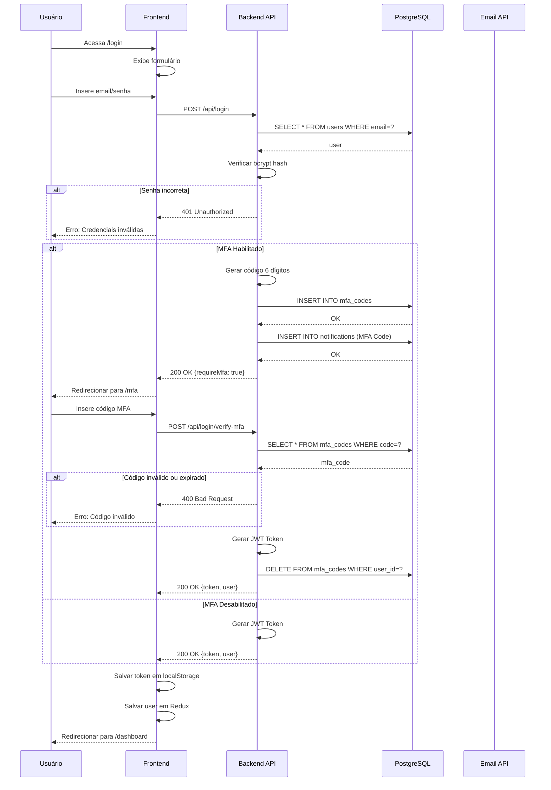

# Fluxo: Autenticação

## Descrição

O fluxo de autenticação na plataforma Amasso utiliza **JWT (JSON Web Tokens)** para manter sessões seguras. Opcionalmente, o usuário pode habilitar **MFA (Multi-Factor Authentication)** para maior segurança.

## Diagrama de Sequência



## Componentes Envolvidos

### 1. Frontend - Formulário de Login

```typescript
// frontend-react/src/pages/Auth/Login.tsx
import { useForm } from "react-hook-form";
import { useNavigate } from "react-router-dom";
import { authApi } from "@/services/api/authApi";
import { useAppDispatch } from "@/store/hooks";
import { setUser } from "@/store/slices/userSlice";

interface LoginForm {
  email: string;
  password: string;
}

export const Login = () => {
  const { register, handleSubmit } = useForm<LoginForm>();
  const navigate = useNavigate();
  const dispatch = useAppDispatch();
  
  const onSubmit = async (data: LoginForm) => {
    try {
      const response = await authApi.login(data);
      
      if (response.requireMfa) {
        // Redirecionar para MFA
        navigate("/auth/mfa", { 
          state: { email: data.email } 
        });
      } else {
        // Salvar token e usuário
        localStorage.setItem("token", response.token);
        dispatch(setUser(response.user));
        navigate("/dashboard");
      }
    } catch (error) {
      toast.error("Credenciais inválidas");
    }
  };
  
  return (
    <form onSubmit={handleSubmit(onSubmit)}>
      <input 
        type="email" 
        {...register("email", { required: true })} 
        placeholder="Email"
      />
      <input 
        type="password" 
        {...register("password", { required: true })} 
        placeholder="Senha"
      />
      <button type="submit">Entrar</button>
      
      <Link to="/auth/forgot-password">Esqueci minha senha</Link>
    </form>
  );
};
```

### 2. Backend - Endpoint de Login

```csharp
// backend-api/Endpoints/LoginEndpoints.cs
app.MapPost("/api/login", async (
    LoginDto dto,
    LoginService service,
    IHttpContextAccessor contextAccessor) =>
{
    var user = await service.ValidateCredentialsAsync(dto.Email, dto.Password);
    
    if (user == null)
        return Results.Unauthorized();
    
    // Verificar se MFA está habilitado
    var mfaEnabled = await service.IsMfaEnabledAsync(user.Id);
    
    if (mfaEnabled)
    {
        // Gerar código MFA
        var code = service.GenerateMfaCode();
        await service.SaveMfaCodeAsync(user.Id, code);
        
        // Enviar notificação
        await service.SendMfaNotificationAsync(user.Email, code);
        
        return Results.Ok(new
        {
            requireMfa = true,
            message = "Código MFA enviado para seu email"
        });
    }
    
    // Gerar token JWT
    var token = _tokenService.GenerateToken(user);
    
    return Results.Ok(new
    {
        token,
        user = new UserDto
        {
            Id = user.Id,
            Email = user.Email,
            FirstName = user.FirstName,
            LastName = user.LastName,
            Type = user.Type
        }
    });
})
.AllowAnonymous();
```

### 3. LoginService - Validação de Credenciais

```csharp
// backend-api/Services/LoginService.cs
public class LoginService
{
    private readonly ApplicationDbContext _context;
    private readonly IPasswordHasher<User> _passwordHasher;
    
    public async Task<User?> ValidateCredentialsAsync(string email, string password)
    {
        var user = await _context.Users
            .FirstOrDefaultAsync(u => u.Email.ToLower() == email.ToLower());
        
        if (user == null)
            return null;
        
        if (!user.IsActive)
            throw new InvalidOperationException("Conta inativa");
        
        // Verificar senha
        var result = _passwordHasher.VerifyHashedPassword(
            user, 
            user.PasswordHash, 
            password
        );
        
        if (result == PasswordVerificationResult.Failed)
            return null;
        
        return user;
    }
    
    public string GenerateMfaCode()
    {
        var random = new Random();
        return random.Next(100000, 999999).ToString();
    }
    
    public async Task SaveMfaCodeAsync(long userId, string code)
    {
        // Invalidar códigos anteriores
        var oldCodes = await _context.MfaCodes
            .Where(m => m.UserId == userId)
            .ToListAsync();
        
        _context.MfaCodes.RemoveRange(oldCodes);
        
        // Criar novo código
        var mfaCode = new MfaCode
        {
            UserId = userId,
            Code = code,
            ExpiresAt = DateTime.UtcNow.AddMinutes(5),
            CreatedAt = DateTime.UtcNow
        };
        
        await _context.MfaCodes.AddAsync(mfaCode);
        await _context.SaveChangesAsync();
    }
    
    public async Task SendMfaNotificationAsync(string email, string code)
    {
        var notification = new Notification
        {
            Type = NotificationTypeEnum.MfaCode,
            Channel = NotificationChannelEnum.Email,
            Email = email,
            MetadataJson = JsonSerializer.Serialize(new { Code = code }),
            CreatedAt = DateTime.UtcNow
        };
        
        await _context.Notifications.AddAsync(notification);
        await _context.SaveChangesAsync();
    }
}
```

### 4. TokenService - Geração de JWT

```csharp
// backend-api/Services/TokenService.cs
public class TokenService
{
    private readonly IConfiguration _configuration;
    
    public string GenerateToken(User user)
    {
        var claims = new List<Claim>
        {
            new Claim(ClaimTypes.NameIdentifier, user.Id.ToString()),
            new Claim(ClaimTypes.Email, user.Email),
            new Claim(ClaimTypes.Role, user.Type.ToString()),
            new Claim("FirstName", user.FirstName),
            new Claim("LastName", user.LastName)
        };
        
        var key = new SymmetricSecurityKey(
            Encoding.UTF8.GetBytes(_configuration["Jwt:SecretKey"])
        );
        
        var credentials = new SigningCredentials(key, SecurityAlgorithms.HmacSha256);
        
        var token = new JwtSecurityToken(
            issuer: _configuration["Jwt:Issuer"],
            audience: _configuration["Jwt:Audience"],
            claims: claims,
            expires: DateTime.UtcNow.AddHours(24),
            signingCredentials: credentials
        );
        
        return new JwtSecurityTokenHandler().WriteToken(token);
    }
}
```

### 5. Frontend - Verificação MFA

```typescript
// frontend-react/src/pages/Auth/MfaVerify.tsx
import { useLocation, useNavigate } from "react-router-dom";

export const MfaVerify = () => {
  const location = useLocation();
  const navigate = useNavigate();
  const dispatch = useAppDispatch();
  const [code, setCode] = useState("");
  
  const email = location.state?.email;
  
  const handleVerifyMfa = async () => {
    try {
      const response = await authApi.verifyMfa({ email, code });
      
      localStorage.setItem("token", response.token);
      dispatch(setUser(response.user));
      navigate("/dashboard");
    } catch (error) {
      toast.error("Código inválido ou expirado");
    }
  };
  
  return (
    <div>
      <h1>Verificação MFA</h1>
      <p>Digite o código de 6 dígitos enviado para {email}</p>
      
      <input 
        type="text" 
        maxLength={6}
        value={code}
        onChange={(e) => setCode(e.target.value)}
        placeholder="000000"
      />
      
      <button onClick={handleVerifyMfa}>
        Verificar
      </button>
      
      <button onClick={handleResendCode}>
        Reenviar código
      </button>
    </div>
  );
};
```

### 6. Backend - Verificação MFA

```csharp
// backend-api/Endpoints/MfaEndpoints.cs
app.MapPost("/api/login/verify-mfa", async (
    VerifyMfaDto dto,
    LoginService service,
    TokenService tokenService) =>
{
    var user = await _context.Users
        .FirstOrDefaultAsync(u => u.Email == dto.Email);
    
    if (user == null)
        return Results.Unauthorized();
    
    // Buscar código MFA
    var mfaCode = await _context.MfaCodes
        .FirstOrDefaultAsync(m => m.UserId == user.Id && 
                                  m.Code == dto.Code);
    
    if (mfaCode == null)
        return Results.BadRequest("Código inválido");
    
    if (mfaCode.ExpiresAt < DateTime.UtcNow)
        return Results.BadRequest("Código expirado");
    
    // Deletar código
    _context.MfaCodes.Remove(mfaCode);
    await _context.SaveChangesAsync();
    
    // Gerar token
    var token = tokenService.GenerateToken(user);
    
    return Results.Ok(new
    {
        token,
        user = new UserDto
        {
            Id = user.Id,
            Email = user.Email,
            FirstName = user.FirstName,
            LastName = user.LastName,
            Type = user.Type
        }
    });
})
.AllowAnonymous();
```

### 7. HTTP Client - Interceptor de Token

```typescript
// frontend-react/src/services/httpClient.ts
import axios from "axios";

export const httpClient = axios.create({
  baseURL: import.meta.env.VITE_API_URL,
  headers: {
    "Content-Type": "application/json"
  }
});

// Request interceptor - adicionar token
httpClient.interceptors.request.use(
  (config) => {
    const token = localStorage.getItem("token");
    if (token) {
      config.headers.Authorization = `Bearer ${token}`;
    }
    return config;
  },
  (error) => Promise.reject(error)
);

// Response interceptor - tratar erros de autenticação
httpClient.interceptors.response.use(
  (response) => response,
  (error) => {
    if (error.response?.status === 401) {
      // Token inválido ou expirado
      localStorage.removeItem("token");
      window.location.href = "/auth/login";
    }
    return Promise.reject(error);
  }
);
```

## Configuração JWT no Backend

### appsettings.json

```json
{
  "Jwt": {
    "SecretKey": "sua-chave-secreta-muito-forte-aqui-com-pelo-menos-32-caracteres",
    "Issuer": "Amasso.API",
    "Audience": "Amasso.Frontend",
    "ExpirationHours": 24
  }
}
```

### Program.cs

```csharp
// Configurar autenticação JWT
builder.Services.AddAuthentication(JwtBearerDefaults.AuthenticationScheme)
    .AddJwtBearer(options =>
    {
        options.TokenValidationParameters = new TokenValidationParameters
        {
            ValidateIssuer = true,
            ValidateAudience = true,
            ValidateLifetime = true,
            ValidateIssuerSigningKey = true,
            ValidIssuer = builder.Configuration["Jwt:Issuer"],
            ValidAudience = builder.Configuration["Jwt:Audience"],
            IssuerSigningKey = new SymmetricSecurityKey(
                Encoding.UTF8.GetBytes(builder.Configuration["Jwt:SecretKey"])
            ),
            ClockSkew = TimeSpan.Zero
        };
    });

builder.Services.AddAuthorization();

// ... no pipeline
app.UseAuthentication();
app.UseAuthorization();
```

## Segurança

### 1. Hash de Senha

```csharp
// Usar PasswordHasher do ASP.NET Core Identity
builder.Services.AddScoped<IPasswordHasher<User>, PasswordHasher<User>>();

// Ao criar usuário
var passwordHasher = serviceProvider.GetRequiredService<IPasswordHasher<User>>();
user.PasswordHash = passwordHasher.HashPassword(user, plainPassword);
```

### 2. Política de Senha

- Mínimo 8 caracteres
- Pelo menos 1 maiúscula
- Pelo menos 1 minúscula
- Pelo menos 1 número
- Pelo menos 1 caractere especial

### 3. Proteção contra Brute Force

```csharp
// Rate limiting com In-Memory Cache
private static readonly Dictionary<string, (int attempts, DateTime lockUntil)> _loginAttempts = new();

public async Task<User?> ValidateCredentialsAsync(string email, string password)
{
    var key = email.ToLower();
    
    // Verificar se está bloqueado
    if (_loginAttempts.TryGetValue(key, out var attempt) && 
        attempt.lockUntil > DateTime.UtcNow)
    {
        throw new InvalidOperationException(
            $"Conta bloqueada. Tente novamente em {(attempt.lockUntil - DateTime.UtcNow).TotalMinutes:F0} minutos"
        );
    }
    
    var user = await ValidateUser(email, password);
    
    if (user == null)
    {
        // Incrementar tentativas
        if (!_loginAttempts.ContainsKey(key))
            _loginAttempts[key] = (1, DateTime.MinValue);
        else
            _loginAttempts[key] = (_loginAttempts[key].attempts + 1, DateTime.MinValue);
        
        // Bloquear após 5 tentativas
        if (_loginAttempts[key].attempts >= 5)
        {
            _loginAttempts[key] = (0, DateTime.UtcNow.AddMinutes(15));
            throw new InvalidOperationException("Muitas tentativas. Conta bloqueada por 15 minutos");
        }
        
        return null;
    }
    
    // Limpar tentativas
    _loginAttempts.Remove(key);
    
    return user;
}
```

## Fluxos Relacionados

- [Cadastro de Usuário](cadastro-usuario.md)
- [Recuperação de Senha](../casos-de-uso/usuario-compra-video.md)

## Próximos Passos

- Implementar refresh tokens para maior segurança
- Adicionar logs de login/logout
- Implementar 2FA com autenticador (Google Authenticator)

