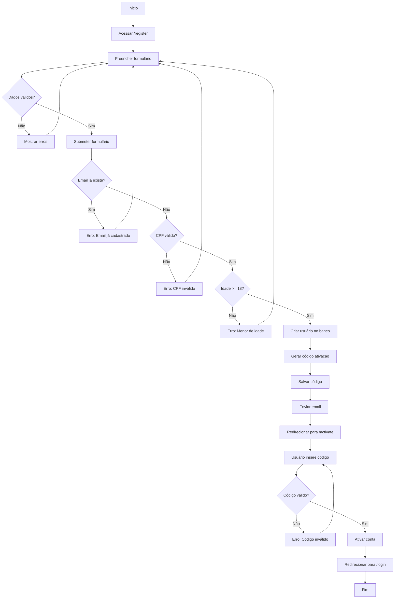

# Fluxo: Cadastro de Usuário

## Descrição

O fluxo de cadastro permite que novos usuários criem uma conta na plataforma Amasso. Após o cadastro, o usuário recebe um código de ativação por email para confirmar sua conta.

## Diagrama de Atividades



## Componentes Envolvidos

### 1. Frontend - Formulário de Cadastro

```typescript
// frontend-react/src/pages/Auth/Register.tsx
import { useForm } from "react-hook-form";
import { zodResolver } from "@hookform/resolvers/zod";
import { z } from "zod";
import { authApi } from "@/services/api/authApi";

const registerSchema = z.object({
  email: z.string().email("Email inválido"),
  password: z.string()
    .min(8, "Mínimo 8 caracteres")
    .regex(/[A-Z]/, "Precisa ter letra maiúscula")
    .regex(/[a-z]/, "Precisa ter letra minúscula")
    .regex(/[0-9]/, "Precisa ter número"),
  confirmPassword: z.string(),
  firstName: z.string().min(2, "Mínimo 2 caracteres"),
  lastName: z.string().min(2, "Mínimo 2 caracteres"),
  cpf: z.string().regex(/^\d{11}$/, "CPF inválido"),
  birthDate: z.string(),
  telephone: z.string().regex(/^\d{10,11}$/, "Telefone inválido"),
  acceptTerms: z.boolean().refine(val => val === true, "Aceite os termos")
}).refine(data => data.password === data.confirmPassword, {
  message: "Senhas não conferem",
  path: ["confirmPassword"]
}).refine(data => {
  const birthDate = new Date(data.birthDate);
  const age = new Date().getFullYear() - birthDate.getFullYear();
  return age >= 18;
}, {
  message: "Você precisa ter pelo menos 18 anos",
  path: ["birthDate"]
});

type RegisterForm = z.infer<typeof registerSchema>;

export const Register = () => {
  const { register, handleSubmit, formState: { errors } } = useForm<RegisterForm>({
    resolver: zodResolver(registerSchema)
  });
  const navigate = useNavigate();
  
  const onSubmit = async (data: RegisterForm) => {
    try {
      await authApi.register({
        email: data.email,
        password: data.password,
        firstName: data.firstName,
        lastName: data.lastName,
        cpf: data.cpf,
        birthDate: data.birthDate,
        telephone: data.telephone,
        type: UserTypeEnum.Default // ou Promoter/Influencer
      });
      
      toast.success("Cadastro realizado! Verifique seu email.");
      navigate("/auth/activate", { state: { email: data.email } });
    } catch (error: any) {
      if (error.response?.data?.message) {
        toast.error(error.response.data.message);
      } else {
        toast.error("Erro ao cadastrar");
      }
    }
  };
  
  return (
    <form onSubmit={handleSubmit(onSubmit)}>
      <input {...register("email")} placeholder="Email" />
      {errors.email && <span>{errors.email.message}</span>}
      
      <input type="password" {...register("password")} placeholder="Senha" />
      {errors.password && <span>{errors.password.message}</span>}
      
      <input type="password" {...register("confirmPassword")} placeholder="Confirmar Senha" />
      {errors.confirmPassword && <span>{errors.confirmPassword.message}</span>}
      
      <input {...register("firstName")} placeholder="Nome" />
      {errors.firstName && <span>{errors.firstName.message}</span>}
      
      <input {...register("lastName")} placeholder="Sobrenome" />
      {errors.lastName && <span>{errors.lastName.message}</span>}
      
      <input {...register("cpf")} placeholder="CPF (apenas números)" maxLength={11} />
      {errors.cpf && <span>{errors.cpf.message}</span>}
      
      <input type="date" {...register("birthDate")} />
      {errors.birthDate && <span>{errors.birthDate.message}</span>}
      
      <input {...register("telephone")} placeholder="Telefone (DDD + número)" />
      {errors.telephone && <span>{errors.telephone.message}</span>}
      
      <label>
        <input type="checkbox" {...register("acceptTerms")} />
        Aceito os termos de uso
      </label>
      {errors.acceptTerms && <span>{errors.acceptTerms.message}</span>}
      
      <button type="submit">Cadastrar</button>
      
      <Link to="/auth/login">Já tenho conta</Link>
    </form>
  );
};
```

### 2. Backend - Endpoint de Cadastro

```csharp
// backend-api/Endpoints/LoginEndpoints.cs
app.MapPost("/api/signup", async (
    SignUpDto dto,
    LoginService service,
    IPasswordHasher<User> passwordHasher,
    ApplicationDbContext context) =>
{
    // Validar se email já existe
    var emailExists = await context.Users
        .AnyAsync(u => u.Email.ToLower() == dto.Email.ToLower());
    
    if (emailExists)
        return Results.BadRequest("Email já cadastrado");
    
    // Validar CPF
    if (!CpfValidator.IsValid(dto.Cpf))
        return Results.BadRequest("CPF inválido");
    
    // Validar idade
    var age = DateTime.Today.Year - dto.BirthDate.Year;
    if (dto.BirthDate.Date > DateTime.Today.AddYears(-age)) age--;
    if (age < 18)
        return Results.BadRequest("Você precisa ter pelo menos 18 anos");
    
    // Criar usuário
    var user = new User
    {
        Email = dto.Email.ToLower(),
        FirstName = dto.FirstName,
        LastName = dto.LastName,
        Cpf = dto.Cpf,
        BirthDate = dto.BirthDate,
        Telephone = dto.Telephone,
        Type = dto.Type,
        IsActive = false, // Aguardando ativação
        CreatedAt = DateTime.UtcNow
    };
    
    // Hash da senha
    user.PasswordHash = passwordHasher.HashPassword(user, dto.Password);
    
    await context.Users.AddAsync(user);
    await context.SaveChangesAsync();
    
    // Gerar código de ativação
    var code = service.GenerateActivationCode();
    await service.SaveActivationCodeAsync(user.Id, code);
    
    // Enviar email
    await service.SendActivationEmailAsync(user.Email, code);
    
    return Results.Ok(new { message = "Cadastro realizado! Verifique seu email." });
})
.AllowAnonymous();
```

### 3. LoginService - Ativação

```csharp
// backend-api/Services/LoginService.cs
public string GenerateActivationCode()
{
    var random = new Random();
    return random.Next(100000, 999999).ToString();
}

public async Task SaveActivationCodeAsync(long userId, string code)
{
    var mfaCode = new MfaCode
    {
        UserId = userId,
        Code = code,
        ExpiresAt = DateTime.UtcNow.AddHours(24),
        CreatedAt = DateTime.UtcNow
    };
    
    await _context.MfaCodes.AddAsync(mfaCode);
    await _context.SaveChangesAsync();
}

public async Task SendActivationEmailAsync(string email, string code)
{
    var notification = new Notification
    {
        Type = NotificationTypeEnum.UserActivation,
        Channel = NotificationChannelEnum.Email,
        Email = email,
        MetadataJson = JsonSerializer.Serialize(new { Code = code }),
        CreatedAt = DateTime.UtcNow
    };
    
    await _context.Notifications.AddAsync(notification);
    await _context.SaveChangesAsync();
}

public async Task ActivateAccountAsync(string email, string code)
{
    var user = await _context.Users
        .FirstOrDefaultAsync(u => u.Email.ToLower() == email.ToLower());
    
    if (user == null)
        throw new InvalidOperationException("Usuário não encontrado");
    
    if (user.IsActive)
        throw new InvalidOperationException("Conta já ativada");
    
    var mfaCode = await _context.MfaCodes
        .FirstOrDefaultAsync(m => m.UserId == user.Id && m.Code == code);
    
    if (mfaCode == null)
        throw new InvalidOperationException("Código inválido");
    
    if (mfaCode.ExpiresAt < DateTime.UtcNow)
        throw new InvalidOperationException("Código expirado");
    
    // Ativar conta
    user.IsActive = true;
    user.UpdatedAt = DateTime.UtcNow;
    
    // Remover código
    _context.MfaCodes.Remove(mfaCode);
    
    await _context.SaveChangesAsync();
}
```

### 4. Frontend - Ativação de Conta

```typescript
// frontend-react/src/pages/Auth/Activate.tsx
export const Activate = () => {
  const location = useLocation();
  const navigate = useNavigate();
  const [code, setCode] = useState("");
  
  const email = location.state?.email || "";
  
  const handleActivate = async () => {
    try {
      await authApi.activate({ email, code });
      toast.success("Conta ativada com sucesso!");
      navigate("/auth/login");
    } catch (error: any) {
      toast.error(error.response?.data?.message || "Código inválido");
    }
  };
  
  const handleResendCode = async () => {
    try {
      await authApi.resendActivationCode({ email });
      toast.success("Código reenviado!");
    } catch (error) {
      toast.error("Erro ao reenviar código");
    }
  };
  
  return (
    <div>
      <h1>Ativar Conta</h1>
      <p>Digite o código de 6 dígitos enviado para {email}</p>
      
      <input 
        type="text" 
        maxLength={6}
        value={code}
        onChange={(e) => setCode(e.target.value)}
        placeholder="000000"
      />
      
      <button onClick={handleActivate}>
        Ativar Conta
      </button>
      
      <button onClick={handleResendCode}>
        Reenviar Código
      </button>
    </div>
  );
};
```

### 5. Validador de CPF

```csharp
// backend-api/Helpers/CpfValidator.cs
public static class CpfValidator
{
    public static bool IsValid(string cpf)
    {
        if (string.IsNullOrWhiteSpace(cpf))
            return false;
        
        cpf = cpf.Replace(".", "").Replace("-", "").Trim();
        
        if (cpf.Length != 11)
            return false;
        
        // Verificar se todos os dígitos são iguais
        if (cpf.Distinct().Count() == 1)
            return false;
        
        // Validar primeiro dígito
        var sum = 0;
        for (int i = 0; i < 9; i++)
            sum += int.Parse(cpf[i].ToString()) * (10 - i);
        
        var remainder = sum % 11;
        var digit1 = remainder < 2 ? 0 : 11 - remainder;
        
        if (int.Parse(cpf[9].ToString()) != digit1)
            return false;
        
        // Validar segundo dígito
        sum = 0;
        for (int i = 0; i < 10; i++)
            sum += int.Parse(cpf[i].ToString()) * (11 - i);
        
        remainder = sum % 11;
        var digit2 = remainder < 2 ? 0 : 11 - remainder;
        
        return int.Parse(cpf[10].ToString()) == digit2;
    }
}
```

## Validações

### Frontend
- Email formato válido
- Senha com requisitos mínimos
- Senhas coincidem
- CPF com 11 dígitos
- Telefone com 10-11 dígitos
- Data de nascimento (idade >= 18)
- Aceite de termos

### Backend
- Email único
- CPF válido (algoritmo)
- Idade mínima 18 anos
- Senha forte

## Template de Email

```html
<!-- email-api/wwwroot/Templates/UserActivation.html -->
<!DOCTYPE html>
<html>
<head>
    <meta charset="UTF-8">
    <title>Ative sua conta - Amasso</title>
</head>
<body>
    <div style="max-width: 600px; margin: 0 auto; padding: 20px;">
        <h1>Bem-vindo à Amasso!</h1>
        <p>Olá, seja bem-vindo à nossa plataforma!</p>
        <p>Para ativar sua conta, use o código abaixo:</p>
        
        <div style="background: #f0f0f0; padding: 20px; text-align: center; font-size: 32px; letter-spacing: 8px;">
            {{Code}}
        </div>
        
        <p>Este código expira em 24 horas.</p>
        <p>Se você não criou uma conta, ignore este email.</p>
        
        <hr>
        <p style="color: #999; font-size: 12px;">Amasso - Plataforma de Vídeos Exclusivos</p>
    </div>
</body>
</html>
```

## Regras de Negócio

1. **Email único**: Não pode haver dois usuários com mesmo email
2. **CPF válido**: Deve passar pela validação de dígitos verificadores
3. **Idade mínima**: 18 anos completos
4. **Código de ativação**: Válido por 24 horas
5. **Conta inativa**: Até ativar, não pode fazer login
6. **Reenvio de código**: Pode solicitar novo código
7. **Senha forte**: Mínimo 8 caracteres com letras e números

## Próximos Passos

- Veja [Fluxo de Autenticação](autenticacao.md) para login
- Consulte [Perfis de Usuário](../perfis-de-usuario/default.md)

