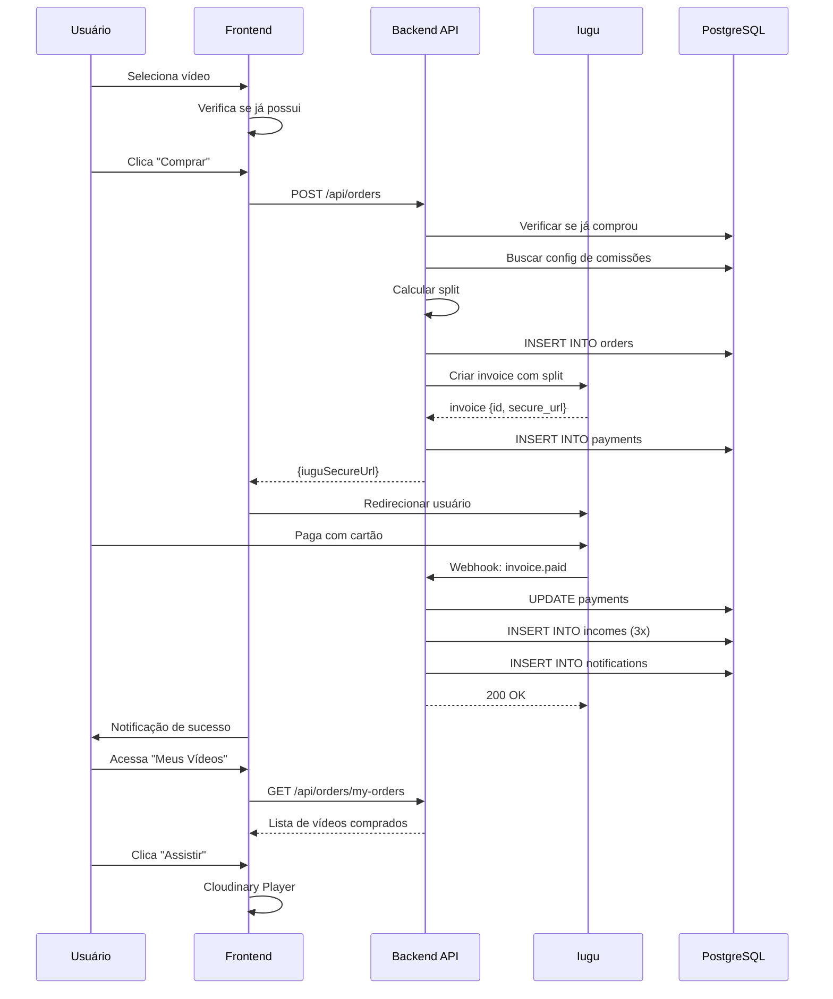

# Fluxo: Compra de Vídeo

## Descrição

O fluxo completo de compra de vídeo, desde a seleção até o acesso ao conteúdo após pagamento confirmado. Veja [Caso de Uso Completo](../casos-de-uso/usuario-compra-video.md) para detalhes aprofundados.

## Diagrama Simplificado



## Pontos-Chave

### 1. Validação de Compra Duplicada

```csharp
var alreadyPurchased = await _context.Orders
    .Include(o => o.Payment)
    .AnyAsync(o => o.UserId == userId && 
                  o.VideoId == videoId &&
                  o.Payment.Status == PaymentStatusEnum.Paid);

if (alreadyPurchased)
    throw new InvalidOperationException("Você já possui este vídeo");
```

### 2. Cálculo de Split

```csharp
var config = video.VideoRevenueConfig;
var totalCents = (int)(video.Price * 100);

var platformCents = (int)(totalCents * config.PlatformPercentage / 100);
var ownerCents = (int)(totalCents * config.OwnerPercentage / 100);
var promoterCents = (int)(totalCents * config.PromoterPercentage / 100);

// Ajustar arredondamento
var diff = totalCents - (platformCents + ownerCents + promoterCents);
if (diff != 0) ownerCents += diff;
```

### 3. Invoice Iugu com Split

```csharp
var splits = new List<IuguSplitRule>();

// Owner/Influencer
var owner = video.OwnerVideos.First().Owner;
splits.Add(new IuguSplitRule
{
    ReceiverAccountId = owner.IuguAccountId,
    AmountCents = ownerCents
});

// Promoter (se houver)
if (order.PromoterId.HasValue)
{
    var promoter = await _context.Owners.FindAsync(order.PromoterId);
    splits.Add(new IuguSplitRule
    {
        ReceiverAccountId = promoter.IuguAccountId,
        AmountCents = promoterCents
    });
}

var invoice = await _iuguService.CreateInvoiceAsync(new
{
    Email = user.Email,
    DueDateDays = 3,
    Items = new[] { new { Description = video.Title, PriceCents = totalCents } },
    PayerCpfCnpj = user.Cpf,
    PayerName = $"{user.FirstName} {user.LastName}",
    Splits = splits
});
```

### 4. Webhook de Confirmação

```csharp
if (webhook.Event == "invoice.status_changed" && webhook.Data.Status == "paid")
{
    await _paymentService.ConfirmPaymentAsync(webhook.Data.Id);
}
```

### 5. Criação de Incomes

```csharp
// 1. Plataforma
await _context.Incomes.AddAsync(new Income
{
    OrderId = order.Id,
    OwnerId = null, // NULL = plataforma
    Amount = order.PlatformAmount,
    Type = IncomeTypeEnum.Platform
});

// 2. Owner
await _context.Incomes.AddAsync(new Income
{
    OrderId = order.Id,
    OwnerId = owner.Id,
    Amount = order.OwnerAmount,
    Type = IncomeTypeEnum.Owner
});

// 3. Promoter (se houver)
if (order.PromoterId.HasValue)
{
    await _context.Incomes.AddAsync(new Income
    {
        OrderId = order.Id,
        OwnerId = order.PromoterId.Value,
        Amount = order.PromoterAmount,
        Type = IncomeTypeEnum.Promoter
    });
}
```

## Próximos Passos

- Veja [Caso de Uso Completo](../casos-de-uso/usuario-compra-video.md)
- Consulte [Split de Pagamento](../pagamentos/split-pagamento.md)
- Entenda [Webhooks Iugu](../pagamentos/webhooks.md)

