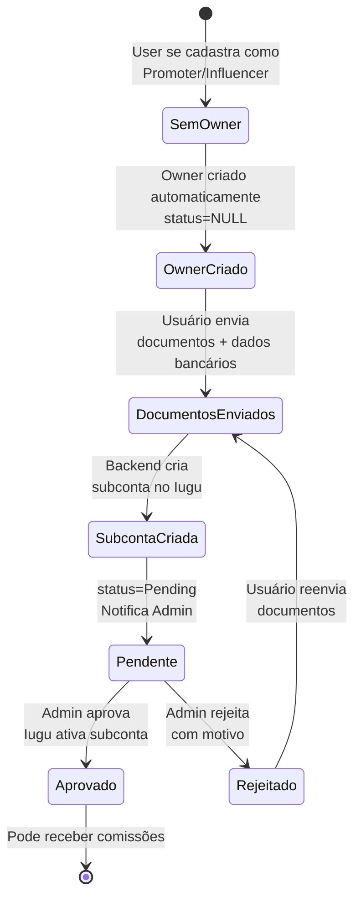

# Fluxo: KYC Promoter/Influencer

## Descrição

O fluxo de KYC (Know Your Customer) é obrigatório para Promoters e Influencers que desejam receber comissões. O processo envolve envio de documentos, criação de subconta Iugu e aprovação por um Admin.

## Diagrama de Estados



## Componentes Envolvidos

### 1. Frontend - Envio de Documentos

```typescript
// frontend-react/src/pages/Owner/KycSubmission.tsx
import { useForm } from "react-hook-form";
import { ownerApi } from "@/services/api/ownerApi";

interface KycForm {
  // Dados pessoais
  cpf: string;
  rg: string;
  birthDate: string;
  
  // Endereço
  addressStreet: string;
  addressNumber: string;
  addressComplement?: string;
  addressNeighborhood: string;
  addressCity: string;
  addressState: string;
  addressZipcode: string;
  
  // Dados bancários
  bankCode: string;
  bankAgency: string;
  bankAccount: string;
  bankAccountType: "corrente" | "poupanca";
  
  // Documentos
  cpfFile: FileList;
  rgFile: FileList;
  addressProofFile: FileList;
  selfieFile: FileList;
}

export const KycSubmission = () => {
  const { register, handleSubmit, formState: { errors } } = useForm<KycForm>();
  const [isSubmitting, setIsSubmitting] = useState(false);
  
  const onSubmit = async (data: KycForm) => {
    setIsSubmitting(true);
    
    try {
      const formData = new FormData();
      
      // Dados pessoais
      formData.append("cpf", data.cpf);
      formData.append("rg", data.rg);
      formData.append("birthDate", data.birthDate);
      
      // Endereço
      formData.append("addressStreet", data.addressStreet);
      formData.append("addressNumber", data.addressNumber);
      formData.append("addressComplement", data.addressComplement || "");
      formData.append("addressNeighborhood", data.addressNeighborhood);
      formData.append("addressCity", data.addressCity);
      formData.append("addressState", data.addressState);
      formData.append("addressZipcode", data.addressZipcode);
      
      // Dados bancários
      formData.append("bankCode", data.bankCode);
      formData.append("bankAgency", data.bankAgency);
      formData.append("bankAccount", data.bankAccount);
      formData.append("bankAccountType", data.bankAccountType);
      
      // Documentos
      formData.append("cpfFile", data.cpfFile[0]);
      formData.append("rgFile", data.rgFile[0]);
      formData.append("addressProofFile", data.addressProofFile[0]);
      formData.append("selfieFile", data.selfieFile[0]);
      
      await ownerApi.submitKyc(formData);
      
      toast.success("Documentos enviados com sucesso! Aguarde aprovação.");
      navigate("/dashboard");
    } catch (error) {
      toast.error("Erro ao enviar documentos");
    } finally {
      setIsSubmitting(false);
    }
  };
  
  return (
    <form onSubmit={handleSubmit(onSubmit)}>
      <h1>Envio de Documentos KYC</h1>
      
      <section>
        <h2>Dados Pessoais</h2>
        <input {...register("cpf", { required: true })} placeholder="CPF" />
        <input {...register("rg", { required: true })} placeholder="RG" />
        <input type="date" {...register("birthDate", { required: true })} />
      </section>
      
      <section>
        <h2>Endereço</h2>
        <input {...register("addressZipcode")} placeholder="CEP" />
        <input {...register("addressStreet")} placeholder="Rua" />
        <input {...register("addressNumber")} placeholder="Número" />
        <input {...register("addressComplement")} placeholder="Complemento" />
        <input {...register("addressNeighborhood")} placeholder="Bairro" />
        <input {...register("addressCity")} placeholder="Cidade" />
        <select {...register("addressState")}>
          <option value="SP">SP</option>
          <option value="RJ">RJ</option>
          {/* ... outros estados */}
        </select>
      </section>
      
      <section>
        <h2>Dados Bancários</h2>
        <input {...register("bankCode")} placeholder="Código do Banco" />
        <input {...register("bankAgency")} placeholder="Agência" />
        <input {...register("bankAccount")} placeholder="Conta" />
        <select {...register("bankAccountType")}>
          <option value="corrente">Corrente</option>
          <option value="poupanca">Poupança</option>
        </select>
      </section>
      
      <section>
        <h2>Documentos</h2>
        <label>
          CPF (frente e verso):
          <input type="file" accept="image/*,application/pdf" {...register("cpfFile", { required: true })} />
        </label>
        
        <label>
          RG (frente e verso):
          <input type="file" accept="image/*,application/pdf" {...register("rgFile", { required: true })} />
        </label>
        
        <label>
          Comprovante de Endereço:
          <input type="file" accept="image/*,application/pdf" {...register("addressProofFile", { required: true })} />
        </label>
        
        <label>
          Selfie com Documento:
          <input type="file" accept="image/*" {...register("selfieFile", { required: true })} />
        </label>
      </section>
      
      <button type="submit" disabled={isSubmitting}>
        {isSubmitting ? "Enviando..." : "Enviar Documentos"}
      </button>
    </form>
  );
};
```

### 2. Backend - Recebimento de Documentos

Já documentado em [Processo KYC](../pagamentos/processo-kyc.md), mas segue resumo:

```csharp
// backend-api/Endpoints/OwnerEndpoints.cs
app.MapPost("/api/owners/kyc", async (
    HttpRequest request,
    OwnerService service,
    ICloudinaryService cloudinary,
    IIuguService iugu) =>
{
    var userId = GetUserIdFromToken(request);
    var form = await request.ReadFormAsync();
    
    // Upload documentos para Cloudinary
    var cpfUrl = await cloudinary.UploadAsync(form.Files["cpfFile"]);
    var rgUrl = await cloudinary.UploadAsync(form.Files["rgFile"]);
    var addressProofUrl = await cloudinary.UploadAsync(form.Files["addressProofFile"]);
    var selfieUrl = await cloudinary.UploadAsync(form.Files["selfieFile"]);
    
    var dto = new SubmitKycDto
    {
        Cpf = form["cpf"],
        Rg = form["rg"],
        BirthDate = DateTime.Parse(form["birthDate"]),
        AddressStreet = form["addressStreet"],
        AddressNumber = form["addressNumber"],
        AddressComplement = form["addressComplement"],
        AddressNeighborhood = form["addressNeighborhood"],
        AddressCity = form["addressCity"],
        AddressState = form["addressState"],
        AddressZipcode = form["addressZipcode"],
        BankCode = form["bankCode"],
        BankAgency = form["bankAgency"],
        BankAccount = form["bankAccount"],
        BankAccountType = form["bankAccountType"],
        DocumentCpfUrl = cpfUrl,
        DocumentRgUrl = rgUrl,
        DocumentAddressProofUrl = addressProofUrl,
        DocumentSelfieUrl = selfieUrl
    };
    
    await service.SubmitKycAsync(userId, dto, iugu);
    
    return Results.Ok(new { message = "KYC enviado com sucesso!" });
})
.RequireAuthorization()
.DisableAntiforgery();
```

### 3. OwnerService - Processamento KYC

```csharp
// backend-api/Services/OwnerService.cs
public async Task SubmitKycAsync(long userId, SubmitKycDto dto, IIuguService iugu)
{
    var owner = await _context.Owners
        .Include(o => o.User)
        .FirstOrDefaultAsync(o => o.UserId == userId);
    
    if (owner == null)
    {
        // Criar owner se não existe
        owner = new Owner
        {
            UserId = userId,
            Type = OwnerTypeEnum.Promoter, // ou Influencer
            CreatedAt = DateTime.UtcNow
        };
        
        await _context.Owners.AddAsync(owner);
        await _context.SaveChangesAsync();
    }
    
    // Atualizar dados
    owner.CpfCnpj = dto.Cpf;
    owner.Rg = dto.Rg;
    owner.BirthDate = dto.BirthDate;
    owner.AddressStreet = dto.AddressStreet;
    owner.AddressNumber = dto.AddressNumber;
    owner.AddressComplement = dto.AddressComplement;
    owner.AddressNeighborhood = dto.AddressNeighborhood;
    owner.AddressCity = dto.AddressCity;
    owner.AddressState = dto.AddressState;
    owner.AddressZipcode = dto.AddressZipcode;
    owner.BankCode = dto.BankCode;
    owner.BankAgency = dto.BankAgency;
    owner.BankAccount = dto.BankAccount;
    owner.BankAccountType = dto.BankAccountType;
    owner.DocumentCpfUrl = dto.DocumentCpfUrl;
    owner.DocumentRgUrl = dto.DocumentRgUrl;
    owner.DocumentAddressProofUrl = dto.DocumentAddressProofUrl;
    owner.DocumentSelfieUrl = dto.DocumentSelfieUrl;
    
    // Criar ou atualizar subconta Iugu
    if (string.IsNullOrEmpty(owner.IuguAccountId))
    {
        var subAccount = await iugu.CreateSubAccountAsync(owner);
        owner.IuguAccountId = subAccount.AccountId;
    }
    else
    {
        await iugu.UpdateSubAccountAsync(owner);
    }
    
    owner.SubAccountStatus = OwnerSubAccountStatusEnum.Pending;
    owner.UpdatedAt = DateTime.UtcNow;
    
    await _context.SaveChangesAsync();
    
    // Notificar admin
    await _notificationService.NotifyAdminKycPendingAsync(owner.Id);
}
```

### 4. Admin - Lista de KYC Pendentes

```typescript
// frontend-react/src/pages/Admin/KycApprovals.tsx
export const KycApprovals = () => {
  const { data: pendingKyc } = useQuery({
    queryKey: ["pending-kyc"],
    queryFn: async () => {
      const response = await adminApi.getPendingKyc();
      return response.data;
    }
  });
  
  const handleApprove = async (ownerId: number) => {
    if (!confirm("Aprovar este KYC?")) return;
    
    try {
      await adminApi.approveKyc(ownerId);
      toast.success("KYC aprovado!");
      queryClient.invalidateQueries(["pending-kyc"]);
    } catch (error) {
      toast.error("Erro ao aprovar KYC");
    }
  };
  
  const handleReject = async (ownerId: number) => {
    const reason = prompt("Motivo da rejeição:");
    if (!reason) return;
    
    try {
      await adminApi.rejectKyc(ownerId, { reason });
      toast.success("KYC rejeitado");
      queryClient.invalidateQueries(["pending-kyc"]);
    } catch (error) {
      toast.error("Erro ao rejeitar KYC");
    }
  };
  
  return (
    <Table>
      <thead>
        <tr>
          <th>Usuário</th>
          <th>Tipo</th>
          <th>CPF</th>
          <th>Enviado em</th>
          <th>Ações</th>
        </tr>
      </thead>
      <tbody>
        {pendingKyc?.map(kyc => (
          <tr key={kyc.id}>
            <td>{kyc.userName}</td>
            <td>{kyc.type}</td>
            <td>{kyc.cpf}</td>
            <td>{format(kyc.updatedAt, "dd/MM/yyyy HH:mm")}</td>
            <td>
              <Button onClick={() => handleViewDocuments(kyc.id)}>
                Ver Documentos
              </Button>
              <Button color="green" onClick={() => handleApprove(kyc.id)}>
                Aprovar
              </Button>
              <Button color="red" onClick={() => handleReject(kyc.id)}>
                Rejeitar
              </Button>
            </td>
          </tr>
        ))}
      </tbody>
    </Table>
  );
};
```

### 5. Admin - Aprovação de KYC

```csharp
// backend-api/Services/Admin/AdminService.cs
public async Task ApproveKycAsync(long ownerId, long adminUserId)
{
    var owner = await _context.Owners
        .Include(o => o.User)
        .FirstAsync(o => o.Id == ownerId);
    
    if (owner.SubAccountStatus != OwnerSubAccountStatusEnum.Pending)
        throw new InvalidOperationException("KYC não está pendente");
    
    // Ativar subconta no Iugu
    await _iuguService.VerifySubAccountAsync(owner.IuguAccountId);
    
    owner.SubAccountStatus = OwnerSubAccountStatusEnum.Approved;
    owner.UpdatedAt = DateTime.UtcNow;
    
    await _context.SaveChangesAsync();
    
    // Notificar usuário
    var notification = new Notification
    {
        Type = NotificationTypeEnum.KycApproved,
        Channel = owner.User.NotificationPreference ?? NotificationChannelEnum.Email,
        Email = owner.User.Email,
        Phone = owner.User.Telephone,
        MetadataJson = JsonSerializer.Serialize(new
        {
            OwnerType = owner.Type.ToString()
        }),
        CreatedAt = DateTime.UtcNow
    };
    
    await _context.Notifications.AddAsync(notification);
    await _context.SaveChangesAsync();
}
```

## Documentos Necessários

1. **CPF**: Frente e verso (imagem ou PDF)
2. **RG**: Frente e verso (imagem ou PDF)
3. **Comprovante de Endereço**: Máximo 3 meses (imagem ou PDF)
4. **Selfie com Documento**: Foto segurando o documento (imagem)

## Validações

- Todos os 4 documentos são obrigatórios
- Imagens devem estar legíveis
- Endereço deve estar completo
- Dados bancários devem ser válidos
- CPF deve ser válido

## Regras de Negócio

1. **Obrigatório para comissões**: Sem KYC aprovado, não recebe
2. **Subconta Iugu**: Criada ao enviar documentos
3. **Aprovação manual**: Admin analisa e aprova/rejeita
4. **Reenvio permitido**: Pode reenviar após rejeição
5. **Notificações**: Usuário notificado em cada mudança de status

## Próximos Passos

- Veja [Conta Master e Subcontas](../pagamentos/conta-master-subcontas.md)
- Consulte [Perfil Promoter](../perfis-de-usuario/promoter.md)
- Entenda [Perfil Influencer](../perfis-de-usuario/influencer.md)

