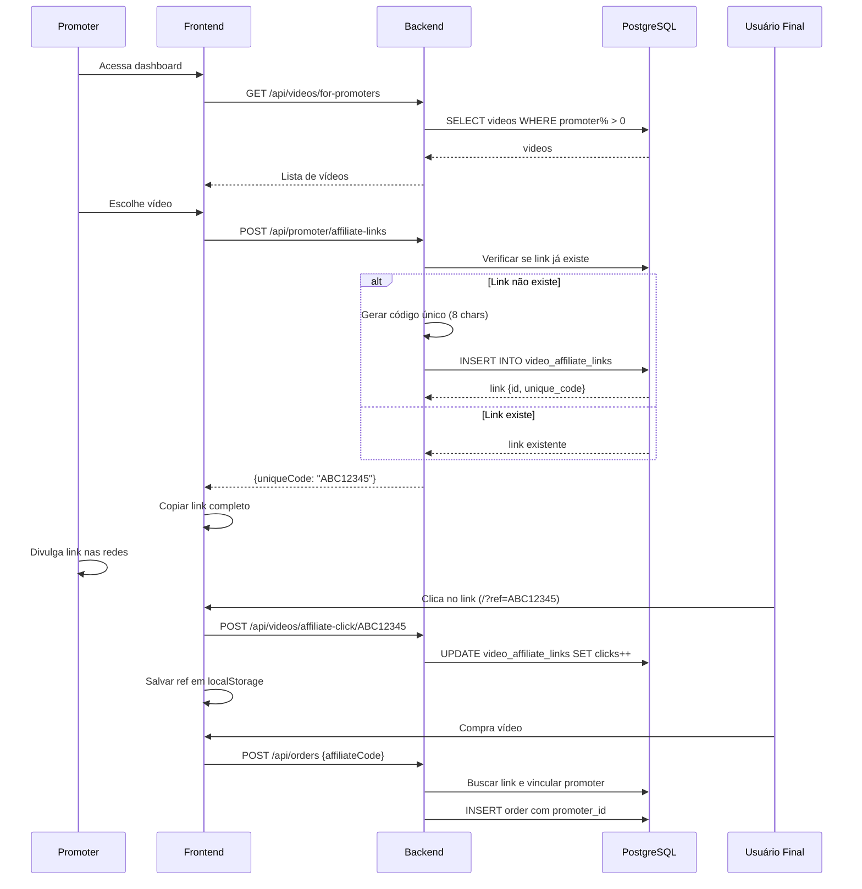

# Fluxo: Link de Afiliado

## Descrição

Promoters podem gerar links exclusivos para divulgar vídeos e receber comissões. O link rastreia cliques e conversões.

## Diagrama de Fluxo



## Componentes Principais

### 1. Gerar Link

```typescript
const handleCreateLink = async (videoId: number) => {
  const response = await promoterApi.createAffiliateLink({ videoId });
  const fullLink = `${window.location.origin}/videos/${videoId}?ref=${response.data.uniqueCode}`;
  
  navigator.clipboard.writeText(fullLink);
  toast.success("Link copiado!");
};
```

```csharp
app.MapPost("/api/promoter/affiliate-links", async (CreateAffiliateLinkDto dto, ...) =>
{
    // Verificar KYC aprovado
    if (owner.SubAccountStatus != OwnerSubAccountStatusEnum.Approved)
        return Results.BadRequest("KYC não aprovado");
    
    // Verificar se vídeo tem comissão
    if (video.VideoRevenueConfig.PromoterPercentage <= 0)
        return Results.BadRequest("Vídeo sem comissão para promoters");
    
    // Criar link
    var link = new VideoAffiliateLink
    {
        OwnerId = owner.Id,
        VideoId = dto.VideoId,
        UniqueCode = GenerateUniqueCode(),
        Clicks = 0,
        CreatedAt = DateTime.UtcNow
    };
    
    await _context.AddAsync(link);
    await _context.SaveChangesAsync();
    
    return Results.Ok(link);
});
```

### 2. Rastrear Clique

```typescript
useEffect(() => {
  const ref = new URLSearchParams(window.location.search).get("ref");
  if (ref) {
    localStorage.setItem("affiliateRef", ref);
    videoApi.trackAffiliateClick(ref);
  }
}, []);
```

```csharp
app.MapPost("/api/videos/affiliate-click/{code}", async (string code, ...) =>
{
    var link = await _context.VideoAffiliateLinks
        .FirstOrDefaultAsync(l => l.UniqueCode == code);
    
    if (link != null)
    {
        link.Clicks++;
        await _context.SaveChangesAsync();
    }
    
    return Results.Ok();
}).AllowAnonymous();
```

### 3. Vincular na Compra

```typescript
const handleCheckout = async () => {
  const affiliateCode = localStorage.getItem("affiliateRef");
  
  const order = await orderApi.create({
    videoId,
    affiliateCode // Envia o código
  });
  
  window.location.href = order.payment.iuguSecureUrl;
};
```

```csharp
public async Task<Order> CreateOrderAsync(CreateOrderDto dto, long userId)
{
    // ... criar order
    
    if (!string.IsNullOrEmpty(dto.AffiliateCode))
    {
        var link = await _context.VideoAffiliateLinks
            .Include(l => l.Owner)
            .FirstOrDefaultAsync(l => l.UniqueCode == dto.AffiliateCode);
        
        if (link != null && link.Owner.SubAccountStatus == OwnerSubAccountStatusEnum.Approved)
        {
            order.PromoterId = link.OwnerId;
            order.VideoAffiliateLinkId = link.Id;
            order.PromoterAmount = (int)(order.Amount * video.VideoRevenueConfig.PromoterPercentage / 100);
        }
    }
    
    return order;
}
```

## Formato do Link

```
https://amasso.com/videos/123?ref=ABC12345
```

- `123` = ID do vídeo
- `ABC12345` = Código único do link (8 caracteres alfanuméricos)

## Dashboard de Links

```typescript
const { data: links } = useQuery({
  queryKey: ["my-affiliate-links"],
  queryFn: async () => {
    const response = await promoterApi.getAffiliateLinks();
    return response.data;
  }
});

return (
  <Table>
    <thead>
      <tr>
        <th>Vídeo</th>
        <th>Código</th>
        <th>Cliques</th>
        <th>Conversões</th>
        <th>Taxa</th>
        <th>Comissão Total</th>
      </tr>
    </thead>
    <tbody>
      {links.map(link => (
        <tr key={link.id}>
          <td>{link.videoTitle}</td>
          <td>{link.uniqueCode}</td>
          <td>{link.clicks}</td>
          <td>{link.conversions}</td>
          <td>{link.conversionRate.toFixed(2)}%</td>
          <td>R$ {link.totalCommission.toFixed(2)}</td>
        </tr>
      ))}
    </tbody>
  </Table>
);
```

## Regras de Negócio

1. **KYC aprovado**: Apenas promoters com KYC aprovado podem gerar links
2. **Comissão > 0%**: Apenas vídeos com `promoter_percentage > 0`
3. **Link único por vídeo**: Cada promoter tem 1 link por vídeo
4. **Código de 8 caracteres**: Alfanumérico, maiúsculas
5. **Rastreamento de cliques**: Incrementado a cada acesso
6. **localStorage**: Código salvo no navegador do usuário
7. **Validade**: Link válido enquanto vídeo estiver disponível para venda

## Métricas

- **Cliques**: Total de acessos ao link
- **Conversões**: Total de compras via link
- **Taxa de conversão**: (Conversões / Cliques) * 100
- **Comissão total**: Soma de todas as comissões geradas

## Próximos Passos

- Veja [Perfil Promoter](../perfis-de-usuario/promoter.md)
- Consulte [Caso de Uso: Promoter Gera Link](../casos-de-uso/promoter-gera-link.md)
- Entenda [Comissões](comissoes.md)

