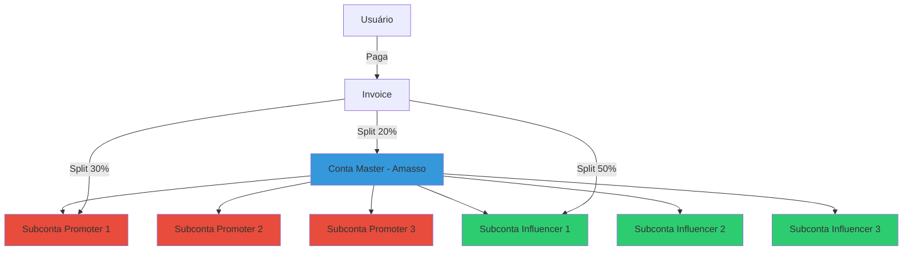
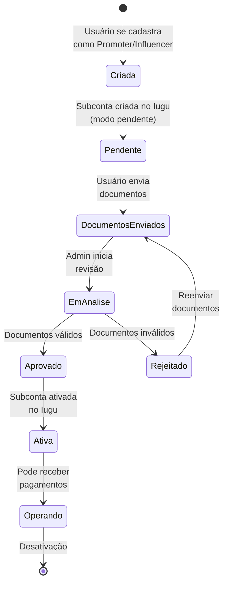

# Conta Master e Subcontas

## Arquitetura de Contas

O modelo de conta master + subcontas do Iugu é fundamental para o funcionamento do Amasso como marketplace.



## Conta Master (Plataforma)

### Características
- **Proprietário**: Empresa Amasso
- **Responsabilidade**: Centralizar pagamentos e distribuir
- **Recebe**: Sua porcentagem configurada (ex: 20%)
- **Gerencia**: Todas as subcontas vinculadas

### Responsabilidades
1. **Receber Pagamentos**: Todos os pagamentos passam pela master
2. **Distribuir via Split**: Automático no momento do pagamento
3. **Criar Subcontas**: Para novos Promoters/Influencers
4. **Aprovar KYC**: Validar documentação
5. **Compliance**: Garantir conformidade legal

### Configuração
```csharp
// appsettings.json
{
  "Iugu": {
    "ApiToken": "SEU_TOKEN_AQUI",
    "MasterAccountId": "ID_DA_CONTA_MASTER",
    "WebhookSecret": "SECRET_PARA_VALIDAR_WEBHOOKS"
  }
}
```

### Acesso ao Dashboard
A conta master acessa o dashboard administrativo do Iugu:
- Visualizar todas as transações
- Gerenciar subcontas
- Configurar webhooks
- Extratos e relatórios
- Saques para conta bancária

## Subcontas (Promoters e Influencers)

### Características
- **Vinculadas**: Sempre ligadas à conta master
- **Autônomas**: Podem gerenciar seus próprios dados
- **Recebem Automaticamente**: Via split de pagamento
- **Requerem KYC**: Obrigatório para operação

### Quando Criar
Uma subconta é criada quando:
1. Promoter se cadastra
2. Influencer se cadastra
3. Status inicial: **Pendente**
4. Aguarda envio de documentos
5. Admin aprova KYC
6. Status muda para: **Aprovado**
7. Subconta é ativada no Iugu

### Mapeamento no Banco de Dados

```sql
-- Tabela owners armazena dados da subconta
CREATE TABLE owners (
    id BIGSERIAL PRIMARY KEY,
    user_id BIGINT REFERENCES users(id),
    type VARCHAR(50), -- Influencer, Promoter, Partner, Agent, Other
    
    -- Subconta Iugu
    iugu_account_id VARCHAR(100), -- ID da subconta no Iugu
    sub_account_status VARCHAR(20), -- Pendente, Aprovado, Rejeitado
    
    -- Dados pessoais (KYC)
    cpf_cnpj VARCHAR(20),
    rg VARCHAR(20),
    birth_date DATE,
    address_street VARCHAR(200),
    address_number VARCHAR(20),
    address_city VARCHAR(100),
    address_state VARCHAR(2),
    address_zipcode VARCHAR(10),
    
    -- Dados bancários
    bank_code VARCHAR(10),
    bank_agency VARCHAR(10),
    bank_account VARCHAR(20),
    bank_account_type VARCHAR(20), -- corrente, poupança
    
    -- Documentos
    document_cpf_url TEXT,
    document_rg_url TEXT,
    document_address_proof_url TEXT,
    document_selfie_url TEXT,
    
    -- Auditoria
    created_at TIMESTAMP,
    updated_at TIMESTAMP
);
```

## Ciclo de Vida de uma Subconta



## Criação de Subconta

### 1. Usuário Se Cadastra

```csharp
// UserService.cs
public async Task<User> CreatePromoterAsync(CreateUserDto dto)
{
    // Criar User
    var user = new User
    {
        Email = dto.Email,
        Type = UserTypeEnum.Promoter,
        // ... outros campos
    };
    
    await _context.Users.AddAsync(user);
    await _context.SaveChangesAsync();
    
    // Criar Owner (ainda sem subconta)
    var owner = new Owner
    {
        UserId = user.Id,
        Type = OwnerTypeEnum.Promoter,
        SubAccountStatus = OwnerSubAccountStatusEnum.Pending,
        // ... outros campos
    };
    
    await _context.Owners.AddAsync(owner);
    await _context.SaveChangesAsync();
    
    return user;
}
```

### 2. Criação da Subconta no Iugu

Quando o usuário envia os documentos:

```csharp
// OwnerService.cs
public async Task SubmitKycDocumentsAsync(long ownerId, KycDocumentsDto dto)
{
    var owner = await _context.Owners.FindAsync(ownerId);
    
    // Salvar documentos
    owner.DocumentCpfUrl = dto.CpfUrl;
    owner.DocumentRgUrl = dto.RgUrl;
    owner.DocumentAddressProofUrl = dto.AddressProofUrl;
    owner.DocumentSelfieUrl = dto.SelfieUrl;
    
    // Criar subconta no Iugu (se ainda não existe)
    if (string.IsNullOrEmpty(owner.IuguAccountId))
    {
        var subAccount = await _iuguService.CreateSubAccountAsync(new CreateSubAccountDto
        {
            Name = owner.User.Fullname,
            Email = owner.User.Email,
            Cpf = owner.CpfCnpj,
            Address = new AddressDto
            {
                Street = owner.AddressStreet,
                Number = owner.AddressNumber,
                City = owner.AddressCity,
                State = owner.AddressState,
                ZipCode = owner.AddressZipcode
            },
            BankAccount = new BankAccountDto
            {
                BankCode = owner.BankCode,
                Agency = owner.BankAgency,
                Account = owner.BankAccount,
                AccountType = owner.BankAccountType
            }
        });
        
        owner.IuguAccountId = subAccount.AccountId;
    }
    
    owner.SubAccountStatus = OwnerSubAccountStatusEnum.Pending;
    await _context.SaveChangesAsync();
    
    // Notificar admin para revisar
    await _notificationService.NotifyAdminKycPendingAsync(ownerId);
}
```

### 3. Chamada à API do Iugu

```csharp
// IuguService.cs
public async Task<IuguSubAccountDto> CreateSubAccountAsync(CreateSubAccountDto dto)
{
    var request = new
    {
        name = dto.Name,
        email = dto.Email,
        cpf_cnpj = dto.Cpf,
        address = new
        {
            street = dto.Address.Street,
            number = dto.Address.Number,
            city = dto.Address.City,
            state = dto.Address.State,
            zip_code = dto.Address.ZipCode
        },
        bank_account = new
        {
            bank = dto.BankAccount.BankCode,
            bank_ag = dto.BankAccount.Agency,
            account_type = dto.BankAccount.AccountType,
            bank_cc = dto.BankAccount.Account
        },
        // Criar em modo de verificação pendente
        auto_verify = false
    };
    
    var response = await _httpClient.PostAsJsonAsync(
        "https://api.iugu.com/v1/marketplace/create_account",
        request
    );
    
    response.EnsureSuccessStatusCode();
    
    var result = await response.Content.ReadFromJsonAsync<IuguSubAccountResponse>();
    
    return new IuguSubAccountDto
    {
        AccountId = result.account_id,
        LiveApiToken = result.live_api_token,
        TestApiToken = result.test_api_token
    };
}
```

## Ativação de Subconta

Após admin aprovar o KYC:

```csharp
// AdminService.cs
public async Task ApproveKycAsync(long ownerId)
{
    var owner = await _context.Owners
        .Include(o => o.User)
        .FirstAsync(o => o.Id == ownerId);
    
    if (owner.SubAccountStatus != OwnerSubAccountStatusEnum.Pending)
        throw new InvalidOperationException("KYC não está pendente");
    
    // Ativar subconta no Iugu
    await _iuguService.VerifySubAccountAsync(owner.IuguAccountId);
    
    // Atualizar status
    owner.SubAccountStatus = OwnerSubAccountStatusEnum.Approved;
    owner.UpdatedAt = DateTime.UtcNow;
    
    await _context.SaveChangesAsync();
    
    // Notificar usuário
    await _notificationService.NotifyKycApprovedAsync(ownerId);
}
```

```csharp
// IuguService.cs
public async Task VerifySubAccountAsync(string accountId)
{
    var request = new
    {
        // Campos necessários para verificação
        data = new
        {
            price_range = "Até R$ 50.000",
            physical_products = false,
            business_type = "Services",
            person_type = "Pessoa Física",
            automatic_transfer = true
        }
    };
    
    var response = await _httpClient.PostAsJsonAsync(
        $"https://api.iugu.com/v1/accounts/{accountId}/request_verification",
        request
    );
    
    response.EnsureSuccessStatusCode();
}
```

## Gestão de Subcontas

### Listar Subcontas Pendentes

```csharp
// AdminService.cs
public async Task<List<OwnerDto>> GetPendingKycAsync()
{
    return await _context.Owners
        .Include(o => o.User)
        .Where(o => o.SubAccountStatus == OwnerSubAccountStatusEnum.Pending)
        .Select(o => new OwnerDto
        {
            Id = o.Id,
            Name = o.User.Fullname,
            Email = o.User.Email,
            Type = o.Type.ToString(),
            Status = o.SubAccountStatus.ToString(),
            DocumentsSubmitted = !string.IsNullOrEmpty(o.DocumentCpfUrl)
        })
        .ToListAsync();
}
```

### Consultar Status no Iugu

```csharp
public async Task<IuguAccountStatusDto> GetSubAccountStatusAsync(string accountId)
{
    var response = await _httpClient.GetAsync(
        $"https://api.iugu.com/v1/accounts/{accountId}"
    );
    
    response.EnsureSuccessStatusCode();
    
    var result = await response.Content.ReadFromJsonAsync<IuguAccountResponse>();
    
    return new IuguAccountStatusDto
    {
        AccountId = result.id,
        Name = result.name,
        IsVerified = result.is_verified,
        CanReceive = result.can_receive,
        Balance = result.balance_cents / 100m
    };
}
```

## Vantagens do Modelo

### Para a Plataforma (Amasso)
- ✅ Centralização de pagamentos
- ✅ Controle total sobre transações
- ✅ Compliance simplificado
- ✅ Visibilidade de todas as operações

### Para Promoters/Influencers
- ✅ Recebimento automático (split)
- ✅ Transparência nos valores
- ✅ Sem intermediários
- ✅ Dashboard próprio no Iugu
- ✅ Saque direto para conta bancária

### Para Usuários Finais
- ✅ Pagamento simples e seguro
- ✅ Múltiplos métodos (cartão, boleto, Pix)
- ✅ Confirmação em tempo real

## Próximos Passos

- Entenda o [Processo KYC](processo-kyc.md) em detalhes
- Veja como funciona o [Split de Pagamento](split-pagamento.md)
- Configure [Webhooks](webhooks.md) para notificações

