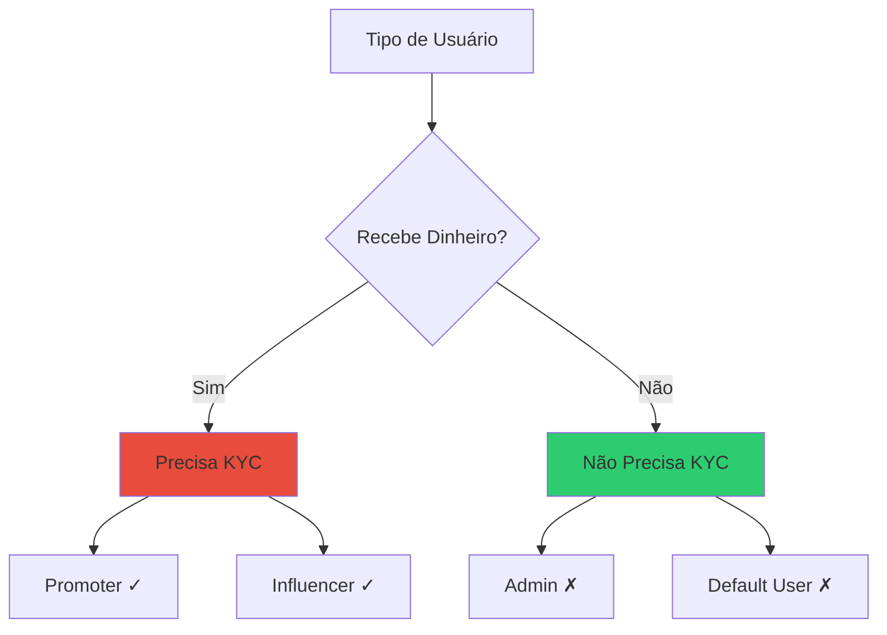
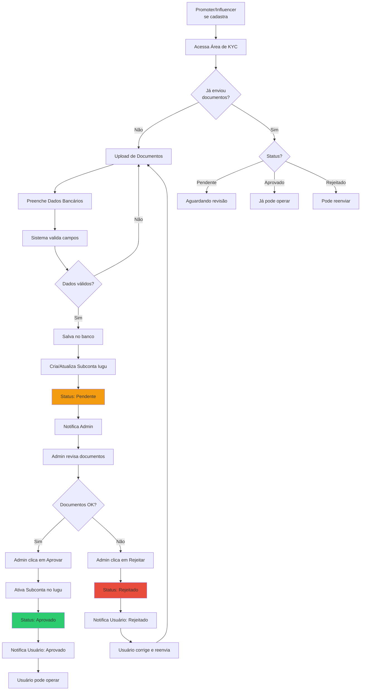

# Processo KYC

## O que é KYC?

**KYC** significa **Know Your Customer** (Conheça Seu Cliente). É um processo de verificação de identidade exigido por lei para instituições financeiras e empresas que lidam com transações monetárias.

## Por que é Necessário?

### Regulamentação
- **Lei de Prevenção à Lavagem de Dinheiro**: Exige identificação de quem recebe dinheiro
- **Banco Central do Brasil**: Normas para operações financeiras
- **Iugu**: Requisito para ativar subcontas que receberão pagamentos

### Segurança
- Previne fraudes
- Protege a plataforma
- Garante legitimidade das transações
- Cria confiança no ecossistema

## Quem Precisa Passar pelo KYC?



### Promoter (Precisa)
- Recebe comissão por vendas através de links de afiliado
- Tem subconta Iugu
- Deve ter KYC aprovado antes de gerar links

### Influencer (Precisa)
- Recebe comissão quando seus vídeos são vendidos
- Tem subconta Iugu
- Deve ter KYC aprovado antes de receber

### Admin (Não Precisa)
- Não recebe dinheiro de vendas
- Gerencia a plataforma
- Sem subconta Iugu

### Default User (Não Precisa)
- Apenas compra vídeos
- Não recebe comissões
- Sem subconta Iugu

## Documentos Necessários

### Pessoa Física

| Documento | Obrigatório | Formato | Descrição |
|-----------|-------------|---------|-----------|
| **CPF** | ✓ | PDF/IMG | Comprovante de inscrição no CPF |
| **RG ou CNH** | ✓ | PDF/IMG | Documento de identidade com foto |
| **Comprovante de Residência** | ✓ | PDF/IMG | Recente (máx 90 dias) |
| **Selfie com Documento** | ✓ | IMG | Foto segurando RG/CNH |
| **Dados Bancários** | ✓ | Form | Banco, agência, conta corrente/poupança |

### Pessoa Jurídica (CNPJ)

| Documento | Obrigatório | Formato | Descrição |
|-----------|-------------|---------|-----------|
| **CNPJ** | ✓ | PDF | Comprovante de inscrição |
| **Contrato Social** | ✓ | PDF | Última alteração |
| **Documentos do Responsável** | ✓ | PDF/IMG | CPF, RG do sócio/representante |
| **Comprovante de Endereço** | ✓ | PDF/IMG | Da empresa |
| **Dados Bancários** | ✓ | Form | Conta PJ |

## Fluxo Completo do Processo



## Estados do KYC

### Enum no Código

```csharp
public enum OwnerSubAccountStatusEnum
{
    Pending,    // Aguardando revisão
    Approved,   // Aprovado, pode operar
    Rejected    // Rejeitado, precisa reenviar
}
```

### Tabela de Estados

| Status | Descrição | O que o usuário pode fazer |
|--------|-----------|----------------------------|
| **Pendente** | Documentos enviados, aguardando análise | Aguardar aprovação |
| **Aprovado** | KYC aprovado pelo admin | Gerar links (Promoter)<br/>Receber comissões (ambos) |
| **Rejeitado** | Documentos rejeitados | Corrigir e reenviar |

## Implementação

### 1. Envio de Documentos (Frontend)

```typescript
export const KycDocumentsForm: React.FC = () => {
  const [documents, setDocuments] = useState<KycDocuments>({
    cpfFile: null,
    rgFile: null,
    addressProofFile: null,
    selfieFile: null
  });
  
  const handleSubmit = async (e: React.FormEvent) => {
    e.preventDefault();
    
    const formData = new FormData();
    formData.append('cpf', documents.cpfFile);
    formData.append('rg', documents.rgFile);
    formData.append('addressProof', documents.addressProofFile);
    formData.append('selfie', documents.selfieFile);
    formData.append('bankCode', bankData.code);
    formData.append('bankAgency', bankData.agency);
    formData.append('bankAccount', bankData.account);
    
    try {
      await ownerApi.submitKycDocuments(formData);
      toast.success('Documentos enviados! Aguarde aprovação.');
    } catch (error) {
      toast.error('Erro ao enviar documentos');
    }
  };
  
  return (
    <form onSubmit={handleSubmit}>
      <FileInput label="CPF" onChange={handleCpfChange} required />
      <FileInput label="RG ou CNH" onChange={handleRgChange} required />
      <FileInput label="Comprovante de Residência" onChange={handleAddressChange} required />
      <FileInput label="Selfie com Documento" onChange={handleSelfieChange} required />
      
      <BankDataForm onChange={setBankData} />
      
      <Button type="submit">Enviar Documentos</Button>
    </form>
  );
};
```

### 2. Recebimento no Backend

```csharp
// OwnerEndpoints.cs
group.MapPost("/kyc/submit", SubmitKyc)
    .RequireAuthorization()
    .DisableAntiforgery(); // Para upload de arquivos

private static async Task<IResult> SubmitKyc(
    HttpRequest request,
    [FromServices] IOwnerService ownerService,
    [FromServices] ICloudinaryService cloudinaryService)
{
    var form = await request.ReadFormAsync();
    var userId = GetUserIdFromToken(request);
    
    // Upload dos documentos para Cloudinary
    var cpfUrl = await cloudinaryService.UploadDocumentAsync(form.Files["cpf"]);
    var rgUrl = await cloudinaryService.UploadDocumentAsync(form.Files["rg"]);
    var addressProofUrl = await cloudinaryService.UploadDocumentAsync(form.Files["addressProof"]);
    var selfieUrl = await cloudinaryService.UploadDocumentAsync(form.Files["selfie"]);
    
    var dto = new SubmitKycDto
    {
        UserId = userId,
        DocumentCpfUrl = cpfUrl,
        DocumentRgUrl = rgUrl,
        DocumentAddressProofUrl = addressProofUrl,
        DocumentSelfieUrl = selfieUrl,
        BankCode = form["bankCode"],
        BankAgency = form["bankAgency"],
        BankAccount = form["bankAccount"],
        BankAccountType = form["bankAccountType"]
    };
    
    await ownerService.SubmitKycAsync(dto);
    
    return Results.Ok(new { message = "Documentos enviados com sucesso" });
}
```

### 3. Processamento do KYC

```csharp
// OwnerService.cs
public async Task SubmitKycAsync(SubmitKycDto dto)
{
    var owner = await _context.Owners
        .Include(o => o.User)
        .FirstAsync(o => o.UserId == dto.UserId);
    
    // Salvar documentos
    owner.DocumentCpfUrl = dto.DocumentCpfUrl;
    owner.DocumentRgUrl = dto.DocumentRgUrl;
    owner.DocumentAddressProofUrl = dto.DocumentAddressProofUrl;
    owner.DocumentSelfieUrl = dto.DocumentSelfieUrl;
    
    // Salvar dados bancários
    owner.BankCode = dto.BankCode;
    owner.BankAgency = dto.BankAgency;
    owner.BankAccount = dto.BankAccount;
    owner.BankAccountType = dto.BankAccountType;
    
    // Criar ou atualizar subconta no Iugu
    if (string.IsNullOrEmpty(owner.IuguAccountId))
    {
        // Primeira submissão - criar subconta
        var subAccount = await _iuguService.CreateSubAccountAsync(owner);
        owner.IuguAccountId = subAccount.AccountId;
    }
    else
    {
        // Resubmissão - atualizar dados
        await _iuguService.UpdateSubAccountAsync(owner);
    }
    
    // Marcar como pendente
    owner.SubAccountStatus = OwnerSubAccountStatusEnum.Pending;
    owner.UpdatedAt = DateTime.UtcNow;
    
    await _context.SaveChangesAsync();
    
    // Notificar admin
    var notification = new Notification
    {
        Type = NotificationTypeEnum.AdminKycPending,
        Channel = NotificationChannelEnum.Email,
        MetadataJson = JsonSerializer.Serialize(new
        {
            OwnerId = owner.Id,
            OwnerName = owner.User.Fullname,
            OwnerEmail = owner.User.Email,
            OwnerType = owner.Type.ToString()
        })
    };
    
    await _context.Notifications.AddAsync(notification);
    await _context.SaveChangesAsync();
}
```

### 4. Aprovação pelo Admin

```csharp
// AdminService.cs
public async Task ApproveKycAsync(long ownerId, string adminUserId)
{
    var owner = await _context.Owners
        .Include(o => o.User)
        .FirstAsync(o => o.Id == ownerId);
    
    if (owner.SubAccountStatus != OwnerSubAccountStatusEnum.Pending)
    {
        throw new InvalidOperationException(
            "Apenas KYCs pendentes podem ser aprovados");
    }
    
    // Ativar subconta no Iugu
    try
    {
        await _iuguService.VerifySubAccountAsync(owner.IuguAccountId);
    }
    catch (Exception ex)
    {
        _logger.LogError(ex, "Erro ao ativar subconta no Iugu");
        throw new InvalidOperationException(
            "Erro ao ativar subconta no Iugu. Verifique os dados.");
    }
    
    // Atualizar status
    owner.SubAccountStatus = OwnerSubAccountStatusEnum.Approved;
    owner.UpdatedAt = DateTime.UtcNow;
    owner.UpdatedBy = adminUserId;
    
    await _context.SaveChangesAsync();
    
    // Notificar usuário
    var notification = new Notification
    {
        Type = NotificationTypeEnum.KycApproved,
        Channel = owner.User.NotificationPreference,
        MetadataJson = JsonSerializer.Serialize(new
        {
            Email = owner.User.Email,
            PhoneNumber = owner.User.Telephone,
            Name = owner.User.FirstName,
            OwnerType = owner.Type.ToString()
        })
    };
    
    await _context.Notifications.AddAsync(notification);
    await _context.SaveChangesAsync();
    
    _logger.LogInformation(
        "KYC aprovado: Owner {OwnerId} por Admin {AdminId}",
        ownerId, adminUserId);
}

public async Task RejectKycAsync(long ownerId, string reason, string adminUserId)
{
    var owner = await _context.Owners
        .Include(o => o.User)
        .FirstAsync(o => o.Id == ownerId);
    
    if (owner.SubAccountStatus != OwnerSubAccountStatusEnum.Pending)
    {
        throw new InvalidOperationException(
            "Apenas KYCs pendentes podem ser rejeitados");
    }
    
    // Atualizar status
    owner.SubAccountStatus = OwnerSubAccountStatusEnum.Rejected;
    owner.UpdatedAt = DateTime.UtcNow;
    owner.UpdatedBy = adminUserId;
    
    await _context.SaveChangesAsync();
    
    // Notificar usuário com motivo
    var notification = new Notification
    {
        Type = NotificationTypeEnum.KycRejected,
        Channel = owner.User.NotificationPreference,
        MetadataJson = JsonSerializer.Serialize(new
        {
            Email = owner.User.Email,
            PhoneNumber = owner.User.Telephone,
            Name = owner.User.FirstName,
            Reason = reason
        })
    };
    
    await _context.Notifications.AddAsync(notification);
    await _context.SaveChangesAsync();
    
    _logger.LogInformation(
        "KYC rejeitado: Owner {OwnerId} por Admin {AdminId}. Motivo: {Reason}",
        ownerId, adminUserId, reason);
}
```

## Validações

### No Envio
- ✅ Todos os arquivos obrigatórios presentes
- ✅ Formatos válidos (PDF, JPG, PNG)
- ✅ Tamanho máximo por arquivo (10MB)
- ✅ Dados bancários preenchidos
- ✅ CPF válido

### Na Revisão (Admin)
- ✅ Documentos legíveis
- ✅ CPF confere em todos os documentos
- ✅ Comprovante de residência recente
- ✅ Selfie reconhecível
- ✅ Dados bancários corretos

## Restrições Baseadas em KYC

### Promoter

```csharp
// PromoterService.cs
public async Task<List<VideoDto>> GetVideosForLinksAsync(long promoterId)
{
    var owner = await _context.Owners.FindAsync(promoterId);
    
    // Verificar se KYC está aprovado
    if (owner.SubAccountStatus != OwnerSubAccountStatusEnum.Approved)
    {
        throw new UnauthorizedAccessException(
            "KYC deve estar aprovado para gerar links");
    }
    
    // Retornar apenas vídeos com comissão > 0%
    return await _context.Videos
        .Include(v => v.VideoRevenueConfig)
        .Where(v => v.IsActive && 
                    v.VideoRevenueConfig.PromoterPercentage > 0)
        .Select(v => MapToDto(v))
        .ToListAsync();
}
```

### Influencer

```csharp
// Validação antes de criar OwnerVideo
public async Task LinkInfluencerToVideoAsync(long videoId, long influencerId)
{
    var owner = await _context.Owners.FindAsync(influencerId);
    
    if (owner.Type != OwnerTypeEnum.Influencer)
    {
        throw new InvalidOperationException("Owner não é influencer");
    }
    
    if (owner.SubAccountStatus != OwnerSubAccountStatusEnum.Approved)
    {
        _logger.LogWarning(
            "Vinculando influencer {Id} com KYC não aprovado ao vídeo {VideoId}",
            influencerId, videoId);
        // Pode vincular, mas não receberá até aprovar KYC
    }
    
    var ownerVideo = new OwnerVideo
    {
        OwnerId = influencerId,
        VideoId = videoId
    };
    
    await _context.OwnerVideos.AddAsync(ownerVideo);
    await _context.SaveChangesAsync();
}
```

## Dashboard Admin

### Listagem de KYCs Pendentes

```csharp
public async Task<List<KycPendingDto>> GetPendingKycsAsync()
{
    return await _context.Owners
        .Include(o => o.User)
        .Where(o => o.SubAccountStatus == OwnerSubAccountStatusEnum.Pending)
        .Select(o => new KycPendingDto
        {
            OwnerId = o.Id,
            Name = o.User.Fullname,
            Email = o.User.Email,
            Type = o.Type.ToString(),
            SubmittedAt = o.UpdatedAt,
            DocumentUrls = new DocumentUrlsDto
            {
                Cpf = o.DocumentCpfUrl,
                Rg = o.DocumentRgUrl,
                AddressProof = o.DocumentAddressProofUrl,
                Selfie = o.DocumentSelfieUrl
            },
            BankData = new BankDataDto
            {
                BankCode = o.BankCode,
                Agency = o.BankAgency,
                Account = o.BankAccount,
                AccountType = o.BankAccountType
            }
        })
        .OrderBy(o => o.SubmittedAt)
        .ToListAsync();
}
```

## Próximos Passos

- Veja como funciona o [Split de Pagamento](split-pagamento.md) após KYC aprovado
- Entenda [Webhooks](webhooks.md) para confirmações automáticas
- Consulte [Casos de Uso > Aprovação KYC](../casos-de-uso/promoter-aprovacao-kyc.md) para exemplo completo

