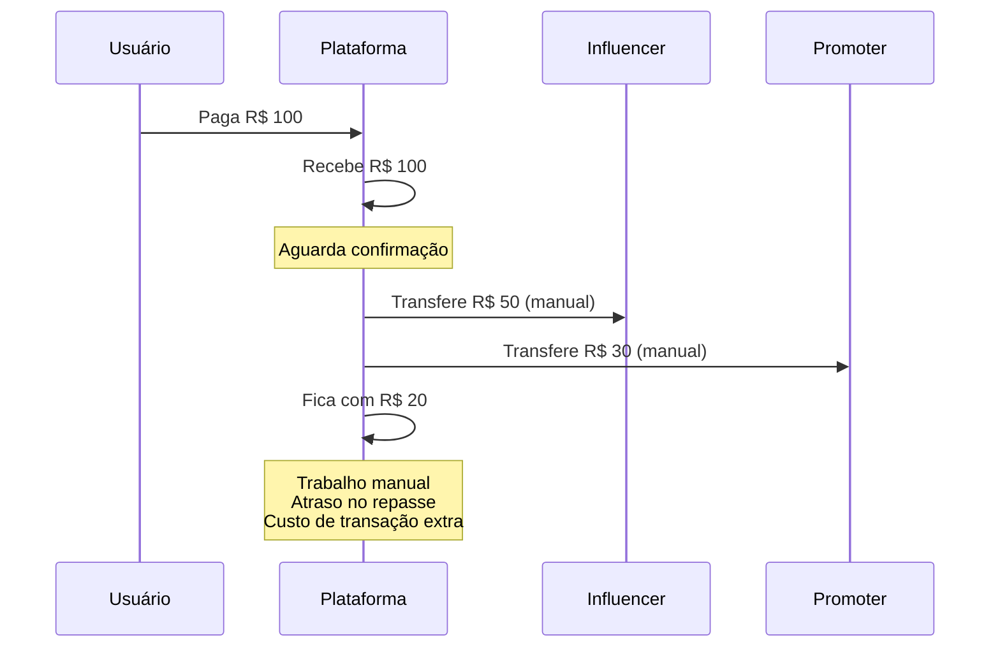
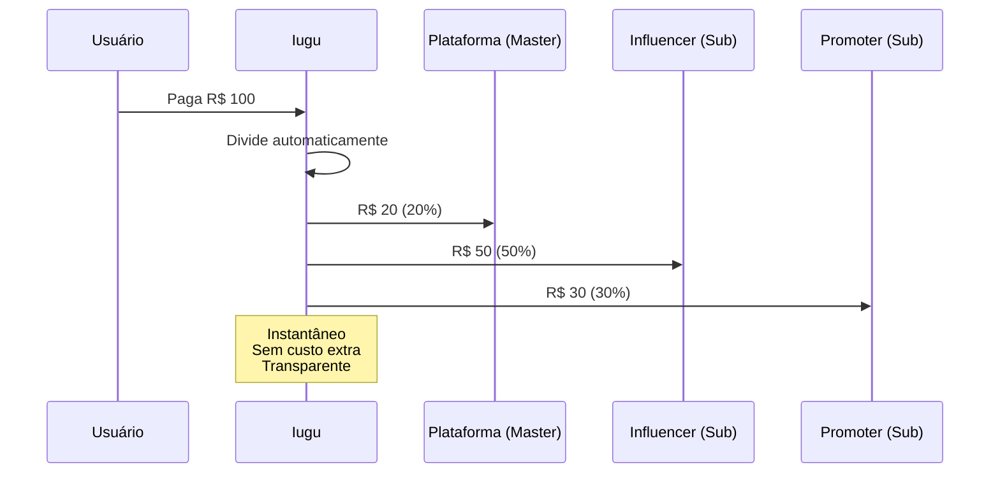
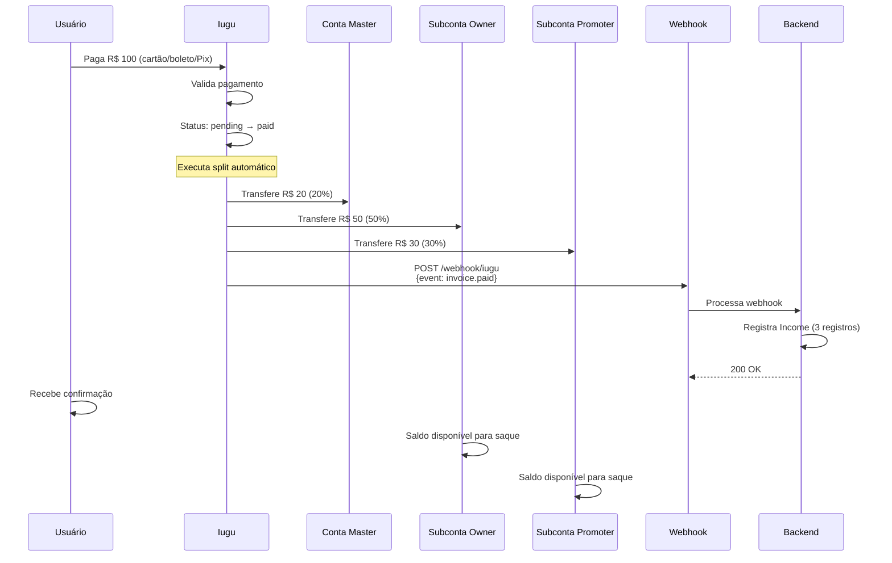

# Split de Pagamento

## O que é Split?

**Split de Pagamento** é a divisão automática de uma transação entre múltiplos beneficiários no momento do pagamento. No Iugu, o split é configurado ao criar a invoice e executado automaticamente quando o pagamento é confirmado.

## Por que Usar Split?

### Sem Split (Manual)


### Com Split (Automático)


## Como Funciona

### 1. Configuração no VideoRevenueConfig

Cada vídeo tem sua própria configuração de comissões:

```sql
CREATE TABLE video_revenue_configs (
    id BIGSERIAL PRIMARY KEY,
    video_id BIGINT REFERENCES videos(id),
    
    -- Percentuais (devem somar 100)
    platform_percentage DECIMAL(5,2), -- Ex: 20.00
    owner_percentage DECIMAL(5,2),    -- Ex: 50.00
    promoter_percentage DECIMAL(5,2), -- Ex: 30.00
    
    -- Se promoter_percentage = 0, vídeo não aparece para geração de links
    
    created_at TIMESTAMP,
    updated_at TIMESTAMP
);
```

**Exemplo de configurações**:

| Vídeo | Plataforma | Owner | Promoter | Disponível para Links |
|-------|------------|-------|----------|-----------------------|
| Vídeo A | 20% | 80% | 0% | ❌ Não |
| Vídeo B | 20% | 50% | 30% | ✅ Sim |
| Vídeo C | 30% | 60% | 10% | ✅ Sim |
| Vídeo D | 25% | 75% | 0% | ❌ Não |

### 2. Cálculo dos Valores

```csharp
// OrderService.cs
public async Task<Order> CreateOrderAsync(CreateOrderDto dto)
{
    var video = await _context.Videos
        .Include(v => v.VideoRevenueConfig)
        .FirstAsync(v => v.Id == dto.VideoId);
    
    var config = video.VideoRevenueConfig;
    
    // Valor do vídeo em centavos (Iugu trabalha com centavos)
    var totalCents = (int)(video.Price * 100);
    
    // Calcular cada parte
    var platformCents = (int)(totalCents * config.PlatformPercentage / 100);
    var ownerCents = (int)(totalCents * config.OwnerPercentage / 100);
    var promoterCents = dto.PromoterId.HasValue 
        ? (int)(totalCents * config.PromoterPercentage / 100)
        : 0;
    
    // Ajustar arredondamento (garantir que soma = 100%)
    var totalCalculated = platformCents + ownerCents + promoterCents;
    if (totalCalculated != totalCents)
    {
        // Adiciona diferença ao owner
        ownerCents += (totalCents - totalCalculated);
    }
    
    var order = new Order
    {
        UserId = dto.UserId,
        VideoId = dto.VideoId,
        PromoterId = dto.PromoterId,
        VideoAffiliateLinkId = dto.AffiliateLinkId,
        Amount = totalCents,
        PlatformAmount = platformCents,
        OwnerAmount = ownerCents,
        PromoterAmount = promoterCents
    };
    
    await _context.Orders.AddAsync(order);
    await _context.SaveChangesAsync();
    
    return order;
}
```

### 3. Criação da Invoice com Split no Iugu

```csharp
// IuguService.cs
public async Task<IuguInvoiceDto> CreateInvoiceWithSplitAsync(Order order)
{
    var video = await _context.Videos.FindAsync(order.VideoId);
    var owner = await GetOwnerForVideo(order.VideoId); // Influencer
    var promoter = order.PromoterId.HasValue 
        ? await _context.Owners.FindAsync(order.PromoterId.Value)
        : null;
    var user = await _context.Users.FindAsync(order.UserId);
    
    // Validar que Owner tem KYC aprovado
    if (owner.SubAccountStatus != OwnerSubAccountStatusEnum.Approved)
    {
        throw new InvalidOperationException(
            "Owner/Influencer deve ter KYC aprovado");
    }
    
    // Validar que Promoter (se houver) tem KYC aprovado
    if (promoter != null && 
        promoter.SubAccountStatus != OwnerSubAccountStatusEnum.Approved)
    {
        throw new InvalidOperationException(
            "Promoter deve ter KYC aprovado");
    }
    
    // Montar splits
    var splits = new List<object>();
    
    // Conta Master (Plataforma)
    splits.Add(new
    {
        recipient_account_id = _config.IuguMasterAccountId,
        cents = order.PlatformAmount
    });
    
    // Subconta Owner (Influencer)
    splits.Add(new
    {
        recipient_account_id = owner.IuguAccountId,
        cents = order.OwnerAmount
    });
    
    // Subconta Promoter (se houver)
    if (promoter != null && order.PromoterAmount > 0)
    {
        splits.Add(new
        {
            recipient_account_id = promoter.IuguAccountId,
            cents = order.PromoterAmount
        });
    }
    
    var request = new
    {
        email = user.Email,
        due_date = DateTime.Now.AddDays(3).ToString("yyyy-MM-dd"),
        items = new[]
        {
            new
            {
                description = $"Vídeo: {video.Title}",
                quantity = 1,
                price_cents = order.Amount
            }
        },
        splits = splits.ToArray(),
        // Importante: configurar split para executar na confirmação
        split_on_payment = true
    };
    
    _httpClient.DefaultRequestHeaders.Authorization = 
        new AuthenticationHeaderValue("Bearer", _config.IuguApiToken);
    
    var response = await _httpClient.PostAsJsonAsync(
        "https://api.iugu.com/v1/invoices",
        request
    );
    
    response.EnsureSuccessStatusCode();
    
    var result = await response.Content.ReadFromJsonAsync<dynamic>();
    
    return new IuguInvoiceDto
    {
        Id = result.id,
        SecureUrl = result.secure_url,
        Status = result.status
    };
}
```

### 4. Execução Automática do Split

Quando o usuário paga a invoice:



## Registro de Income

Após confirmação do pagamento, registramos cada parte do split:

```csharp
// PaymentService.cs
public async Task ConfirmPaymentAsync(string iuguInvoiceId)
{
    var payment = await _context.Payments
        .Include(p => p.Order)
        .ThenInclude(o => o.Video)
        .ThenInclude(v => v.OwnerVideos)
        .FirstAsync(p => p.IuguInvoiceId == iuguInvoiceId);
    
    // Atualizar payment
    payment.Status = PaymentStatusEnum.Paid;
    payment.IuguPaidAt = DateTime.UtcNow;
    
    // Criar registro de income para cada beneficiário
    var incomes = new List<Income>();
    
    // 1. Plataforma (conta master)
    incomes.Add(new Income
    {
        OrderId = payment.Order.Id,
        OwnerId = null, // NULL = plataforma
        Amount = payment.Order.PlatformAmount,
        Type = IncomeTypeEnum.Platform,
        Description = "Comissão da plataforma",
        CreatedAt = DateTime.UtcNow
    });
    
    // 2. Owner/Influencer
    var owner = payment.Order.Video.OwnerVideos.First().Owner;
    incomes.Add(new Income
    {
        OrderId = payment.Order.Id,
        OwnerId = owner.Id,
        Amount = payment.Order.OwnerAmount,
        Type = IncomeTypeEnum.Owner,
        Description = $"Venda do vídeo: {payment.Order.Video.Title}",
        CreatedAt = DateTime.UtcNow
    });
    
    // 3. Promoter (se houver)
    if (payment.Order.PromoterId.HasValue && payment.Order.PromoterAmount > 0)
    {
        incomes.Add(new Income
        {
            OrderId = payment.Order.Id,
            OwnerId = payment.Order.PromoterId.Value,
            Amount = payment.Order.PromoterAmount,
            Type = IncomeTypeEnum.Promoter,
            Description = $"Comissão por divulgação: {payment.Order.Video.Title}",
            CreatedAt = DateTime.UtcNow
        });
    }
    
    _context.Incomes.AddRange(incomes);
    await _context.SaveChangesAsync();
    
    _logger.LogInformation(
        "Pagamento confirmado: Invoice {InvoiceId}, {IncomeCount} incomes criados",
        iuguInvoiceId, incomes.Count);
}
```

## Exemplo Prático

### Cenário: Vídeo de R$ 100,00

**Configuração**:
- Plataforma: 20%
- Influencer (Owner): 50%
- Promoter: 30%

**Usuário compra via link de afiliado**:

```
Preço do vídeo: R$ 100,00

Cálculo:
- Plataforma: R$ 100 × 20% = R$ 20,00
- Influencer: R$ 100 × 50% = R$ 50,00
- Promoter: R$ 100 × 30% = R$ 30,00

Total: R$ 20 + R$ 50 + R$ 30 = R$ 100,00 ✓
```

**Após pagamento**:

| Beneficiário | Valor | Recebe em | Pode Sacar |
|--------------|-------|-----------|------------|
| Conta Master (Amasso) | R$ 20,00 | Imediato | Sim |
| Subconta Influencer | R$ 50,00 | Imediato | Sim |
| Subconta Promoter | R$ 30,00 | Imediato | Sim |

**Tabela `incomes`**:

| id | order_id | owner_id | amount | type | description |
|----|----------|----------|--------|------|-------------|
| 1 | 123 | NULL | 2000 | Platform | Comissão da plataforma |
| 2 | 123 | 45 | 5000 | Owner | Venda do vídeo: Vídeo X |
| 3 | 123 | 67 | 3000 | Promoter | Comissão por divulgação: Vídeo X |

**Nota**: Valores armazenados em centavos no banco.

## Vídeos Sem Promoter

Se o usuário comprar **sem** usar link de afiliado ou se o vídeo **não tem comissão para promoter** (promoter_percentage = 0):

```
Preço do vídeo: R$ 100,00
Config: Plataforma 20%, Owner 80%, Promoter 0%

Cálculo:
- Plataforma: R$ 100 × 20% = R$ 20,00
- Influencer: R$ 100 × 80% = R$ 80,00
- Promoter: R$ 0,00 (sem promoter ou sem comissão)

Total: R$ 20 + R$ 80 = R$ 100,00 ✓
```

Split no Iugu:
```javascript
{
  splits: [
    { recipient_account_id: "master_id", cents: 2000 },
    { recipient_account_id: "owner_id", cents: 8000 }
    // Sem split para promoter
  ]
}
```

## Custos e Taxas

### Taxas do Iugu (Exemplo)
O Iugu cobra sobre o valor total da transação:
- Cartão de crédito: ~2,99% + R$ 0,49
- Boleto: ~R$ 2,00
- Pix: ~0,99%

**Exemplo: Venda de R$ 100 com cartão**:
```
Valor pago pelo usuário: R$ 100,00
Taxa Iugu (2,99% + R$ 0,49): R$ 3,48
Valor disponível para split: R$ 96,52

Split:
- Plataforma (20% de 96,52): R$ 19,30
- Influencer (50% de 96,52): R$ 48,26
- Promoter (30% de 96,52): R$ 28,96
```

**Nota**: A plataforma pode:
1. Absorver as taxas (como acima)
2. Repassar ao usuário (cobrar R$ 103,48)
3. Distribuir entre beneficiários

## Relatórios e Dashboards

### Dashboard do Influencer

```csharp
public async Task<InfluencerDashboardDto> GetDashboardAsync(long influencerId)
{
    var incomes = await _context.Incomes
        .Include(i => i.Order)
        .ThenInclude(o => o.Video)
        .Where(i => i.OwnerId == influencerId && 
                    i.Type == IncomeTypeEnum.Owner)
        .ToListAsync();
    
    return new InfluencerDashboardDto
    {
        TotalEarnings = incomes.Sum(i => i.Amount) / 100m,
        TotalSales = incomes.Count,
        AveragePerSale = incomes.Average(i => i.Amount) / 100m,
        TopVideos = incomes
            .GroupBy(i => i.Order.Video)
            .OrderByDescending(g => g.Sum(i => i.Amount))
            .Take(5)
            .Select(g => new VideoEarningsDto
            {
                VideoTitle = g.Key.Title,
                Sales = g.Count(),
                TotalEarnings = g.Sum(i => i.Amount) / 100m
            })
            .ToList()
    };
}
```

### Dashboard do Promoter

```csharp
public async Task<PromoterDashboardDto> GetDashboardAsync(long promoterId)
{
    var incomes = await _context.Incomes
        .Include(i => i.Order)
        .ThenInclude(o => o.Video)
        .Include(i => i.Order)
        .ThenInclude(o => o.VideoAffiliateLink)
        .Where(i => i.OwnerId == promoterId && 
                    i.Type == IncomeTypeEnum.Promoter)
        .ToListAsync();
    
    var links = await _context.VideoAffiliateLinks
        .Include(l => l.Video)
        .Where(l => l.OwnerId == promoterId)
        .ToListAsync();
    
    return new PromoterDashboardDto
    {
        TotalEarnings = incomes.Sum(i => i.Amount) / 100m,
        TotalConversions = incomes.Count,
        ActiveLinks = links.Count(l => l.IsActive),
        ConversionRate = CalculateConversionRate(links, incomes),
        TopPerformingLinks = GetTopLinks(links, incomes)
    };
}
```

## Vantagens do Split Automático

### Para a Plataforma
- ✅ Sem trabalho manual de transferências
- ✅ Sem custo extra de transações
- ✅ Transparência total
- ✅ Conformidade garantida

### Para Promoters/Influencers
- ✅ Recebimento instantâneo
- ✅ Sem atrasos
- ✅ Controle total do saldo
- ✅ Pode sacar quando quiser

### Para o Sistema
- ✅ Escalável
- ✅ Auditável
- ✅ Automático
- ✅ Confiável

## Próximos Passos

- Entenda como [Webhooks](webhooks.md) confirmam os pagamentos
- Veja [Casos de Uso > Compra de Vídeo](../casos-de-uso/usuario-compra-video.md) para fluxo completo
- Consulte [Fluxos de Negócio > Comissões](../fluxos-de-negocio/comissoes.md) para detalhes

