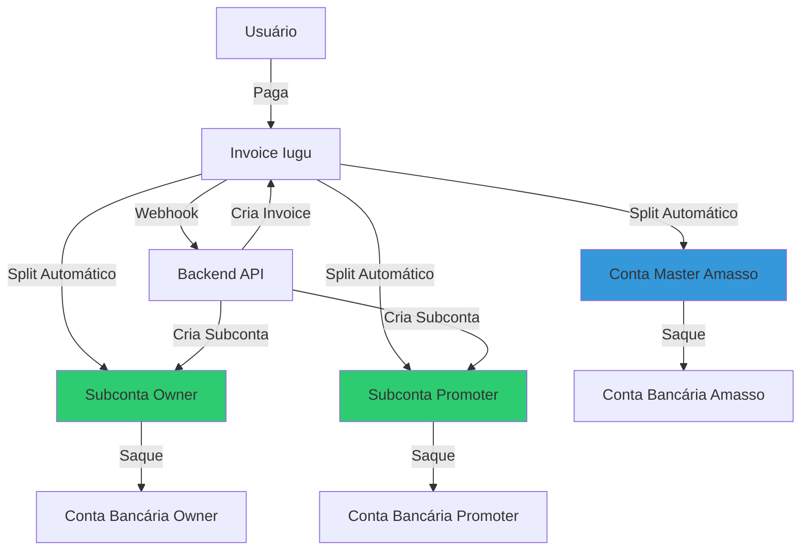
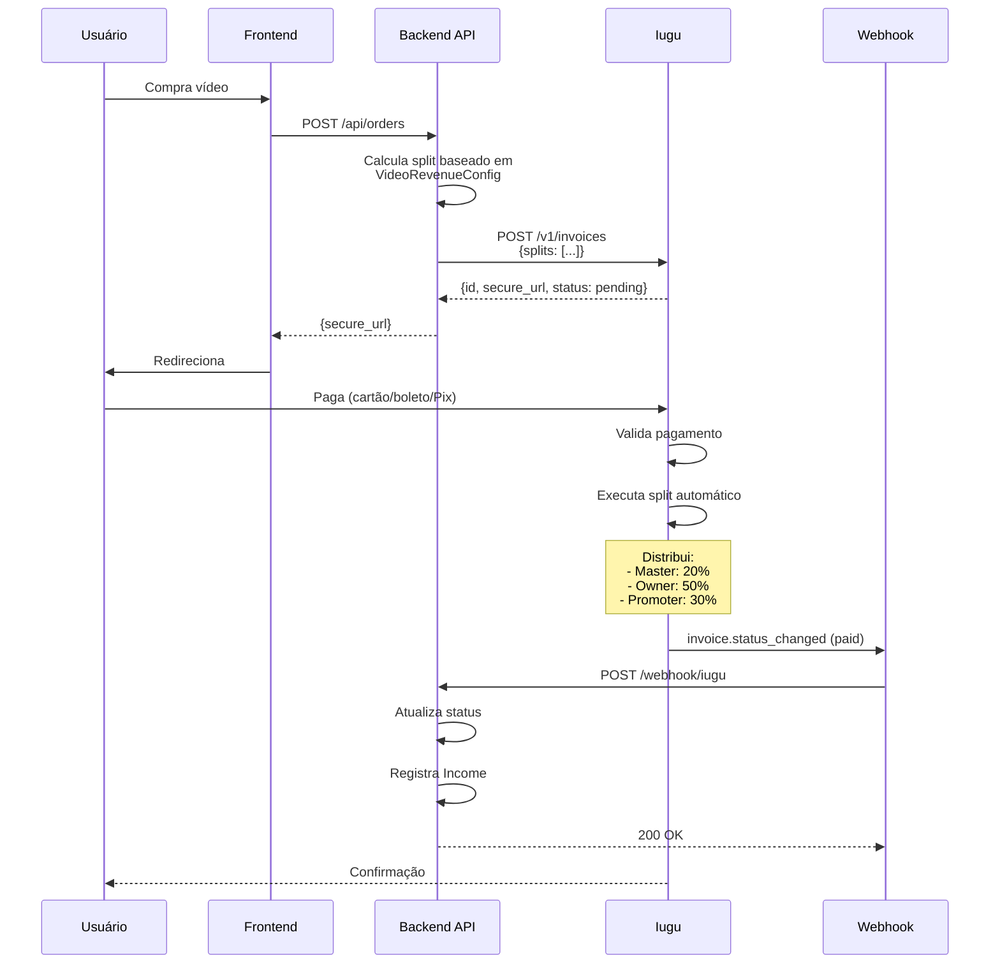

# Pagamentos Iugu - Visão Geral

## O que é o Iugu?

O **Iugu** é um gateway de pagamento brasileiro completo que oferece não apenas processamento de pagamentos, mas também um sistema robusto de **marketplace** com contas master e subcontas.

Website: [https://iugu.com](https://iugu.com)

## Por que Escolhemos o Iugu?

### Recursos Fundamentais para o Amasso

1. **Sistema de Marketplace (Split Automático)**
   - Divisão automática do pagamento entre múltiplos beneficiários
   - Sem necessidade de transferências manuais
   - Transparência total para todos os envolvidos

2. **Conta Master + Subcontas**
   - Plataforma como conta master centraliza pagamentos
   - Cada Promoter e Influencer tem sua subconta
   - Conformidade com regulamentações financeiras

3. **Compliance e KYC**
   - Sistema integrado de verificação de identidade
   - Exigido por lei para quem recebe dinheiro
   - Processo documentado e auditável

4. **Webhooks Confiáveis**
   - Notificações em tempo real de mudanças de status
   - Retry automático em caso de falha
   - Assinatura digital para segurança

5. **API Completa**
   - Criação de invoices (faturas)
   - Gestão de subcontas
   - Configuração de splits
   - Consulta de transações

## Conceitos Principais

### Invoice (Fatura)
Representa uma cobrança a ser paga:
- Criada programaticamente via API
- Possui URL de pagamento (secure_url)
- Aceita múltiplos métodos: cartão, boleto, Pix
- Status: pending, paid, cancelled, refunded

### Split (Divisão)
Configuração de como o valor será distribuído:
- Definido no momento da criação da invoice
- Percentuais ou valores fixos
- Executa automaticamente quando invoice é paga
- Irrevogável após execução

### Conta Master
Conta principal da plataforma:
- Recebe todos os pagamentos
- Gerencia subcontas
- Configura regras de split
- Centraliza gestão financeira

### Subconta
Conta vinculada à master para cada seller:
- Criada para Promoters e Influencers
- Requer KYC aprovado
- Recebe automaticamente via split
- Pode sacar para conta bancária

## Arquitetura do Sistema



## Fluxo Geral de Pagamento



## Entidades Relacionadas no Banco

### Owner
```sql
CREATE TABLE owners (
    id BIGSERIAL PRIMARY KEY,
    user_id BIGINT REFERENCES users(id),
    type VARCHAR(50), -- Influencer, Promoter, etc
    iugu_account_id VARCHAR(100), -- ID da subconta no Iugu
    sub_account_status VARCHAR(20), -- Pendente, Aprovado, Rejeitado
    cpf_cnpj VARCHAR(20),
    -- Dados bancários
    bank_code VARCHAR(10),
    bank_agency VARCHAR(10),
    bank_account VARCHAR(20),
    -- ... outros campos
);
```

### Payment
```sql
CREATE TABLE payments (
    id BIGSERIAL PRIMARY KEY,
    order_id BIGINT REFERENCES orders(id),
    iugu_invoice_id VARCHAR(100), -- ID da invoice no Iugu
    iugu_secure_url TEXT, -- URL de pagamento
    status VARCHAR(20), -- Pending, Paid, Cancelled
    iugu_paid_at TIMESTAMP,
    amount INT, -- em centavos
    -- ... outros campos
);
```

### Income
```sql
CREATE TABLE incomes (
    id BIGSERIAL PRIMARY KEY,
    order_id BIGINT REFERENCES orders(id),
    owner_id BIGINT REFERENCES owners(id), -- NULL para plataforma
    amount INT, -- em centavos
    type VARCHAR(20), -- Platform, Owner, Promoter
    created_at TIMESTAMP
);
```

## Recursos Utilizados do Iugu

| Recurso | Endpoint | Uso |
|---------|----------|-----|
| **Criar Invoice** | `POST /v1/invoices` | Gerar cobrança com split |
| **Consultar Invoice** | `GET /v1/invoices/:id` | Verificar status |
| **Criar Subconta** | `POST /v1/marketplace/create_account` | KYC de Promoter/Influencer |
| **Consultar Subconta** | `GET /v1/accounts/:id` | Status do KYC |
| **Verificar Subconta** | `POST /v1/accounts/:id/request_verification` | Enviar para análise |
| **Webhooks** | Configuração no painel | Notificações automáticas |

## Custos (Exemplo Simplificado)

**Nota**: Valores ilustrativos. Consultar contrato com Iugu.

### Taxas da Plataforma
- Cartão de crédito: ~2,99% + R$ 0,49
- Boleto: ~R$ 2,00
- Pix: ~0,99%

### Repasses para Subcontas
- Automáticos via split (sem custo extra)
- Saques para conta bancária: Conforme política Iugu

## Segurança

### API Token
```csharp
// Configuração
var apiToken = Environment.GetEnvironmentVariable("IUGU_API_TOKEN");
_httpClient.DefaultRequestHeaders.Add("Authorization", $"Bearer {apiToken}");
```

### Validação de Webhooks
```csharp
public bool ValidateWebhookSignature(string payload, string signature)
{
    var secret = _configuration["Iugu:WebhookSecret"];
    var hash = ComputeHmacSha256(payload, secret);
    return hash.Equals(signature, StringComparison.OrdinalIgnoreCase);
}
```

## Ambientes

### Sandbox (Desenvolvimento)
- Base URL: `https://api.iugu.com` (mesmo endpoint, usa API Token de teste)
- Cartões de teste disponíveis
- Sem cobranças reais

### Produção
- Base URL: `https://api.iugu.com`
- API Token de produção
- Transações reais

## Limitações e Considerações

### Splits
- Máximo de 20 recipients por invoice
- Percentuais devem somar 100%
- Mínimo de R$ 1,00 por recipient

### Subcontas
- Requerem KYC completo
- Aprovação pode levar dias
- Documentação obrigatória

### Webhooks
- Timeout de 5 segundos
- Retry automático 3x (1h, 6h, 24h)
- Deve responder 200 OK rapidamente

## Monitoramento

### Dashboard Iugu
- Transações em tempo real
- Status de subcontas
- Relatórios financeiros
- Gestão de invoices

### Nossa Aplicação
- Tabela `payments` - todos os pagamentos
- Tabela `incomes` - distribuição detalhada
- Logs de webhooks
- Alertas de falhas

## Próximos Passos

Aprofunde-se nos tópicos específicos:
- [Conta Master e Subcontas](conta-master-subcontas.md) - Arquitetura detalhada
- [Processo KYC](processo-kyc.md) - Como aprovar Promoters/Influencers
- [Split de Pagamento](split-pagamento.md) - Cálculo e distribuição
- [Webhooks](webhooks.md) - Processamento de eventos

## Recursos Externos

- [Documentação Oficial Iugu](https://dev.iugu.com)
- [API Reference](https://dev.iugu.com/reference)
- [Webhooks](https://dev.iugu.com/docs/webhooks)
- [Marketplace](https://dev.iugu.com/docs/marketplace)

