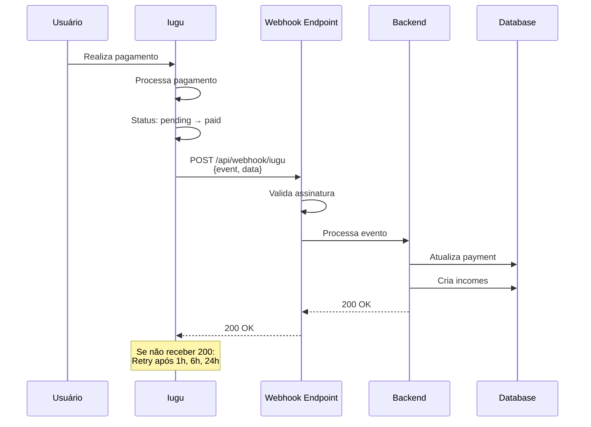
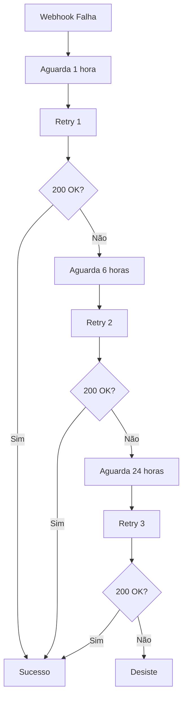

# Webhooks do Iugu

## O que são Webhooks?

Webhooks são **notificações HTTP automáticas** enviadas pelo Iugu para informar a aplicação sobre eventos importantes, como mudanças de status de pagamento.



## Por que Usar Webhooks?

### Sem Webhooks (Polling)
```
❌ Backend precisa consultar status periodicamente
❌ Atraso na confirmação
❌ Sobrecarga de requisições à API
❌ Complexidade de implementação
```

### Com Webhooks
```
✅ Notificação instantânea
✅ Sem polling necessário
✅ Eficiente e escalável
✅ Confiável (retry automático)
```

## Eventos do Iugu

### Eventos de Invoice (Fatura)

| Evento | Descrição | Quando acontece |
|--------|-----------|-----------------|
| **invoice.created** | Invoice criada | Ao criar invoice programaticamente |
| **invoice.status_changed** | Status mudou | Pagamento confirmado, cancelado, etc |
| **invoice.payment_failed** | Pagamento falhou | Cartão recusado, boleto não pago |
| **invoice.refunded** | Estorno realizado | Admin ou Iugu estorna |

### Eventos de Subconta

| Evento | Descrição | Quando acontece |
|--------|-----------|-----------------|
| **account.verified** | Subconta verificada | KYC aprovado pelo Iugu |
| **account.updated** | Dados atualizados | Alteração de dados bancários |

## Status de Invoice

| Status | Descrição | Ação do Backend |
|--------|-----------|-----------------|
| **pending** | Aguardando pagamento | Nenhuma |
| **paid** | Pago | ✅ Confirmar payment, criar incomes |
| **canceled** | Cancelado | Cancelar order |
| **refunded** | Estornado | Reverter incomes |
| **expired** | Expirado | Marcar como expirado |
| **partially_paid** | Pago parcialmente | Aguardar confirmação total |

## Configuração

### 1. Configurar URL no Painel Iugu

Acessar: `Dashboard Iugu > Configurações > Webhooks`

**URL de Produção**: `https://api.amasso.com.br/api/webhook/iugu`

**URL de Dev**: `https://dev-api.amasso.com.br/api/webhook/iugu` ou usar **ngrok**:
```bash
ngrok http 7080
# URL gerada: https://abc123.ngrok.io
# Configurar: https://abc123.ngrok.io/api/webhook/iugu
```

**Eventos a assinar**:
- ✅ invoice.status_changed
- ✅ invoice.refunded
- ✅ invoice.payment_failed
- ✅ account.verified

### 2. Secret para Validação

O Iugu gera um **Webhook Secret** único. Copiar e configurar:

```json
// appsettings.json
{
  "Iugu": {
    "ApiToken": "...",
    "MasterAccountId": "...",
    "WebhookSecret": "SEU_SECRET_AQUI"
  }
}
```

## Implementação

### Endpoint do Webhook

```csharp
// WebHookEndpoint.cs
public static class WebHookEndpoints
{
    public static void MapWebHookEndpoints(this IEndpointRouteBuilder app)
    {
        var group = app.MapGroup("/api/webhook");
        
        // Não requer autenticação JWT (usa validação de assinatura)
        group.MapPost("/iugu", HandleIuguWebhook);
    }
    
    [AllowAnonymous]
    private static async Task<IResult> HandleIuguWebhook(
        HttpContext context,
        [FromServices] IPaymentService paymentService,
        [FromServices] IConfiguration config)
    {
        // 1. Ler body
        context.Request.EnableBuffering();
        var body = await new StreamReader(context.Request.Body).ReadToEndAsync();
        context.Request.Body.Position = 0;
        
        // 2. Validar assinatura
        var signature = context.Request.Headers["X-Hub-Signature"].ToString();
        if (!ValidateSignature(body, signature, config["Iugu:WebhookSecret"]))
        {
            return Results.Unauthorized();
        }
        
        // 3. Deserializar
        var webhook = JsonSerializer.Deserialize<IuguWebhookDto>(body);
        
        // 4. Processar evento
        try
        {
            switch (webhook.Event)
            {
                case "invoice.status_changed":
                    await HandleInvoiceStatusChanged(webhook.Data, paymentService);
                    break;
                    
                case "invoice.refunded":
                    await HandleInvoiceRefunded(webhook.Data, paymentService);
                    break;
                    
                case "invoice.payment_failed":
                    await HandlePaymentFailed(webhook.Data, paymentService);
                    break;
                    
                default:
                    // Evento não tratado, mas retorna 200 OK
                    break;
            }
            
            return Results.Ok();
        }
        catch (Exception ex)
        {
            // Log erro mas retorna 200 para não gerar retry
            // (se for erro de lógica, não adianta retry)
            _logger.LogError(ex, "Erro ao processar webhook Iugu");
            return Results.Ok(); // ou Results.StatusCode(500) para retry
        }
    }
    
    private static bool ValidateSignature(string body, string signature, string secret)
    {
        if (string.IsNullOrEmpty(signature))
            return false;
        
        // Iugu envia: sha256=<hash>
        var expectedHash = signature.Replace("sha256=", "");
        
        using var hmac = new HMACSHA256(Encoding.UTF8.GetBytes(secret));
        var hash = hmac.ComputeHash(Encoding.UTF8.GetBytes(body));
        var computedHash = BitConverter.ToString(hash).Replace("-", "").ToLower();
        
        return computedHash.Equals(expectedHash, StringComparison.OrdinalIgnoreCase);
    }
    
    private static async Task HandleInvoiceStatusChanged(
        IuguWebhookDataDto data,
        IPaymentService paymentService)
    {
        if (data.Status == "paid")
        {
            await paymentService.ConfirmPaymentAsync(data.Id);
        }
        else if (data.Status == "canceled")
        {
            await paymentService.CancelPaymentAsync(data.Id);
        }
        else if (data.Status == "expired")
        {
            await paymentService.ExpirePaymentAsync(data.Id);
        }
    }
    
    private static async Task HandleInvoiceRefunded(
        IuguWebhookDataDto data,
        IPaymentService paymentService)
    {
        await paymentService.RefundPaymentAsync(data.Id);
    }
    
    private static async Task HandlePaymentFailed(
        IuguWebhookDataDto data,
        IPaymentService paymentService)
    {
        await paymentService.MarkPaymentFailedAsync(data.Id);
    }
}
```

### DTOs do Webhook

```csharp
public class IuguWebhookDto
{
    [JsonPropertyName("event")]
    public string Event { get; set; }
    
    [JsonPropertyName("data")]
    public IuguWebhookDataDto Data { get; set; }
}

public class IuguWebhookDataDto
{
    [JsonPropertyName("id")]
    public string Id { get; set; } // Invoice ID
    
    [JsonPropertyName("status")]
    public string Status { get; set; }
    
    [JsonPropertyName("total_cents")]
    public int TotalCents { get; set; }
    
    [JsonPropertyName("paid_at")]
    public DateTime? PaidAt { get; set; }
    
    [JsonPropertyName("payer_email")]
    public string PayerEmail { get; set; }
    
    // ... outros campos conforme necessário
}
```

### Processamento do Pagamento

```csharp
// PaymentService.cs
public async Task ConfirmPaymentAsync(string iuguInvoiceId)
{
    var payment = await _context.Payments
        .Include(p => p.Order)
        .ThenInclude(o => o.Video)
        .ThenInclude(v => v.OwnerVideos)
        .ThenInclude(ov => ov.Owner)
        .FirstOrDefaultAsync(p => p.IuguInvoiceId == iuguInvoiceId);
    
    if (payment == null)
    {
        _logger.LogWarning("Payment não encontrado para invoice {InvoiceId}", iuguInvoiceId);
        return; // Não falha, pode ser invoice de outra operação
    }
    
    // Verificar se já foi processado (idempotência)
    if (payment.Status == PaymentStatusEnum.Paid)
    {
        _logger.LogInformation(
            "Payment {PaymentId} já confirmado anteriormente",
            payment.Id);
        return;
    }
    
    using var transaction = await _context.Database.BeginTransactionAsync();
    try
    {
        // 1. Atualizar payment
        payment.Status = PaymentStatusEnum.Paid;
        payment.IuguPaidAt = DateTime.UtcNow;
        payment.UpdatedAt = DateTime.UtcNow;
        
        // 2. Criar incomes
        var incomes = CreateIncomesForOrder(payment.Order);
        await _context.Incomes.AddRangeAsync(incomes);
        
        // 3. Criar notificação de confirmação
        var notification = new Notification
        {
            Type = NotificationTypeEnum.PaymentConfirmed,
            Channel = payment.Order.User.NotificationPreference,
            MetadataJson = JsonSerializer.Serialize(new
            {
                Email = payment.Order.User.Email,
                PhoneNumber = payment.Order.User.Telephone,
                Name = payment.Order.User.FirstName,
                VideoTitle = payment.Order.Video.Title,
                Amount = payment.Order.Amount / 100m,
                OrderId = payment.Order.Id
            })
        };
        
        await _context.Notifications.AddAsync(notification);
        
        await _context.SaveChangesAsync();
        await transaction.CommitAsync();
        
        _logger.LogInformation(
            "Payment {PaymentId} confirmado com sucesso. {IncomeCount} incomes criados",
            payment.Id, incomes.Count);
    }
    catch (Exception ex)
    {
        await transaction.RollbackAsync();
        _logger.LogError(ex, "Erro ao confirmar payment {PaymentId}", payment.Id);
        throw;
    }
}

private List<Income> CreateIncomesForOrder(Order order)
{
    var incomes = new List<Income>();
    
    // Plataforma
    incomes.Add(new Income
    {
        OrderId = order.Id,
        OwnerId = null,
        Amount = order.PlatformAmount,
        Type = IncomeTypeEnum.Platform,
        Description = "Comissão da plataforma",
        CreatedAt = DateTime.UtcNow
    });
    
    // Owner (Influencer)
    var owner = order.Video.OwnerVideos.First().Owner;
    incomes.Add(new Income
    {
        OrderId = order.Id,
        OwnerId = owner.Id,
        Amount = order.OwnerAmount,
        Type = IncomeTypeEnum.Owner,
        Description = $"Venda: {order.Video.Title}",
        CreatedAt = DateTime.UtcNow
    });
    
    // Promoter (se houver)
    if (order.PromoterId.HasValue && order.PromoterAmount > 0)
    {
        incomes.Add(new Income
        {
            OrderId = order.Id,
            OwnerId = order.PromoterId.Value,
            Amount = order.PromoterAmount,
            Type = IncomeTypeEnum.Promoter,
            Description = $"Comissão: {order.Video.Title}",
            CreatedAt = DateTime.UtcNow
        });
    }
    
    return incomes;
}
```

## Idempotência

É crucial garantir que o mesmo webhook não seja processado múltiplas vezes:

```csharp
// Verificar status antes de processar
if (payment.Status == PaymentStatusEnum.Paid)
{
    _logger.LogInformation("Payment já processado, ignorando");
    return; // Não processa novamente
}

// Usar transação para garantir atomicidade
using var transaction = await _context.Database.BeginTransactionAsync();
try
{
    // Processar
    await _context.SaveChangesAsync();
    await transaction.CommitAsync();
}
catch
{
    await transaction.RollbackAsync();
    throw;
}
```

## Retry Automático do Iugu

Se o endpoint não responder 200 OK:



**Importante**: 
- Responder 200 OK rapidamente (< 5 segundos)
- Processar de forma assíncrona se necessário
- Log detalhado para debug

## Logging de Webhooks

```csharp
// Middleware para log
app.Use(async (context, next) =>
{
    if (context.Request.Path.StartsWithSegments("/api/webhook"))
    {
        context.Request.EnableBuffering();
        var body = await new StreamReader(context.Request.Body).ReadToEndAsync();
        context.Request.Body.Position = 0;
        
        _logger.LogInformation(
            "Webhook recebido: {Method} {Path}\nHeaders: {Headers}\nBody: {Body}",
            context.Request.Method,
            context.Request.Path,
            JsonSerializer.Serialize(context.Request.Headers),
            body
        );
    }
    
    await next();
});
```

## Testando Webhooks

### 1. Usar Ngrok para Dev Local

```bash
# Terminal 1: Rodar aplicação
dotnet run

# Terminal 2: Expor localhost
ngrok http 7080

# Copiar URL: https://abc123.ngrok.io
# Configurar no Iugu: https://abc123.ngrok.io/api/webhook/iugu
```

### 2. Simular Webhook Manualmente

```bash
curl -X POST https://localhost:7080/api/webhook/iugu \
  -H "Content-Type: application/json" \
  -H "X-Hub-Signature: sha256=SEU_HASH_AQUI" \
  -d '{
    "event": "invoice.status_changed",
    "data": {
      "id": "INVOICE_ID_AQUI",
      "status": "paid",
      "total_cents": 10000,
      "paid_at": "2025-10-16T10:00:00Z"
    }
  }'
```

### 3. Usar Ferramentas do Iugu

Dashboard Iugu > Webhooks > Ver Eventos:
- Ver webhooks enviados
- Status de entrega
- Retry manual
- Payload completo

## Segurança

### Validação de Assinatura

```csharp
private static bool ValidateSignature(string body, string signature, string secret)
{
    // Iugu usa HMAC-SHA256
    var expectedHash = signature.Replace("sha256=", "");
    
    using var hmac = new HMACSHA256(Encoding.UTF8.GetBytes(secret));
    var hash = hmac.ComputeHash(Encoding.UTF8.GetBytes(body));
    var computedHash = BitConverter.ToString(hash)
        .Replace("-", "")
        .ToLower();
    
    return computedHash.Equals(expectedHash, StringComparison.OrdinalIgnoreCase);
}
```

### Whitelist de IPs (Opcional)

```csharp
// Middleware para validar IP
app.Use(async (context, next) =>
{
    if (context.Request.Path.StartsWithSegments("/api/webhook/iugu"))
    {
        var remoteIp = context.Connection.RemoteIpAddress?.ToString();
        var allowedIps = new[] { "18.231.194.64", "18.231.194.65" }; // IPs do Iugu
        
        if (!allowedIps.Contains(remoteIp))
        {
            context.Response.StatusCode = 403;
            return;
        }
    }
    
    await next();
});
```

## Monitoramento

### Alertas

- ❌ Webhook falhou 3x seguidas
- ❌ Nenhum webhook recebido em 24h (se houver vendas esperadas)
- ⚠️ Tempo de processamento > 3 segundos
- ⚠️ Validação de assinatura falhou

### Métricas

```csharp
// Prometheus ou Application Insights
_metrics.IncrementCounter("webhooks_received_total", 
    new[] { "event", webhook.Event });

_metrics.RecordHistogram("webhook_processing_duration_seconds", 
    duration.TotalSeconds);

_metrics.IncrementCounter("webhook_errors_total",
    new[] { "event", webhook.Event, "error", ex.GetType().Name });
```

## Troubleshooting

### Webhook não chegou
- ✅ Verificar URL configurada no Iugu
- ✅ Verificar se aplicação está acessível (firewall, DNS)
- ✅ Checar logs do Iugu (Dashboard > Webhooks)
- ✅ Usar ngrok para testar localmente

### Webhook falhou
- ✅ Ver logs detalhados
- ✅ Verificar se validação de assinatura está OK
- ✅ Garantir resposta 200 OK rápida
- ✅ Checar timeout (< 5s)

### Processamento duplicado
- ✅ Implementar idempotência
- ✅ Verificar status antes de processar
- ✅ Usar transações

## Próximos Passos

- Veja [Casos de Uso > Compra de Vídeo](../casos-de-uso/usuario-compra-video.md) para fluxo completo
- Entenda o [Split de Pagamento](split-pagamento.md) executado após webhook
- Consulte [Fluxos > Compra](../fluxos-de-negocio/compra-video.md) para contexto

