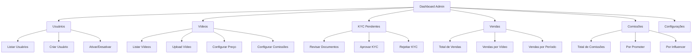
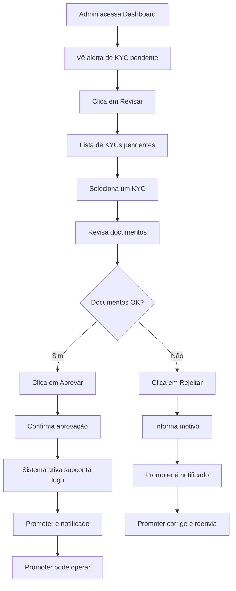

# Perfil: Admin

## Descrição

O **Admin** é o administrador da plataforma Amasso, com acesso total ao sistema para gerenciar usuários, vídeos, configurações e aprovar processos de KYC.

## Características

- ✅ **Acesso Total**: Todas as funcionalidades da plataforma
- ✅ **Gestão de Usuários**: Criar, editar, desativar usuários
- ✅ **Gestão de Vídeos**: Upload, configuração de preços e comissões
- ✅ **Aprovação de KYC**: Revisar e aprovar documentos de Promoters/Influencers
- ✅ **Relatórios Financeiros**: Visão completa de vendas e comissões
- ❌ **Não Recebe Comissões**: Não participa do split de pagamento

## Permissões

### Endpoints Exclusivos

```csharp
// AdminEndpoints.cs
var group = app.MapGroup("/api/admin")
    .RequireAuthorization()
    .RequireRole("Admin"); // Apenas Admin pode acessar

// Gestão de Usuários
group.MapGet("/users", GetAllUsers);
group.MapPut("/users/{id}/activate", ActivateUser);
group.MapPut("/users/{id}/deactivate", DeactivateUser);

// Gestão de KYC
group.MapGet("/kyc/pending", GetPendingKyc);
group.MapPost("/kyc/{ownerId}/approve", ApproveKyc);
group.MapPost("/kyc/{ownerId}/reject", RejectKyc);

// Gestão de Vídeos
group.MapPost("/videos", CreateVideo);
group.MapPut("/videos/{id}", UpdateVideo);
group.MapDelete("/videos/{id}", DeleteVideo);
group.MapPost("/videos/{id}/revenue-config", ConfigureRevenue);

// Relatórios
group.MapGet("/reports/sales", GetSalesReport);
group.MapGet("/reports/commissions", GetCommissionsReport);
```

## Dashboard



## Principais Funcionalidades

### 1. Gestão de Usuários

#### Listar Todos os Usuários

```typescript
// Frontend - AdminUsers.tsx
export const AdminUsers: React.FC = () => {
  const [users, setUsers] = useState<User[]>([]);
  const [filters, setFilters] = useState({
    type: 'all', // all, Admin, Default, Promoter, Influencer
    status: 'all', // all, active, inactive
    search: ''
  });
  
  useEffect(() => {
    const fetchUsers = async () => {
      const data = await adminApi.getUsers(filters);
      setUsers(data);
    };
    fetchUsers();
  }, [filters]);
  
  return (
    <Box>
      <Typography variant="h4">Gerenciar Usuários</Typography>
      
      <Box sx={{ mb: 2 }}>
        <TextField 
          label="Buscar" 
          value={filters.search}
          onChange={(e) => setFilters({...filters, search: e.target.value})}
        />
        <Select 
          value={filters.type}
          onChange={(e) => setFilters({...filters, type: e.target.value})}
        >
          <MenuItem value="all">Todos</MenuItem>
          <MenuItem value="Default">Default</MenuItem>
          <MenuItem value="Promoter">Promoter</MenuItem>
          <MenuItem value="Influencer">Influencer</MenuItem>
        </Select>
      </Box>
      
      <TableContainer>
        <Table>
          <TableHead>
            <TableRow>
              <TableCell>ID</TableCell>
              <TableCell>Nome</TableCell>
              <TableCell>Email</TableCell>
              <TableCell>Tipo</TableCell>
              <TableCell>Status</TableCell>
              <TableCell>Ações</TableCell>
            </TableRow>
          </TableHead>
          <TableBody>
            {users.map(user => (
              <TableRow key={user.id}>
                <TableCell>{user.id}</TableCell>
                <TableCell>{user.fullname}</TableCell>
                <TableCell>{user.email}</TableCell>
                <TableCell>
                  <Chip label={user.type} color="primary" />
                </TableCell>
                <TableCell>
                  <Chip 
                    label={user.isActive ? 'Ativo' : 'Inativo'} 
                    color={user.isActive ? 'success' : 'default'}
                  />
                </TableCell>
                <TableCell>
                  <IconButton onClick={() => handleEdit(user.id)}>
                    <EditIcon />
                  </IconButton>
                  <IconButton onClick={() => handleToggleStatus(user.id)}>
                    {user.isActive ? <BlockIcon /> : <CheckIcon />}
                  </IconButton>
                </TableCell>
              </TableRow>
            ))}
          </TableBody>
        </Table>
      </TableContainer>
    </Box>
  );
};
```

### 2. Aprovação de KYC

#### Listar KYCs Pendentes

```typescript
// Frontend - AdminKyc.tsx
export const AdminKyc: React.FC = () => {
  const [pendingKycs, setPendingKycs] = useState<KycPending[]>([]);
  const [selectedKyc, setSelectedKyc] = useState<KycPending | null>(null);
  
  const handleApprove = async (ownerId: number) => {
    if (!confirm('Aprovar este KYC?')) return;
    
    try {
      await adminApi.approveKyc(ownerId);
      toast.success('KYC aprovado!');
      fetchPendingKycs(); // Recarregar lista
    } catch (error) {
      toast.error('Erro ao aprovar KYC');
    }
  };
  
  const handleReject = async (ownerId: number) => {
    const reason = prompt('Motivo da rejeição:');
    if (!reason) return;
    
    try {
      await adminApi.rejectKyc(ownerId, reason);
      toast.success('KYC rejeitado');
      fetchPendingKycs();
    } catch (error) {
      toast.error('Erro ao rejeitar KYC');
    }
  };
  
  return (
    <Grid container spacing={2}>
      <Grid item xs={12} md={6}>
        <Typography variant="h5">KYCs Pendentes</Typography>
        <List>
          {pendingKycs.map(kyc => (
            <ListItem key={kyc.ownerId}>
              <ListItemText
                primary={kyc.name}
                secondary={`${kyc.type} - ${kyc.email}`}
              />
              <Button onClick={() => setSelectedKyc(kyc)}>
                Revisar
              </Button>
            </ListItem>
          ))}
        </List>
      </Grid>
      
      <Grid item xs={12} md={6}>
        {selectedKyc && (
          <Paper sx={{ p: 2 }}>
            <Typography variant="h6">Documentos de {selectedKyc.name}</Typography>
            
            <Box sx={{ my: 2 }}>
              <Typography variant="subtitle2">CPF</Typography>
              
            </Box>
            
            <Box sx={{ my: 2 }}>
              <Typography variant="subtitle2">RG / CNH</Typography>
              
            </Box>
            
            <Box sx={{ my: 2 }}>
              <Typography variant="subtitle2">Comprovante de Residência</Typography>
              
            </Box>
            
            <Box sx={{ my: 2 }}>
              <Typography variant="subtitle2">Selfie com Documento</Typography>
              
            </Box>
            
            <Box sx={{ my: 2 }}>
              <Typography variant="subtitle2">Dados Bancários</Typography>
              <Typography>Banco: {selectedKyc.bankData.bankCode}</Typography>
              <Typography>Agência: {selectedKyc.bankData.agency}</Typography>
              <Typography>Conta: {selectedKyc.bankData.account}</Typography>
              <Typography>Tipo: {selectedKyc.bankData.accountType}</Typography>
            </Box>
            
            <Box sx={{ display: 'flex', gap: 2, mt: 3 }}>
              <Button 
                variant="contained" 
                color="success"
                onClick={() => handleApprove(selectedKyc.ownerId)}
              >
                Aprovar KYC
              </Button>
              <Button 
                variant="contained" 
                color="error"
                onClick={() => handleReject(selectedKyc.ownerId)}
              >
                Rejeitar KYC
              </Button>
            </Box>
          </Paper>
        )}
      </Grid>
    </Grid>
  );
};
```

### 3. Gestão de Vídeos

#### Upload e Configuração

```typescript
// Frontend - AdminVideoForm.tsx
export const AdminVideoForm: React.FC = () => {
  const [formData, setFormData] = useState({
    title: '',
    description: '',
    price: 0,
    releaseDate: '',
    videoFile: null as File | null,
    thumbFile: null as File | null,
    trailerFile: null as File | null,
    // Comissões
    platformPercentage: 20,
    ownerPercentage: 50,
    promoterPercentage: 30, // 0 = não disponível para links
  });
  
  const handleSubmit = async (e: React.FormEvent) => {
    e.preventDefault();
    
    // Validar percentuais somam 100
    const total = formData.platformPercentage + 
                  formData.ownerPercentage + 
                  formData.promoterPercentage;
    
    if (total !== 100) {
      toast.error('Percentuais devem somar 100%');
      return;
    }
    
    try {
      const video = await adminApi.createVideo(formData);
      toast.success('Vídeo criado!');
      navigate('/admin/videos');
    } catch (error) {
      toast.error('Erro ao criar vídeo');
    }
  };
  
  return (
    <form onSubmit={handleSubmit}>
      <TextField 
        label="Título" 
        value={formData.title}
        onChange={(e) => setFormData({...formData, title: e.target.value})}
        required
      />
      
      <TextField 
        label="Descrição" 
        multiline
        rows={4}
        value={formData.description}
        onChange={(e) => setFormData({...formData, description: e.target.value})}
        required
      />
      
      <TextField 
        label="Preço (R$)" 
        type="number"
        value={formData.price}
        onChange={(e) => setFormData({...formData, price: parseFloat(e.target.value)})}
        required
      />
      
      <TextField 
        label="Data de Lançamento" 
        type="date"
        value={formData.releaseDate}
        onChange={(e) => setFormData({...formData, releaseDate: e.target.value})}
        InputLabelProps={{ shrink: true }}
        required
      />
      
      <Typography variant="h6" sx={{ mt: 3 }}>Arquivos</Typography>
      
      <FileInput 
        label="Vídeo Principal"
        onChange={(file) => setFormData({...formData, videoFile: file})}
        accept="video/*"
        required
      />
      
      <FileInput 
        label="Thumbnail"
        onChange={(file) => setFormData({...formData, thumbFile: file})}
        accept="image/*"
        required
      />
      
      <FileInput 
        label="Trailer (opcional)"
        onChange={(file) => setFormData({...formData, trailerFile: file})}
        accept="video/*"
      />
      
      <Typography variant="h6" sx={{ mt: 3 }}>Configuração de Comissões</Typography>
      
      <Typography variant="caption" color="text.secondary">
        Se Promoter = 0%, o vídeo não aparecerá para geração de links de afiliado
      </Typography>
      
      <TextField 
        label="Plataforma (%)" 
        type="number"
        value={formData.platformPercentage}
        onChange={(e) => setFormData({...formData, platformPercentage: parseFloat(e.target.value)})}
        inputProps={{ min: 0, max: 100 }}
      />
      
      <TextField 
        label="Owner/Influencer (%)" 
        type="number"
        value={formData.ownerPercentage}
        onChange={(e) => setFormData({...formData, ownerPercentage: parseFloat(e.target.value)})}
        inputProps={{ min: 0, max: 100 }}
      />
      
      <TextField 
        label="Promoter (%)" 
        type="number"
        value={formData.promoterPercentage}
        onChange={(e) => setFormData({...formData, promoterPercentage: parseFloat(e.target.value)})}
        inputProps={{ min: 0, max: 100 }}
      />
      
      <Typography variant="body2" sx={{ mt: 1 }}>
        Total: {formData.platformPercentage + formData.ownerPercentage + formData.promoterPercentage}%
        {(formData.platformPercentage + formData.ownerPercentage + formData.promoterPercentage) !== 100 && (
          <span style={{ color: 'red' }}> (deve ser 100%)</span>
        )}
      </Typography>
      
      <Button type="submit" variant="contained" sx={{ mt: 3 }}>
        Criar Vídeo
      </Button>
    </form>
  );
};
```

### 4. Relatórios

#### Dashboard com Métricas

```typescript
// Frontend - AdminDashboard.tsx
export const AdminDashboard: React.FC = () => {
  const [metrics, setMetrics] = useState({
    totalUsers: 0,
    totalVideos: 0,
    totalSales: 0,
    totalRevenue: 0,
    pendingKycs: 0,
    recentOrders: [],
  });
  
  return (
    <Box>
      <Typography variant="h4">Dashboard Admin</Typography>
      
      <Grid container spacing={3} sx={{ mt: 2 }}>
        <Grid item xs={12} md={3}>
          <StatCard 
            title="Total de Usuários"
            value={metrics.totalUsers}
            icon={<PeopleIcon />}
          />
        </Grid>
        
        <Grid item xs={12} md={3}>
          <StatCard 
            title="Total de Vídeos"
            value={metrics.totalVideos}
            icon={<VideoIcon />}
          />
        </Grid>
        
        <Grid item xs={12} md={3}>
          <StatCard 
            title="Total de Vendas"
            value={metrics.totalSales}
            icon={<ShoppingIcon />}
          />
        </Grid>
        
        <Grid item xs={12} md={3}>
          <StatCard 
            title="Receita Total"
            value={`R$ ${metrics.totalRevenue.toFixed(2)}`}
            icon={<MoneyIcon />}
          />
        </Grid>
        
        {metrics.pendingKycs > 0 && (
          <Grid item xs={12}>
            <Alert severity="warning">
              Existem {metrics.pendingKycs} KYCs pendentes de aprovação
              <Button component={Link} to="/admin/kyc">
                Revisar Agora
              </Button>
            </Alert>
          </Grid>
        )}
        
        <Grid item xs={12}>
          <Typography variant="h6">Vendas Recentes</Typography>
          <RecentOrdersTable orders={metrics.recentOrders} />
        </Grid>
      </Grid>
    </Box>
  );
};
```

## Fluxos Típicos

### Fluxo: Aprovar KYC de Promoter



## Acesso ao Sistema

### Login

```typescript
const login = async () => {
  const response = await authApi.login({
    email: 'admin@amasso.com',
    password: 'senha_segura',
    signInWith: 'Admin' // Importante: tipo correto
  });
  
  // MFA será solicitado
  if (response.requiresMfa) {
    // Redirecionar para tela de MFA
  }
};
```

## Próximos Passos

- Veja outros perfis:
  - [Default](default.md) - Usuário que compra vídeos
  - [Promoter](promoter.md) - Divulgador com links de afiliado
  - [Influencer](influencer.md) - Criador de conteúdo
- Consulte [Casos de Uso > Gestão Admin](../casos-de-uso/admin-gerencia-plataforma.md)

