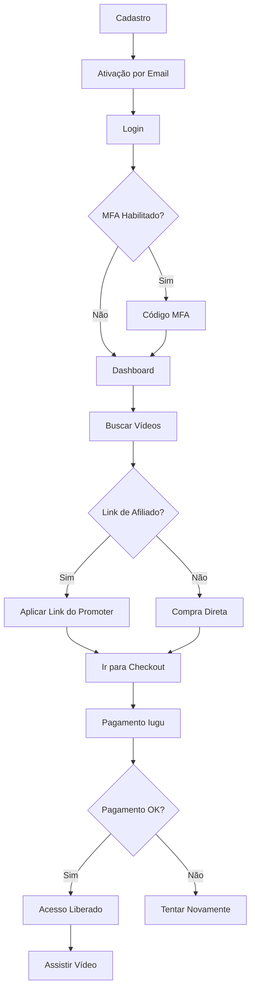

# Perfil: Usuário Default (Comprador)

## Descrição

O **usuário Default** é o perfil padrão da plataforma Amasso. Representa os compradores de vídeos que buscam conteúdo exclusivo e pagam para ter acesso.

## Características

- 🛒 **Função principal**: Comprar e assistir vídeos
- 📧 **Email necessário**: Sim (cadastro obrigatório)
- 🔐 **KYC necessário**: Não
- 💳 **Recebe comissões**: Não
- 📱 **Subconta Iugu**: Não

## Jornada do Usuário



## Funcionalidades

### 1. Cadastro e Autenticação

#### Cadastro

```typescript
// frontend-react/src/pages/Auth/Register.tsx
const handleRegister = async (data: RegisterDto) => {
  const response = await authApi.register({
    email: data.email,
    password: data.password,
    firstName: data.firstName,
    lastName: data.lastName,
    birthDate: data.birthDate,
    cpf: data.cpf,
    telephone: data.telephone,
    type: UserTypeEnum.Default // Padrão
  });
  
  toast.success("Cadastro realizado! Verifique seu email.");
  navigate("/auth/activate");
};
```

#### Ativação

- Recebe código de ativação por email
- Validade: 24 horas
- Pode solicitar reenvio

```csharp
// Backend: LoginEndpoints.cs
app.MapPost("/api/signup/activate", async (
    ActivateAccountDto dto,
    LoginService service) =>
{
    await service.ActivateAccountAsync(dto.Email, dto.Code);
    return Results.Ok(new { message = "Conta ativada com sucesso!" });
});
```

#### Login

```typescript
// frontend-react/src/pages/Auth/Login.tsx
const handleLogin = async (data: LoginDto) => {
  const response = await authApi.login({
    email: data.email,
    password: data.password
  });
  
  if (response.requireMfa) {
    // Redirecionar para MFA
    navigate("/auth/mfa", { state: { email: data.email } });
  } else {
    // Salvar token e redirecionar
    dispatch(setUser(response.user));
    localStorage.setItem("token", response.token);
    navigate("/dashboard");
  }
};
```

### 2. Buscar e Explorar Vídeos

#### Listagem de Vídeos

```typescript
// frontend-react/src/pages/Videos/VideoList.tsx
const { data: videos } = useQuery({
  queryKey: ["videos"],
  queryFn: async () => {
    const response = await videoApi.getAll();
    return response.data;
  }
});

// Filtros disponíveis
const filters = {
  search: "", // Busca por título
  minPrice: 0,
  maxPrice: 500,
  sortBy: "newest" // newest, oldest, price_asc, price_desc
};
```

#### Detalhes do Vídeo

```typescript
// frontend-react/src/pages/Videos/VideoDetail.tsx
const VideoDetail = () => {
  const { videoId } = useParams();
  const { data: video } = useQuery({
    queryKey: ["video", videoId],
    queryFn: async () => {
      const response = await videoApi.getById(videoId);
      return response.data;
    }
  });
  
  // Verifica se usuário já possui o vídeo
  const { data: userVideos } = useQuery({
    queryKey: ["user-videos"],
    queryFn: async () => {
      const response = await orderApi.getMyOrders();
      return response.data.filter(o => o.payment.status === "Paid");
    }
  });
  
  const alreadyOwns = userVideos?.some(
    o => o.videoId === parseInt(videoId)
  );
  
  return (
    <div>
      <h1>{video.title}</h1>
      <p>{video.description}</p>
      <p>R$ {video.price.toFixed(2)}</p>
      
      {alreadyOwns ? (
        <Button onClick={() => navigate(`/videos/${videoId}/watch`)}>
          Assistir Agora
        </Button>
      ) : (
        <Button onClick={handleBuy}>
          Comprar Agora
        </Button>
      )}
    </div>
  );
};
```

### 3. Comprar Vídeo

#### Fluxo de Compra

```typescript
// frontend-react/src/pages/Checkout/VideoCheckout.tsx
const handleCheckout = async () => {
  // Criar order
  const order = await orderApi.create({
    videoId: video.id,
    promoterId: affiliateLinkPromoter?.id, // Se veio de link
    videoAffiliateLinkId: affiliateLinkId
  });
  
  // Redirecionar para Iugu
  window.location.href = order.payment.iuguSecureUrl;
};
```

#### Confirmação de Pagamento

- Webhook do Iugu confirma automaticamente
- Usuário recebe notificação por email/WhatsApp
- Vídeo aparece em "Meus Vídeos"

```csharp
// Backend: PaymentEndpoints.cs
app.MapPost("/api/webhooks/iugu", async (
    HttpRequest request,
    PaymentService service) =>
{
    var body = await new StreamReader(request.Body).ReadToEndAsync();
    var signature = request.Headers["X-Iugu-Signature"];
    
    if (!ValidateSignature(body, signature))
        return Results.Unauthorized();
    
    var webhook = JsonSerializer.Deserialize<IuguWebhook>(body);
    
    if (webhook.Event == "invoice.status_changed" && 
        webhook.Data.Status == "paid")
    {
        await service.ConfirmPaymentAsync(webhook.Data.Id);
    }
    
    return Results.Ok();
});
```

### 4. Assistir Vídeos

#### Lista de Vídeos Comprados

```typescript
// frontend-react/src/pages/MyVideos/MyVideosList.tsx
const { data: myVideos } = useQuery({
  queryKey: ["my-videos"],
  queryFn: async () => {
    const orders = await orderApi.getMyOrders();
    return orders
      .filter(o => o.payment.status === "Paid")
      .map(o => ({
        ...o.video,
        purchasedAt: o.payment.iuguPaidAt,
        canWatch: !o.video.expirationViewDate || 
                  new Date(o.video.expirationViewDate) >= new Date()
      }));
  }
});
```

#### Player de Vídeo

```typescript
// frontend-react/src/pages/MyVideos/VideoPlayer.tsx
const VideoPlayer = () => {
  const { videoId } = useParams();
  const { data: video } = useQuery({
    queryKey: ["my-video", videoId],
    queryFn: async () => {
      // Verificar se usuário possui o vídeo
      const orders = await orderApi.getMyOrders();
      const order = orders.find(
        o => o.videoId === parseInt(videoId) &&
             o.payment.status === "Paid"
      );
      
      if (!order) throw new Error("Você não possui este vídeo");
      
      if (order.video.expirationViewDate &&
          new Date(order.video.expirationViewDate) < new Date()) {
        throw new Error("Período de visualização expirado");
      }
      
      return order.video;
    }
  });
  
  // Cloudinary Video Player
  const videoUrl = `https://res.cloudinary.com/${cloudName}/video/upload/${video.cloudinaryPublicId}`;
  
  return (
    <div>
      <h1>{video.title}</h1>
      <video
        controls
        width="100%"
        src={videoUrl}
        onPlay={handleLogView}
      />
    </div>
  );
};
```

### 5. Dashboard

```typescript
// frontend-react/src/pages/Dashboard/DefaultDashboard.tsx
const DefaultDashboard = () => {
  const { data: stats } = useQuery({
    queryKey: ["my-stats"],
    queryFn: async () => {
      const orders = await orderApi.getMyOrders();
      const paid = orders.filter(o => o.payment.status === "Paid");
      
      return {
        videosOwned: paid.length,
        totalSpent: paid.reduce((sum, o) => sum + o.amount, 0) / 100,
        lastPurchase: paid[0]?.payment.iuguPaidAt,
        recentVideos: paid.slice(0, 5)
      };
    }
  });
  
  return (
    <div>
      <h1>Meu Dashboard</h1>
      
      <Card>
        <h3>Estatísticas</h3>
        <p>Vídeos Comprados: {stats.videosOwned}</p>
        <p>Total Gasto: R$ {stats.totalSpent.toFixed(2)}</p>
        <p>Última Compra: {format(stats.lastPurchase)}</p>
      </Card>
      
      <h3>Compras Recentes</h3>
      <VideoGrid videos={stats.recentVideos} />
    </div>
  );
};
```

### 6. Perfil e Preferências

```typescript
// frontend-react/src/pages/Profile/UserProfile.tsx
const handleUpdateProfile = async (data: UpdateProfileDto) => {
  await userApi.update({
    firstName: data.firstName,
    lastName: data.lastName,
    telephone: data.telephone,
    notificationPreference: data.notificationPreference // Email, WhatsApp, All
  });
  
  toast.success("Perfil atualizado!");
};
```

## Permissões

| Ação | Permitido |
|------|-----------|
| Ver catálogo de vídeos | ✅ |
| Comprar vídeos | ✅ |
| Assistir vídeos comprados | ✅ |
| Gerar links de afiliado | ❌ |
| Receber comissões | ❌ |
| Acessar admin | ❌ |
| Enviar documentos KYC | ❌ |

## Notificações Recebidas

- ✉️ **Email de ativação** (NotificationTypeEnum.UserActivation)
- 🔑 **Código MFA** (NotificationTypeEnum.MfaCode)
- 🔒 **Recuperação de senha** (NotificationTypeEnum.ForgotPassword)
- ✅ **Pagamento confirmado** (NotificationTypeEnum.PaymentConfirmed)
- 🎬 **Lançamento de vídeo** (NotificationTypeEnum.VideoReleaseSchedule)

## Regras de Negócio

1. **Email único**: Não pode haver dois usuários com mesmo email
2. **Ativação obrigatória**: Deve ativar conta antes de fazer login
3. **Compra única**: Não pode comprar o mesmo vídeo duas vezes
4. **Expiração de visualização**: Respeitar `expiration_view_date` do vídeo
5. **Senha segura**: Mínimo 8 caracteres, incluindo maiúsculas e números
6. **Idade mínima**: 18 anos (validado na data de nascimento)

## Endpoints Principais

| Método | Endpoint | Descrição |
|--------|----------|-----------|
| POST | `/api/signup` | Cadastro |
| POST | `/api/signup/activate` | Ativação |
| POST | `/api/login` | Login |
| POST | `/api/login/verify-mfa` | Verificar MFA |
| GET | `/api/videos` | Listar vídeos |
| GET | `/api/videos/:id` | Detalhes do vídeo |
| POST | `/api/orders` | Criar pedido |
| GET | `/api/orders/my-orders` | Meus pedidos |
| PUT | `/api/users/me` | Atualizar perfil |

## Próximos Passos

- Veja [Caso de Uso: Compra de Vídeo](../casos-de-uso/usuario-compra-video.md)
- Consulte [Fluxo de Autenticação](../fluxos-de-negocio/autenticacao.md)
- Entenda [Perfil Promoter](promoter.md) para gerar links

