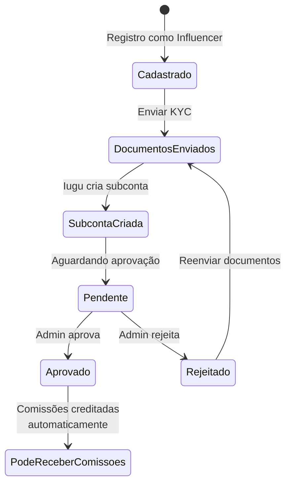
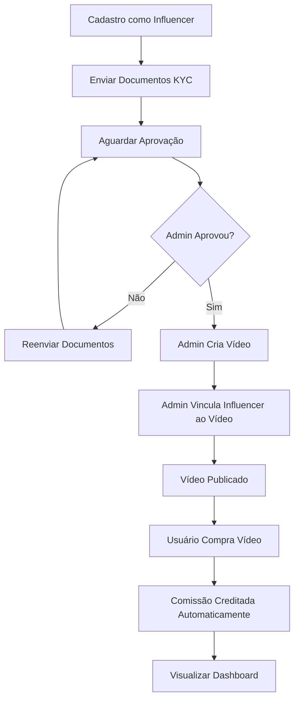

# Perfil: Influencer (Criador de Conteúdo)

## Descrição

O **Influencer** é o criador de conteúdo que participa dos vídeos disponibilizados na plataforma e recebe comissões por cada venda realizada dos vídeos em que participa.

## Características

- 🎬 **Função principal**: Participar de vídeos e receber comissões
- 📧 **Email necessário**: Sim
- 🔐 **KYC necessário**: **Sim** (obrigatório para receber comissões)
- 💰 **Recebe comissões**: Sim (após KYC aprovado)
- 🏦 **Subconta Iugu**: Sim (criada após envio de documentos)
- 📊 **Dashboard**: Dashboard de rendimentos por vídeo
- 🎥 **Vínculo com vídeos**: Via tabela `owner_videos`

## Requisitos para Receber Comissões



## Jornada do Influencer



## Funcionalidades

### 1. Cadastro e KYC

#### Cadastro como Influencer

```typescript
// frontend-react/src/pages/Auth/RegisterInfluencer.tsx
const handleRegisterInfluencer = async (data: RegisterDto) => {
  await authApi.register({
    ...data,
    type: UserTypeEnum.Influencer
  });
  
  toast.success("Cadastro realizado! Envie seus documentos KYC.");
  navigate("/influencer/kyc");
};
```

#### Envio de Documentos KYC

O processo é **idêntico ao Promoter**. Veja [Perfil Promoter - KYC](promoter.md#envio-de-documentos-kyc).

```csharp
// Backend: OwnerEndpoints.cs
// Mesmo endpoint usado por Promoters
app.MapPost("/api/owners/kyc", async (
    HttpRequest request,
    OwnerService service,
    ICloudinaryService cloudinary) =>
{
    // ... upload de documentos
    // ... criação/atualização de subconta Iugu
    
    await service.SubmitKycAsync(ownerId, dto);
    
    return Results.Ok(new { message = "KYC enviado com sucesso!" });
})
.RequireAuthorization()
.DisableAntiforgery();
```

### 2. Dashboard de Influencer

```typescript
// frontend-react/src/pages/Influencer/InfluencerDashboard.tsx
const InfluencerDashboard = () => {
  const { data: dashboard } = useQuery({
    queryKey: ["influencer-dashboard"],
    queryFn: async () => {
      const response = await influencerApi.getDashboard();
      return response.data;
    }
  });
  
  return (
    <div>
      <h1>Dashboard do Influencer</h1>
      
      <Grid cols={4}>
        <Card>
          <h3>Total de Comissões</h3>
          <p className="text-3xl">R$ {dashboard.totalEarnings.toFixed(2)}</p>
        </Card>
        
        <Card>
          <h3>Meus Vídeos</h3>
          <p className="text-3xl">{dashboard.totalVideos}</p>
        </Card>
        
        <Card>
          <h3>Total de Vendas</h3>
          <p className="text-3xl">{dashboard.totalSales}</p>
        </Card>
        
        <Card>
          <h3>Ticket Médio</h3>
          <p className="text-3xl">R$ {dashboard.averagePerSale.toFixed(2)}</p>
        </Card>
      </Grid>
      
      <h2>Meus Vídeos</h2>
      <VideosPerformanceTable videos={dashboard.videos} />
      
      <h2>Últimas Vendas</h2>
      <RecentSalesTable sales={dashboard.recentSales} />
    </div>
  );
};
```

```csharp
// Backend: InfluencerDashboardEndpoints.cs
app.MapGet("/api/influencer/dashboard", async (
    HttpRequest request,
    InfluencerDashboardService service,
    ApplicationDbContext context) =>
{
    var userId = GetUserIdFromToken(request);
    var owner = await context.Owners
        .FirstAsync(o => o.UserId == userId);
    
    // Buscar vídeos do influencer
    var videos = await context.OwnerVideos
        .Include(ov => ov.Video)
        .ThenInclude(v => v.Orders)
        .ThenInclude(o => o.Payment)
        .Where(ov => ov.OwnerId == owner.Id)
        .Select(ov => new
        {
            Video = ov.Video,
            Sales = ov.Video.Orders.Count(o => o.Payment.Status == PaymentStatusEnum.Paid),
            Revenue = ov.Video.Orders
                .Where(o => o.Payment.Status == PaymentStatusEnum.Paid)
                .Sum(o => o.OwnerAmount) / 100m
        })
        .ToListAsync();
    
    // Buscar comissões
    var incomes = await context.Incomes
        .Include(i => i.Order)
        .ThenInclude(o => o.Video)
        .Where(i => i.OwnerId == owner.Id &&
                    i.Type == IncomeTypeEnum.Owner)
        .ToListAsync();
    
    var dashboard = new InfluencerDashboardDto
    {
        TotalEarnings = incomes.Sum(i => i.Amount) / 100m,
        TotalVideos = videos.Count,
        TotalSales = incomes.Count,
        AveragePerSale = incomes.Any() 
            ? incomes.Average(i => i.Amount) / 100m 
            : 0,
        Videos = videos.Select(v => new VideoPerformanceDto
        {
            VideoId = v.Video.Id,
            Title = v.Video.Title,
            Price = v.Video.Price,
            Sales = v.Sales,
            YourRevenue = v.Revenue
        }).ToList(),
        RecentSales = incomes
            .OrderByDescending(i => i.CreatedAt)
            .Take(10)
            .Select(i => new SaleDto
            {
                Date = i.CreatedAt,
                VideoTitle = i.Order.Video.Title,
                Amount = i.Amount / 100m
            })
            .ToList()
    };
    
    return Results.Ok(dashboard);
})
.RequireAuthorization();
```

### 3. Vídeos do Influencer

#### Listar Meus Vídeos

```typescript
// frontend-react/src/pages/Influencer/MyVideos.tsx
const MyVideos = () => {
  const { data: videos } = useQuery({
    queryKey: ["my-influencer-videos"],
    queryFn: async () => {
      const response = await influencerApi.getMyVideos();
      return response.data;
    }
  });
  
  return (
    <Table>
      <thead>
        <tr>
          <th>Vídeo</th>
          <th>Preço</th>
          <th>Minha %</th>
          <th>Vendas</th>
          <th>Minha Receita</th>
          <th>Status</th>
        </tr>
      </thead>
      <tbody>
        {videos.map(v => (
          <tr key={v.id}>
            <td>{v.title}</td>
            <td>R$ {v.price.toFixed(2)}</td>
            <td>{v.ownerPercentage}%</td>
            <td>{v.sales}</td>
            <td>R$ {v.myRevenue.toFixed(2)}</td>
            <td>
              <Badge color={v.isActive ? "green" : "red"}>
                {v.isActive ? "Ativo" : "Inativo"}
              </Badge>
            </td>
          </tr>
        ))}
      </tbody>
    </Table>
  );
};
```

```csharp
// Backend: InfluencerDashboardEndpoints.cs
app.MapGet("/api/influencer/videos", async (
    HttpRequest request,
    ApplicationDbContext context) =>
{
    var userId = GetUserIdFromToken(request);
    var owner = await context.Owners.FirstAsync(o => o.UserId == userId);
    
    var videos = await context.OwnerVideos
        .Include(ov => ov.Video)
        .ThenInclude(v => v.VideoRevenueConfig)
        .Include(ov => ov.Video)
        .ThenInclude(v => v.Orders)
        .ThenInclude(o => o.Payment)
        .Where(ov => ov.OwnerId == owner.Id)
        .Select(ov => new InfluencerVideoDto
        {
            Id = ov.Video.Id,
            Title = ov.Video.Title,
            Description = ov.Video.Description,
            Price = ov.Video.Price,
            OwnerPercentage = ov.Video.VideoRevenueConfig.OwnerPercentage,
            Sales = ov.Video.Orders.Count(o => o.Payment.Status == PaymentStatusEnum.Paid),
            MyRevenue = ov.Video.Orders
                .Where(o => o.Payment.Status == PaymentStatusEnum.Paid)
                .Sum(o => o.OwnerAmount) / 100m,
            IsActive = ov.Video.IsActive,
            ReleaseDate = ov.Video.ReleaseDate,
            ExpirationSaleDate = ov.Video.ExpirationSaleDate
        })
        .ToListAsync();
    
    return Results.Ok(videos);
})
.RequireAuthorization();
```

### 4. Detalhes de Performance de um Vídeo

```typescript
// frontend-react/src/pages/Influencer/VideoPerformance.tsx
const VideoPerformance = () => {
  const { videoId } = useParams();
  const { data: performance } = useQuery({
    queryKey: ["video-performance", videoId],
    queryFn: async () => {
      const response = await influencerApi.getVideoPerformance(videoId);
      return response.data;
    }
  });
  
  return (
    <div>
      <h1>{performance.videoTitle}</h1>
      
      <Grid cols={3}>
        <Card>
          <h3>Total de Vendas</h3>
          <p>{performance.totalSales}</p>
        </Card>
        
        <Card>
          <h3>Receita Total do Vídeo</h3>
          <p>R$ {performance.totalRevenue.toFixed(2)}</p>
        </Card>
        
        <Card>
          <h3>Sua Comissão Total</h3>
          <p>R$ {performance.myCommission.toFixed(2)}</p>
        </Card>
      </Grid>
      
      <h2>Vendas por Período</h2>
      <SalesChart data={performance.salesByMonth} />
      
      <h2>Últimas Vendas</h2>
      <Table>
        <thead>
          <tr>
            <th>Data</th>
            <th>Valor da Venda</th>
            <th>Sua Comissão</th>
            <th>Promoter?</th>
          </tr>
        </thead>
        <tbody>
          {performance.sales.map(s => (
            <tr key={s.orderId}>
              <td>{format(s.paidAt, "dd/MM/yyyy HH:mm")}</td>
              <td>R$ {s.amount.toFixed(2)}</td>
              <td>R$ {s.ownerCommission.toFixed(2)}</td>
              <td>{s.hasPromoter ? "Sim" : "Não"}</td>
            </tr>
          ))}
        </tbody>
      </Table>
    </div>
  );
};
```

```csharp
// Backend: InfluencerDashboardEndpoints.cs
app.MapGet("/api/influencer/videos/{videoId:long}/performance", async (
    long videoId,
    HttpRequest request,
    ApplicationDbContext context) =>
{
    var userId = GetUserIdFromToken(request);
    var owner = await context.Owners.FirstAsync(o => o.UserId == userId);
    
    // Verificar se influencer está vinculado ao vídeo
    var isLinked = await context.OwnerVideos
        .AnyAsync(ov => ov.OwnerId == owner.Id && ov.VideoId == videoId);
    
    if (!isLinked)
        return Results.Forbid();
    
    var video = await context.Videos
        .Include(v => v.VideoRevenueConfig)
        .FirstAsync(v => v.Id == videoId);
    
    var orders = await context.Orders
        .Include(o => o.Payment)
        .Include(o => o.Promoter)
        .ThenInclude(p => p.User)
        .Where(o => o.VideoId == videoId &&
                    o.Payment.Status == PaymentStatusEnum.Paid)
        .ToListAsync();
    
    var performance = new VideoPerformanceDto
    {
        VideoId = video.Id,
        VideoTitle = video.Title,
        TotalSales = orders.Count,
        TotalRevenue = orders.Sum(o => o.Amount) / 100m,
        MyCommission = orders.Sum(o => o.OwnerAmount) / 100m,
        SalesByMonth = orders
            .GroupBy(o => new { o.Payment.IuguPaidAt.Value.Year, o.Payment.IuguPaidAt.Value.Month })
            .Select(g => new
            {
                Month = $"{g.Key.Year}-{g.Key.Month:D2}",
                Sales = g.Count(),
                Revenue = g.Sum(o => o.OwnerAmount) / 100m
            })
            .ToList(),
        Sales = orders
            .OrderByDescending(o => o.Payment.IuguPaidAt)
            .Take(50)
            .Select(o => new
            {
                OrderId = o.Id,
                PaidAt = o.Payment.IuguPaidAt,
                Amount = o.Amount / 100m,
                OwnerCommission = o.OwnerAmount / 100m,
                HasPromoter = o.PromoterId.HasValue,
                PromoterName = o.Promoter != null 
                    ? o.Promoter.User.FirstName + " " + o.Promoter.User.LastName 
                    : null
            })
            .ToList()
    };
    
    return Results.Ok(performance);
})
.RequireAuthorization();
```

### 5. Vínculo com Vídeos (Admin)

O **Admin** é responsável por vincular influencers aos vídeos:

```csharp
// Backend: AdminEndpoints.cs
app.MapPost("/api/admin/videos/{videoId:long}/add-influencer", async (
    long videoId,
    AddInfluencerDto dto,
    ApplicationDbContext context) =>
{
    // Verificar se owner é influencer e tem KYC aprovado
    var owner = await context.Owners
        .FirstOrDefaultAsync(o => o.Id == dto.InfluencerId &&
                                  o.Type == OwnerTypeEnum.Influencer);
    
    if (owner == null)
        return Results.BadRequest("Owner não encontrado ou não é influencer");
    
    if (owner.SubAccountStatus != OwnerSubAccountStatusEnum.Approved)
        return Results.BadRequest("KYC do influencer não aprovado");
    
    // Verificar se já está vinculado
    var existing = await context.OwnerVideos
        .AnyAsync(ov => ov.VideoId == videoId && ov.OwnerId == dto.InfluencerId);
    
    if (existing)
        return Results.BadRequest("Influencer já vinculado a este vídeo");
    
    // Criar vínculo
    var ownerVideo = new OwnerVideo
    {
        VideoId = videoId,
        OwnerId = dto.InfluencerId,
        CreatedAt = DateTime.UtcNow
    };
    
    await context.OwnerVideos.AddAsync(ownerVideo);
    await context.SaveChangesAsync();
    
    return Results.Ok(new { message = "Influencer vinculado com sucesso!" });
})
.RequireAuthorization("Admin");
```

## Permissões

| Ação | Permitido |
|------|-----------|
| Ver catálogo de vídeos | ✅ |
| Comprar vídeos | ✅ |
| Ver meus vídeos | ✅ |
| Ver dashboard de rendimentos | ✅ |
| Receber comissões | ✅ (após KYC aprovado) |
| Criar vídeos | ❌ (admin faz) |
| Vincular-se a vídeos | ❌ (admin faz) |
| Gerar links de afiliado | ❌ |
| Acessar admin | ❌ |

## Regras de Negócio

1. **KYC obrigatório**: Deve ter KYC aprovado para receber comissões
2. **Vínculo via admin**: Apenas admin pode vincular influencer a vídeo
3. **Subconta Iugu**: Criada automaticamente ao enviar documentos KYC
4. **Comissão automática**: Creditada automaticamente em cada venda
5. **Múltiplos vídeos**: Influencer pode estar em vários vídeos
6. **Múltiplos influencers**: Um vídeo pode ter vários influencers (comissão dividida)

## Endpoints Principais

| Método | Endpoint | Descrição |
|--------|----------|-----------|
| POST | `/api/owners/kyc` | Enviar documentos KYC |
| GET | `/api/owners/me` | Ver status KYC |
| GET | `/api/influencer/dashboard` | Dashboard |
| GET | `/api/influencer/videos` | Meus vídeos |
| GET | `/api/influencer/videos/:id/performance` | Performance de vídeo |

## Notificações Recebidas

- 📄 **KYC enviado**: Confirmação de envio
- ✅ **KYC aprovado**: Pode começar a receber
- ❌ **KYC rejeitado**: Motivo da rejeição
- 🎬 **Novo vídeo**: Notificação de novo vídeo vinculado
- 💰 **Nova venda**: Notificação de venda

## Próximos Passos

- Veja [Processo KYC](../pagamentos/processo-kyc.md) completo
- Consulte [Caso de Uso: Influencer Recebe Comissão](../casos-de-uso/influencer-recebe-comissao.md)
- Entenda [Split de Pagamento](../pagamentos/split-pagamento.md)

