# Perfil: Promoter (Afiliado)

## Descrição

O **Promoter** é um usuário afiliado que divulga vídeos da plataforma através de links exclusivos e recebe comissões por cada venda realizada através de seus links.

## Características

- 🔗 **Função principal**: Gerar links de afiliado e promover vídeos
- 📧 **Email necessário**: Sim
- 🔐 **KYC necessário**: **Sim** (obrigatório para receber comissões)
- 💰 **Recebe comissões**: Sim (após KYC aprovado)
- 🏦 **Subconta Iugu**: Sim (criada após envio de documentos)
- 📊 **Dashboard**: Dashboard de conversões e comissões

## Requisitos para Operar

```mermaid
stateDiagram-v2
    [*] --> Cadastrado: Registro como Promoter
    Cadastrado --> DocumentosEnviados: Enviar KYC
    DocumentosEnviados --> SubcontaCriada: Iugu cria subconta
    SubcontaCriada --> Pendente: Aguardando aprovação
    Pendente --> Aprovado: Admin aprova
    Pendente --> Rejeitado: Admin rejeita
    Rejeitado --> DocumentosEnviados: Reenviar documentos
    Aprovado --> Operando: Pode gerar links<br/>e receber comissões
```



## Jornada do Promoter

```mermaid
graph TD
    A[Cadastro como Promoter] --> B[Enviar Documentos KYC]
    B --> C[Aguardar Aprovação]
    C --> D{Admin Aprovou?}
    D -->|Não| E[Reenviar Documentos]
    E --> C
    D -->|Sim| F[Acesso Dashboard Promoter]
    F --> G[Buscar Vídeos com Comissão > 0%]
    G --> H[Gerar Link de Afiliado]
    H --> I[Divulgar Link]
    I --> J[Usuário Clica no Link]
    J --> K[Usuário Compra Vídeo]
    K --> L[Comissão Creditada]
    L --> M[Visualizar Dashboard]
```



## Funcionalidades

### 1. Cadastro e KYC

#### Cadastro como Promoter

```typescript
// frontend-react/src/pages/Auth/RegisterPromoter.tsx
const handleRegisterPromoter = async (data: RegisterDto) => {
  await authApi.register({
    ...data,
    type: UserTypeEnum.Promoter
  });
  
  toast.success("Cadastro realizado! Envie seus documentos KYC.");
  navigate("/promoter/kyc");
};
```

#### Envio de Documentos KYC

```typescript
// frontend-react/src/pages/Promoter/KycSubmission.tsx
const handleSubmitKyc = async (data: KycDocumentsDto) => {
  const formData = new FormData();
  formData.append("cpf", data.cpf);
  formData.append("rg", data.rg);
  formData.append("birthDate", data.birthDate);
  
  // Documentos
  formData.append("cpfFile", data.cpfFile);
  formData.append("rgFile", data.rgFile);
  formData.append("addressProofFile", data.addressProofFile);
  formData.append("selfieFile", data.selfieFile);
  
  // Endereço
  formData.append("addressStreet", data.addressStreet);
  formData.append("addressNumber", data.addressNumber);
  formData.append("addressCity", data.addressCity);
  formData.append("addressState", data.addressState);
  formData.append("addressZipcode", data.addressZipcode);
  
  // Dados bancários
  formData.append("bankCode", data.bankCode);
  formData.append("bankAgency", data.bankAgency);
  formData.append("bankAccount", data.bankAccount);
  formData.append("bankAccountType", data.bankAccountType);
  
  await ownerApi.submitKyc(formData);
  
  toast.success("Documentos enviados! Aguarde aprovação.");
};
```

```csharp
// Backend: OwnerEndpoints.cs
app.MapPost("/api/owners/kyc", async (
    HttpRequest request,
    OwnerService service,
    ICloudinaryService cloudinary) =>
{
    var form = await request.ReadFormAsync();
    var ownerId = GetOwnerIdFromToken(request);
    
    // Upload documentos para Cloudinary
    var cpfUrl = await cloudinary.UploadAsync(form.Files["cpfFile"]);
    var rgUrl = await cloudinary.UploadAsync(form.Files["rgFile"]);
    var addressProofUrl = await cloudinary.UploadAsync(form.Files["addressProofFile"]);
    var selfieUrl = await cloudinary.UploadAsync(form.Files["selfieFile"]);
    
    var dto = new KycDocumentsDto
    {
        Cpf = form["cpf"],
        Rg = form["rg"],
        DocumentCpfUrl = cpfUrl,
        DocumentRgUrl = rgUrl,
        DocumentAddressProofUrl = addressProofUrl,
        DocumentSelfieUrl = selfieUrl,
        // ... outros campos
    };
    
    await service.SubmitKycAsync(ownerId, dto);
    
    return Results.Ok(new { message = "KYC enviado com sucesso!" });
})
.RequireAuthorization()
.DisableAntiforgery();
```

### 2. Dashboard de Promoter

```typescript
// frontend-react/src/pages/Promoter/PromoterDashboard.tsx
const PromoterDashboard = () => {
  const { data: dashboard } = useQuery({
    queryKey: ["promoter-dashboard"],
    queryFn: async () => {
      const response = await promoterApi.getDashboard();
      return response.data;
    }
  });
  
  return (
    <div>
      <h1>Dashboard do Promoter</h1>
      
      <Grid cols={4}>
        <Card>
          <h3>Total de Comissões</h3>
          <p className="text-3xl">R$ {dashboard.totalEarnings.toFixed(2)}</p>
        </Card>
        
        <Card>
          <h3>Total de Conversões</h3>
          <p className="text-3xl">{dashboard.totalConversions}</p>
        </Card>
        
        <Card>
          <h3>Total de Cliques</h3>
          <p className="text-3xl">{dashboard.totalClicks}</p>
        </Card>
        
        <Card>
          <h3>Taxa de Conversão</h3>
          <p className="text-3xl">{dashboard.conversionRate.toFixed(2)}%</p>
        </Card>
      </Grid>
      
      <h2>Meus Links de Afiliado</h2>
      <AffiliateLinksTable links={dashboard.affiliateLinks} />
      
      <h2>Últimas Conversões</h2>
      <ConversionsTable conversions={dashboard.recentConversions} />
    </div>
  );
};
```

```csharp
// Backend: PromoterEndpoints.cs
app.MapGet("/api/promoter/dashboard", async (
    HttpRequest request,
    PromoterDashboardService service) =>
{
    var userId = GetUserIdFromToken(request);
    var owner = await _context.Owners
        .FirstAsync(o => o.UserId == userId);
    
    var dashboard = await service.GetDashboardAsync(owner.Id);
    
    return Results.Ok(dashboard);
})
.RequireAuthorization();
```

### 3. Gerar Links de Afiliado

#### Listar Vídeos Disponíveis

```typescript
// frontend-react/src/pages/Promoter/AvailableVideos.tsx
const { data: videos } = useQuery({
  queryKey: ["promoter-videos"],
  queryFn: async () => {
    // Apenas vídeos com promoter_percentage > 0%
    const response = await videoApi.getForPromoters();
    return response.data;
  }
});
```

```csharp
// Backend: VideoEndpoints.cs
app.MapGet("/api/videos/for-promoters", async (ApplicationDbContext context) =>
{
    var videos = await context.Videos
        .Include(v => v.VideoRevenueConfig)
        .Where(v => v.IsActive &&
                    v.VideoRevenueConfig.PromoterPercentage > 0 &&
                    (v.ReleaseDate == null || v.ReleaseDate <= DateTime.Today) &&
                    (v.ExpirationSaleDate == null || v.ExpirationSaleDate >= DateTime.Today))
        .Select(v => new VideoForPromoterDto
        {
            Id = v.Id,
            Title = v.Title,
            Price = v.Price,
            PromoterPercentage = v.VideoRevenueConfig.PromoterPercentage,
            PromoterCommission = v.Price * v.VideoRevenueConfig.PromoterPercentage / 100
        })
        .ToListAsync();
    
    return Results.Ok(videos);
})
.RequireAuthorization();
```

#### Criar Link de Afiliado

```typescript
// frontend-react/src/pages/Promoter/CreateAffiliateLink.tsx
const handleCreateLink = async (videoId: number) => {
  const response = await promoterApi.createAffiliateLink({ videoId });
  
  const fullLink = `${window.location.origin}/videos/${videoId}?ref=${response.data.uniqueCode}`;
  
  navigator.clipboard.writeText(fullLink);
  toast.success("Link copiado para área de transferência!");
};
```

```csharp
// Backend: PromoterEndpoints.cs
app.MapPost("/api/promoter/affiliate-links", async (
    CreateAffiliateLinkDto dto,
    PromoterService service,
    HttpRequest request) =>
{
    var userId = GetUserIdFromToken(request);
    var owner = await _context.Owners
        .FirstAsync(o => o.UserId == userId);
    
    // Verificar se promoter tem KYC aprovado
    if (owner.SubAccountStatus != OwnerSubAccountStatusEnum.Approved)
    {
        return Results.BadRequest("KYC não aprovado");
    }
    
    // Verificar se vídeo tem comissão para promoters
    var video = await _context.Videos
        .Include(v => v.VideoRevenueConfig)
        .FirstAsync(v => v.Id == dto.VideoId);
    
    if (video.VideoRevenueConfig.PromoterPercentage <= 0)
    {
        return Results.BadRequest("Este vídeo não tem comissão para promoters");
    }
    
    // Verificar se já existe link para este vídeo
    var existingLink = await _context.VideoAffiliateLinks
        .FirstOrDefaultAsync(l => l.OwnerId == owner.Id && 
                                  l.VideoId == dto.VideoId);
    
    if (existingLink != null)
    {
        return Results.Ok(existingLink);
    }
    
    // Criar novo link
    var link = new VideoAffiliateLink
    {
        OwnerId = owner.Id,
        VideoId = dto.VideoId,
        UniqueCode = GenerateUniqueCode(), // Gera código único
        Clicks = 0,
        CreatedAt = DateTime.UtcNow
    };
    
    await _context.VideoAffiliateLinks.AddAsync(link);
    await _context.SaveChangesAsync();
    
    return Results.Ok(link);
})
.RequireAuthorization();

private string GenerateUniqueCode()
{
    return Convert.ToBase64String(Guid.NewGuid().ToByteArray())
        .Replace("+", "").Replace("/", "").Replace("=", "")
        .Substring(0, 8)
        .ToUpper();
}
```

### 4. Rastreamento de Links

#### Registrar Clique

```typescript
// frontend-react/src/pages/Videos/VideoDetail.tsx
useEffect(() => {
  const searchParams = new URLSearchParams(window.location.search);
  const refCode = searchParams.get("ref");
  
  if (refCode) {
    // Salvar no localStorage para usar no checkout
    localStorage.setItem("affiliateRef", refCode);
    
    // Registrar clique (sem autenticação)
    videoApi.trackAffiliateClick(refCode);
  }
}, []);
```

```csharp
// Backend: VideoEndpoints.cs
app.MapPost("/api/videos/affiliate-click/{uniqueCode}", async (
    string uniqueCode,
    ApplicationDbContext context) =>
{
    var link = await context.VideoAffiliateLinks
        .FirstOrDefaultAsync(l => l.UniqueCode == uniqueCode);
    
    if (link != null)
    {
        link.Clicks++;
        link.UpdatedAt = DateTime.UtcNow;
        await context.SaveChangesAsync();
    }
    
    return Results.Ok();
})
.AllowAnonymous();
```

#### Vincular Order ao Link

```csharp
// Backend: OrderService.cs
public async Task<Order> CreateOrderAsync(CreateOrderDto dto, long userId)
{
    // ... criar order
    
    // Se tem código de afiliado
    if (!string.IsNullOrEmpty(dto.AffiliateCode))
    {
        var link = await _context.VideoAffiliateLinks
            .Include(l => l.Owner)
            .FirstOrDefaultAsync(l => l.UniqueCode == dto.AffiliateCode &&
                                      l.VideoId == dto.VideoId);
        
        if (link != null && 
            link.Owner.SubAccountStatus == OwnerSubAccountStatusEnum.Approved)
        {
            order.PromoterId = link.OwnerId;
            order.VideoAffiliateLinkId = link.Id;
            
            // Recalcular split incluindo promoter
            var config = video.VideoRevenueConfig;
            order.PromoterAmount = (int)(order.Amount * config.PromoterPercentage / 100);
        }
    }
    
    return order;
}
```

### 5. Tabela de Conversões

```typescript
// frontend-react/src/components/Promoter/ConversionsTable.tsx
const ConversionsTable = () => {
  const { data: conversions } = useQuery({
    queryKey: ["promoter-conversions"],
    queryFn: async () => {
      const response = await promoterApi.getConversions();
      return response.data;
    }
  });
  
  return (
    <Table>
      <thead>
        <tr>
          <th>Data</th>
          <th>Vídeo</th>
          <th>Comprador</th>
          <th>Valor Venda</th>
          <th>Sua Comissão</th>
        </tr>
      </thead>
      <tbody>
        {conversions.map(c => (
          <tr key={c.orderId}>
            <td>{format(c.paidAt, "dd/MM/yyyy HH:mm")}</td>
            <td>{c.videoTitle}</td>
            <td>{c.buyerName}</td>
            <td>R$ {c.orderAmount.toFixed(2)}</td>
            <td>R$ {c.commissionAmount.toFixed(2)}</td>
          </tr>
        ))}
      </tbody>
    </Table>
  );
};
```

```csharp
// Backend: PromoterEndpoints.cs
app.MapGet("/api/promoter/conversions", async (
    HttpRequest request,
    ApplicationDbContext context) =>
{
    var userId = GetUserIdFromToken(request);
    var owner = await context.Owners.FirstAsync(o => o.UserId == userId);
    
    var conversions = await context.Incomes
        .Include(i => i.Order)
        .ThenInclude(o => o.Video)
        .Include(i => i.Order)
        .ThenInclude(o => o.User)
        .Include(i => i.Order)
        .ThenInclude(o => o.Payment)
        .Where(i => i.OwnerId == owner.Id &&
                    i.Type == IncomeTypeEnum.Promoter)
        .OrderByDescending(i => i.CreatedAt)
        .Select(i => new ConversionDto
        {
            OrderId = i.OrderId,
            VideoTitle = i.Order.Video.Title,
            BuyerName = i.Order.User.FirstName + " " + i.Order.User.LastName,
            OrderAmount = i.Order.Amount / 100m,
            CommissionAmount = i.Amount / 100m,
            PaidAt = i.Order.Payment.IuguPaidAt
        })
        .ToListAsync();
    
    return Results.Ok(conversions);
})
.RequireAuthorization();
```

## Permissões

| Ação | Permitido |
|------|-----------|
| Ver catálogo de vídeos | ✅ |
| Comprar vídeos | ✅ |
| Gerar links de afiliado | ✅ (após KYC aprovado) |
| Receber comissões | ✅ (após KYC aprovado) |
| Ver dashboard de promoter | ✅ |
| Acessar admin | ❌ |
| Criar vídeos | ❌ |

## Regras de Negócio

1. **KYC obrigatório**: Deve ter KYC aprovado para operar
2. **Vídeos com comissão > 0%**: Só pode gerar links para vídeos com `promoter_percentage > 0`
3. **Link único por vídeo**: Cada promoter tem apenas 1 link por vídeo
4. **Subconta Iugu**: Criada automaticamente ao enviar documentos KYC
5. **Aprovação admin**: Admin deve aprovar KYC antes de promoter receber comissões
6. **Comissão calculada no order**: Valor já definido no momento da compra

## Endpoints Principais

| Método | Endpoint | Descrição |
|--------|----------|-----------|
| POST | `/api/owners/kyc` | Enviar documentos KYC |
| GET | `/api/owners/me` | Ver status KYC |
| GET | `/api/promoter/dashboard` | Dashboard |
| GET | `/api/videos/for-promoters` | Vídeos disponíveis |
| POST | `/api/promoter/affiliate-links` | Criar link |
| GET | `/api/promoter/affiliate-links` | Meus links |
| GET | `/api/promoter/conversions` | Minhas conversões |
| POST | `/api/videos/affiliate-click/:code` | Registrar clique |

## Notificações Recebidas

- 📄 **KYC enviado**: Confirmação de envio
- ✅ **KYC aprovado**: Pode começar a operar
- ❌ **KYC rejeitado**: Motivo da rejeição
- 💰 **Nova venda**: Notificação de conversão

## Próximos Passos

- Veja [Processo KYC](../pagamentos/processo-kyc.md) completo
- Consulte [Caso de Uso: Promoter Gera Link](../casos-de-uso/promoter-gera-link.md)
- Entenda [Split de Pagamento](../pagamentos/split-pagamento.md)

