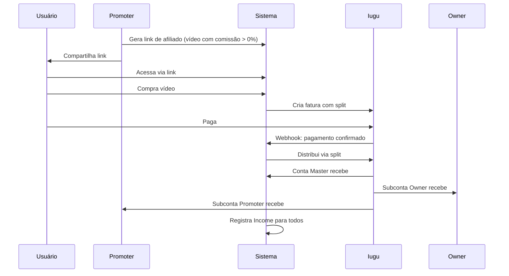

# Conceitos Principais

Este documento explica os conceitos fundamentais da plataforma Amasso.

## Vídeos

### Vídeo Principal
Conteúdo premium que os usuários compram para assistir. Características:
- Armazenado no Cloudinary com proteção
- Possui preço configurável
- Pode ter promoções temporárias
- Tem data de lançamento
- Pode ter data de expiração para venda e visualização

### Trailer
Prévia gratuita do vídeo principal para divulgação:
- Disponível publicamente sem login
- Usado para marketing
- Pode ter múltiplos trailers por vídeo
- Tipos: Teaser, Behind the Scenes, Highlights

### VideoRevenueConfig
Configuração de comissionamento por vídeo:
- **Percentual da Plataforma**: % que fica com o Amasso
- **Percentual do Owner**: % para o criador/influencer
- **Percentual do Promoter**: % para quem divulga (se houver)
- **Regra importante**: Se promoter = 0%, o vídeo não aparece para geração de links de afiliado

## Sistema de Compra

### Order (Pedido)
Representa uma transação de compra:
- Vincula usuário + vídeo
- Armazena valores separados (plataforma, owner, promoter)
- Pode ter um promoter associado (via link de afiliado)
- Rastreia link de afiliado usado

### Payment (Pagamento)
Detalha o pagamento de um pedido:
- Status: Pendente, Pago, Cancelado, Estornado
- ID da fatura Iugu
- Data de pagamento
- Dados do webhook

### Income (Renda)
Registro individual de cada parte da comissão:
- Um income por beneficiário (plataforma, owner, promoter)
- Valor específico de cada um
- Ligado ao pedido e ao owner beneficiário
- Usado para relatórios financeiros

## Links de Afiliado

### VideoAffiliateLink
Link único gerado por um promoter para divulgar um vídeo:
- URL única e rastreável
- Vincula promoter + vídeo
- Usado para calcular comissão
- Rastreia conversões

### Funcionamento
1. Promoter gera link para vídeo (se vídeo tiver comissão > 0%)
2. Compartilha o link
3. Usuário acessa via link
4. Ao comprar, o promoter é vinculado ao pedido
5. Na confirmação do pagamento, promoter recebe sua %

## Sistema de Comissões

### Cálculo Automático
Baseado no VideoRevenueConfig:

**Exemplo: Vídeo de R$ 100,00**
```
- Plataforma: 20% = R$ 20,00 (vai para conta master)
- Owner (Influencer): 50% = R$ 50,00 (vai para subconta do influencer)
- Promoter: 30% = R$ 30,00 (vai para subconta do promoter)
```

### Split no Iugu
- Configurado no momento da criação da fatura
- Distribuição automática ao confirmar pagamento
- Cada subconta recebe diretamente
- Plataforma recebe na conta master

### Vídeos sem Comissão para Promoter
Se admin configurar promoter = 0%:
- Vídeo **não aparece** na listagem para promoters gerarem links
- Apenas plataforma e owner recebem
- Ideal para vídeos exclusivos sem programa de afiliados

## Gateway Iugu

### Conta Master
- Pertence à plataforma Amasso
- Recebe todos os pagamentos
- Distribui via split para subcontas
- Centraliza gestão financeira

### Subcontas
Criadas para Promoters e Influencers:
- Cada promoter/influencer tem uma subconta
- Criada após aprovação do KYC
- Recebe pagamentos automaticamente via split
- Pode sacar para conta bancária

### Split de Pagamento
Divisão automática no momento da transação:
- Configurado na criação da fatura
- Executado quando pagamento confirma
- Sem necessidade de transferências manuais
- Transparente para todos os envolvidos

## Processo KYC

### O que é KYC
Know Your Customer - verificação de identidade exigida por lei para transações financeiras.

### Quem Precisa
- **Promoters**: Recebem comissão por vendas
- **Influencers**: Recebem por vídeos vendidos
- **Não precisam**:
  - Admin (não recebe dinheiro de vendas)
  - Default (só compra, não recebe)

### Documentos Necessários
- CPF ou CNPJ
- RG ou CNH
- Comprovante de residência
- Dados bancários
- Selfie segurando documento (verificação)

### Fluxo
1. Usuário envia documentos
2. Sistema registra (status: Pendente)
3. Tenta criar subconta Iugu (pendente)
4. Admin revisa
5. Admin aprova ou rejeita
6. Se aprovado: subconta ativada, usuário pode operar
7. Se rejeitado: notificação ao usuário

### Status
- **Pendente**: Aguardando revisão
- **Aprovado**: KYC aprovado, subconta ativa
- **Rejeitado**: Documentos não aprovados

## Notificações Multi-canal

### Tipos de Notificação
- **MfaCode**: Código de autenticação em duas etapas
- **UserActivation**: Ativação de conta nova
- **ForgotPassword**: Recuperação de senha
- **VideoReleaseSchedule**: Notificação de lançamento de vídeo

### Canais
- **Email**: Via SMTP (AWS SES)
- **WhatsApp**: Via Z-API
- **All**: Envia para ambos os canais

### Sistema Assíncrono
- Notificações gravadas no banco
- Jobs Hangfire processam em background
- Retry automático em caso de falha (até 3 tentativas)
- Templates personalizados (HTML para email, texto para WhatsApp)

## Perfis de Usuário

### Admin
- Administrador da plataforma
- Acesso total ao sistema
- Aprova KYC
- Configura vídeos e comissões
- Gerencia usuários

### Default
- Usuário que compra vídeos
- Não precisa de KYC
- Assiste conteúdo comprado
- Pode se tornar promoter ou influencer

### Promoter
- Divulgador com links de afiliado
- **Precisa de KYC aprovado**
- Gera links únicos
- Recebe comissão em subconta
- Dashboard de vendas
- **Só vê vídeos com comissão > 0%**

### Influencer
- Participa dos vídeos
- **Precisa de KYC aprovado**
- Vinculado a vídeos (OwnerVideo)
- Recebe comissão em subconta
- Dashboard de rendimentos

## Tabelas Principais

### Users
Todos os usuários da plataforma (Admin, Default, Promoter, Influencer)

### Owners
Detalhes adicionais de Promoters e Influencers:
- Dados de KYC
- ID da subconta Iugu
- Status do KYC
- Documentos

### Videos
Vídeos disponíveis na plataforma

### VideoRevenueConfig
Configuração de comissão por vídeo

### Orders
Pedidos de compra

### Payments
Pagamentos dos pedidos

### Income
Registro de comissões distribuídas

### VideoAffiliateLink
Links de afiliado dos promoters

### Notifications
Notificações a serem enviadas

## Fluxo Completo: Compra com Afiliado



## Próximos Passos

- Consulte o [Glossário](glossario.md) para termos técnicos
- Veja a [Arquitetura](../arquitetura/visao-geral.md) detalhada
- Explore os [Fluxos de Negócio](../fluxos-de-negocio/compra-video.md) completos

