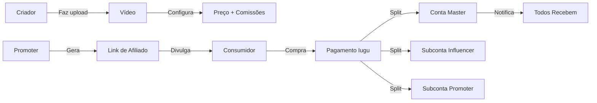

# Introdução

## O que é a Plataforma Amasso?

O **Amasso** é uma plataforma digital inovadora que conecta criadores de conteúdo, influencers, promoters e consumidores em um ecossistema de vídeos premium com sistema de monetização automatizado.

## Problema que Resolve

### Para Criadores de Conteúdo
- **Monetização facilitada**: Venda de vídeos exclusivos diretamente aos fãs
- **Gestão simplificada**: Upload, precificação e distribuição em uma única plataforma
- **Pagamentos automáticos**: Recebimento via Iugu sem burocracia

### Para Influencers
- **Comissionamento justo**: Receba automaticamente por cada vídeo vendido
- **Transparência total**: Acompanhe ganhos em tempo real
- **Conformidade legal**: Sistema KYC integrado

### Para Promoters (Afiliados)
- **Oportunidade de renda**: Ganhe comissão divulgando vídeos
- **Links rastreáveis**: Sistema de afiliados robusto
- **Dashboard completo**: Métricas de vendas e conversões

### Para Consumidores
- **Acesso a conteúdo exclusivo**: Vídeos únicos de seus criadores favoritos
- **Pagamento seguro**: Transações protegidas via Iugu
- **Experiência simples**: Compre e assista facilmente

## Principais Funcionalidades

### 🎬 Sistema de Vídeos
- Upload e armazenamento na nuvem (Cloudinary)
- Trailers públicos para divulgação
- Conteúdo premium protegido
- Agendamento de lançamentos
- Configuração de preços e promoções

### 💰 Sistema de Comissões
- **Configuração flexível**: Admin define % por vídeo
- **Visibilidade inteligente**: Vídeos com 0% para promoter não aparecem para links
- **Distribuição automática**: Split no momento do pagamento
- **Múltiplos beneficiários**:
  - Plataforma (conta master)
  - Owner/Influencer (subconta)
  - Promoter (subconta, se aplicável)

### 🔗 Sistema de Afiliados
- Geração de links únicos por promoter
- Rastreamento de cliques e conversões
- Dashboard com métricas detalhadas
- Comissão calculada e paga automaticamente

### 💳 Pagamentos Seguros (Iugu)
- **Conta Master**: Plataforma gerencia transações
- **Subcontas**: Promoters e Influencers recebem direto
- **Split automático**: Distribuição no momento do pagamento
- **Webhooks**: Confirmação em tempo real

### 📋 KYC e Compliance
- Processo de verificação para quem recebe dinheiro
- Validação de documentos
- Aprovação por administradores
- Criação automática de subcontas Iugu

### 📧 Notificações Multi-canal
- E-mail via SMTP
- WhatsApp via Z-API
- Templates personalizados
- Sistema assíncrono com Hangfire

## Tecnologias Utilizadas

### Backend API (.NET 8)
- **Framework**: ASP.NET Core 8.0
- **ORM**: Entity Framework Core
- **Banco de Dados**: PostgreSQL 16
- **Autenticação**: JWT + MFA
- **Padrões**: Clean Architecture, Repository, DTOs

### Email API (.NET 8)
- **Framework**: ASP.NET Core 8.0
- **Jobs**: Hangfire
- **E-mail**: SMTP (AWS SES)
- **WhatsApp**: Z-API
- **Templates**: HTML + Texto

### Frontend (React + TypeScript)
- **Framework**: React 18
- **Linguagem**: TypeScript
- **Estado**: Redux Toolkit
- **Roteamento**: React Router 6
- **UI**: Material-UI, Bootstrap
- **Build**: Vite

### Infraestrutura
- **Hospedagem de Vídeos**: Cloudinary
- **Gateway de Pagamento**: Iugu
- **Banco de Dados**: PostgreSQL 16
- **CI/CD**: Azure Pipelines / GitHub Actions

## Fluxo Geral da Plataforma

## Público-Alvo da Documentação

Esta documentação é destinada a:

- **Desenvolvedores Backend**: Trabalhar com .NET 8, EF Core, PostgreSQL
- **Desenvolvedores Frontend**: Trabalhar com React, TypeScript, Redux
- **DevOps**: Configurar ambientes e deploys
- **Product Owners**: Entender funcionalidades e regras de negócio
- **Novos membros da equipe**: Onboarding completo

## Estrutura da Documentação

1. **Visão Geral**: Conceitos e glossário (você está aqui)
2. **Arquitetura**: Como os sistemas se comunicam
3. **Pagamentos**: Sistema Iugu, KYC e split
4. **Banco de Dados**: Modelo ER e tabelas
5. **Perfis de Usuário**: Admin, Default, Promoter, Influencer
6. **Fluxos de Negócio**: Jornadas completas
7. **APIs**: Referência de endpoints
8. **Guias**: Setup e desenvolvimento
9. **Casos de Uso**: Exemplos práticos com código

## Próximos Passos

- Leia os [Conceitos Principais](conceitos-principais.md) para entender termos-chave
- Explore a [Arquitetura](../arquitetura/visao-geral.md) do sistema
- Configure seu [Ambiente de Desenvolvimento](../guias/configuracao-ambiente/requisitos.md)
- Consulte os [Casos de Uso](../casos-de-uso/usuario-compra-video.md) para exemplos práticos

